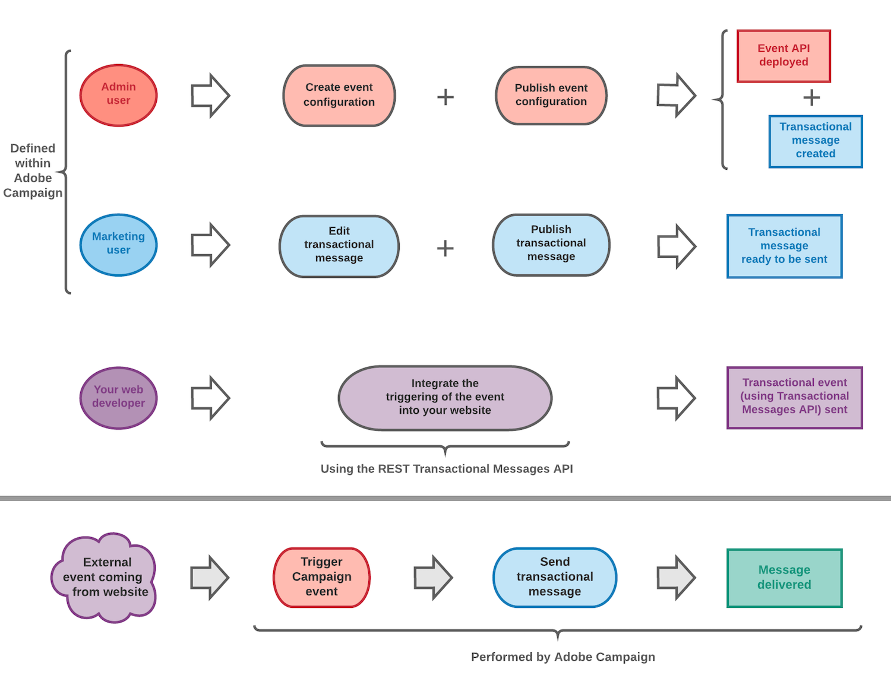

# Aan de slag met transactiemeldingen {#getting-started-with-transactional-messaging}

## Overzicht

<table>
<tr>
<td > 
Het transactieoverseinen laat u toe om individuele en unieke berichten <b>naar uw klanten in real time te</b> verzenden.
</td>
<td>Dit kunnen welkomstberichten, bestellingen voor het verzenden van bestellingen, wachtwoordwijzigingen, enzovoort zijn.</td>
</tr>
</table>

Met Adobe Campaign kunt u deze functionaliteit integreren met een informatiesysteem dat gebeurtenissen verzendt die moeten worden omgezet in aangepaste transactieberichten.

>[!NOTE]
>
>Transactieberichten kunnen worden verzonden via e-mail, sms of pushmeldingen, afhankelijk van uw opties. Controleer hiervoor uw licentieovereenkomst.

Adobe Campaign geeft voorrang aan het verwerken van transactieberichten boven elke andere levering.

Transactieberichten zijn ook beschikbaar via de Adobe Campaign Standard-API. Raadpleeg de [desbetreffende documentatie](../../api/using/managing-transactional-messages.md)voor meer informatie hierover.

>[!NOTE]
>
>Alle transactieberichten worden nu verzonden met de verbeterde MTA van Adobe Campaign voor een betere levering en doorvoer, en voor de verwerking van berichten die niet bezorgbaar zijn. Alle effecten zijn hetzelfde als bij standaardmarketingberichten. Zie [deze sectie](../../administration/using/configuring-email-channel.md) voor meer informatie.

## Transactionele berichtendefinitie {#transactional-messaging-definition}

<table>
<tr>
<td align="center"> 
<b>Wat is een transactioneel bericht?</b>
</td>
<td>
Het is een individuele en unieke communicatie, die door een leverancier zoals een website wordt verzonden.
</td>
<td>
Dit wordt vooral verwacht, omdat het belangrijke informatie bevat die de ontvanger wil controleren of bevestigen.
</td>
</tr>
<tr>
<td align="center"> 
<b>Wanneer komt het?</b>
</td>
<td>
 Omdat dit bericht belangrijke informatie bevat, verwacht de gebruiker dat het in echt - tijd wordt verzonden.
</td>
<td>
De vertraging tussen de gebeurtenis die wordt geactiveerd en het bericht dat aankomt, moet daarom zeer kort zijn.
</td>
</tr>
<tr>
<td align="center"> 
<b>Waarom is het belangrijk?</b>
</td>
<td>
Over het algemeen zijn er voor een transactiebericht hoge open tarieven. Het moet daarom zorgvuldig worden ontworpen.
</td>
<td>
Het kan namelijk een sterke invloed hebben op het gedrag van de klanten, aangezien het de relatie met de klant definieert.
</td>
</tr>
<tr>
<td align="center"> 
<b>Bijvoorbeeld?</b>
</td>
<td>
Het zou een welkomstbericht kunnen zijn na het maken van een account, een bevestiging dat een bestelling is verzonden, een factuur...
</td>
<td>
Het kan ook een bericht zijn dat een wachtwoordwijziging bevestigt, of een bericht nadat een klant door uw website heeft gebladerd...
</td>
</tr>
</table>

## Transactieberichttypen

Er zijn twee typen transactieberichten beschikbaar in Adobe Campaign:

<!--[Event transactional messages](../../channels/using/event-transactional-messages.md) targeting an **event**. The data contained in the event itself is used to define the delivery target.-->

<table>
<tr>
<td align="center"> 
<a href="../../channels/using/event-transactional-messages.md">Gebeurtenistransactieberichten</a> <b> die zijn gericht op een gebeurtenis</b>
</td>
<td>
<ul><li>Ze bevatten geen profielgegevens.</li><li>Zij zijn niet verenigbaar met <a href="../../sending/using/fatigue-rules.md">vermoeidheidsregels</a> (zelfs in geval van verrijking met profielen).</li><li>Het leveringsdoel wordt bepaald door de gegevens in de gebeurtenis zelf.</li></ul>
</td>
</tr>
<tr>
<td align="center"> 
<a href="../../channels/using/profile-transactional-messages.md">Profieltransactieberichten</a> <b> die zijn gericht op profielen in de marketingdatabase van Adobe Campaign</b>
</td>
<td>
Transactieberichten van het profiel laten u toe:<ul><li>Pas marketingtypologieregels toe, zoals <b>Adres op lijst van afgewezen personen</b> of <a href="../../sending/using/fatigue-rules.md">vermoeidheidsregels</a>.</li><li>De koppeling voor het opzeggen van abonnementen in de berichten opnemen.</li><li>De transactionele berichten aan de globale leveringsrapportage toevoegen.</li><li>De transactionele berichten in het klanttraject gebruiken.</li></ul>
</td>
</tr>
</table>

<!--[Profile transactional messages](../../channels/using/profile-transactional-messages.md) targeting **profiles from the Adobe Campaign marketing database**. You can use information from the Adobe Campaign database to send a transactional message based on customer marketing profiles.-->

Het berichttype wordt bepaald tijdens de configuratie van de gebeurtenis die in een transactiebericht wordt omgezet. Zie [Transactieberichten configureren](../../administration/using/configuring-transactional-messaging.md).

>[!IMPORTANT]
>
>To access all transactional messages, you must be part of the **[!UICONTROL Administrators (all units)]** security group.

<!--Event transactional messages do not contain profile information, therefore they are not compatible with fatigue rules (even in the case of an enrichment with profiles). However, profile transactional messages are compatible. For more on fatigue rules, see [this section](../../sending/using/fatigue-rules.md#choosing-the-channel).-->

## Werkingsprincipe voor transactieberichten {#transactional-messaging-operating-principle}

Laten we het voorbeeld nemen van een bedrijf dat een website heeft en op deze website kunnen klanten producten kopen.

Met Adobe Campaign kunt u een e-mailbericht naar sitegebruikers sturen die producten in hun winkelwagen hebben geplaatst: wanneer ze de site verlaten zonder een aankoop te doen, wordt er automatisch een e-mail naar ze gestuurd met de melding dat ze een winkelwagen met artikelen hebben achtergelaten.

De maatregelen om dit in te voeren zijn als volgt.

### Stap 1 - creeer en publiceer de gebeurtenisconfiguratie {#create-event-configuration}

<!--

Configure an event that will be named "Cart abandonment" and publish this event configuration.

The API that will be used by your website developer is deployed and a transactional message is automatically created.-->

<table>
<tr>
<td> 
Configureer een gebeurtenis met de naam "Afstand starten" en publiceer deze gebeurtenisconfiguratie.
</td>
<td>De API die wordt gebruikt door uw websiteontwikkelaar, wordt geïmplementeerd en er wordt automatisch een transactiemelding gemaakt.</td>
</tr>
</table>

Het maken en publiceren van een gebeurtenis wordt beschreven in de sectie [Een gebeurtenis configureren voor het sturen van een gebeurtenistransactiebericht](../../administration/using/configuring-transactional-messaging.md#use-case--configuring-an-event-to-send-a-transactional-message).

### Stap 2 - geef en publiceer het transactiebericht uit {#create-transactional-message}

<!--

Edit and personalize the transactional message, test it, and then publish it.-->

<table>
<tr>
<td> 
Bewerk het transactiebericht, test het en publiceer het.
</td>
<td>Het transactiebericht is dan klaar om te worden verzonden.</td>
</tr>
</table>

For more on editing and publishing a transactional message, see [Event transactional messages](../../channels/using/event-transactional-messages.md).

### Stap 3 - Integreer de gebeurtenis die teweegbrengt {#integrate-event-trigger}

<!--

Use the REST Transactional Messages API to integrate the event into your website.

The event will be triggered when a client abandons their cart.-->

<table>
<tr>
<td> 
Gebruik de REST Transaction Messages API om de gebeurtenis in uw website te integreren.
</td>
<td>De gebeurtenis wordt geactiveerd wanneer een klant zijn winkelwagentje verlaat.</td>
</tr>
</table>

Zie [Site-integratie](../../administration/using/configuring-transactional-messaging.md#integrating-the-triggering-of-the-event-in-a-website)voor meer informatie over het integreren van de gebeurtenis in uw website.

### Stap 4 - Berichtlevering {#message-delivery}

<!--Once all of these steps have been carried out, the message can be delivered:

As soon as a user leaves the site without ordering the products in their cart, they automatically receive a notification email.-->

<table>
<tr>
<td> 
Zodra al deze stappen zijn uitgevoerd, kan het bericht worden geleverd.
</td>
<td>Zodra een gebruiker de site verlaat zonder de producten in zijn winkelwagentje te bestellen, ontvangt hij automatisch een e-mailbericht.</td>
</tr>
</table>

## Belangrijkste stappen {#key-steps}

De belangrijkste stappen bij het maken en beheren van persoonlijke transactiemeldingen in Adobe Campaign worden hieronder samengevat.

<!--## Transactional messaging publication process {#transactional-messaging-pub-process}

The chart below illustrates the whole transactional messaging publication process.

For more on the event configuration steps, see [Transactional messaging configuration](../../administration/using/configuring-transactional-messaging.md).

Read more:

* [About transactional messaging](../../channels/using/about-transactional-messaging.md)
* [Event transactional messages](../../channels/using/event-transactional-messages.md)
* [Profile transactional messages](../../channels/using/profile-transactional-messages.md)
* [Transactional push notifications](../../channels/using/transactional-push-notifications.md)
* [Follow-up messages](../../channels/using/follow-up-messages.md)-->

**Verwante onderwerpen:**

* [Belangrijkste stappen om een bericht te verzenden](../../channels/using/key-steps-to-send-a-message.md)
* [Aan de slag met communicatiekanalen](../../channels/using/get-started-communication-channels.md)