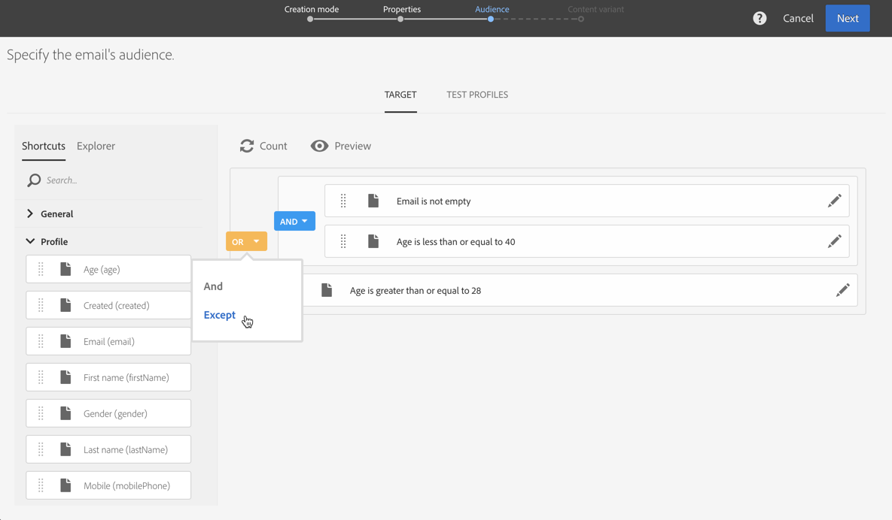

# Belangrijkste stappen voor verzending van een bericht{#key-steps-to-send-a-message}

In deze sectie leert u hoe u persoonlijke berichten kunt maken en verzenden naar een doelgroep met Adobe Campaign Standard.

De specifieke informatie over om elk communicatie kanaal tot stand te brengen en te vormen is beschikbaar in deze secties:

* [Een e-mail maken](../../channels/using/creating-an-email.md)
* [SMS maken](../../channels/using/creating-an-sms-message.md)
* [Een direct-maillevering maken](../../channels/using/creating-the-direct-mail.md)
* [Een pushmelding maken](../../channels/using/preparing-and-sending-a-push-notification.md).
* [Een in-app-bericht voorbereiden en verzenden](../../channels/using/preparing-and-sending-an-in-app-message.md)

Raadpleeg de [Best practices voor levering](../../sending/using/delivery-best-practices.md) sectie.

## Uw bericht maken

Hefboomwerking Campaign Standard [marketingactiviteiten](../../start/using/marketing-activities.md) om een e-mail-, SMS-, direct-mail-, push-bericht of In-App-bericht te maken.

Berichten kunnen worden gemaakt op basis van de lijst met marketingactiviteiten of op basis van een workflow met [specifieke activiteiten](../../automating/using/about-channel-activities.md).

## De doelgroep definiëren

Bepaal de ontvangers van uw bericht. Om dit te doen, gebruik [queryeditor](../../automating/using/editing-queries.md) van de linkerruit aan filtergegevens in uw gegevensbestand en bouwt regels om uw publiek te richten.

Er zijn verschillende soorten publiek beschikbaar:

* **[!UICONTROL Target]** is het belangrijkste doel van uw e-mail,
* **[!UICONTROL Test profiles]** zijn de profielen die worden gebruikt om uw e-mail te testen en te valideren (zie [Testprofielen beheren](../../audiences/using/managing-test-profiles.md)).

## Content ontwerpen en aanpassen

In de **[!UICONTROL Content]** de inhoud van uw bericht blokkeren, ontwerpen en aanpassen met behulp van velden uit uw database. Raadpleeg de secties boven aan deze pagina voor meer informatie over het ontwerpen van inhoud voor een specifiek kanaal.

## Voorbereiden en testen

[Voorbereiden](../../sending/using/preparing-the-send.md) het bericht. Dit proces berekent de doelpopulatie en bereidt het gepersonaliseerde bericht voor.

**Controleer en test uw bericht** voordat u het verzendt met gebruik van Campaign Standard-mogelijkheden: voorvertoning, e-mailweergave, proefdrukken, enz. Raadpleeg [deze sectie](../../sending/using/previewing-messages.md) voor meer informatie.

Gebruik de **[!UICONTROL Schedule]** blok om te bepalen wanneer uw berichten zullen worden verzonden (zie [Berichten plannen](../../sending/using/about-scheduling-messages.md)).

## Verzenden en volgen

Zodra uw bericht klaar is, kunt u het verzenden bevestigen. De **[!UICONTROL Deployment]** geeft de voortgang van het verzenden en het resultaat weer.

Verschillende logboeken zijn beschikbaar om u te helpen de levering van uw berichten te controleren (zie [toezicht op de levering](../../sending/using/monitoring-a-delivery.md)). U kunt ook de ontvangers van de levering volgen dankzij het gedrag van uw Campaign Standard [trackingfuncties](../../sending/using/tracking-messages.md).

Meet de doeltreffendheid van uw berichten en de evolutie van uw verzendt en campagnes door diverse indicatoren en grafieken (zie [Toegang tot rapporten](../../reporting/using/about-dynamic-reports.md)).

