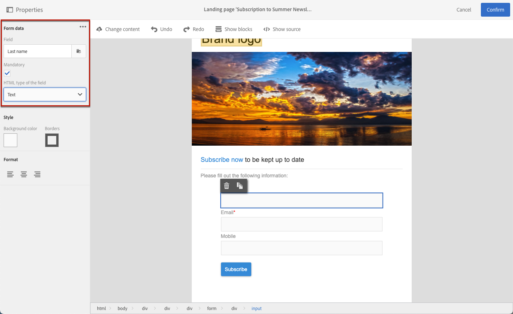
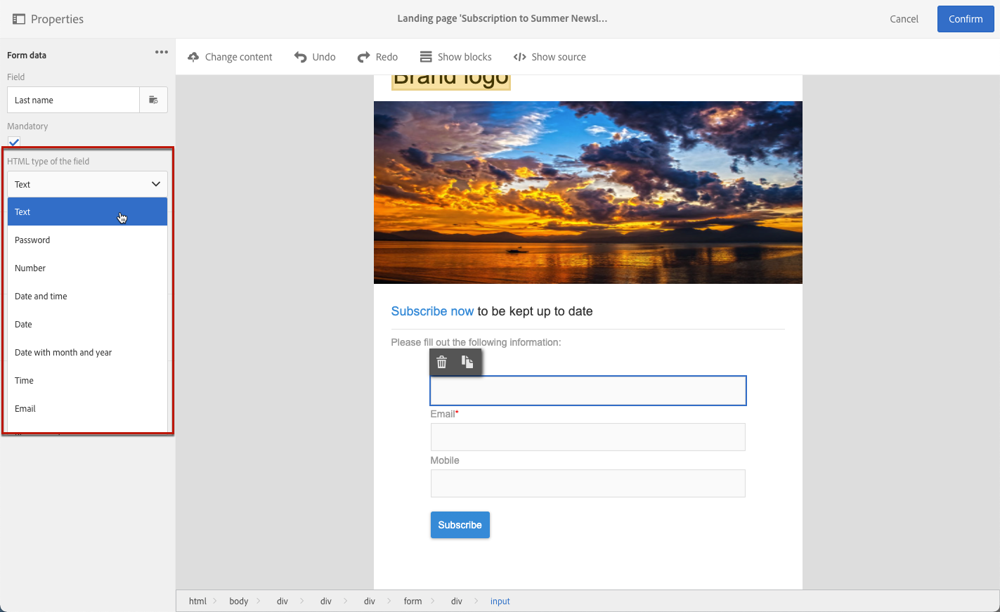
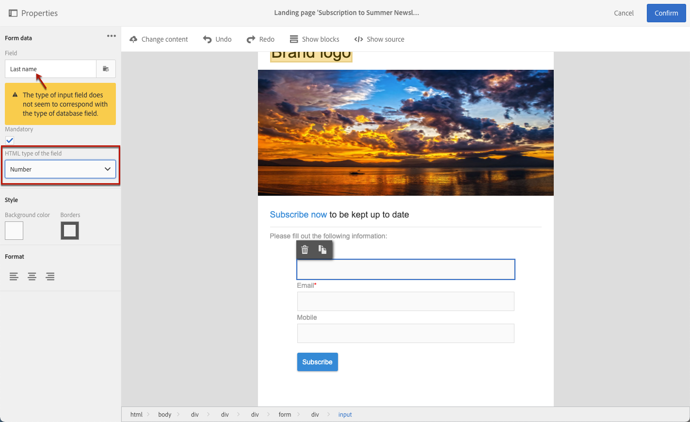
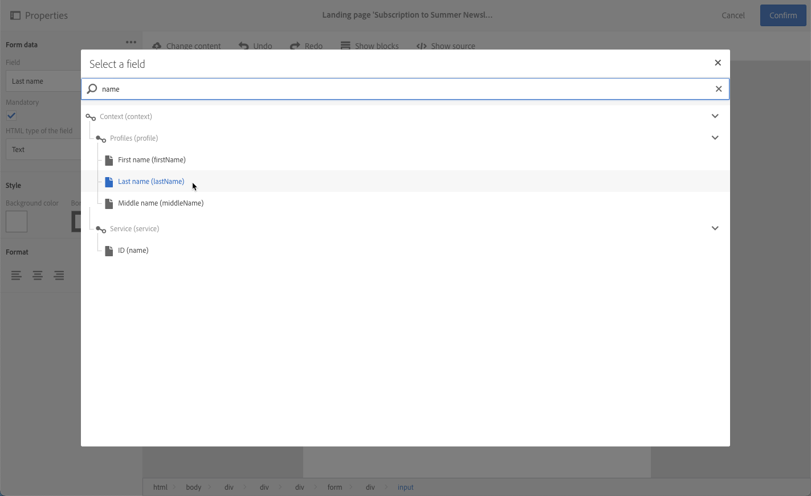
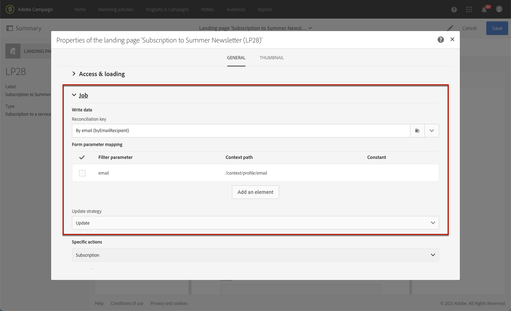
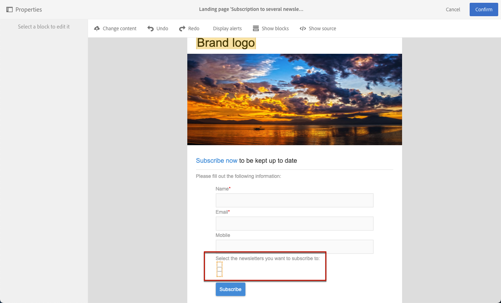
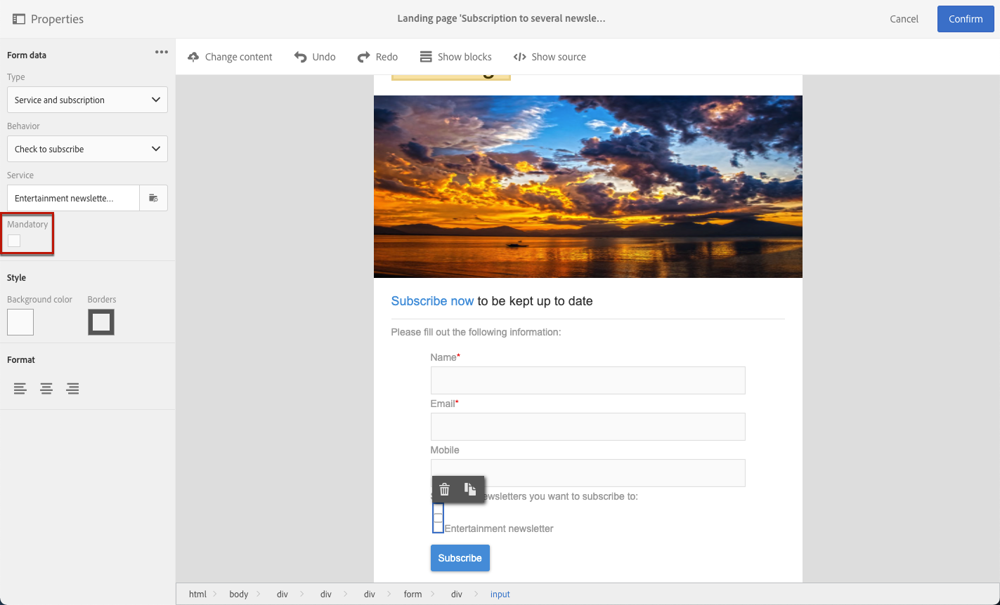
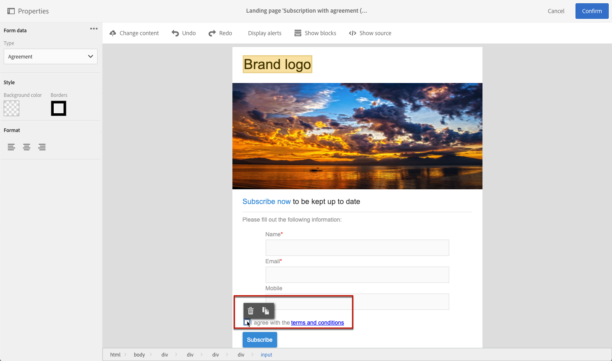

# Landingspaginaformuliergegevens beheren{#managing-landing-page-form-data}

In de inhoud van de bestemmingspagina worden de inputgebieden gebruikt om gegevens van het gegevensbestand van de Campagne op te slaan of bij te werken.

Hiertoe moeten deze velden worden toegewezen aan databasevelden.

U kunt de toewijzing ervan definiëren en beheren via de sectie **[!UICONTROL Form data]** in het linkerpalet.

## Formuliervelden toewijzen {#mapping-form-fields}

Als u de Campagne-database naar wens wilt bijwerken, koppelt u relevante databasevelden aan invoerzone, keuzerondje of keuzelijstblokken van de landingspagina.

Hiervoor voert u de volgende stappen uit:

1. Selecteer een blok in de inhoud van de bestemmingspagina.

   >[!NOTE]
   >
   >De standaardvelden van de ingebouwde bestemmingspagina&#39;s zijn vooraf geconfigureerd. U kunt deze desgewenst wijzigen.

1. Open de sectie **[!UICONTROL Form data]** in het linkerpalet.

1. U wijzigt het veldtype door een waarde te selecteren in de vervolgkeuzelijst **[!UICONTROL HTML type of the field]** .

   

   >[!NOTE]
   >
   >Voor meer bij het gebruiken van het checkbox type in een het landen pagina, zie de [&#x200B; veelvoudige de dienstabonnementen van de Update &#x200B;](#multiple-subscriptions) en [&#x200B; checkbox van de Overeenkomst &#x200B;](#agreement-checkbox) secties.

1. Als u een veldtype selecteert dat niet compatibel is met het databaseveld dat momenteel is geselecteerd in de **[!UICONTROL Field]** -zone, wordt een waarschuwingsbericht weergegeven. Selecteer een geschikte waarde voor optimale toewijzing.

   

1. Gebruik de zone **[!UICONTROL Field]** om een databaseveld te selecteren dat aan het formulierveld wordt gekoppeld.

   

   >[!NOTE]
   >
   >Landingspagina&#39;s kunnen alleen worden toegewezen met de bronnen **[!UICONTROL Profiles]** of **[!UICONTROL Service]** .

   In dit voorbeeld, kaart het **gebied van de Naam** van uw landende pagina aan het **[!UICONTROL Last name]** gebied van het **[!UICONTROL Profiles]** middel.

   

1. Controleer indien nodig de optie **[!UICONTROL Mandatory]** . In dat geval kan de landingspagina alleen worden verzonden als de gebruiker dit veld heeft ingevuld.

   

   Als een verplicht veld niet is ingevuld, wordt een foutbericht weergegeven wanneer de gebruiker de pagina verzendt.

1. Klik op **[!UICONTROL Confirm]** om de wijzigingen op te slaan.

<!--If you choose a mandatory **[!UICONTROL Checkbox]**, make sure that it is of **[!UICONTROL Field]** type.-->

## Gegevensopslag en afstemming{#data-storage-and-reconciliation}

Met de parameters voor het afstemmen van gegevens kunt u definiëren hoe de gegevens die op de landingspagina worden ingevoerd, worden beheerd nadat deze door een gebruiker zijn verzonden.

Dit doet u als volgt:

1. Bewerk de eigenschappen van de openingspagina die via het pictogram  in het dashboard voor de bestemmingspagina worden benaderd en geef de parameters **[!UICONTROL Job]** weer.

   

1. Selecteer **[!UICONTROL Reconciliation key]**: dit databaseveld wordt gebruikt om te bepalen of de bezoeker een profiel heeft dat al bekend is in de Adobe Campaign-database. Het kan bijvoorbeeld e-mail, voornaam, achternaam zijn. Met de afstemmingssleutel kunt u een profiel bijwerken of maken, volgens de parameter **[!UICONTROL Update strategy]** die hieronder wordt gedefinieerd.

1. Definieer de **[!UICONTROL Form parameter mapping]** : in deze sectie kunt u de veldparameters van de openingspagina en die van de afstemmingssleutel toewijzen.

1. Selecteer **[!UICONTROL Update strategy]**: als met de afstemmingssleutel een bestaand databaseprofiel wordt hersteld, kunt u ervoor kiezen dat dit profiel wordt bijgewerkt met de gegevens die in het formulier zijn ingevoerd, of deze update voorkomen.

   

## Meerdere abonnementen op services {#multiple-subscriptions}

U kunt verschillende selectievakjes gebruiken op één bestemmingspagina om gebruikers toe te staan zich van de veelvoudige diensten te abonneren of af te melden.

Hiervoor voert u de volgende stappen uit:

1. Bij het ontwerpen van de bestemmingspagina:

   * Selecteer een blok en kies **[!UICONTROL Form data]** in de sectie **[!UICONTROL Checkbox]** als veldtype.

     

   * Als u bekend bent met HTML, kunt u ook handmatig een selectievakje invoegen met de knop **[!UICONTROL Show source]** .

     

     Op deze manier kunt u het selectievakje op de gewenste plaats op de pagina invoegen.

     

1. Controleer of het selectievakje is ingeschakeld in de inhoud. De vervolgkeuzelijst **[!UICONTROL Type]** wordt weergegeven in de sectie **[!UICONTROL Form data]** van het linkerpalet. Selecteer **[!UICONTROL Service and subscription]** in de lijst.

   

1. Kies een optie in de vervolgkeuzelijst **[!UICONTROL Behavior]** .

   

1. Selecteer de dienst van a [&#x200B; &#x200B;](../../audiences/using/creating-a-service.md) van de overeenkomstige lijst.

   

1. Controleer of de optie **[!UICONTROL Mandatory]** is uitgeschakeld. Anders hebben uw gebruikers geen keuze.

   

1. Als u meer selectievakjes wilt toevoegen waarmee u zich kunt abonneren op andere services, herhaalt u de bovenstaande stappen zo vaak als nodig is.

   

Nadat de bestemmingspagina is gepubliceerd, kunnen de gebruikers meerdere selectievakjes selecteren om zich te abonneren op meerdere nieuwsbrieven van dezelfde pagina.

## Selectievakje voor overeenkomst {#agreement-checkbox}

U kunt een selectievakje toevoegen waarmee het profiel moet worden gecontroleerd voordat de bestemmingspagina wordt verzonden.

Zo kunt u bijvoorbeeld vragen dat gebruikers hun toestemming geven voor het privacybeleid, of ze uw voorwaarden laten accepteren voordat ze het formulier verzenden.

>[!IMPORTANT]
>
>Dit selectievakje is verplicht voor uw gebruikers. Als deze optie niet is geselecteerd, kunnen ze de bestemmingspagina niet indienen.

Voer de volgende handelingen uit om dit selectievakje in te voegen en te configureren:

1. Bij het ontwerpen van de bestemmingspagina:

   * Selecteer een blok en kies **[!UICONTROL Form data]** in de sectie **[!UICONTROL Checkbox]** als veldtype.

     

   * Als u bekend bent met HTML, kunt u ook handmatig een selectievakje invoegen met de knop **[!UICONTROL Show source]** .

     

     <!--
      Manually insert a checkbox, such as in the example below:

      Click **[!UICONTROL Hide source]**.
      -->

1. Controleer of het selectievakje is ingeschakeld.

   

1. De vervolgkeuzelijst **[!UICONTROL Type]** wordt weergegeven in de sectie **[!UICONTROL Form data]** van het linkerpalet. Selecteer **[!UICONTROL Agreement]** in de lijst.

   

   >[!NOTE]
   >
   >Het element **[!UICONTROL Agreement]** wordt niet toegewezen aan een veld in de Campagne-database.

1. Klik op het pictogram  naast **[!UICONTROL Form data]** om de geavanceerde eigenschappen van het selectievakje te openen.

1. U kunt het bericht indien nodig bewerken.

   

   Deze tekst wordt weergegeven als een waarschuwing als de gebruiker het selectievakje niet inschakelt voordat het formulier wordt verzonden.

   >[!NOTE]
   >
   >Deze handeling is standaard verplicht en kan niet worden gewijzigd.

1. Klik op **[!UICONTROL Confirm]** .

Elke keer dat de landingspagina wordt weergegeven, moet de gebruiker dit selectievakje inschakelen voordat het formulier wordt verzonden. Als dat niet het geval is, wordt de waarschuwing weergegeven en kan de gebruiker het formulier pas verzenden als het selectievakje is geactiveerd.