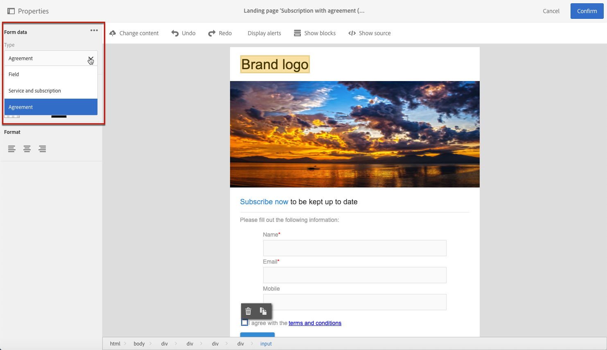

# Formulierdata voor landingspagina beheren{#managing-landing-page-form-data}

In de inhoud van de bestemmingspagina worden de inputgebieden gebruikt om gegevens van het gegevensbestand van de Campagne op te slaan of bij te werken.

Hiertoe moeten deze velden worden toegewezen aan databasevelden.

U kunt hun toewijzing definiëren en beheren via de **[!UICONTROL Form data]** in het linkerpalet.

## Formuliervelden toewijzen {#mapping-form-fields}

Als u de Campagne-database naar wens wilt bijwerken, koppelt u relevante databasevelden aan invoerzone, keuzerondje of keuzelijstblokken van de landingspagina.

Hiervoor voert u de volgende stappen uit:

1. Selecteer een blok in de inhoud van de bestemmingspagina.

   >[!NOTE]
   >
   >De standaardvelden van de ingebouwde landingspagina&#39;s zijn vooraf geconfigureerd. U kunt deze desgewenst wijzigen.

1. Toegang krijgen tot de **[!UICONTROL Form data]** in het linkerpalet.

1. Als u het veldtype wilt wijzigen, selecteert u een waarde in het menu **[!UICONTROL HTML type of the field]** vervolgkeuzelijst.

   

   >[!NOTE]
   >
   >Zie voor meer informatie over het gebruik van het type selectievakje op een bestemmingspagina de optie [Meerdere abonnementen op services bijwerken](#multiple-subscriptions) en [Selectievakje voor overeenkomst](#agreement-checkbox) secties.

1. Als u een veldtype selecteert dat niet compatibel is met het databaseveld dat momenteel is geselecteerd in het dialoogvenster **[!UICONTROL Field]** zone, zal een waarschuwingsbericht tonen. Selecteer een geschikte waarde voor optimale toewijzing.

   

1. Gebruik de **[!UICONTROL Field]** zone om een databaseveld te selecteren dat wordt gekoppeld aan het formulierveld.

   

   >[!NOTE]
   >
   >Landingspagina&#39;s kunnen alleen worden toegewezen aan de **[!UICONTROL Profiles]** of **[!UICONTROL Service]** middelen.

   Wijs in dit voorbeeld de **Naam** veld van de landingspagina naar de **[!UICONTROL Last name]** van het **[!UICONTROL Profiles]** resource.

   

1. Schakel indien nodig de optie **[!UICONTROL Mandatory]** in. In dat geval kan de landingspagina alleen worden verzonden als de gebruiker dit veld heeft ingevuld.

   

   Als een verplicht veld niet is ingevuld, wordt een foutbericht weergegeven wanneer de gebruiker de pagina verzendt.

1. Klikken **[!UICONTROL Confirm]** om uw wijzigingen op te slaan.

<!--If you choose a mandatory **[!UICONTROL Checkbox]**, make sure that it is of **[!UICONTROL Field]** type.-->

## Gegevensopslag en afstemming{#data-storage-and-reconciliation}

Met de parameters voor data-afstemming definieert u hoe de data die zijn ingevoerd op de landingspagina, worden beheerd nadat ze door de gebruiker zijn verzonden.

Dit doet u als volgt:

1. Bewerk de eigenschappen van de landingspagina die u via het pictogram  in het dashboard van de landingspagina opent en geef de parameters voor **[!UICONTROL Job]** weer.

   

1. Selecteer de **[!UICONTROL Reconciliation key]**: dit databaseveld wordt gebruikt om te bepalen of de bezoeker een profiel heeft dat al bekend is in de Adobe Campaign-database. Het kan bijvoorbeeld e-mail, voornaam, achternaam zijn. Met de afstemmingssleutel kunt u een profiel bijwerken of maken, afhankelijk van de **[!UICONTROL Update strategy]** hieronder gedefinieerde parameter.

1. Definieer **[!UICONTROL Form parameter mapping]**: in deze sectie kunt u de veldparameters van de landingspagina toewijzen, net als de parameters die in de afstemmingssleutel worden gebruikt.

1. Selecteer de **[!UICONTROL Update strategy]**: als met de afstemmingssleutel een bestaand databaseprofiel wordt hersteld, kunt u ervoor kiezen dat dit profiel wordt bijgewerkt met de gegevens die in het formulier zijn ingevoerd, of deze update voorkomen.

   

## Meerdere abonnementen op services {#multiple-subscriptions}

U kunt verschillende selectievakjes gebruiken op één bestemmingspagina om gebruikers toe te staan zich van de veelvoudige diensten te abonneren of af te melden.

Hiervoor voert u de volgende stappen uit:

1. Bij het ontwerpen van de bestemmingspagina:

   * Selecteer een blok in het menu **[!UICONTROL Form data]** sectie, kiest u **[!UICONTROL Checkbox]** als het veldtype.

     

   * Als u bekend bent met HTML, kunt u ook handmatig een selectievakje invoegen met de opdracht **[!UICONTROL Show source]** knop.

     

     Op deze manier kunt u het selectievakje op de gewenste plaats op de pagina invoegen.

     

1. Controleer of het selectievakje is ingeschakeld in de inhoud. De **[!UICONTROL Type]** vervolgkeuzelijst wordt weergegeven in het dialoogvenster **[!UICONTROL Form data]** in het linkerpalet. Selecteren **[!UICONTROL Service and subscription]** in de lijst.

   

1. Kies een optie in het menu **[!UICONTROL Behavior]** vervolgkeuzelijst.

   

1. Selecteer een [service](../../audiences/using/creating-a-service.md) in de overeenkomstige lijst.

   

1. Zorg ervoor dat de **[!UICONTROL Mandatory]** is uitgeschakeld. Anders hebben uw gebruikers geen keuze.

   

1. Als u meer selectievakjes wilt toevoegen waarmee u zich kunt abonneren op andere services, herhaalt u de bovenstaande stappen zo vaak als nodig is.

   

Nadat de bestemmingspagina is gepubliceerd, kunnen de gebruikers meerdere selectievakjes selecteren om zich te abonneren op meerdere nieuwsbrieven van dezelfde pagina.

## Selectievakje voor overeenkomst {#agreement-checkbox}

U kunt een selectievakje toevoegen waarmee het profiel moet worden gecontroleerd voordat de bestemmingspagina wordt verzonden.

Zo kunt u bijvoorbeeld vragen dat gebruikers hun toestemming geven voor het privacybeleid, of ze uw voorwaarden laten accepteren voordat ze het formulier verzenden.

>[!IMPORTANT]
>
>Dit selectievakje is verplicht voor uw gebruikers. Als deze optie niet is geselecteerd, kunnen ze de bestemmingspagina niet indienen.

Voer de volgende handelingen uit om dit selectievakje in te voegen en te configureren:

1. Bij het ontwerpen van de bestemmingspagina:

   * Selecteer een blok in het menu **[!UICONTROL Form data]** sectie, kiest u **[!UICONTROL Checkbox]** als het veldtype.

     

   * Als u bekend bent met HTML, kunt u ook handmatig een selectievakje invoegen met de opdracht **[!UICONTROL Show source]** knop.

     

     <!--Manually insert a checkbox, such as in the example below:

      <!--Click **[!UICONTROL Hide source]**.-->

1. Controleer of het selectievakje is ingeschakeld.

   

1. De **[!UICONTROL Type]** vervolgkeuzelijst wordt weergegeven in het dialoogvenster **[!UICONTROL Form data]** in het linkerpalet. Selecteren **[!UICONTROL Agreement]** in de lijst.

   

   >[!NOTE]
   >
   >De **[!UICONTROL Agreement]** element wordt niet toegewezen aan een gebied van het gegevensbestand van de Campagne.

1. Klik op de knop  pictogram naast **[!UICONTROL Form data]** om toegang te krijgen tot geavanceerde eigenschappen van het selectievakje.

1. U kunt het bericht indien nodig bewerken.

   

   Deze tekst wordt weergegeven als een waarschuwing als de gebruiker het selectievakje niet inschakelt voordat het formulier wordt verzonden.

   >[!NOTE]
   >
   >Deze handeling is standaard verplicht en kan niet worden gewijzigd.

1. Klik op **[!UICONTROL Confirm]**.

Elke keer dat de landingspagina wordt weergegeven, moet de gebruiker dit selectievakje inschakelen voordat het formulier wordt verzonden. Als dat niet het geval is, wordt de waarschuwing weergegeven en kan de gebruiker het formulier pas verzenden als het selectievakje is geactiveerd.