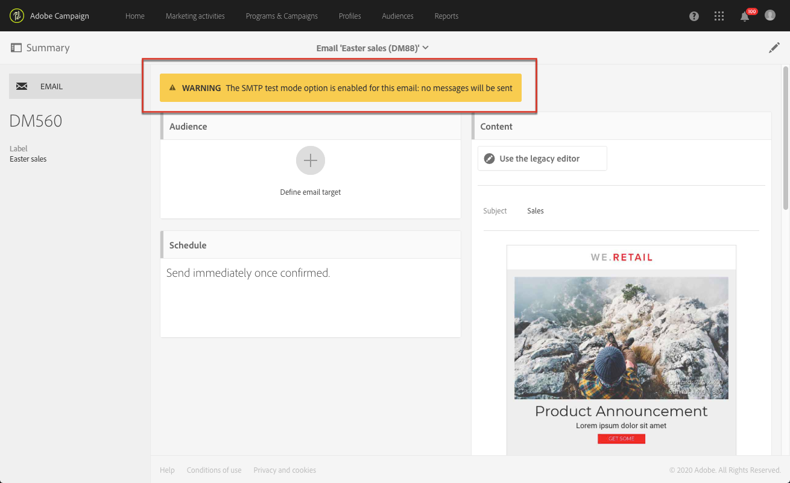

# Berichtdashboard{#message-dashboard}

Het berichtdashboard is een werkruimte die uit verschillende pictogrammen - in een actiebar wordt gegroepeerd - en diverse functionele blokken bestaat die u toestaan om de parameters van uw bericht te vestigen en het te verzenden. Deze elementen worden hierna weergegeven.

## Grijsbalk {#gray-bar}

De grijze balk groepeert verschillende pictogrammen die aan uw bericht zijn gekoppeld.

* **[!UICONTROL Summary]**: toont/verbergt de belangrijkste informatie betreffende het bericht.
* **[!UICONTROL Edit properties]**: hiermee kunt u de [geavanceerde parameters](../../administration/using/configuring-email-channel.md#list-of-email-properties).
* **[!UICONTROL Reports]**: geeft u toegang tot de rapporten met betrekking tot het bericht.

**Verwante onderwerpen:**

* [Kanalen configureren](../../administration/using/about-channel-configuration.md)
* [Toegang tot rapporten](../../reporting/using/about-dynamic-reports.md)

## Actiebalk {#action-bar}

De actiebalk heeft verschillende pictogrammen waarmee u kunt communiceren met uw bericht.

Afhankelijk van de ingestelde parameters en de geboekte vooruitgang zijn bepaalde pictogrammen mogelijk niet beschikbaar.

* **[!UICONTROL Show proofs]**: toont/verbergt de lijst met proefdrukken die zijn verzonden, als deze bestaan. Deze knop wordt alleen ingeschakeld nadat u proefdrukken hebt verzonden.

  Zie voor meer informatie over proefdrukken [Proefdrukken verzenden](../../sending/using/sending-proofs.md).

* **[!UICONTROL Send a test]**: Hiermee kunt u de goedkeuringsmodus selecteren die u wilt gebruiken: **[!UICONTROL Email rendering]** (alleen e-mail), **[!UICONTROL Proof]** of beide. Zie voor meer informatie over testprofielen [Proefdrukken verzenden](../../sending/using/sending-proofs.md). Deze knop wordt alleen ingeschakeld nadat u testprofielen hebt gemaakt.

* **[!UICONTROL Prepare send]**: begint met het voorbereiden van de verzending. De **[!UICONTROL Deployment]** wordt weergegeven en geeft het resultaat van de voorbereiding weer. Deze knop wordt alleen weergegeven wanneer het doel is ingevoerd. U kunt de voorbereiding op elk gewenst moment stoppen met de bijbehorende knop. Voor meer informatie over het voorbereiden van berichten raadpleegt u [De verzending voorbereiden](../../sending/using/preparing-the-send.md).

* **[!UICONTROL Confirm send]**: bevestigt het verzenden van het bericht. De verzendende statistieken verschijnen in **[!UICONTROL Deployment]** blokkeren. Deze knop wordt alleen weergegeven nadat het verzenden is voorbereid. U kunt de verzending op elk gewenst moment stoppen of pauzeren met de **Stoppen met verzenden** en **[!UICONTROL Pause]** knoppen. Voor meer informatie over het bevestigen van het verzenden, raadpleegt u [Berichten verzenden](../../sending/using/confirming-the-send.md).

## Blokken {#blocks}

Het hoofdscherm bestaat uit verschillende blokken. Klik in een blok om het bijbehorende parameterscherm te openen:

* **[!UICONTROL Deployment]**: hiermee kunt u de voortgang van het voorbereiden of verzenden van berichten volgen. Klik op de knop in de rechterbenedensectie van dit blok voor toegang tot de logboeken voor verzenden en analyse. Dit blok verschijnt slechts zodra het verzenden is voorbereid. Meer hierover. Zie [Verzenden bevestigen](../../sending/using/confirming-the-send.md).
* **[!UICONTROL Audience]**: hiermee kunt u zowel het hoofddoel van het bericht als de testprofielen vaststellen. Zie [Doelgroepen maken](../../audiences/using/creating-audiences.md).
* **[!UICONTROL Schedule]**: hiermee kunt u de datum opgeven waarop het bericht wordt verzonden. Zie [Planning](../../sending/using/about-scheduling-messages.md).
* **[!UICONTROL Content]**: hiermee kunt u de inhoud van het bericht definiëren en er een voorvertoning van weergeven. Zie [Belangrijkste stappen om een bericht te verzenden](../../channels/using/key-steps-to-send-a-message.md).

## Waarschuwingen {#warnings}

In sommige gevallen kan een waarschuwing in een gele banner boven op het berichtdashboard worden weergegeven.

Hieronder volgt een lijst met de berichten die kunnen worden weergegeven:

* *&quot;De optie voor de SMTP-testmodus is ingeschakeld voor deze e-mail: er worden geen berichten verzonden.&quot;*

  Zie [deze sectie](../../administration/using/configuring-email-channel.md#smtp-test-mode)voor meer informatie.

* *&quot;Het verpletteren van externe rekening is onbruikbaar gemaakt.&quot;*

  Zie voor meer informatie [Externe rekeningen](../../administration/using/external-accounts.md).

* *&quot;De berichten kunnen niet worden verzonden omdat de huidige IP affiniteit niet door om het even welk verzendend proces wordt behandeld.&quot;*

  Als u dit bericht ziet, is er een kwestie op het IP niveau van de affiniteitdefinitie of op het verzendende procesniveau. Neem contact op met de beheerder van de Adobe.

* *&quot;Dit is een uit-van-de-doos transactionele berichtmalplaatje. Als u het wilt wijzigen, moet u het dupliceren en aan uw exemplaar werken.&quot;*

  Sommige van deze uit-van-de-doos transactionele berichtmalplaatjes zijn ingebouwde het landen paginasjablonen. Zie [deze sectie](../../channels/using/landing-page-templates.md)voor meer informatie.

* *&quot;Dit bericht is een sjabloon voor technische transactieberichten. U kunt deze niet wijzigen of publiceren.&quot;*

  Deze waarschuwing wordt weergegeven in lege transactiemalplaatjes die niet bewerkbaar zijn. Zie voor meer informatie over transactieberichten [deze sectie](../../channels/using/getting-started-with-transactional-msg.md).
