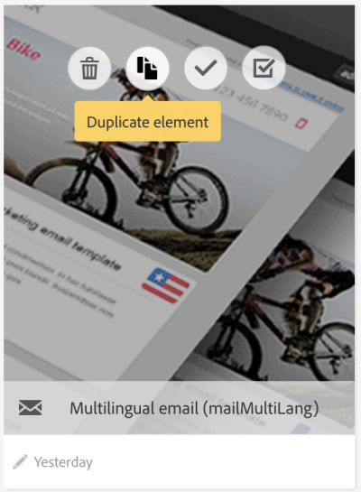

# Sjablonen voor meertalige berichten {#multilingual-messages-template}

Een meertalige sjabloon is een specifieke sjabloon voor het beheren van meertalige berichten. Dit soort sjabloon is beschikbaar voor **e-mail**- en **sms-berichten** en kan worden gebruikt in de zelfstandige modus, in een workflow of in een terugkerende levering.

In de meertalige eigenschapssjablonen is het taalbeheer gebaseerd op varianten. **Elke variant vertegenwoordigt één taal**. Adobe Campaign Standard kan maximaal 40 varianten instellen.

Adobe Campaign wordt geleverd met een standaardtaal die is ingesteld op **EN**. De standaardtaal kan worden gewijzigd in een andere variant, maar mag nooit worden verwijderd.

Tijdens het maken van de sjabloon kunt u het aantal varianten toevoegen dat correspondeert met het aantal nodige talen in het bericht.

Voer de volgende stappen uit om een sms- of e-mailsjabloon te maken:

1. Dupliceer een bestaande meertalige sjabloon (sms of e-mail).

   

   >[!NOTE]
   >
   >U kunt ook een bestaande standaardsjabloon in een meertalige sjabloon wijzigen door op de knop **[!UICONTROL Initialize content variant]** in de sjablooneigenschappen te klikken.

1. Wijzig de eigenschappen om label, tracking, enzovoort aan te passen.
1. Wijzig het aantal gewenste varianten door op de tegel Varianten te klikken. Het venster Varianten wordt weergegeven.

   

   U kunt varianten toevoegen of verwijderen. Als u een variant wilt toevoegen, vult u het venster **[!UICONTROL New content variant]** in.

   

   >[!NOTE]
   >
   >Verwijder niet de variant ‘standaard’. Dit is namelijk de variant die wordt verzonden naar profielen waarvoor geen voorkeurstaalparameter is opgegeven.

1. Pas indien nodig de labelvariant aan en klik op **[!UICONTROL Confirm]**.
1. U kunt de content voor elke variant ook rechtstreeks toevoegen.

U kunt nu een e-mail of een sms-bericht maken op basis van deze meertalige sjabloon.

**Verwante onderwerpen:**

* [Een meertalige e-mail maken](../../channels/using/creating-a-multilingual-email.md)
* [Profielen maken](../../audiences/using/creating-profiles.md)
