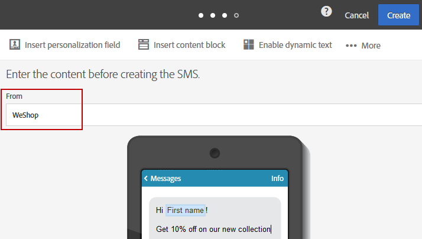

# Sms-berichten personaliseren{#personalizing-sms-messages}

De principes voor het personaliseren van sms-berichten zijn dezelfde als die voor [e-mails](../../designing/using/personalization.md#inserting-a-personalization-field). U moet echter op de hoogte zijn van de transliteratie-opties, aangezien deze van invloed kunnen zijn op de codering en daarmee op het aantal sms-berichten dat moet worden verzonden. Raadpleeg de sectie [Transliteratie en sms-lengte](../../administration/using/configuring-sms-channel.md#sms-encoding--length-and-transliteration) voor meer informatie.

Hier bespreken we een voorbeeld van een sms-bericht met personalisatievelden dat, afhankelijk van het feit of er al dan niet voor transliteratie wordt gekozen, niet hetzelfde aantal verzendingen zal genereren:

**Hallo &lt; FirstName > &lt; LastName >, er zijn nu nieuwe producten beschikbaar. Kom maar eens kijken in de winkel!**

* Voor een ontvanger met de naam John Smith waarin geen speciale tekens voorkomen, kiest Adobe Campaign voor GSM-codering met maximaal 160 tekens per sms-bericht. Het bericht wordt dus in één keer verzonden.
* Voor een ontvanger met de naam Raphaël Forêt kunnen de tekens &#39;ë&#39; en &#39;ê&#39; niet worden gecodeerd in GSM. Afhankelijk van het feit of transliteratie is ingeschakeld, zijn er in Adobe Campaign twee mogelijkheden:

   * Als transliteratie is geautoriseerd, worden &#39;ë&#39; en &#39;ê&#39; vervangen door &#39;e&#39;, wat betekent dat GSM-codering kan worden gebruikt en dat de sms uit maximaal 160 tekens kan bestaan. Dit bericht wordt als één sms-bericht verzonden, maar het wordt enigszins gewijzigd.
   * Als transliteratie niet is geautoriseerd, kiest Adobe Campaign ervoor het bericht in binaire notatie (Unicode) te verzenden: alle tekens worden daarom als zodanig verzonden. Aangezien er in Unicode een beperking geldt van 70 tekens per sms-bericht, moet Adobe Campagne het bericht in twee delen verzenden.

>[!NOTE]
>
>Het algoritme dat automatisch de beste codering kiest, wordt onafhankelijk uitgevoerd voor elk bericht, geval voor geval. Op deze manier worden alleen de gepersonaliseerde berichten die Unicode-codering vereisen in Unicode verzonden; voor alle andere wordt GSM-codering gebruikt.

## SMS-afzender {#sms-sender}

>[!IMPORTANT]
>
>Controleer de wetgeving in uw land met betrekking tot het wijzigen van het adres van de afzender. Neem ook contact op met uw sms-serviceprovider om te controleren of deze deze functionaliteit aanbiedt.

Met de optie **[!UICONTROL From]** kunt u de naam van de afzender van het sms-bericht aanpassen met een reeks tekens. Dit is de naam die wordt weergegeven als de afzender van het sms-bericht op de mobiele telefoon van de ontvanger.

Als dit veld leeg is, wordt het bronnummer gebruikt dat in het externe account is opgegeven. Als er geen bronnummer is opgegeven, wordt de korte code gebruikt. Het externe account specifiek voor sms-levering wordt in de sectie [Een sms-routering bepalen](../../administration/using/configuring-sms-channel.md#defining-an-sms-routing) opgegeven.

