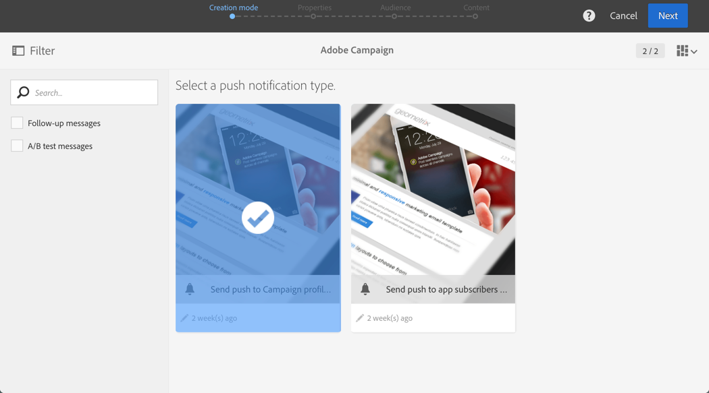
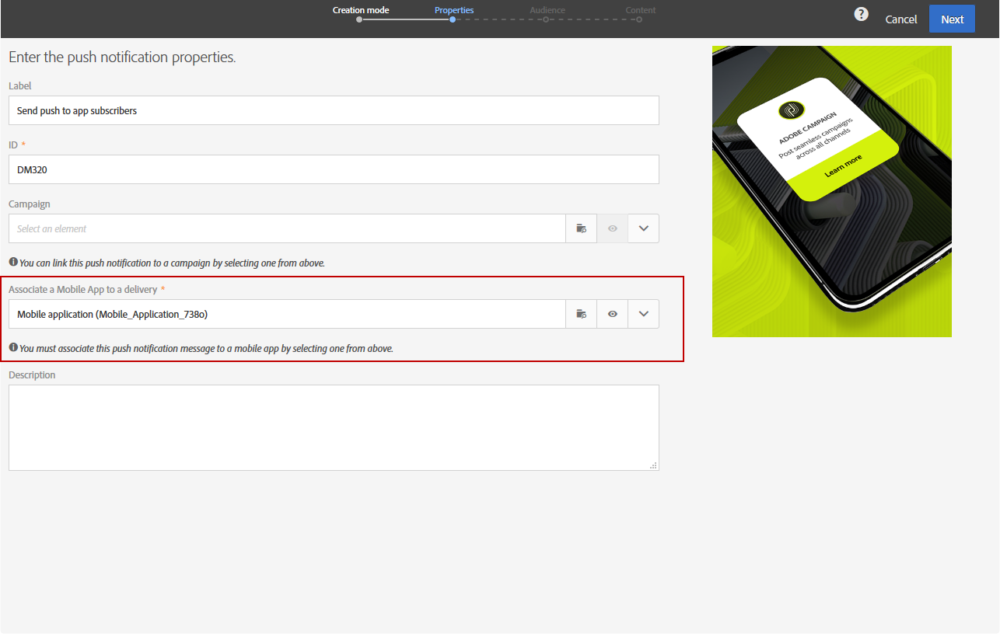
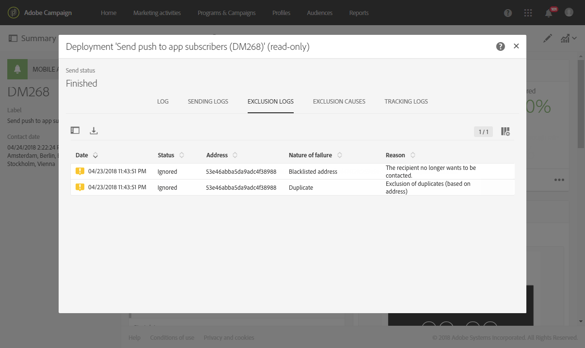

# Een pushmelding voorbereiden en verzenden{#preparing-and-sending-a-push-notification}

## De melding voorbereiden {#preparing-the-notification}

De stappen voor het maken van een pushmelding met Adobe Campagne zijn:

1. Maak vanuit het **[!UICONTROL Marketing activities]** venster een nieuwe marketingactiviteit .

   Er kan ook één pushmelding worden gemaakt van een [campagne](../../start/using/marketing-activities.md#creating-a-marketing-activity) of van de Adobe Campagne- [startpagina](../../start/using/interface-description.md#home-page).

   U kunt ook een leveringsactiviteit voor pushberichten gebruiken in een workflow. Deze activiteit wordt voorgesteld in de [sectie van de het berichtlevering](../../automating/using/push-notification-delivery.md) van de duw.

1. Selecteer **[!UICONTROL Push notification]**.
1. Selecteer een sjabloon.

   

   Standaard kunt u een van de volgende twee sjablonen selecteren:

   * **[!UICONTROL Send push to Campaign profiles]**: Gebruik deze sjabloon als doel voor de Adobe Campagne CRM-profielen die zijn geabonneerd op uw mobiele toepassing en zich hebben aangemeld voor het ontvangen van pushberichten. U kunt [verpersoonlijkingsgebieden](../../designing/using/personalization.md#inserting-a-personalization-field) in uw dupmelding, zoals de voornaam van de ontvanger opnemen.
   * **[!UICONTROL Send push to app subscribers]**: gebruik deze sjabloon om een pushmelding te verzenden naar alle bekende en anonieme gebruikers van mobiele toepassingen die zich hebben aangemeld om meldingen van uw toepassing te ontvangen. U kunt deze berichten personaliseren met gegevens die uit uw mobiele toepassing worden verzameld.
   U kunt ook meertalige sjablonen selecteren. Raadpleeg [Een meertalige pushmelding](../../channels/using/creating-a-multilingual-push-notification.md)maken voor meer informatie.

   Raadpleeg de sectie [Sjablonen](../../start/using/marketing-activity-templates.md) beheren voor meer informatie over sjablonen.

1. Voer de eigenschappen van uw pushmelding in en selecteer uw mobiele app in het **[!UICONTROL Associate a Mobile App to a delivery]** veld.

   In het vervolgkeuzemenu worden zowel SDK V4- als Experience Platform SDK-toepassingen weergegeven.

   

   U kunt de pushmelding koppelen aan een campagne. U doet dit door het te selecteren uit de campagnes die al zijn gemaakt.

1. In het volgende scherm kunt u een publiek opgeven, bijvoorbeeld al uw VIP-klanten die zich hebben geabonneerd op een specifieke mobiele toepassing. Zie [Soorten publiek](../../audiences/using/creating-audiences.md)maken voor meer informatie hierover.

   Uw publiek wordt automatisch gefilterd op basis van de mobiele toepassing die u in de vorige stap hebt geselecteerd.

   

1. U kunt uw pushmelding nu aanpassen. Kies eerst de berichtstijl: **[!UICONTROL Alert/Message/Badge]** of **[!UICONTROL Silent push]**. De typen pushmeldingen worden beschreven in de sectie [Over pushmeldingen](../../channels/using/about-push-notifications.md) .

   Bewerk de inhoud van uw pushmelding en definieer de geavanceerde opties. Zie Een pushmelding [aanpassen](../../channels/using/customizing-a-push-notification.md).

   

   De inhoud en opties van de pushmelding die hier zijn geconfigureerd, worden doorgegeven aan uw mobiele app in de vorm van een payload. De gedetailleerde structuur van de lading wordt beschreven in het [Begrip van ACS-push berichten loonlaststructuur](https://helpx.adobe.com/campaign/kb/understanding-campaign-standard-push-notifications-payload-struc.html) .

1. Klik op **[!UICONTROL Create]**.

   

1. Voordat u het bericht verzendt, kunt u het testen met testprofielen en vervolgens precies zien wat de ontvangers zullen zien voordat de levering wordt verzonden. Selecteer **[!UICONTROL Audiences]** in uw leveringsoverzicht en klik op het **[!UICONTROL Test profiles]** tabblad.

   Raadpleeg de [testprofielen](../../sending/using/sending-proofs.md)voor meer informatie over het verzenden van tests.

1. Selecteer de testprofielen en klik **[!UICONTROL Preview]** om de melding weer te geven: inhoud wordt gepersonaliseerd met de gegevens van het testprofiel.
1. Controleer de lay-out van de pushmelding op verschillende apparaten: Selecteer een iPhone-, Android-telefoon-, iPad- of Android-tablet voor een voorvertoning van de rendering.

   

1. Dit **[!UICONTROL Estimated Payload Size]** is een schatting op basis van gegevens van het testprofiel. De werkelijke ladingsgrootte kan variëren. De limiet van het bericht is 4 kB.

   >[!CAUTION]
   >
   >Als de ladingsgrootte 4KB grens overschrijdt, zal het bericht niet worden geleverd. De gegevens van de aanpassing beïnvloeden de grootte van bericht.

## De melding verzenden {#sending-the-notification}

U kunt pushmeldingen naar een geselecteerd publiek in Adobe Campagne verzenden door de criteria voor het publiek te definiëren. In het onderstaande voorbeeld bestaat ons geselecteerde publiek uit vier beoogde abonnees van mobiele apps.

1. Klik **[!UICONTROL Prepare]** om het doel te berekenen en de berichten te produceren.

   

1. Zodra de voorbereiding is beëindigd, geeft het venster **[!UICONTROL Deployment]** de volgende KPI&#39;s weer: **[!UICONTROL Target]** en **[!UICONTROL To deliver]**. Houd er rekening mee dat het aantal voor **[!UICONTROL To deliver]** lager is dan het aantal voor **[!UICONTROL Targeted]** vanwege uitsluitingen die kunnen worden weergegeven door op de knop  onder aan het venster **[!UICONTROL Deployment]** te klikken.

   

1. Op het **[!UICONTROL Exclusion logs]** tabblad vindt u de lijst met alle berichten die zijn uitgesloten van het verzonden doel en de reden voor deze uitsluiting.

   Hier kunnen we zien dat een van onze abonnees op mobiele apps is uitgesloten omdat het adres op de zwarte lijst stond en de andere abonnees omdat het profiel een duplicaat was.

   

1. Klik op het **[!UICONTROL Exclusion causes]** tabblad om het volume van uitgesloten berichten weer te geven.

   

1. U kunt nu klikken **[!UICONTROL Confirm]** om pushmeldingen te verzenden.
1. Controleer de status van uw levering via het berichtdashboard en de logboeken. Voor meer op dit, zie het [Verzenden van berichten](../../sending/using/confirming-the-send.md) en de Logboeken [van de](../../sending/using/monitoring-a-delivery.md#delivery-logs)Levering.

   In dit voorbeeld wordt op het berichtdashboard weergegeven dat Adobe Campagne heeft geprobeerd twee pushmeldingen te verzenden: een werd met succes geleverd aan het apparaat en een andere ontbrak. Als u wilt weten waarom de levering fouten bevat, klikt u op de  knop onder aan het **[!UICONTROL Deployment]** venster.

   

1. Klik in het **[!UICONTROL Deployment]** venster op het **[!UICONTROL Sending logs]** tabblad voor toegang tot de lijst met verzonden pushberichten en hun status. Voor deze levering is een pushmelding verzonden, terwijl het andere is mislukt als gevolg van een ongeldige apparaattoken. Deze abonnee wordt dan op de zwarte lijst gezet van verdere leveringen.

   >[!NOTE]
   >
   >De oorzaak kan zijn dat de campagne van Adobe is mislukt. In het geval van mislukkingen van aanbieders zoals apns en fcm, zal de reden dat ook weerspiegelen. Raadpleeg de documentatie van [Apple](https://developer.apple.com/library/content/documentation/NetworkingInternet/Conceptual/RemoteNotificationsPG/CommunicatingwithAPNs.html) en [Android](https://firebase.google.com/docs/cloud-messaging/http-server-ref) voor meer informatie over problemen met leveranciers.

   

U kunt nu de impact van uw pushmelding meten met dynamische rapporten.

**Verwante onderwerpen:**

* [Pushmeldingsrapport](../../reporting/using/push-notification-report.md)
* [Een pushmelding verzenden binnen een workflow](../../automating/using/push-notification-delivery.md)

