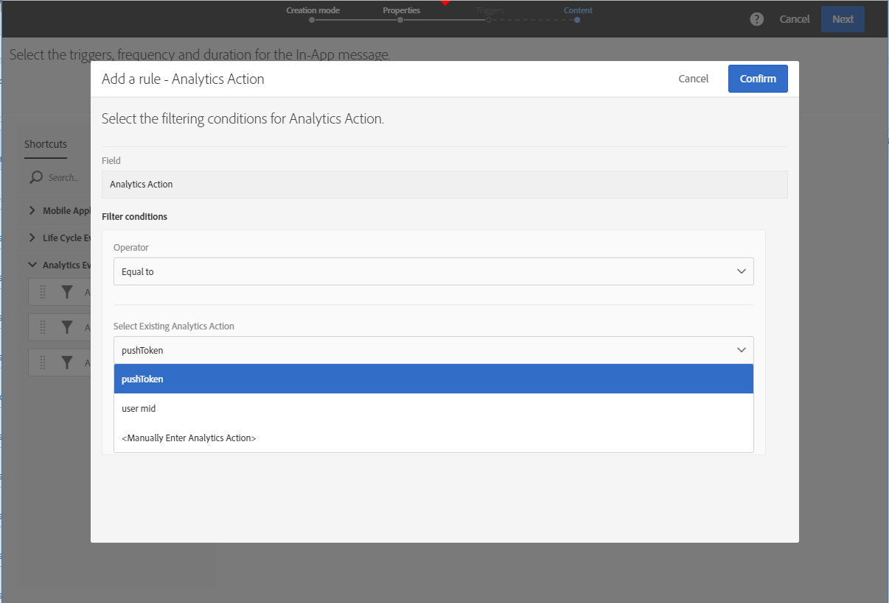

# Een bericht in de app voorbereiden en verzenden{#preparing-and-sending-an-in-app-message}

>[!NOTE]
>
>De personalisatie in de app is afhankelijk van een koppelingsveld dat doorgaans een CRM-id en/of een Mobile App Login-id is. U bent als enige verantwoordelijk voor het beveiligen van dit koppelingsveld bij gebruik in combinatie met Adobe Campaign. Als u uw koppelingsveld(en) niet veilig houdt, kan uw persoonlijke bericht kwetsbaar zijn. Adobe is niet aansprakelijk voor schade die voortvloeit uit ongeoorloofde toegang tot of gebruik van profielgegevens als u de compositie, het beheer en de beveiligingspraktijken van het veld voor veilige koppelingen niet opvolgt.

Er zijn drie typen In-App-berichten beschikbaar in Adobe Campaign:

* **[!UICONTROL Target users based on their Campaign profile (inAppProfile)]**: Met dit berichttype kunt u zich richten op Adobe Campaign-profielen (CRM-profielen) die zijn geabonneerd op uw mobiele toepassing. Dit berichttype kan met alle beschikbare profielattributen in Adobe Campaign worden gepersonaliseerd maar vereist een veilige handdruk tussen Mobile SDK en de het overseinendienst van de Campagne In-App om ervoor te zorgen dat de berichten met persoonlijke en gevoelige informatie door erkende gebruikers slechts worden gebruikt.

   Om dit berichttype op gebruikersapparaten te downloaden, moet Mobile SDK koppelingsgebieden verzenden die worden gebruikt om een mobiel profiel aan een profiel van CRM in Adobe Campaign te verbinden. Raadpleeg deze [pagina](https://aep-sdks.gitbook.io/docs/using-mobile-extensions/adobe-campaign-standard/adobe-campaign-standard-api-reference)voor meer informatie over SDK API&#39;s die vereist zijn voor ondersteuning van In-App.

* **[!UICONTROL Target all users of a Mobile app (inAppBroadcast)]**: Met dit berichttype kunt u berichten verzenden naar alle gebruikers (huidige of toekomstige) van uw mobiele toepassing, zelfs als deze geen bestaand profiel in Adobe Campaign hebben. Personalisatie is dus niet mogelijk bij het aanpassen van de berichten omdat het gebruikersprofiel misschien niet eens bestaat in Adobe Campaign.
* **[!UICONTROL Target users based on their Mobile profile (inApp)]**: Met dit berichttype kunt u zich richten op alle bekende of anonieme gebruikers van een mobiele app met een mobiel profiel in Adobe Campaign. Dit berichttype kan worden gepersonaliseerd gebruikend slechts niet-persoonlijke en niet-gevoelige attributen en vereist geen veilige handdruk tussen Mobiele SDK en de In-App overseinendienst van Adobe Campaign.

   Zie [Mobiele profielvelden afhandelen met persoonlijke en vertrouwelijke gegevens](#handling-mobile-profile-fields-with-personal-and-sensitive-data)voor meer informatie over hoe u met persoonlijke en vertrouwelijke gegevens kunt omgaan.

## Mobiele profielvelden verwerken met persoonlijke en gevoelige gegevens {#handling-mobile-profile-fields-with-personal-and-sensitive-data}

In Adobe Campaign worden data van mobiele profielkenmerken die vanaf een mobiel apparaat worden verzonden, opgeslagen in de resource **[!UICONTROL Subscriptions to an application (appSubscriptionRcp)]** waardoor u de data die u van de abonnees van uw applicaties wilt verzamelen, kunt definiëren.

Deze bron moet worden uitgebreid om gegevens te verzamelen die u van het mobiele apparaat naar Adobe Campaign wilt verzenden. Raadpleeg hiervoor deze [pagina](../../developing/using/extending-the-subscriptions-to-an-application-resource.md) voor de gedetailleerde stappen.

Om personalisatie van uw in-app-berichten veiliger te maken moeten de mobiele profielvelden van deze resource dienovereenkomstig worden geconfigureerd. Wanneer u uw nieuwe mobiele profielvelden maakt, schakelt u in uw **[!UICONTROL Subscriptions to an application (appSubscriptionRcp)]** de optie **[!UICONTROL Personal and Sensitive]** om deze onbeschikbaar te maken tijdens personalisatie van in-app-berichten.

>[!NOTE]
>
>Als u een bestaande implementatie hebt met een aangepaste bronnenextensie in deze tabel, raden we u aan de velden op de juiste wijze te labelen voordat u ze gebruikt voor de personalisatie van In-App-berichten.

Zodra uw aangepaste resource voor **[!UICONTROL Subscriptions to an application]** is geconfigureerd en gepubliceerd, kunt u beginnen met de voorbereiding van uw in-app-levering met behulp van de sjabloon **[!UICONTROL Target users based on their Mobile profile (inApp)]**. Alleen niet-persoonlijke en niet-gevoelige velden zijn beschikbaar voor personalisatie vanuit de resource **[!UICONTROL Subscriptions to an application (appSubscriptionRcp)]**.

Als u personalisatie met **persoonlijke en gevoelige** velden nodig hebt, raden wij u aan de sjabloon **[!UICONTROL Target users based on their Campaign profile (inAppProfile)]** te gebruiken die over een extra veiligheidsmechanisme beschikt om ervoor te zorgen dat de PII-data van uw gebruikers veilig blijven.

## Uw bericht in de app voorbereiden {#preparing-your-in-app-message}

De stappen voor het maken van een zelfstandig In-App-bericht met Adobe Campaign zijn:

1. Klik op de **[!UICONTROL In-App messaging]** kaart vanaf de homepage van Adobe Campaign.

   U kunt ook een In-App maken via het tabblad **Marketingactiviteiten** door op de **[!UICONTROL Create]** knop te klikken.

   Een bericht in de app kan ook worden gemaakt op basis van een campagne, de startpagina van Adobe Campaign of een workflow.

1. Selecteer **In-App-bericht**.

   

1. Selecteer een geschikte sjabloon op basis van de doelbehoeften van uw doelgroep.

   

   Standaard kunt u een van de volgende drie out-of-the-box sjablonen selecteren:

   * **[!UICONTROL Target users based on their Campaign CRM profile (inAppProfile)]**
   * **[!UICONTROL Target all users of a Mobile app (inAppBroadcast)]**
   * **[!UICONTROL Target users based on their Mobile profile (inApp)]**

1. Voer de berichteigenschappen in de app in en selecteer de mobiele app in het **[!UICONTROL Associate a Mobile App to a delivery]** veld. Houd er rekening mee dat als u uw mobiele app niet met Adobe Campaign Standard hebt geconfigureerd, deze niet in de lijst wordt weergegeven. Raadpleeg deze [pagina](https://helpx.adobe.com/campaign/kb/configuring-app-sdk.html#ChannelspecificapplicationconfigurationinAdobeCampaign)voor meer informatie over de configuratie van mobiele toepassingen.

   

1. Selecteer het publiek dat u als doel voor uw In-App bericht wilt instellen. Uw publiek wordt geprefilterd afhankelijk van de mobiele toepassing verbonden aan deze levering.

   Houd er rekening mee dat deze stap niet nodig is voor de toepassing **[!UICONTROL Broadcast an In-App message (inAppBroadcast)]** omdat deze gericht is op alle gebruikers van een mobiele toepassing.

   

1. Sleep op het **[!UICONTROL Triggers]** tabblad de gebeurtenis die het bericht activeert. Door een trigger te kiezen, kiest u een actie die door gebruikers wordt uitgevoerd en die ertoe leidt dat het bericht in de app wordt weergegeven.

   Er zijn vier categorieën gebeurtenissen beschikbaar:

   * **[!UICONTROL Mobile Application events]**: Aangepaste gebeurtenissen die in uw mobiele toepassing zijn geïmplementeerd.

      Raadpleeg deze [pagina](https://helpx.adobe.com/campaign/kb/configuring-app-sdk.html)voor meer informatie over het maken van gebeurtenissen.

   * **[!UICONTROL Life Cycle events]**: Gebeurtenissen voor de levenscyclus buiten de box die worden ondersteund door Adobe Mobile SDK.

      Raadpleeg deze [pagina](https://docs.adobe.com/content/help/en/mobile-services/android/metrics.html)voor meer informatie over levenscyclusgebeurtenissen.

   * **[!UICONTROL Analytics Events]**: De volgende drie categorieën worden ondersteund, afhankelijk van wat er van instrumenten wordt voorzien in uw mobiele app: Adobe Analytics, Context-gegevens of weergavestatus.

      Deze gebeurtenissen zijn alleen beschikbaar als u een Adobe Analytics-licentie hebt.

   * **[!UICONTROL Places]**: De volgende drie categorieën maken gebruik van realtime locatiegegevens om contextueel relevante mobiele ervaringen te bieden: Plaatst contextgegevens, Plaatst aangepaste metagegevens of het gebeurtenistype Plaatsen.

      Raadpleeg de documentatie bij [Plaatsen voor meer informatie over Adobe Places](https://placesdocs.com/).
   

1. Als u een **[!UICONTROL Analytics Events]**, de staatsgebeurtenissen van Adobe Analytics en van de Mening gebruikt zullen automatisch bevolkt worden gebaseerd op de rapportreeksen die in de uitbreiding van Analytics in de Lancering van het Adobe Experience Platform worden gevormd terwijl de gebeurtenissen van de Context- gegevens manueel moeten worden toegevoegd.

   Deze gebeurtenissen zijn alleen beschikbaar als u een Adobe Analytics-licentie hebt.

   

1. Als u een **[!UICONTROL Places]** trigger gebruikt, worden de contextgegevens van Plaatsen, aangepaste metagegevens of het gebeurtenistype Plaatsen automatisch ingevuld op basis van alle bibliotheken en hun interessepunten die zijn gemaakt op Adobe-locaties.

   Deze trigger wordt alleen op het apparaat toegepast voor de interessepunten van de bibliotheken die zijn geselecteerd in de extensie Plaatsen in Experience Platform Launch. Raadpleeg deze [documentatie](https://docs.adobe.com/content/help/en/places/using/places-ext-aep-sdks/places-extension/places-extension.html)voor meer informatie over de extensie Plaatsen en over het installeren ervan.

1. Kies op het **[!UICONTROL Frequency & duration]** tabblad de frequentie voor de trigger, de begin- en einddatum, de dag van de week en het tijdstip van de dag waarop het bericht in de app actief wordt.

   

1. Bewerk de inhoud van uw bericht en definieer de geavanceerde opties. Zie Een bericht [in de app](https://helpx.adobe.com/campaign/standard/channels/using/customizing-a-push-notification.html)aanpassen.

   

1. Klik op **[!UICONTROL Create]**.

Uw bericht in de app is nu klaar om naar het beoogde publiek te worden verzonden.

**Verwante onderwerpen:**

* [Een bericht in de app aanpassen](../../channels/using/customizing-an-in-app-message.md)
* [Rapport in app](../../reporting/using/in-app-report.md)
* [Een bericht in de app verzenden binnen een workflow](../../automating/using/in-app-delivery.md)

## Uw bericht in de app verzenden {#sending-your-in-app-message}

Nadat u de levering hebt voorbereid en de goedkeuringsstappen zijn uitgevoerd, kunt u uw bericht verzenden.

1. Klik **[!UICONTROL Prepare]** om het doel te berekenen en de berichten te produceren.

   

1. Once the preparation has finished successfully, the **Deployment** window presents the following KPIs: **Target** and **To deliver**.

   U kunt het venster van de Plaatsing controleren door de  knoop voor potentiële uitsluitingen of fouten in uw levering te klikken.

   

1. Klik **[!UICONTROL Confirm]** om uw bericht in de app te verzenden.

   

1. Controleer de status van uw levering via het berichtdashboard en de logboeken. For more on this, refer to this [section](../../sending/using/monitoring-a-delivery.md).

   **[!UICONTROL Delivered]** en de tellingen **[!UICONTROL Sent]** van KPIs zijn gebaseerd op wat met succes van Campagne aan de leveringsdienst van het Bericht wordt verzonden. Merk op dat deze KPIs geen aanwijzing van de telling van mobiele apparaten is die het bericht van de de leveringsdienst van het Bericht met succes hebben ontvangen of gedownload.

   

1. Meet het effect van uw In-App berichten met leveringsrapporten. For more on reporting, refer to [this section](../../reporting/using/in-app-report.md).

**Verwante onderwerpen:**

* [Rapport in app](../../reporting/using/in-app-report.md)
* [Een bericht in de app verzenden binnen een workflow](../../automating/using/in-app-delivery.md)

