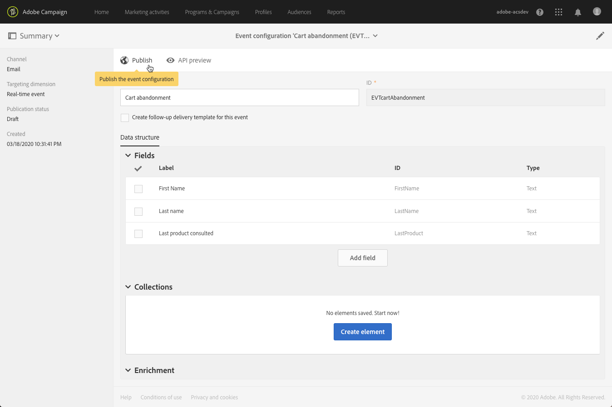
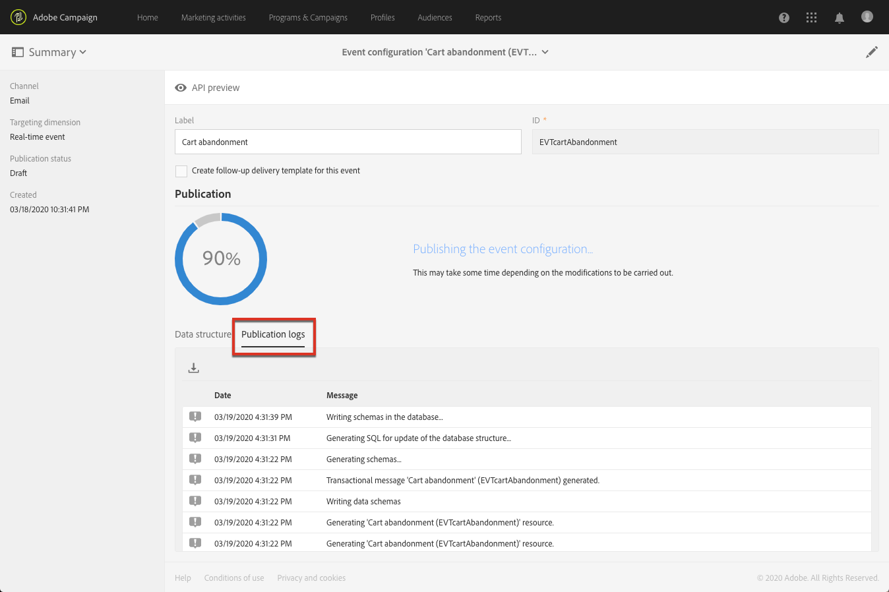
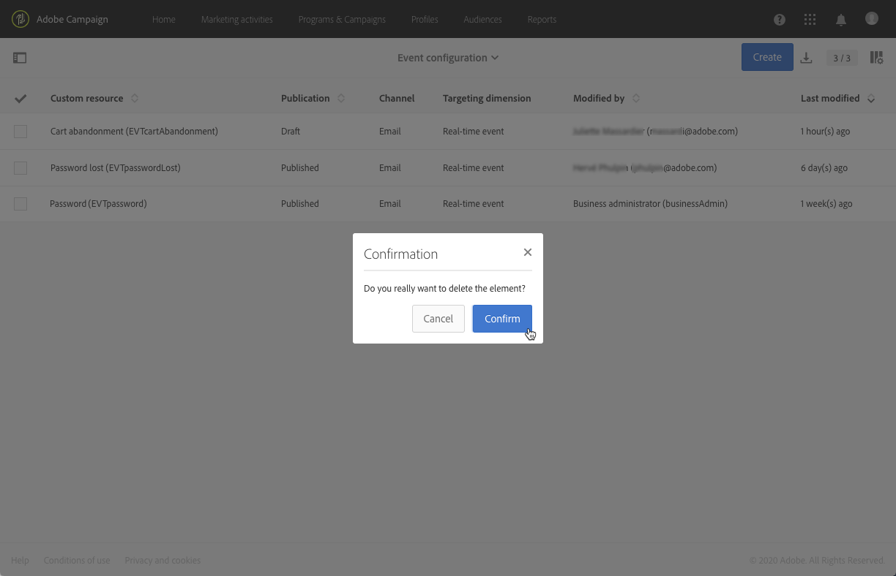

# Transactiegebeurtenissen publiceren {#publishing-transactional-event}

Zodra [ configuratie ](../../channels/using/configuring-transactional-event.md) wordt gedaan, is de gebeurtenis klaar om te worden gepubliceerd. De stappen voor het voorvertonen, publiceren, publiceren en verwijderen van een gebeurtenis worden hieronder beschreven.

>[!IMPORTANT]
>
>Slechts [ Functionele beheerders ](../../administration/using/users-management.md#functional-administrators) <!--being part of the **[!UICONTROL All]** [organizational unit](../../administration/using/organizational-units.md) --> hebben de aangewezen rechten om gebeurtenisconfiguraties te publiceren.

Een grafiek die het volledige transactieoverseinenpublicatieproces, met inbegrip van het publiceren en unpublishing gebeurtenisconfiguraties illustreert, is beschikbaar in [ deze sectie ](../../channels/using/publishing-transactional-message.md).

Zodra de publicatie is voltooid:
* Het overeenkomstige transactiemelding wordt automatisch gecreeerd. Zie [ het Uitgeven van transactionele berichten ](../../channels/using/editing-transactional-message.md).
* De API die door uw websiteontwikkelaar wordt gebruikt, wordt opgesteld en de transactionele gebeurtenissen kunnen nu worden verzonden. Zie [ de gebeurtenis die ](../../channels/using/getting-started-with-transactional-msg.md#integrate-event-trigger) teweegbrengt integreren.

## Een gebeurtenis voorvertonen en publiceren {#previewing-and-publishing-the-event}

Voordat u de gebeurtenis kunt gebruiken, moet u deze voorvertonen en publiceren.

1. Klik op de knop **[!UICONTROL API preview]** om een simulatie van de REST API te bekijken die door de ontwikkelaar van de website wordt gebruikt voordat deze wordt gepubliceerd.

   Nadat de gebeurtenis is gepubliceerd, kunt u met deze knop ook een voorvertoning van de API in productie zien. Zie [ de gebeurtenis die ](../../channels/using/getting-started-with-transactional-msg.md#integrate-event-trigger) teweegbrengt integreren.

   

   >[!NOTE]
   >
   >De REST API varieert afhankelijk van het geselecteerde kanaal en de geselecteerde doeldimensie. Voor meer details op de diverse configuraties, verwijs naar [ deze sectie ](../../channels/using/configuring-transactional-event.md#transactional-event-specific-configurations).

1. Klik op **[!UICONTROL Publish]** om de publicatie te starten.

   

   De API die door uw websiteontwikkelaar wordt gebruikt, wordt opgesteld en de transactionele gebeurtenissen kunnen nu worden verzonden.

1. U kunt de publicatielogboeken weergeven op het bijbehorende tabblad.

   

   >[!IMPORTANT]
   >
   >Telkens wanneer u de gebeurtenis wijzigt, moet u nogmaals op **[!UICONTROL Publish]** klikken om de bijgewerkte REST API te genereren die door uw websiteontwikkelaar wordt gebruikt.

   Zodra de gebeurtenis is gepubliceerd, wordt het a [ transactiebericht ](../../channels/using/editing-transactional-message.md) verbonden aan de nieuwe gebeurtenis automatisch gecreeerd.

1. U kunt tot dit transactiebericht direct toegang hebben door de verbinding die in het linkerzijgebied wordt gevestigd.

   

   >[!NOTE]
   >
   >Als de gebeurtenis het verzenden van een transactiemelding moet activeren, moet u het bericht wijzigen en publiceren dat net is gemaakt. Zie [ het Uitgeven ](../../channels/using/editing-transactional-message.md) en [ het Publiceren van een transactiebericht ](../../channels/using/publishing-transactional-message.md) secties. U moet ook [ deze trekkergebeurtenis ](../../channels/using/getting-started-with-transactional-msg.md#integrate-event-trigger) in uw website integreren.

1. Zodra Adobe Campaign gebeurtenissen ontvangt die betrekking hebben op deze gebeurtenisconfiguratie, kunt u op de koppeling **[!UICONTROL Latest transactional events]** onder de sectie **[!UICONTROL History]** klikken om toegang te krijgen tot de meest recente gebeurtenissen die door uw externe service zijn verzonden en door Adobe Campaign zijn verwerkt.

De gebeurtenissen (in JSON-indeling) worden weergegeven van de meest recente tot de oudste. Met deze lijst kunt u gegevens zoals de inhoud of de status van een gebeurtenis controleren voor controle en foutopsporing.

## Publicatie van een gebeurtenis ongedaan maken {#unpublishing-an-event}

Met de knop **[!UICONTROL Unpublish]** kunt u de publicatie van de gebeurtenis annuleren. Hierdoor wordt de bron die overeenkomt met de gebeurtenis die u eerder hebt gemaakt, uit de REST-API verwijderd.

Zelfs als de gebeurtenis via uw website wordt geactiveerd, worden de bijbehorende berichten niet meer verzonden en niet opgeslagen in de database.

>[!NOTE]
>
>Als u het overeenkomstige transactiemelding reeds hebt gepubliceerd, wordt de transactieberichtpublicatie ook geannuleerd. Zie [ Unpublishing een transactioneel bericht ](../../channels/using/publishing-transactional-message.md#unpublishing-a-transactional-message).

Klik op de knop **[!UICONTROL Publish]** om een nieuwe REST API te genereren.

<!--
## Transactional messaging publication process {#transactional-messaging-pub-process}

The chart below illustrates the transactional messaging publication process.

For more on publishing, pausing and unpublishing a transactional message, see [this section](../../channels/using/publishing-transactional-message.md).
-->

## Een gebeurtenis verwijderen {#deleting-an-event}

Nadat een gebeurtenis niet gepubliceerd is of nog niet gepubliceerd is, kunt u deze verwijderen uit de lijst met gebeurtenisconfiguraties. Dit doet u als volgt:

1. Klik het **Adobe** embleem, in de top-linkerhoek, dan uitgezocht **[!UICONTROL Marketing plans]** > **[!UICONTROL Transactional messages]** > **[!UICONTROL Event configuration]**.
1. Houd de muis boven de gewenste gebeurtenisconfiguratie en selecteer de knop **[!UICONTROL Delete element]** .

   

   >[!NOTE]
   >
   >Zorg ervoor dat de gebeurtenisconfiguratie de status **[!UICONTROL Draft]** heeft, anders kunt u deze niet verwijderen. De **[!UICONTROL Draft]** status is op een gebeurtenis van toepassing die nog niet gepubliceerd is of die [ niet gepubliceerd ](#unpublishing-an-event) is geweest.

1. Klik op **[!UICONTROL Confirm]** .

   

>[!IMPORTANT]
>
>Als u een gebeurtenisconfiguratie verwijdert die is gepubliceerd en al wordt gebruikt, worden ook de bijbehorende transactiemeldingen en de bijbehorende verzendings- en trackinglogboeken verwijderd.
