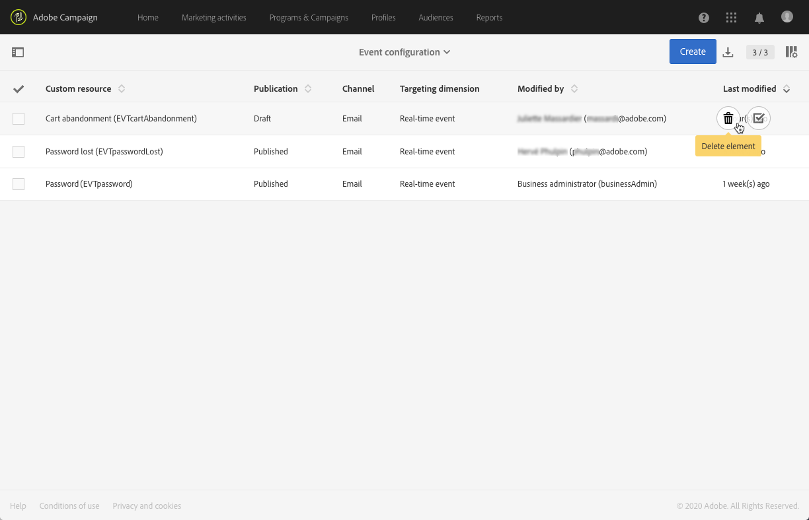

# Een transactionele gebeurtenis publiceren {#publishing-transactional-event}

Eenmaal [configuratie](../../channels/using/configuring-transactional-event.md) is voltooid, is de gebeurtenis gereed om te worden gepubliceerd. De stappen voor het voorvertonen, publiceren, publiceren en verwijderen van een gebeurtenis worden hieronder beschreven.

>[!IMPORTANT]
>
>Alleen [Functionele beheerders](../../administration/using/users-management.md#functional-administrators) <!--being part of the **[!UICONTROL All]** [organizational unit](../../administration/using/organizational-units.md) -->beschikken over de juiste rechten om gebeurtenisconfiguraties te publiceren.

Een grafiek die het volledige transactieoverseinenpublicatieproces, met inbegrip van het publiceren en unpublishing gebeurtenisconfiguraties illustreert, is beschikbaar in [deze sectie](../../channels/using/publishing-transactional-message.md).

Zodra de publicatie is voltooid:
* Het overeenkomstige transactiemelding wordt automatisch gecreeerd. Zie [Transactieberichten bewerken](../../channels/using/editing-transactional-message.md).
* De API die door uw websiteontwikkelaar wordt gebruikt, wordt opgesteld en de transactionele gebeurtenissen kunnen nu worden verzonden. Zie [De gebeurtenis die leidt tot integratie](../../channels/using/getting-started-with-transactional-msg.md#integrate-event-trigger).

## Een gebeurtenis voorvertonen en publiceren {#previewing-and-publishing-the-event}

Voordat u de gebeurtenis kunt gebruiken, moet u deze voorvertonen en publiceren.

1. Klik op de knop **[!UICONTROL API preview]** om een simulatie van de REST API te bekijken die door uw websiteontwikkelaar zal worden gebruikt alvorens het wordt gepubliceerd.

   Nadat de gebeurtenis is gepubliceerd, kunt u met deze knop ook een voorvertoning van de API in productie zien. Zie [De gebeurtenis die leidt tot integratie](../../channels/using/getting-started-with-transactional-msg.md#integrate-event-trigger).

   

   >[!NOTE]
   >
   >De REST API varieert afhankelijk van het geselecteerde kanaal en de geselecteerde doeldimensie. Raadpleeg voor meer informatie over de verschillende configuraties [deze sectie](../../channels/using/configuring-transactional-event.md#transactional-event-specific-configurations).

1. Klikken **[!UICONTROL Publish]** om de publicatie te starten.

   

   De API die door uw websiteontwikkelaar wordt gebruikt, wordt opgesteld en de transactionele gebeurtenissen kunnen nu worden verzonden.

1. U kunt de publicatielogboeken weergeven op het bijbehorende tabblad.

   

   >[!IMPORTANT]
   >
   >Telkens wanneer u de gebeurtenis wijzigt, moet u klikken **[!UICONTROL Publish]** opnieuw om de bijgewerkte REST API te genereren die door uw websiteontwikkelaar zal worden gebruikt.

   Nadat de gebeurtenis is gepubliceerd, voert u een [transactiebericht](../../channels/using/editing-transactional-message.md) wordt automatisch gekoppeld aan de nieuwe gebeurtenis.

1. U kunt tot dit transactiebericht direct toegang hebben door de verbinding die in het linkerzijgebied wordt gevestigd.

   

   >[!NOTE]
   >
   >Als de gebeurtenis het verzenden van een transactiemelding moet activeren, moet u het bericht wijzigen en publiceren dat net is gemaakt. Zie [Bewerken](../../channels/using/editing-transactional-message.md) en [Transactiebericht publiceren](../../channels/using/publishing-transactional-message.md) secties. U moet ook [Deze activeringsgebeurtenis integreren](../../channels/using/getting-started-with-transactional-msg.md#integrate-event-trigger) op uw website.

1. Zodra Adobe Campaign gebeurtenissen ontvangt die betrekking hebben op deze gebeurtenisconfiguratie, kunt u op de knop **[!UICONTROL Latest transactional events]** koppeling onder de **[!UICONTROL History]** voor toegang tot de meest recente gebeurtenissen die door uw service van derden zijn verzonden en door Adobe Campaign zijn verwerkt.

De gebeurtenissen (in JSON-indeling) worden weergegeven van de meest recente tot de oudste. Met deze lijst kunt u gegevens zoals de inhoud of de status van een gebeurtenis controleren voor controle en foutopsporing.

## Publicatie van een gebeurtenis ongedaan maken {#unpublishing-an-event}

De **[!UICONTROL Unpublish]** Met deze knop kunt u de publicatie van de gebeurtenis annuleren. Hierdoor wordt de bron die overeenkomt met de gebeurtenis die u eerder hebt gemaakt, van de REST API verwijderd.

Zelfs als de gebeurtenis via uw website wordt geactiveerd, worden de bijbehorende berichten niet meer verzonden en niet opgeslagen in de database.

>[!NOTE]
>
>Als u het overeenkomstige transactiemelding reeds hebt gepubliceerd, wordt de transactieberichtpublicatie ook geannuleerd. Zie [Het publiceren van een transactiemelding opheffen](../../channels/using/publishing-transactional-message.md#unpublishing-a-transactional-message).

Klik op de knop **[!UICONTROL Publish]** om een nieuwe REST API te genereren.

<!--## Transactional messaging publication process {#transactional-messaging-pub-process}

The chart below illustrates the transactional messaging publication process.

For more on publishing, pausing and unpublishing a transactional message, see [this section](../../channels/using/publishing-transactional-message.md).-->

## Een gebeurtenis verwijderen {#deleting-an-event}

Nadat een gebeurtenis niet gepubliceerd is of nog niet gepubliceerd is, kunt u deze verwijderen uit de lijst met gebeurtenisconfiguraties. Dit doet u als volgt:

1. Klik op de knop **Adobe** logo, in de linkerbovenhoek, en selecteer **[!UICONTROL Marketing plans]** > **[!UICONTROL Transactional messages]** > **[!UICONTROL Event configuration]**.
1. Houd de muis boven de gebeurtenisconfiguratie van uw keuze en selecteer de optie **[!UICONTROL Delete element]** knop.

   

   >[!NOTE]
   >
   >Zorg ervoor dat de gebeurtenisconfiguratie de **[!UICONTROL Draft]** status, anders kunt u deze niet verwijderen. De **[!UICONTROL Draft]** status is van toepassing op een gebeurtenis die nog niet is gepubliceerd of die [ongepubliceerd](#unpublishing-an-event).

1. Klik op de knop **[!UICONTROL Confirm]**.

   

>[!IMPORTANT]
>
>Als u een gebeurtenisconfiguratie verwijdert die is gepubliceerd en al wordt gebruikt, worden ook de bijbehorende transactiemeldingen en de bijbehorende verzendings- en trackinglogboeken verwijderd.
