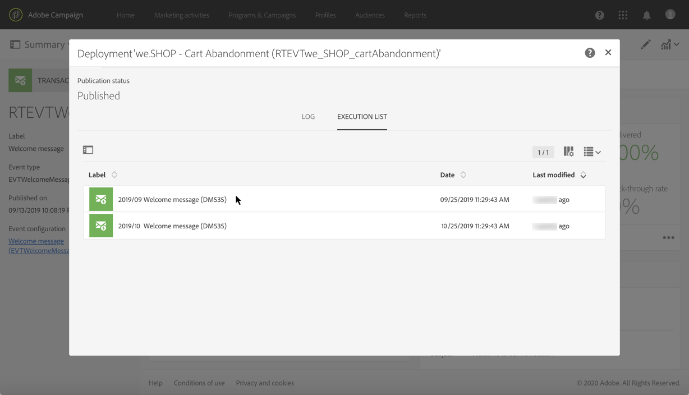

# Levenscyclus van transactieberichten {#publishing-transactional-message}

Wanneer het [transactioneel bericht](../../channels/using/editing-transactional-message.md) klaar is om te worden verzonden, kan het worden gepubliceerd.

De stappen voor het publiceren, pauzeren, verwijderen en publiceren van een transactiebericht worden hieronder beschreven.

>[!IMPORTANT]
>
>Alleen gebruikers met de rol [Beheer](../../administration/using/users-management.md#functional-administrators) kunnen transactieberichten openen en publiceren.

## Publicatieproces voor transactieberichten {#transactional-messaging-pub-process}

De grafiek hieronder illustreert het algemene proces van de transactionele berichtpublicatie.

**Verwante onderwerpen:**
* [Transactiebericht publiceren](#publishing-a-transactional-message)
* [Een transactiebericht pauzeren](#suspending-a-transactional-message-publication)
* [Het publiceren van een transactiebericht opheffen](#unpublishing-a-transactional-message)
* [Een gebeurtenis publiceren](../../channels/using/publishing-transactional-event.md)

<!--## Testing a transactional message {#testing-a-transactional-message}

You first need to create a specific test profile that will allow you to properly check the transactional message.

### Defining a specific test profile {#defining-specific-test-profile}

Define a test profile that will be linked to your event, which will allow you to preview your message and send a relevant proof.

1. From the transactional message dashboard, click the **[!UICONTROL Create test profile]** button.

   

1. Specify the information to send in JSON format in the **[!UICONTROL Event data used for personalization]** section. This is the content that will be used when previewing the message and when the test profile receives the proof.

   

   >[!NOTE]
   >
   >You can also enter the information relating to the profile table. See [Enriching the event](../../channels/using/configuring-transactional-event.md#enriching-the-transactional-message-content) and [Personalizing a transactional message](../../channels/using/editing-transactional-message.md#personalizing-a-transactional-message).

1. Once created, the test profile will be pre-specified in the transactional message. Click the **[!UICONTROL Test profiles]** block of the message to check the target of your proof.

   

You can also create a new test profile or use one that already exists in the **[!UICONTROL Test profiles]** menu. To do this:

1. Click the **[!UICONTROL Adobe Campaign]** logo, in the top left corner, then select **[!UICONTROL Profiles & audiences]** > **[!UICONTROL Test profiles]**.
1. In the **[!UICONTROL Event]** section, select the event that you have just created. In this example, select "Cart abandonment (EVTcartAbandonment)".
1. Specify the information to send in JSON format in the **[!UICONTROL Event data]** text box.

   

1. Save your changes.
1. Access the message that you created and select the updated test profile.

**Related topics:**

* [Managing test profiles](../../audiences/using/managing-test-profiles.md)
* [Creating audiences](../../audiences/using/creating-audiences.md)

### Sending the proof {#sending-proof}

Once you have created one or more specific test profiles and saved your transactional message, you can send a proof to test it.

The steps for sending a proof are detailed in the [Sending proofs](../../sending/using/sending-proofs.md) section.-->

## Transactiebericht publiceren {#publishing-a-transactional-message}

Nadat u het transactiebericht hebt bewerkt en getest, kunt u het publiceren. Klik gewoon op de knop **[!UICONTROL Publish]**.

Zodra de gebeurtenis ‘Cart abandonment’ wordt geactiveerd, wordt automatisch een bericht verzonden met de titel en de achternaam van de ontvanger, de URL naar de winkelwagen, het laatst geraadpleegde product of een lijst met producten (als u een productvermelding hebt gedefinieerd) en het totale bedrag van de winkelwagen.

Klik op de knop **[!UICONTROL Reports]** voor toegang tot rapporten over uw transactiebericht. Zie [Dynamische rapporten](../../reporting/using/about-dynamic-reports.md).

**Verwante onderwerpen**:
* [Een transactiebericht bewerken](../../channels/using/editing-transactional-message.md)
* [Een transactiebericht testen](../../channels/using/testing-transactional-message.md)
* [De gebeurtenis die leidt tot integratie](../../channels/using/getting-started-with-transactional-msg.md#integrate-event-trigger)

## Opschorting van de publicatie van een transactiebericht {#suspending-a-transactional-message-publication}

U kunt het publiceren van uw transactiebericht opschorten met behulp van de knop **[!UICONTROL Pause]**, bijvoorbeeld als u de data in het bericht wilt wijzigen. De gebeurtenissen worden daarom niet meer verwerkt, maar in plaats daarvan in een wachtrij in de Adobe Campaign-database opgeslagen.

De gebeurtenissen in de wachtrij worden bewaard gedurende een periode die is gedefinieerd in de REST API (zie de [REST API-documentatie](../../api/using/managing-transactional-messages.md)) of in de triggergebeurtenis als u de Triggers Core-service gebruikt (zie [Informatie over Adobe Experience Cloud Triggers](../../integrating/using/about-adobe-experience-cloud-triggers.md)).

Na het klikken op **[!UICONTROL Resume]** worden alle gebeurtenissen in de wachtrij verwerkt (op voorwaarde dat deze niet verlopen zijn). Zij bevatten nu alle wijzigingen die zijn uitgevoerd terwijl de publicatie van de sjabloon was opgeschort.

## Het publiceren van een transactiebericht opheffen {#unpublishing-a-transactional-message}

Door op **[!UICONTROL Unpublish]** te klikken, kunt de publicatie van transactionele berichten en de publicatie van de overeenkomstige gebeurtenis annuleren, waardoor de resource overeenkomend aan de eerder aangemaakte gebeurtenis uit de REST API wordt verwijderd.

Zelfs als de gebeurtenis via uw website wordt geactiveerd, worden de bijbehorende berichten niet meer verzonden en niet opgeslagen in de database.

>[!NOTE]
>
>Als u het bericht opnieuw wilt publiceren, moet u teruggaan naar de corresponderende gebeurtenisconfiguratie, [de gebeurtenis ](../../channels/using/publishing-transactional-event.md) publiceren en vervolgens [het bericht](#publishing-a-transactional-message) publiceren.

Als u de publicatie van een gepauzeerd transactiebericht ongedaan maakt, moet u mogelijk tot 24 uur wachten voordat u het bericht opnieuw kunt publiceren. Zo kan de workflow **[!UICONTROL Database cleanup]** alle gebeurtenissen opschonen die naar de wachtrij zijn verzonden.

De stappen voor het pauzeren van een bericht worden uitgebreid beschreven in de sectie[Opschorting van de publicatie van een transactiebericht](#suspending-a-transactional-message-publication).

De workflow **[!UICONTROL Database cleanup]**, die elke dag om 4.00 uur wordt uitgevoerd, is toegankelijk via **[!UICONTROL Administration]** > **[!UICONTROL Application settings]** > **[!UICONTROL Workflows]**.

## Transactiebericht verwijderen {#deleting-a-transactional-message}

Als de publicatie van een transactiebericht ongedaan is gemaakt, of als een transactiebericht nog niet is gepubliceerd, kunt u het transactiebericht uit de lijst met transactieberichten verwijderen. Dit doet u als volgt:

1. Klik in de linkerbovenhoek op het logo **[!UICONTROL Adobe Campaign]** en selecteer **[!UICONTROL Marketing plans]** > **[!UICONTROL Transactional messages]** > **[!UICONTROL Transactional messages]**.
1. Houd de muis boven het gewenste bericht.
1. Klik op de knop **[!UICONTROL Delete element]**.

Het verwijderen van een transactiebericht kan echter alleen onder bepaalde voorwaarden worden uitgevoerd:

* Zorg ervoor dat het transactiebericht de status **[!UICONTROL Draft]** heeft, anders kunt u het bericht niet verwijderen. De status **[!UICONTROL Draft]** is van toepassing op een bericht dat nog niet is gepubliceerd of waarvan [de publicatie ongedaan is gemaakt](#unpublishing-a-transactional-message) (en niet is [gepauzeerd](#suspending-a-transactional-message-publication)).

* **Transactieberichten**: Tenzij een ander transactiebericht is gekoppeld aan de overeenkomstige gebeurtenis, geldt dat als de publicatie van het transactiebericht ongedaan is gemaakt de publicatie van de gebeurtenisconfiguratie ook ongedaan moet worden gemaakt om uw transactiebericht te kunnen verwijderen. Zie [Publicatie van een gebeurtenis ongedaan maken](../../channels/using/publishing-transactional-event.md#unpublishing-an-event) voor meer informatie.

   >[!IMPORTANT]
   >
   >Als u een transactiebericht verwijdert waarvoor al meldingen zijn verzonden, worden ook de verzendings- en trackinglogboeken verwijderd.

* **Transactieberichten van een kant-en-klare gebeurtenissjabloon (interne transactieberichten)**: Als een intern transactiebericht als enige bericht aan de overeenkomstige interne gebeurtenis is gekoppeld, kan het niet worden verwijderd. U moet eerst een ander transactiebericht maken door het te dupliceren of via het menu **[!UICONTROL Resources]** > **[!UICONTROL Templates]** > **[!UICONTROL Transactional message templates]**.

<!--## Monitoring transactional message delivery {#monitoring-transactional-message-delivery}

Once the message is published and your site integration is done, you can monitor the delivery.

To monitor transactional messaging, you need to access **execution deliveries**. An execution delivery is a non-actionable and non-functional technical message created once a month for each transactional message, and each time a transactional message is edited and published again.

1. To view the message delivery log, click the icon at the bottom right of the **[!UICONTROL Deployment]** block.

   

1. Click the **[!UICONTROL Execution list]** tab.

   

1. Select the execution delivery of your choice.

   

1. Click again the icon at the bottom right of the **[!UICONTROL Deployment]** block.

   

   For each execution delivery, you can consult the delivery logs as you would do for a standard delivery. For more on accessing and using the logs, see [Monitoring a delivery](../../sending/using/monitoring-a-delivery.md).

**Related topics**:
* [Publishing a transactional message](#publishing-a-transactional-message)
* [Integrate the event triggering](../../channels/using/getting-started-with-transactional-msg.md#integrate-event-trigger)

### Profile-based transactional message specificities {#profile-transactional-message-monitoring}

For profile-based transactional messages, you can monitor the following profile information.

Select the **[!UICONTROL Sending logs]** tab. In the **[!UICONTROL Status]** column, **[!UICONTROL Sent]** indicates that a profile has opted in.

Select the **[!UICONTROL Exclusions logs]** tab to view recipients who have been excluded from the message target, such as addresses on denylist.

For any profile that has opted out, the **[!UICONTROL Address on denylist]** typology rule excluded the corresponding recipient.

This rule is part of a specific typology that applies to all transactional messages based on the **[!UICONTROL Profile]** table.

**Related topics**:

* [About typologies and typology rules](../../sending/using/about-typology-rules.md)
* [Monitoring a delivery](../../sending/using/monitoring-a-delivery.md)

## Transactional message retry process {#transactional-message-retry-process}

A temporarily undelivered transactional message is subject to automatic retries that are performed until the delivery expires. For more on the delivery duration, see [Validity period parameters](../../administration/using/configuring-email-channel.md#validity-period-parameters).

When a transactional message fails to be sent, there are two retry systems:

* At the transactional messaging level, a transactional message can fail before the event is assigned to an execution delivery, meaning between the event reception and the delivery preparation. See [Event processing retry process](#event-processing-retry-process).
* At the sending process level, once the event has been assigned to an execution delivery, the transactional message can fail due to a temporary error. See [Message sending retry process](#message-sending-retry-process).

The definition of **execution delivery** can be found in the [Monitoring transactional message delivery](#monitoring-transactional-message-delivery) section.

### Event processing retry process {#event-processing-retry-process}

When an event is triggered, it is assigned to an execution delivery.

If the event cannot be assigned to an execution delivery, the event processing is postponed. Retries are then performed until it is assigned to a new execution delivery.

>[!NOTE]
>
>A postponed event does not appear in the transactional message sending logs, because it is not assigned to an execution delivery yet.

For example, the event could not be assigned to an execution delivery because its content was not correct, there was an issue with access rights or branding, an error was detected on applying typology rules, etc. In this case, you can pause the message, edit it to fix the problem and publish it again. The retry system will then assign it to a new execution delivery.

### Message sending retry process {#message-sending-retry-process}

Once the event has been assigned to an execution delivery, the transactional message can fail due to a temporary error, if the recipient's mailbox is full for example. For more on this, see [Retries after a delivery temporary failure](../../sending/using/understanding-delivery-failures.md#retries-after-a-delivery-temporary-failure).

>[!NOTE]
>
>When an event is assigned to an execution delivery, it appears in the sending logs of this execution delivery, and only at this time. The failed deliveries are displayed in the **[!UICONTROL Execution list]** tab of the transactional message sending logs.

### Retry process limitations {#limitations}

**Sending logs update**

In the retry process, the sending logs of the new execution delivery are not immediately updated (the update is performed through a scheduled workflow). It means that the message could be in **[!UICONTROL Pending]** status even if the transactional event has been processed by the new execution delivery.

**Failed execution delivery**

You cannot stop an execution delivery. However, if the current execution delivery fails, a new one is created as soon as a new event is received, and all new events are processed by this new execution delivery. No new events are processed by the failed execution delivery.

If some events already assigned to an execution delivery have been postponed as part of the retry process and if that execution delivery fails, the retry system does not assign the postponed events to the new execution delivery, which means that these events are lost. Check the [delivery logs](#monitoring-transactional-message-delivery) to see the recipients that may have been impacted.-->
