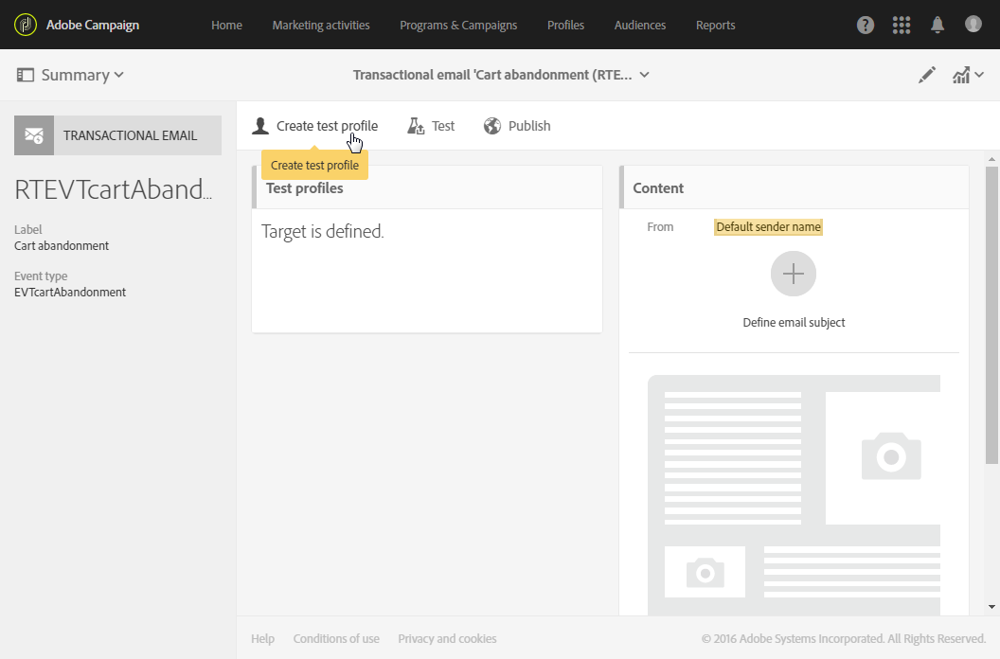
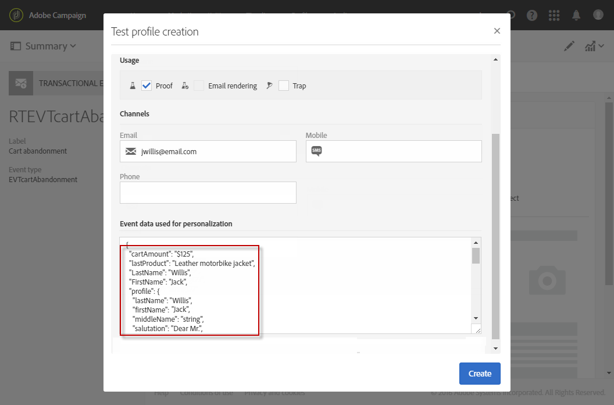
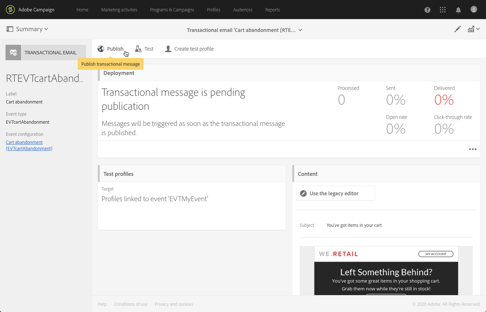
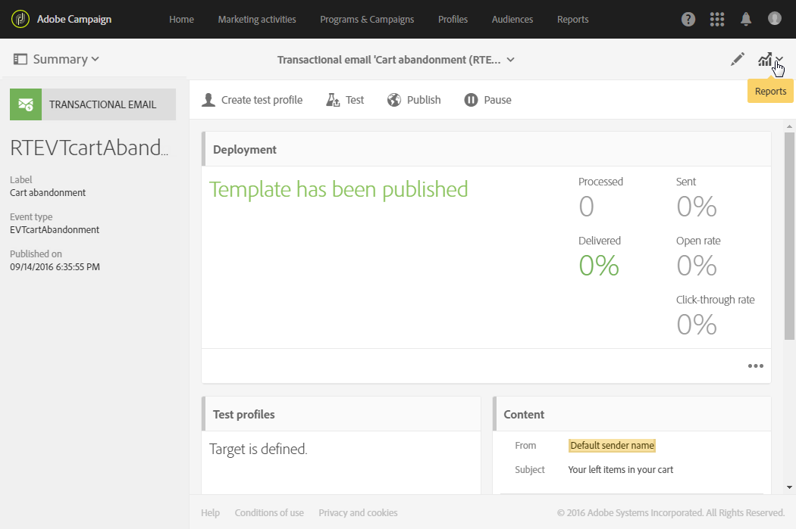
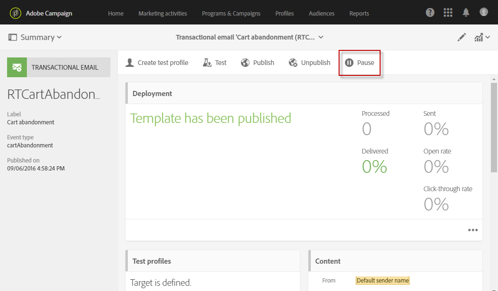
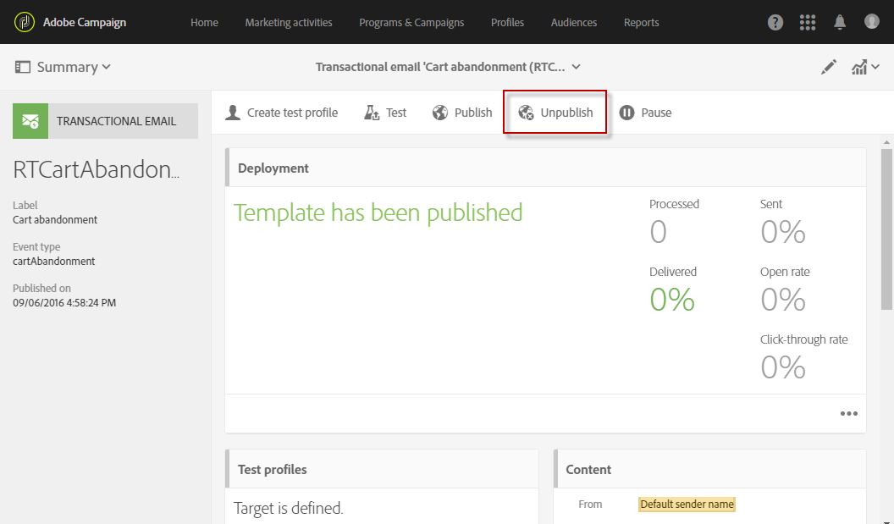
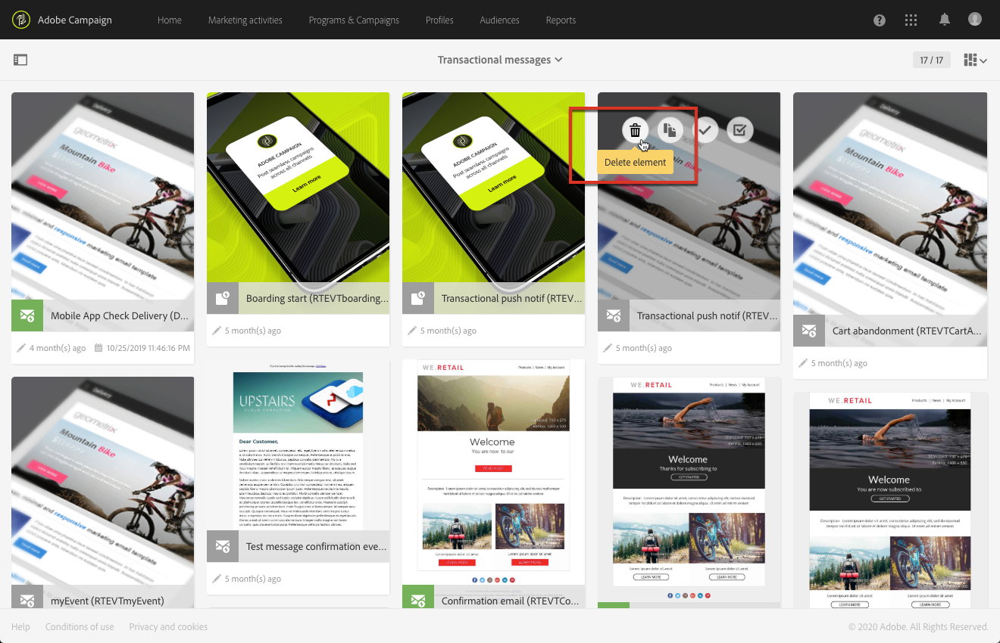
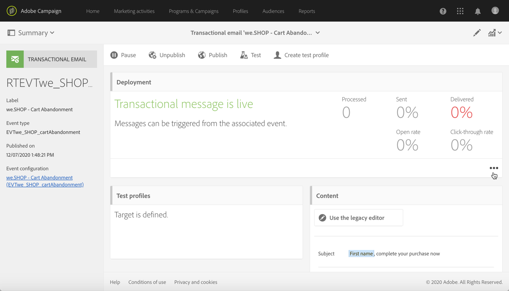
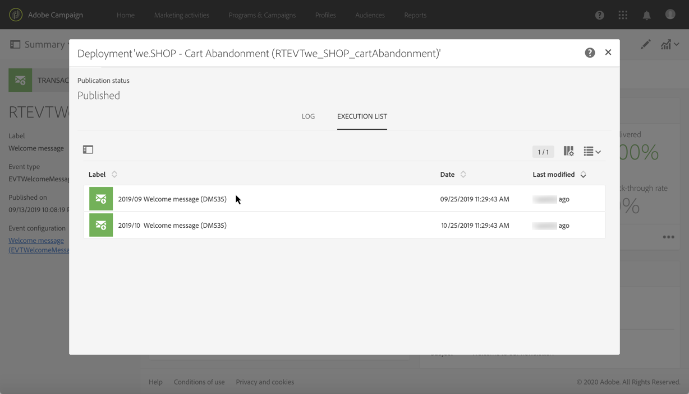
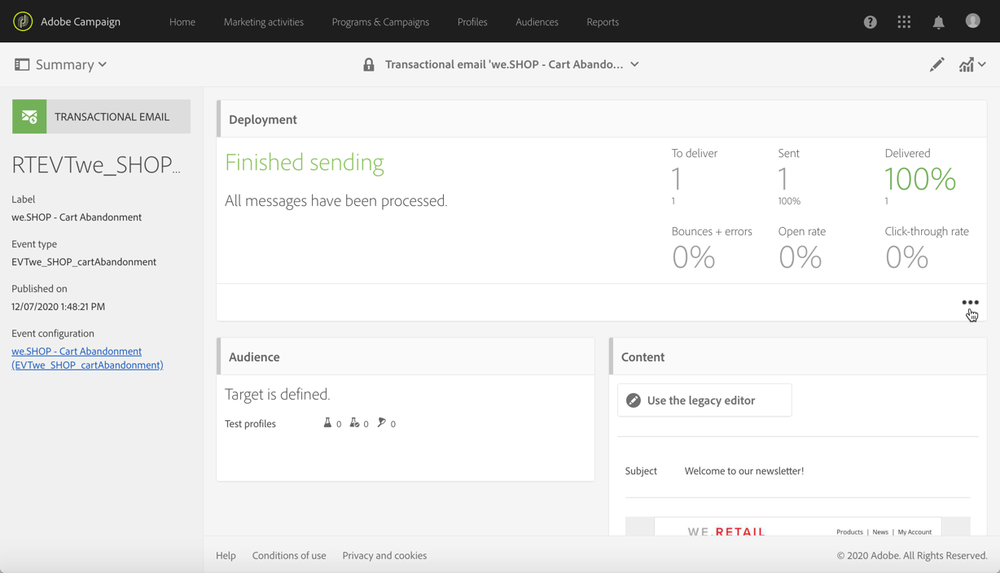

# Levenscyclus van transactionele berichten {#publishing-transactional-message}

Wanneer het [ transactionele bericht ](../../channels/using/editing-transactional-message.md) klaar is om te worden verzonden, kan het worden gepubliceerd.

De stappen voor het publiceren, pauzeren, verwijderen en publiceren van een transactiebericht worden hieronder beschreven.

>[!IMPORTANT]
>
>Slechts kunnen de gebruikers met de [ rol van het Beleid ](../../administration/using/users-management.md#functional-administrators) tot transactionele berichten toegang hebben en publiceren.

## Transactieproces voor de publicatie van berichten {#transactional-messaging-pub-process}

De grafiek hieronder illustreert het algemene proces van de transactionele berichtpublicatie.

**Verwante onderwerpen:**
* [Transactiebericht publiceren](#publishing-a-transactional-message)
* [Een transactiebericht pauzeren](#suspending-a-transactional-message-publication)
* [Het publiceren van een transactiemelding opheffen](#unpublishing-a-transactional-message)
* [Een gebeurtenis publiceren](../../channels/using/publishing-transactional-event.md)

<!--
## Testing a transactional message {#testing-a-transactional-message}

You first need to create a specific test profile that will allow you to properly check the transactional message.

### Defining a specific test profile {#defining-specific-test-profile}

Define a test profile that will be linked to your event, which will allow you to preview your message and send a relevant proof.

1. From the transactional message dashboard, click the **[!UICONTROL Create test profile]** button.

   

1. Specify the information to send in JSON format in the **[!UICONTROL Event data used for personalization]** section. This is the content that will be used when previewing the message and when the test profile receives the proof.

   

   >[!NOTE]
   >
   >You can also enter the information relating to the profile table. See [Enriching the event](../../channels/using/configuring-transactional-event.md#enriching-the-transactional-message-content) and [Personalizing a transactional message](../../channels/using/editing-transactional-message.md#personalizing-a-transactional-message).

1. Once created, the test profile will be pre-specified in the transactional message. Click the **[!UICONTROL Test profiles]** block of the message to check the target of your proof.

   

You can also create a new test profile or use one that already exists in the **[!UICONTROL Test profiles]** menu. To do this:

1. Click the **Adobe** logo, in the top-left corner, then select **[!UICONTROL Profiles & audiences]** > **[!UICONTROL Test profiles]**.
1. In the **[!UICONTROL Event]** section, select the event that you have just created. In this example, select "Cart abandonment (EVTcartAbandonment)".
1. Specify the information to send in JSON format in the **[!UICONTROL Event data]** text box.

   

1. Save your changes.
1. Access the message that you created and select the updated test profile.

**Related topics:**

* [Managing test profiles](../../audiences/using/managing-test-profiles.md)
* [Creating audiences](../../audiences/using/creating-audiences.md)

### Sending the proof {#sending-proof}

Once you have created one or more specific test profiles and saved your transactional message, you can send a proof to test it.

The steps for sending a proof are detailed in the [Sending proofs](../../sending/using/sending-proofs.md) section.
-->

## Transactiebericht publiceren {#publishing-a-transactional-message}

Nadat u het transactiebericht hebt bewerkt en getest, kunt u het publiceren. Klik op de knop **[!UICONTROL Publish]** .

Nu, zodra de gebeurtenis van de &quot;Verlaat van de Kar&quot;wordt teweeggebracht, veroorzaakt het automatisch een bericht dat de titel en de familienaam van de ontvanger, de kar URL, het laatste geraadpleegde product of een lijst van producten bevat als u een productlijst, en het totale kartbedrag om te verzenden bepaalde.

Klik op de knop **[!UICONTROL Reports]** om rapporten over uw transactiemelding te openen. Zie [ Dynamische rapporten ](../../reporting/using/about-dynamic-reports.md).

**Verwante onderwerpen**:
* [Een transactiebericht bewerken](../../channels/using/editing-transactional-message.md)
* [Transactiebericht testen](../../channels/using/testing-transactional-message.md)
* [De gebeurtenis die leidt tot integratie](../../channels/using/getting-started-with-transactional-msg.md#integrate-event-trigger)

## Opschorting van een transactiebericht {#suspending-a-transactional-message-publication}

U kunt het publiceren van uw transactiemelding opschorten door de **[!UICONTROL Pause]** knoop, bijvoorbeeld te gebruiken om de gegevens te wijzigen in het bericht. De gebeurtenissen worden daarom niet meer verwerkt, maar in plaats daarvan in een wachtrij in de Adobe Campaign-database opgeslagen.

De een rij gevormde gebeurtenissen worden gehouden tijdens een periode die in REST API (zie de [ REST API documentatie ](../../api/using/managing-transactional-messages.md)) of in de trekkergebeurtenis wordt bepaald als u de de kerndienst van Triggers gebruikt (zie [ Ongeveer de Trekkers van de Wolk van de Ervaring van Adobe ](../../integrating/using/about-adobe-experience-cloud-triggers.md)).

Wanneer u op **[!UICONTROL Resume]** klikt, worden alle gebeurtenissen in de wachtrij verwerkt (mits deze niet verlopen zijn). Zij bevatten nu alle wijzigingen die zijn uitgevoerd terwijl de publicatie van de template werd opgeschort.

## Het publiceren van een transactiemelding opheffen {#unpublishing-a-transactional-message}

Als u op **[!UICONTROL Unpublish]** klikt, kunt u de publicatie van het transactiebericht annuleren, maar ook de publicatie van de bijbehorende gebeurtenis. Hierdoor wordt de bron die overeenkomt met de gebeurtenis die u eerder hebt gemaakt, van de REST-API verwijderd.

Zelfs als de gebeurtenis via uw website wordt geactiveerd, worden de bijbehorende berichten niet meer verzonden en niet opgeslagen in de database.

>[!NOTE]
>
>Om het bericht opnieuw te publiceren, moet u terug naar de overeenkomstige gebeurtenisconfiguratie gaan, [ publiceren de gebeurtenis ](../../channels/using/publishing-transactional-event.md), en dan [ publiceren het bericht ](#publishing-a-transactional-message).

Als u de publicatie van een gepauzeerd transactiebericht ongedaan maakt, moet u mogelijk tot 24 uur wachten voordat u het bericht opnieuw kunt publiceren. Hiermee kan de **[!UICONTROL Database cleanup]** -workflow alle gebeurtenissen opschonen die naar de wachtrij zijn verzonden.

De stappen voor het pauzeren van een bericht zijn gedetailleerd in [ die een transactionele berichtpublicatie ](#suspending-a-transactional-message-publication) sectie schorsen.

De **[!UICONTROL Database cleanup]** -workflow, die elke dag om 4.00 uur wordt uitgevoerd, is toegankelijk via **[!UICONTROL Administration]** > **[!UICONTROL Application settings]** > **[!UICONTROL Workflows]** .

## Transactiebericht verwijderen {#deleting-a-transactional-message}

Zodra een transactiebericht niet gepubliceerd is, of als een transactiebericht nog niet is gepubliceerd, kunt u het van de transactiemeldlijst schrappen. Dit doet u als volgt:

1. Klik het **Adobe** embleem, in de top-linkerhoek, dan uitgezocht **[!UICONTROL Marketing plans]** > **[!UICONTROL Transactional messages]** > **[!UICONTROL Transactional messages]**.
1. Houd de muis boven het bericht van uw keuze.
1. Klik op **[!UICONTROL Delete element]** .

Het verwijderen van een transactiebericht kan echter alleen onder bepaalde voorwaarden worden uitgevoerd:

* Zorg ervoor dat het transactiebericht de status **[!UICONTROL Draft]** heeft, anders kunt u het bericht niet verwijderen. De **[!UICONTROL Draft]** status is op een bericht van toepassing dat nog niet gepubliceerd is, of dat [ niet gepubliceerd ](#unpublishing-a-transactional-message) (en niet [ gepauzeerd ](#suspending-a-transactional-message-publication)) is geweest.

* **Transactionele berichten**: Tenzij een ander transactiebericht met de overeenkomstige gebeurtenis verbonden is, als het transactiebericht unpublished is, moet de gebeurtenisconfiguratie ook unpublished zijn om uw transactiebericht met succes te schrappen. Voor meer op dit, zie [ Unpublishing een gebeurtenis ](../../channels/using/publishing-transactional-event.md#unpublishing-an-event).

  >[!IMPORTANT]
  >
  >Als u een transactiemelding verwijdert waarvoor al meldingen zijn verzonden, worden ook de verzendings- en trackinglogboeken verwijderd.

* **Transactionele berichten van een uit-van-de-doos gebeurtenismalplaatje (interne transactionele berichten)**: Als een intern transactiebericht slechts met de overeenkomstige interne gebeurtenis verbonden is, kan het niet worden geschrapt. U moet eerst een ander transactiebericht maken door het te dupliceren of via het menu **[!UICONTROL Resources]** > **[!UICONTROL Templates]** > **[!UICONTROL Transactional message templates]** .

<!--
## Monitoring transactional message delivery {#monitoring-transactional-message-delivery}

Once the message is published and your site integration is done, you can monitor the delivery.

To monitor transactional messaging, you need to access **execution deliveries**. An execution delivery is a non-actionable and non-functional technical message created once a month for each transactional message, and each time a transactional message is edited and published again.

1. To view the message delivery log, click the icon at the bottom right of the **[!UICONTROL Deployment]** block.

   

1. Click the **[!UICONTROL Execution list]** tab.

   

1. Select the execution delivery of your choice.

   

1. Click again the icon at the bottom right of the **[!UICONTROL Deployment]** block.

   

   For each execution delivery, you can consult the delivery logs as you would do for a standard delivery. For more on accessing and using the logs, see [Monitoring a delivery](../../sending/using/monitoring-a-delivery.md).

**Related topics**:
* [Publishing a transactional message](#publishing-a-transactional-message)
* [Integrate the event triggering](../../channels/using/getting-started-with-transactional-msg.md#integrate-event-trigger)

### Profile-based transactional message specificities {#profile-transactional-message-monitoring}

For profile-based transactional messages, you can monitor the following profile information.

Select the **[!UICONTROL Sending logs]** tab. In the **[!UICONTROL Status]** column, **[!UICONTROL Sent]** indicates that a profile has opted in.

Select the **[!UICONTROL Exclusions logs]** tab to view recipients who have been excluded from the message target, such as addresses on denylist.

For any profile that has opted out, the **[!UICONTROL Address on denylist]** typology rule excluded the corresponding recipient.

This rule is part of a specific typology that applies to all transactional messages based on the **[!UICONTROL Profile]** table.

**Related topics**:

* [About typologies and typology rules](../../sending/using/about-typology-rules.md)
* [Monitoring a delivery](../../sending/using/monitoring-a-delivery.md)

## Transactional message retry process {#transactional-message-retry-process}

A temporarily undelivered transactional message is subject to automatic retries that are performed until the delivery expires. For more on the delivery duration, see [Validity period parameters](../../administration/using/configuring-email-channel.md#validity-period-parameters).

When a transactional message fails to be sent, there are two retry systems:

* At the transactional messaging level, a transactional message can fail before the event is assigned to an execution delivery, meaning between the event reception and the delivery preparation. See [Event processing retry process](#event-processing-retry-process).
* At the sending process level, once the event has been assigned to an execution delivery, the transactional message can fail due to a temporary error. See [Message sending retry process](#message-sending-retry-process).

The definition of **execution delivery** can be found in the [Monitoring transactional message delivery](#monitoring-transactional-message-delivery) section.

### Event processing retry process {#event-processing-retry-process}

When an event is triggered, it is assigned to an execution delivery.

If the event cannot be assigned to an execution delivery, the event processing is postponed. Retries are then performed until it is assigned to a new execution delivery.

>[!NOTE]
>
>A postponed event does not appear in the transactional message sending logs, because it is not assigned to an execution delivery yet.

For example, the event could not be assigned to an execution delivery because its content was not correct, there was an issue with access rights or branding, an error was detected on applying typology rules, etc. In this case, you can pause the message, edit it to fix the problem and publish it again. The retry system will then assign it to a new execution delivery.

### Message sending retry process {#message-sending-retry-process}

Once the event has been assigned to an execution delivery, the transactional message can fail due to a temporary error, if the recipient's mailbox is full for example. For more on this, see [Retries after a delivery temporary failure](../../sending/using/understanding-delivery-failures.md#retries-after-a-delivery-temporary-failure).

>[!NOTE]
>
>When an event is assigned to an execution delivery, it appears in the sending logs of this execution delivery, and only at this time. The failed deliveries are displayed in the **[!UICONTROL Execution list]** tab of the transactional message sending logs.

### Retry process limitations {#limitations}

**Sending logs update**

In the retry process, the sending logs of the new execution delivery are not immediately updated (the update is performed through a scheduled workflow). It means that the message could be in **[!UICONTROL Pending]** status even if the transactional event has been processed by the new execution delivery.

**Failed execution delivery**

You cannot stop an execution delivery. However, if the current execution delivery fails, a new one is created as soon as a new event is received, and all new events are processed by this new execution delivery. No new events are processed by the failed execution delivery.

If some events already assigned to an execution delivery have been postponed as part of the retry process and if that execution delivery fails, the retry system does not assign the postponed events to the new execution delivery, which means that these events are lost. Check the [delivery logs](#monitoring-transactional-message-delivery) to see the recipients that may have been impacted.
-->
