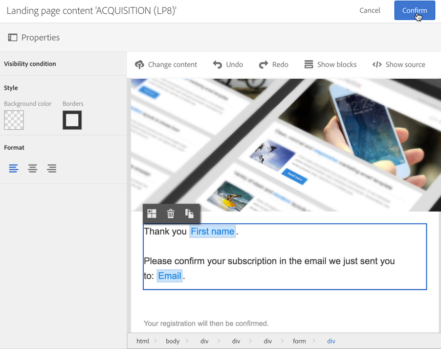

# Een dubbele opt-in-procedure instellen{#setting-up-a-double-opt-in-process}

## Dubbele aanmelding {#about-double-opt-in}

Dubbele aanmeldingsprocedure is een beste manier om e-mails te verzenden. Het beveiligt het platform tegen onjuiste of ongeldige e-mailadressen, spambots, en voorkomt mogelijke spamklachten.

Het principe is om een e-mail te verzenden om de overeenkomst van de bezoeker te bevestigen alvorens hen als &quot;profielen&quot;in uw gegevensbestand van de Campagne op te slaan: de bezoeker vult een online bestemmingspagina in, ontvangt een e-mail en moet in de bevestigingsverbinding klikken om zijn abonnement te voltooien.

U moet het volgende instellen:

1. Maak en publiceer een bestemmingspagina zodat de bezoekers zich kunnen registreren en zich kunnen abonneren. Deze openingspagina is beschikbaar op een website. Bezoekers die deze landingspagina invullen en indienen, worden in de database opgeslagen, maar op de zwarte lijst geplaatst, zodat zij geen communicatie ontvangen vóór de definitieve validatie (zie [De zwarte lijst beheren in Campagne](../../audiences/using/about-opt-in-and-opt-out-in-campaign.md)).
1. Maak en verzend automatisch de e-mail met aanmelding, met een bevestigingskoppeling. Dit e-mailbericht is bedoeld voor de populatie die de landingspagina heeft verzonden. Het zal gebaseerd zijn op een e-mailsjabloon dat het mogelijk maakt zich te richten op &quot;opt-out&quot;-profielen.
1. Omleiden naar een bestemmingspagina voor bevestiging. Op deze laatste landingspagina wordt een bevestigingsknop voorgesteld: de bezoekers moeten erop klikken . U kunt een welkomstbericht ontwerpen dat wordt verzonden wanneer de bevestiging wordt uitgevoerd, en bijvoorbeeld een speciale aanbieding in de e-mail toevoegen voor nieuwe ontvangers.

Deze stappen moeten in de Campagne van Adobe in een specifieke orde worden geplaatst om alle parameters te hebben behoorlijk toegelaten.

## Stap 1: De bestemmingspagina voor bevestiging maken {#step-1--create-the-confirmation-landing-page}

Het proces voor het instellen van het mechanisme voor dubbele opt-in begint met het maken van de bevestigingspagina voor landingen: deze pagina wordt weergegeven wanneer de bezoekers op de bevestigingsmail hebben geklikt om zich te registreren.

Om deze landende pagina tot stand te brengen en te vormen, moet u:

1. Ontwerp een [nieuwe landingspagina](../../channels/using/getting-started-with-landing-pages.md) op basis van de **[!UICONTROL Profile acquisition (acquisition)]** sjabloon. Voer het label &#39;**CONFIRMATION**&#39; in.

   Als u de [diensten](../../audiences/using/about-subscriptions.md)moet gebruiken, kunt u het **[!UICONTROL Subscription (sub)]** malplaatje ook gebruiken.

1. Bewerk de eigenschappen van de bestemmingspagina en schakel onder de **[!UICONTROL Access and loading]** sectie de optie uit **[!UICONTROL Authorize unidentified visitors]** en selecteer **[!UICONTROL Preload visitor data]** (deze is niet verplicht).

   

1. Klik in de sectie **[!UICONTROL Job]** > **[!UICONTROL Additional data]** op het volgende contextpad **[!UICONTROL Add an element]** en voer dit in:

   /context/profile/blackList

   Stel de waarde in op **false** en klik op **[!UICONTROL Add]**.

   

   Deze context verwijdert het zwarte lijstveld om e-mailberichten te kunnen verzenden. Later zullen we zien dat de eerste bestemmingspagina dit veld vóór de bevestiging instelde op **true** om te voorkomen dat e-mails naar niet-bevestigde profielen worden verzonden. Zie [Stap 3 voor meer informatie: Maak de aanschafpagina](#step-3--create-the-acquisition-landing-page).

1. De inhoud van de bestemmingspagina aanpassen: U kunt bijvoorbeeld gepersonaliseerde gegevens weergeven en het label van de bevestigingsknop wijzigen in &quot;Klik hier om mijn abonnement te bevestigen&quot;.

   

1. Pas de inhoud van de bevestigingspagina aan om je abonnees te laten weten dat ze nu zijn geregistreerd.

   

1. [Test en publiceer](../../channels/using/testing-publishing-landing-page.md) de openingspagina.

## Stap 2: Het bevestigingsbericht maken {#step-2--create-the-confirmation-email}

Nadat de bestemmingspagina voor bevestiging is gemaakt, kunt u het bevestigingsbericht ontwerpen: deze e-mail wordt automatisch verzonden naar elke bezoeker die de aanschafpagina voor aankopen valideert . Deze validatie wordt beschouwd als een gebeurtenis en het e-mailbericht is een transactiebericht dat is gekoppeld aan een specifieke typologieregel die de mogelijkheid biedt om de voorkeur uit te spreken.

De stappen voor het maken van deze elementen worden hieronder beschreven. U moet ze volgen voordat u de bestemmingspagina zelf maakt, aangezien in deze e-mailsjabloon naar deze pagina wordt verwezen.

### De gebeurtenis maken {#create-the-event}

Het bevestigingsbericht is een [transactiebericht](../../channels/using/about-transactional-messaging.md) als reactie op een gebeurtenis: de validatie van het formulier. U moet eerst de gebeurtenis maken en vervolgens de sjabloon van het transactiebericht maken.

1. Maak een gebeurtenis via het menu **[!UICONTROL Marketing plans]** > **[!UICONTROL Transactional messages]** > **[!UICONTROL Event configuration]** , die toegankelijk is via het logo van de Adobe-campagne, en voer het label &#39;**CONFIRM**&#39; in.
1. Selecteer de **[!UICONTROL Profile]** doeldimensie en klik **[!UICONTROL Create]**.

   

1. Klik in de **[!UICONTROL Fields]** sectie op de koppeling **[!UICONTROL Create element]** en voeg deze toe **[!UICONTROL email]** in de gegevensstructuur om de koppeling in te schakelen.
1. Klik in de **[!UICONTROL Enrichment]** sectie op de **[!UICONTROL Create element]** doelbron **[!UICONTROL Profile]** en selecteer deze. U kunt vervolgens een kaart maken op het **[!UICONTROL email]** veld in de **[!UICONTROL Join definition]** sectie of op een andere samengestelde afstemmingssleutel, afhankelijk van uw behoeften.

   

   Als u de diensten moet gebruiken, voeg het **[!UICONTROL Service]** doelmiddel en kaart op het **[!UICONTROL serviceName]** gebied toe. Zie voor meer informatie hierover.

1. Selecteer **[!UICONTROL Profile]** als de **[!UICONTROL Targeting enrichment]** optie in de vervolgkeuzelijst.
1. Klik **[!UICONTROL Publish]** om de gebeurtenis te publiceren.

De gebeurtenis is gereed. U kunt nu de e-mailsjabloon ontwerpen. Deze sjabloon moet een koppeling bevatten naar de eerder gemaakte **CONFIRMATION** -landingspagina. Zie [Het bevestigingsbericht](#design-the-confirmation-message)ontwerpen voor meer informatie.

### De typologieregel maken {#create-the-typology-rule}

U moet een specifieke [typologieregel](../../administration/using/about-typology-rules.md)maken door een regel uit de doos te dupliceren. Op grond van deze regel kunnen berichten worden verzonden naar profielen die hun overeenkomst nog niet hebben bevestigd en nog steeds op de zwarte lijst staan. Standaard sluiten typologische regels profielen voor opt-out (d.w.z. op de zwarte lijst) uit. Voer de volgende stappen uit om deze typologieregel te maken:

1. Selecteer in het Adobe Campagne-logo **[!UICONTROL Administration]** > **[!UICONTROL Channels]** > **[!UICONTROL Typologies]** en klik **[!UICONTROL Typologies]**.
1. Dupliceer de uit-van-doos typologie **[!UICONTROL Transactional message on profile (mcTypologyProfile)]**.
1. Zodra duplicatie is bevestigd, bewerkt u de nieuwe typologie en voert u het label **TYPOLOGY_PROFILE** in.
1. Verwijder de **adresregel op de zwarte lijst** .
1. Klik op **[!UICONTROL Save]**.

Deze typologie kan nu worden gekoppeld aan het bevestigingsbericht.

### Het bevestigingsbericht ontwerpen {#design-the-confirmation-message}

Het bevestigingsbericht is een transactiemelding op basis van de gebeurtenis die eerder is gemaakt. Voer de onderstaande stappen uit om dit bericht te maken:

1. Selecteer **[!UICONTROL Marketing plans]** > in het Adobe Campagne-logo **[!UICONTROL Transactional messages]** en klik op **[!UICONTROL Transactional messages]**.
1. Bewerk de e-mailsjabloon **BEVESTIGEN** en pas deze aan. U kunt bestaande inhoud uploaden of een sjabloon buiten de doos gebruiken.
1. Voeg een koppeling toe aan de bestemmingspagina **CONFIRMATION** en klik **[!UICONTROL Confirm]** om wijzigingen op te slaan.

   

1. Bewerk de eigenschappen van de e-mailsjabloon. Selecteer in de sectie **[!UICONTROL Advanced parameters]** > **[!UICONTROL Preparation]** de eerder gemaakte **typologie TYPOLOGY_PROFILE** .
1. Sla het transactiebericht op en publiceer dit.

## Stap 3: De openingspagina voor aankopen maken {#step-3--create-the-acquisition-landing-page}

U moet de openingspagina voor aankopen maken: dit aanmeldingsformulier wordt op uw website gepubliceerd.

Om deze landende pagina tot stand te brengen en te vormen, moet u:

1. Ontwerp een [nieuwe landingspagina](../../channels/using/getting-started-with-landing-pages.md) op basis van de **[!UICONTROL Profile acquisition (acquisition)]** sjabloon. Voer het label &#39;**ACQUISITION**&#39; in.
1. Bewerk de eigenschappen van de openingspagina: Klik in de sectie **[!UICONTROL Job]** > **[!UICONTROL Additional data]** op het volgende contextpad **[!UICONTROL Add an element]** en voer dit in:

   /context/profile/blackList

   en stel de waarde in op **true**.

   Dit is verplicht de zwarte lijst te forceren en geen berichten te sturen naar bezoekers die hun instemming niet hebben bevestigd. De validatie van de bestemmingspagina van de BEVESTIGING zal dit gebied aan **vals** na bevestiging plaatsen. Zie [Stap 1 voor meer informatie: Maak de bestemmingspagina](#step-1--create-the-confirmation-landing-page)voor bevestiging.

1. Selecteer de optie in de sectie **[!UICONTROL Job]** > **[!UICONTROL Specific actions]** **[!UICONTROL Start sending messages]**.
1. In de bijbehorende drop-down lijst, kies **BEVESTIGEN** transactiemalplaatje u creeerde.

   

1. Pas de inhoud van de bestemmingspagina aan, afhankelijk van uw merk en de gegevens die u moet aanschaffen. Je kunt bijvoorbeeld gepersonaliseerde gegevens weergeven en het label van de bevestigingsknop wijzigen om mijn abonnement **te** bevestigen.

   

1. Pas de bevestigingspagina aan om de nieuwe abonnee te laten weten dat hij zijn abonnement moet valideren.

   

1. [Test en publiceer](../../channels/using/testing-publishing-landing-page.md) de openingspagina.

Het dubbele opt-in mechanisme wordt nu gevormd. U kunt de procedure van eind tot eind in werking stellen en testen, beginnend bij openbare URL van deze het landen pagina. **[!UICONTROL ACQUISITION]** Deze URL wordt weergegeven in het dashboard van de bestemmingspagina.
