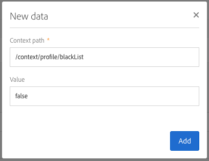

# Een dubbele opt-inprocedure instellen{#setting-up-a-double-opt-in-process}

## Dubbele opt-in {#about-double-opt-in}

Het dubbele opt-inmechanisme is een best practice voor de verzending van e-mails. Het beveiligt het platform tegen onjuiste of ongeldige e-mailadressen en spambots en voorkomt mogelijke spamklachten.

Het principe is om een e-mail te verzenden om de instemming van bezoekers te bevestigen voordat u deze als profielen in uw Campaign-database opslaat. De bezoeker vult een online landingspagina in, ontvangt een e-mail en moet op de bevestigingskoppeling klikken om zijn inschrijving te voltooien.

Hiervoor gaat u als volgt te werk:

1. Maak en publiceer een landingspagina zodat de bezoekers zich kunnen registreren en inschrijven. Deze landingspagina is beschikbaar vanaf een website. Bezoekers die deze landingspagina invullen en verzenden, worden in de database opgeslagen maar aan de lijst van afgewezen personen toegevoegd om geen communicatie te ontvangen vóór de laatste validatie (zie [Beheer van Lijst van afgewezen personen in Campagne](../../audiences/using/about-opt-in-and-opt-out-in-campaign.md)).
1. Maak en verzend automatisch de opt-in e-mail met een bevestigingskoppeling. Deze e-mail is bedoeld voor de populatie die de landingspagina heeft ingediend. De mail is gebaseerd op een e-mailsjabloon die het mogelijk maakt opt-outprofielen doelgericht te benaderen.
1. Stuur bezoekers door naar een landingspagina voor bevestiging. Op deze laatste landingspagina wordt een bevestigingsknop voorgesteld waarop de bezoekers moeten klikken. U kunt een welkomst-e-mail ontwerpen die wordt verzonden wanneer de bevestiging is voltooid en bijvoorbeeld een speciale aanbieding voor nieuwe ontvangers aan de e-mail toevoegen.

Deze stappen moeten in Adobe Campaign in een specifieke volgorde worden ingesteld om ervoor te zorgen dat alle parameters correct zijn ingeschakeld.

## Stap 1: De landingspagina voor bevestiging maken {#step-1--create-the-confirmation-landing-page}

Het proces voor het instellen van het dubbele opt-inmechanisme begint met het maken van de landingspagina voor bevestiging. Deze pagina wordt weergegeven wanneer de bezoekers op de bevestigings-e-mail hebben geklikt om zich te registreren.

Ga als volgt te werk om deze landingspagina te maken en te configureren:

1. Ontwerp een [nieuwe landingspagina](../../channels/using/getting-started-with-landing-pages.md) op basis van de sjabloon **[!UICONTROL Profile acquisition (acquisition)]**. Voer het label **CONFIRMATION** in.

   Als u [services](../../audiences/using/about-subscriptions.md) moet gebruiken, kunt u ook de sjabloon **[!UICONTROL Subscription (sub)]** gebruiken.

1. Bewerk de eigenschappen van de landingspagina en schakel onder de sectie **[!UICONTROL Access and loading]** de optie **[!UICONTROL Authorize unidentified visitors]** uit en schakel **[!UICONTROL Preload visitor data]** in (deze is niet verplicht).

   

1. Klik in de sectie **[!UICONTROL Job]** > **[!UICONTROL Additional data]** op **[!UICONTROL Add an element]** en voer het volgende contextpad in:

   /context/profile/blackList

   Stel de waarde in op **false** en klik op **[!UICONTROL Add]**.

   

   In deze context wordt het veld &#39;Op lijst van afgewezen personen&#39; verwijderd, zodat e-mailberichten kunnen worden verzonden. Later zullen we zien dat op de eerste landingspagina dit veld vóór de bevestiging was ingesteld op **true** om te voorkomen dat e-mails naar niet-bevestigde profielen worden verzonden. Zie [Stap 3: De landingspagina voor acquisitie maken](#step-3--create-the-acquisition-landing-page) voor meer informatie.

1. Pas de content van de landingspagina aan. U kunt bijvoorbeeld gepersonaliseerde data weergeven en het label van de bevestigingsknop wijzigen in ‘Click here to confirm my subscription’.

   

1. Pas de content van de bevestigingspagina aan om uw abonnees te laten weten dat ze nu geregistreerd zijn.

   

1. [Test en publiceer](../../channels/using/testing-publishing-landing-page.md) de landingspagina.

## Stap 2: De bevestigings-e-mail maken {#step-2--create-the-confirmation-email}

Nadat de landingspagina voor bevestiging is gemaakt, kunt u de bevestigings-e-mail ontwerpen. Deze e-mail wordt automatisch verzonden naar elke bezoeker die de landingspagina voor acquisitie valideert. Deze validatie wordt beschouwd als een gebeurtenis en de e-mail is een transactioneel bericht dat is gekoppeld aan een specifieke typologieregel die de mogelijkheid biedt om opt-outpopulaties doelgericht te benaderen.

De stappen voor het maken van deze elementen worden hieronder beschreven. U moet ze volgen voordat u de landingspagina voor acquisitie zelf maakt, aangezien op deze pagina naar deze e-mailsjabloon wordt verwezen.

### De gebeurtenis maken {#create-the-event}

De bevestigings-e-mail is een [transactioneel bericht](../../channels/using/getting-started-with-transactional-msg.md) omdat deze reageert op een gebeurtenis, namelijk de validatie van het formulier. U moet eerst de gebeurtenis maken en vervolgens de sjabloon van het transactionele bericht maken.

1. Maak een gebeurtenis via het menu **[!UICONTROL Marketing plans]** > **[!UICONTROL Transactional messages]** > **[!UICONTROL Event configuration]**, dat toegankelijk is via het Adobe Campaign-logo en voer het label **CONFIRM** in.
1. Selecteer de doeldimensie **[!UICONTROL Profile]** en klik op **[!UICONTROL Create]**.

   

1. Klik in de sectie **[!UICONTROL Fields]** op **[!UICONTROL Create element]** en voeg de **[!UICONTROL email]** toe in de datastructuur om afstemming in te schakelen.
1. Klik in de sectie **[!UICONTROL Enrichment]** op **[!UICONTROL Create element]** en selecteer de doelresource **[!UICONTROL Profile]**. U kunt vervolgens een toewijzing maken op het veld **[!UICONTROL email]** in de sectie **[!UICONTROL Join definition]** of op een andere samengestelde afstemmingssleutel, afhankelijk van uw behoeften.

   

   Als u services moet gebruiken, voegt u de doelresource **[!UICONTROL Service]** toe en maakt u een toewijzing op het veld **[!UICONTROL serviceName]**. Voor meer informatie raadpleegt u .

1. Selecteer **[!UICONTROL Profile]** als de **[!UICONTROL Targeting enrichment]** in de vervolgkeuzelijst.
1. Klik op **[!UICONTROL Publish]** om de gebeurtenis te publiceren.

De gebeurtenis is gereed. U kunt nu de e-mailsjabloon ontwerpen. Deze sjabloon moet een koppeling bevatten naar de eerder gemaakte landingspagina voor **CONFIRMATION**. Zie [Het bevestigingsbericht ontwerpen](#design-the-confirmation-message) voor meer informatie.

### De typologie maken {#create-the-typology-rule}

U moet een specifieke [typologie](../../sending/using/about-typology-rules.md) maken door een kant-en-klare typologie te dupliceren. De typologie maakt het mogelijk berichten te verzenden naar profielen die hun instemming nog niet hebben bevestigd en die nog in de lijst van afgewezen personen zijn. Standaard sluiten typologieën de profielen opt-out (d.w.z. op lijst van afgewezen personen) uit. Voer de volgende stappen uit om deze typologie te maken:

1. Selecteer vanaf het Adobe Campaign-logo de optie **[!UICONTROL Administration]** > **[!UICONTROL Channels]** > **[!UICONTROL Typologies]** en klik op **[!UICONTROL Typologies]**.
1. Dupliceer de kant-en-klare typologie **[!UICONTROL Transactional message on profile (mcTypologyProfile)]**.
1. Zodra de duplicatie is bevestigd, bewerkt u de nieuwe typologie en voert u het label **TYPOLOGY_PROFILE** in.
1. Verwijder **Adres op lijst van afgewezen personen** regel.
1. Klik op **[!UICONTROL Save]**.

Deze typologie kan nu worden gekoppeld aan de bevestigings-e-mail.

### Het bevestigingsbericht ontwerpen {#design-the-confirmation-message}

De bevestigings-e-mail is een transactioneel bericht dat is gebaseerd op de gebeurtenis die eerder is gemaakt. Voer de onderstaande stappen uit om dit bericht te maken:

1. Selecteer vanaf het Adobe Campaign-logo de optie **[!UICONTROL Marketing plans]** > **[!UICONTROL Transactional messages]** en klik op **[!UICONTROL Transactional messages]**.
1. Bewerk de e-mailsjabloon **CONFIRM** en personaliseer deze. U kunt bestaande content uploaden of een kant-en-klare sjabloon gebruiken.
1. Voeg een koppeling toe aan de landingspagina voor **CONFIRMATION** en klik op **[!UICONTROL Confirm]** om wijzigingen op te slaan.

   

1. Bewerk de eigenschappen van de e-mailsjabloon. Selecteer in de sectie **[!UICONTROL Advanced parameters]** > **[!UICONTROL Preparation]** de eerder gemaakte typologie **TYPOLOGY_PROFILE**.
1. Sla het transactionele bericht op en publiceer dit.

## Stap 3: De landingspagina voor acquisitie maken {#step-3--create-the-acquisition-landing-page}

U moet de initiële landingspagina voor acquisitie maken: dit opt-informulier wordt op uw website gepubliceerd.

Ga als volgt te werk om deze landingspagina te maken en te configureren:

1. Ontwerp een [nieuwe landingspagina](../../channels/using/getting-started-with-landing-pages.md) op basis van de sjabloon **[!UICONTROL Profile acquisition (acquisition)]**. Voer het label **ACQUISITION** in.
1. Bewerk de eigenschappen van de landingspagina: klik in de sectie **[!UICONTROL Job]** > **[!UICONTROL Additional data]** op **[!UICONTROL Add an element]** en voer het volgende contextpad in:

   /context/profile/blackList

   en stel de waarde in op **true**.

   Dit is verplicht om het toevoegen van lijst van afgewezen personen te forceren en te voorkomen dat bezoekers berichten ontvangen die hun instemming niet hebben bevestigd. Door validatie van de landingspagina CONFIRMATION wordt dit veld ingesteld op **false** na de bevestiging. Zie [Stap 1: De landingspagina voor bevestiging maken](#step-1--create-the-confirmation-landing-page) voor meer informatie.

1. Selecteer in de sectie **[!UICONTROL Job]** > **[!UICONTROL Specific actions]** de optie **[!UICONTROL Start sending messages]**.
1. Kies in de gekoppelde vervolgkeuzelijst de door u gemaakte transactionele berichtsjabloon **CONFIRM**.

   

1. Pas de content van de landingspagina aan, afhankelijk van uw merk en de data die u wilt verkrijgen. U kunt bijvoorbeeld gepersonaliseerde data weergeven en het label van de bevestigingsknop wijzigen in **Confirm my subscription**.

   

1. Pas de bevestigingspagina aan om de nieuwe abonnee te laten weten dat deze zijn abonnement moet valideren.

   

1. [Test en publiceer](../../channels/using/testing-publishing-landing-page.md) de landingspagina.

Het dubbele opt-inmechanisme is nu geconfigureerd. U kunt elke fase van de procedure uitvoeren en testen, te beginnen bij de openbare URL van deze landingspagina voor **[!UICONTROL ACQUISITION]**. Deze URL wordt weergegeven in het dashboard van de landingspagina.
