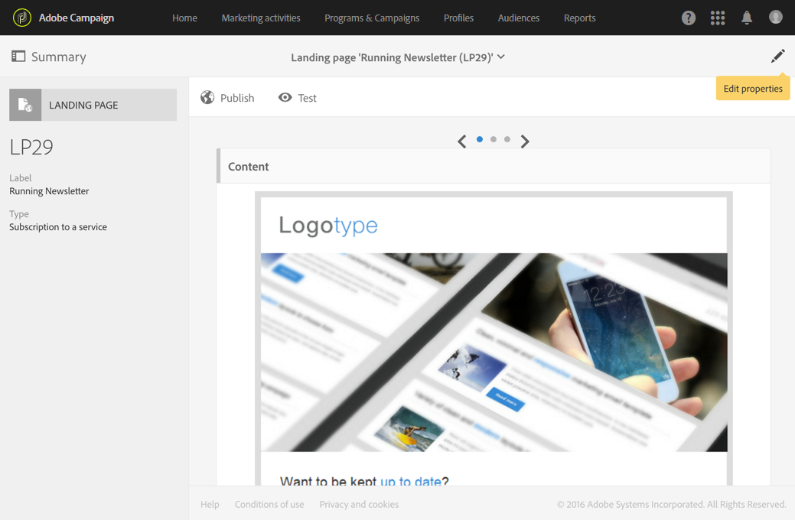
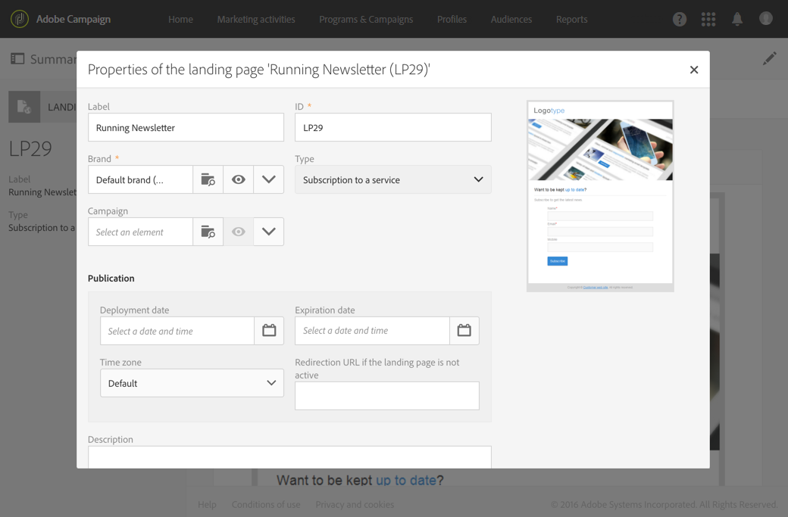

# Een landingspagina testen en publiceren{#testing-publishing--landing-page}

## De publicatie van een landingspagina {#about-landing-page-publication}

Voordat u een landingspagina publiceert, moet u tests uitvoeren: valideer de uitvoering, configureer de toegang en stel het einde van de levensduur van de landingspagina in. Deze stappen zijn vereist en moeten voorzichtig worden uitgevoerd.

## De landingspagina testen {#testing-the-landing-page-}

Aangezien de landingspagina uw platform en data zal beïnvloeden, moet u de uitvoering ervan zorgvuldig testen. Dit doet u als volgt:

1. Klik op de knop **[!UICONTROL Test]** op de actiebalk van de landingspagina.
1. Selecteer in het testscherm een testprofiel en een testservice als de landingspagina wordt gebruikt voor het beheren van abonnementen.

   

1. Voer data in de velden in en selecteer opties.
1. Verzend de landingspagina en controleer updates in de database.

   >[!IMPORTANT]
   >
   >Wanneer het formulier is verzonden, worden de gebruikte service en het gebruikte profiel bijgewerkt.

1. Herhaal dit met verschillende profielen en data.

U kunt ook de miniatuur van de landingspagina genereren vanuit dit scherm.

>[!NOTE]
>
>Als u de voorvertoning van de landingspagina wilt weergeven in de gebruikersinterface van Campaign, moet de URL van de applicatieserver beveiligd zijn. In dat geval gebruikt u https:// in plaats van http:// om deze URL in te stellen bij het [configureren van uw merk](../../administration/using/branding.md#configuring-and-using-brands).

## Geldigheidsparameters instellen {#setting-up-validity-parameters}

Voordat u gaat publiceren, is het met het oog op de veiligheid en platformprestaties raadzaam om een vervaldatum in te stellen in de eigenschappen van de landingspagina. Op de geselecteerde datum wordt de publicatie van de landingspagina automatisch ongedaan gemaakt. Dit doet u als volgt:

1. Bewerk de eigenschappen van de landingspagina, die toegankelijk zijn via de knop  in het dashboard van de landingspagina.

   

1. Stel de vervaldatum en -tijd in in de sectie **[!UICONTROL Publication]**: de publicatie van de landingspagina wordt op de opgegeven datum automatisch ongedaan gemaakt en is dan niet langer beschikbaar.

   U kunt de tijdzone selecteren die voor deze datum en tijd in aanmerking moet worden genomen.

1. Definieer een omleidings-URL om bezoekers om te leiden wanneer ze proberen een niet-actieve landingspagina te openen.

   

>[!IMPORTANT]
>
>U kunt ook een implementatiedatum en -tijd definiëren: de landingspagina wordt dan automatisch gepubliceerd op de opgegeven datum.

## Een landingspagina publiceren {#publishing-a-landing-page}

Wanneer u een landingspagina publiceert, wordt deze live weergegeven. De landingspagina kan dan worden geopend door uw bezoekers.

U kunt de publicatie van de landingspagina op elk gewenst moment ongedaan maken of de landingspagina bijwerken en opnieuw publiceren via de knop **[!UICONTROL Publish]**. Als het opnieuw publiceren mislukt en u de publicatie van de landingspagina nog niet ongedaan hebt gemaakt, blijft de eerste versie online.
