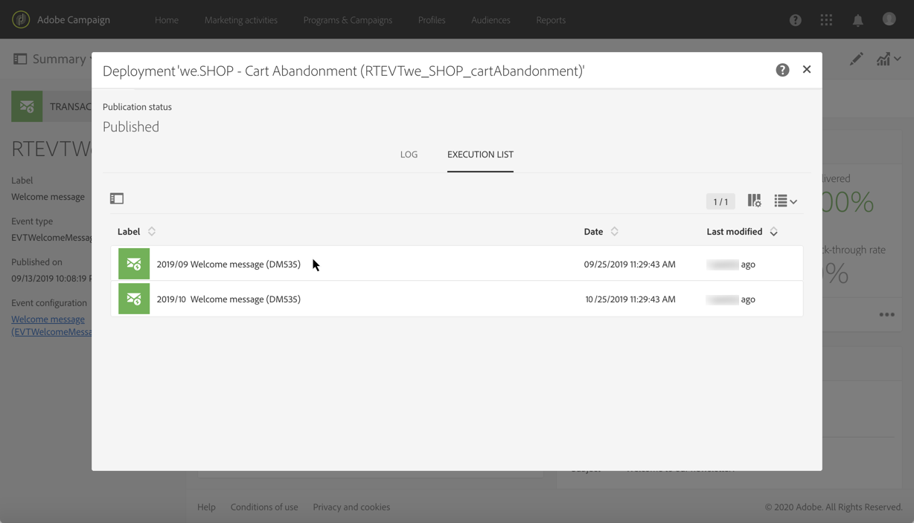

# Transactieberichten uitvoeren en controleren {#transactional-messaging-execution}

## Uitvoering van transactief bericht {#transactional-message-execution-delivery}

Zodra het bericht wordt gepubliceerd en uw plaatsintegratie wordt gedaan, wanneer een gebeurtenis wordt teweeggebracht, wordt het toegewezen aan een uitvoeringslevering.

Een **uitvoeringslevering** is een niet-actionable en niet-functionele technische die bericht eens per maand voor elk transactioneel bericht wordt gecreeerd, en telkens als een transactioneel bericht wordt uitgegeven en opnieuw wordt gepubliceerd.

**Verwante onderwerpen**:
* [Transactiebericht publiceren](../../channels/using/publishing-transactional-message.md#publishing-a-transactional-message)
* [De gebeurtenis die leidt tot integratie](../../channels/using/getting-started-with-transactional-msg.md#integrate-event-trigger)

## Transactieproces voor opnieuw proberen van berichten {#transactional-message-retry-process}

Er wordt automatisch opnieuw geprobeerd een tijdelijk onbezorgd transactiebericht te verzenden totdat de levering is vervallen. Zie [Parameters voor geldigheidsperiode](../../administration/using/configuring-email-channel.md#validity-period-parameters) voor meer informatie over de leveringsduur.

Wanneer een transactiebericht niet kan worden verzonden, zijn er twee systemen om het opnieuw te proberen:

* Op transactioneel berichtniveau kan een transactiebericht mislukken voordat de gebeurtenis aan een uitvoeringslevering wordt toegewezen, dus tussen de ontvangst van de gebeurtenis en de voorbereiding van de levering. Zie [Proces nieuwe verwerkingspogingen voor gebeurtenissen](#event-processing-retry-process).
* Qua verzendingsproces kan het transactiebericht vanwege een tijdelijke fout mislukken als de gebeurtenis eenmaal aan een uitvoeringslevering is toegewezen. Zie [Proces voor het opnieuw verzenden van een bericht](#message-sending-retry-process).

### Proces nieuwe verwerkingspogingen voor gebeurtenissen {#event-processing-retry-process}

Wanneer een gebeurtenis wordt teweeggebracht, wordt het toegewezen aan een uitvoeringslevering. De gebeurtenisverwerking wordt uitgesteld als de gebeurtenis niet aan een uitvoeringslevering kan worden toegewezen. Hernieuwde pogingen worden uitgevoerd tot de gebeurtenis aan een nieuwe uitvoeringslevering wordt toegewezen.

>[!NOTE]
>
>Een uitgestelde gebeurtenis wordt niet weergegeven in de verzendingslogboeken voor transactieberichten, omdat deze gebeurtenis nog niet is toegewezen aan een uitvoeringslevering.

De gebeurtenis kan bijvoorbeeld niet worden toegewezen aan een uitvoeringslevering omdat de content niet correct is, er een probleem is met toegangsrechten of branding, er een fout is ontdekt bij het toepassen van typologische regels, enz. In dit geval kunt u het bericht pauzeren, het bewerken om het probleem op te lossen en het opnieuw publiceren. Het systeem voor hernieuwde pogingen wijst het bericht dan toe aan een nieuwe uitvoeringslevering.

### Proces voor het opnieuw verzenden van een bericht {#message-sending-retry-process}

Zodra de gebeurtenis aan een uitvoeringslevering is toegewezen, kan het transactiebericht wegens een tijdelijke fout mislukken, bijvoorbeeld als de mailbox van de ontvanger vol is. Zie [Hernieuwde pogingen na een tijdelijke leveringsfout](../../sending/using/understanding-delivery-failures.md#retries-after-a-delivery-temporary-failure)voor meer informatie.

>[!NOTE]
>
>Pas wanneer een gebeurtenis aan een uitvoeringslevering wordt toegewezen, verschijnt het in de verzendingslogboeken van deze uitvoeringslevering. De mislukte leveringen worden weergegeven op het tabblad **[!UICONTROL Execution list]** van het transactionele bericht dat logbestanden verzendt.

### Procesbeperkingen {#limitations} opnieuw proberen

**Verzendingslogboeken bijwerken**

Tijdens de hernieuwde pogingen worden de verzendingslogboeken van de nieuwe uitvoeringslevering niet onmiddellijk bijgewerkt (het bijwerken wordt uitgevoerd door een geplande workflow). Dit betekent dat het bericht de status **[!UICONTROL Pending]** kan hebben, zelfs als de transactiegebeurtenis door de nieuwe uitvoeringslevering is verwerkt.

**Uitvoering mislukt**

U kunt een uitvoeringslevering niet stoppen. Als de huidige uitvoeringslevering echter mislukt, wordt er een nieuwe levering gemaakt zodra een nieuwe gebeurtenis wordt ontvangen en worden alle nieuwe gebeurtenissen door deze nieuwe uitvoeringslevering verwerkt. Er worden geen nieuwe gebeurtenissen door de mislukte uitvoeringslevering verwerkt.

Als sommige gebeurtenissen die reeds aan een uitvoeringslevering zijn toegewezen als deel van het hertestproces zijn uitgesteld en als die uitvoeringslevering ontbreekt, wijst het hertestsysteem niet de uitgestelde gebeurtenissen aan de nieuwe uitvoeringslevering toe, wat betekent dat deze gebeurtenissen worden verloren. Controleer [leveringslogboeken](#monitoring-transactional-message-delivery) om de ontvangers te zien die kunnen zijn beïnvloed.

## Transactieberichten {#monitoring-transactional-message-delivery} controleren

Om een transactiebericht te controleren, moet u tot de overeenkomstige [uitvoerleveringen](#transactional-message-execution-delivery) toegang hebben.

1. Klik op het pictogram rechtsonder in het blok **[!UICONTROL Deployment]** om het logboek voor de verzending van berichten weer te geven.

   

1. Klik op het tabblad **[!UICONTROL Execution list]**.

   

1. Selecteer de uitvoeringslevering van uw keuze.

   

1. Klik nogmaals op het pictogram rechtsonder in het **[!UICONTROL Deployment]**-blok.

   

   Voor elke uitvoeringslevering, kunt u de leveringslogboeken raadplegen zoals u voor een standaardlevering zou doen. Voor meer bij de toegang tot van en het gebruiken van de logboeken, zie [Controle een levering](../../sending/using/monitoring-a-delivery.md).

### Specificaties van op profielen gebaseerde transactiemeldingen {#profile-transactional-message-monitoring}

Voor op profielen gebaseerde transactiemeldingen kunt u de volgende profielgegevens controleren.

Selecteer het tabblad **[!UICONTROL Sending logs]**. In de kolom **[!UICONTROL Status]** geeft **[!UICONTROL Sent]** aan dat er een profiel is ingeschreven.

Selecteer **[!UICONTROL Exclusions logs]** lusje om ontvangers te bekijken die van het berichtdoel, zoals adressen op lijst van afgewezen personen zijn uitgesloten.

Voor elk profiel dat is uitgeschreven, is de typologieregel **[!UICONTROL Address on denylist]** niet van toepassing op de bijbehorende ontvanger.

Deze regel maakt deel uit van een specifieke typologie die op alle transactionele berichten van toepassing is op basis van de tabel **[!UICONTROL Profile]**.

**Verwante onderwerpen**:

* [Informatie over typologieën en typologieregels](../../sending/using/about-typology-rules.md)
* [Een levering controleren](../../sending/using/monitoring-a-delivery.md)
