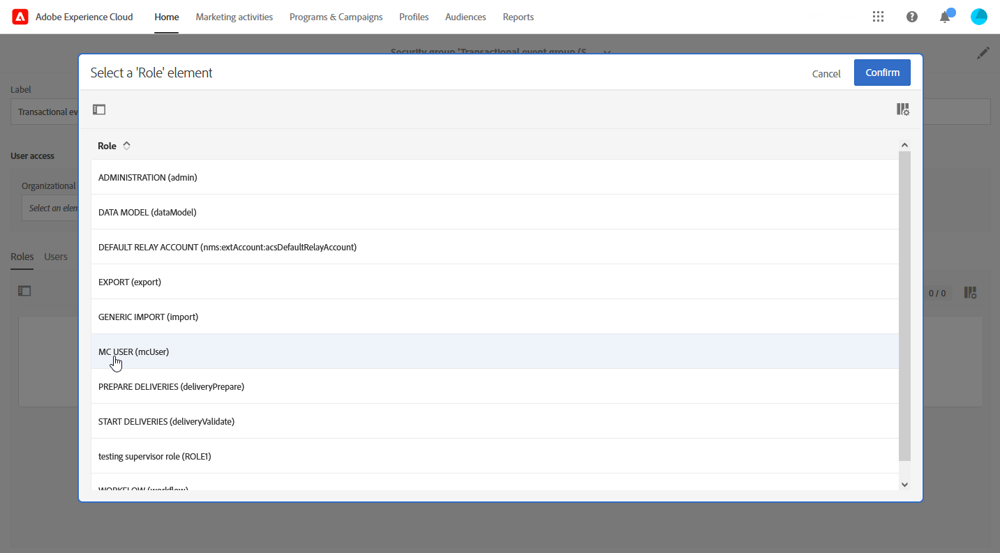

# Toestemming voor Transactieberichten {#transactional-message-permission}

Op dit moment kunnen gebruikers zonder de beveiligingsgroep Beheerder in Adobe Campaign Standard geen toegang krijgen tot gebeurtenissen, deze maken of publiceren. Dit leidt tot problemen voor zakelijke gebruikers die gebeurtenissen moeten configureren en publiceren, maar geen beheerdersrechten hebben.

We hebben de volgende verbeteringen geïmplementeerd in de toegangscontrole voor transactieberichten:

* Een nieuwe **[!UICONTROL Role]**, aangeroepen **MC-gebruiker**, is toegevoegd om niet-beheerdersgebruikers toe te staan transactionele gebeurtenissen te beheren. De **MC-gebruiker** rol verleent deze gebruikers de capaciteit om tot transactiegebeurtenissen en berichten toegang te hebben tot, tot stand te brengen, te publiceren en unpublish.

* Onderliggende leveringen zijn nu ingesteld op **[!UICONTROL Organizational unit]** van de veiligheidsgroep waartoe de gebruiker die het berichtmalplaatje creeert behoort eerder dan beperkt tot **[!UICONTROL Organizational unit]** van de **Message Center-agent (mcExec)** beveiligingsgroep.

* De standaardwaarde **Berichtencentrum Uitvoering (mcExec)** de campagne , die de transacties van het overseinen kindleveringen verzamelt, is nu geplaatst aan de organisatorische eenheid **Alles** het toestaan van alle gebruikers om rapporten van kindleveringen te bekijken.

Om het **MC-gebruiker** rol:

1. Een nieuwe **[!UICONTROL Security group]** of een bestaande versie bijwerken. [Meer informatie](../../administration/using/managing-groups-and-users.md).

1. Klikken **[!UICONTROL Create element]** om rollen aan uw veiligheidsgroep toe te wijzen.

   

1. De MC-gebruiker selecteren **[!UICONTROL Role]** en klik op **[!UICONTROL Confirm]**.

   >[!IMPORTANT]
   >
   > Ga met voorzichtigheid te werk wanneer het toewijzen van de rol van de Gebruiker MC aan exploitanten, aangezien dit hen de capaciteit verleent om gebeurtenissen unpublish.

   

1. Zodra gevormd, klik **[!UICONTROL Save]**.

Aan deze **[!UICONTROL Security group]** U kunt Transactionele gebeurtenissen en berichten nu openen, maken en publiceren.

In de onderstaande tabel wordt de invloed van deze functie op toegangsbeheer beschreven:

| Objecten | Voor deze wijziging | Na deze wijziging |
|:-: | :--: | :-:|
| McExec-campagne (Message Center Execution) | **Berichtencentrum Uitvoering (mcExec)** wordt ingesteld op de Organizer-eenheid van de **Message Center-agent (mcExec)** beveiligingsgroep. | **Berichtencentrum Uitvoering (mcExec)** wordt ingesteld op de Organizer-eenheid **Alles** alle onderliggende leveringen aan deze campagne mogen worden gekoppeld.  Alle gebruikers zullen rapporten van de kindleveringen kunnen bekijken, maar zullen slechts read-only toegang tot de leveringsinhoud hebben. |
| Kinderleveringen | Onderliggende items worden ingesteld op **Organisatorische eenheid** van de **Message Center-agent (mcExec)** beveiligingsgroep. | Onderliggende leveringen worden ingesteld op **Organisatorische eenheid** van de beveiligingsgroep waartoe de gebruiker die de berichtsjabloon maakt, behoort. |
| Berichtsjabloon | Berichttemplates zijn ingesteld op **Organisatorische eenheid** van de **Message Center-agent (mcExec)** beveiligingsgroep. | Berichttemplates worden ingesteld op **Organisatorische eenheid** van de beveiligingsgroep waartoe de gebruiker die de berichtsjabloon maakt, behoort. |
| Transactionele gebeurtenissen | Alleen gebruikers binnen de **Beheerder** beveiligingsgroepen kunnen gebeurtenissen maken en publiceren. | De **MC-gebruiker** Met deze rol kunnen gebruikers gebeurtenissen maken en publiceren. |
| Transactionele berichtsjablonen | Transactiesjablonen voor berichten worden ingesteld op de Organizer-eenheid **Alles**. | De template voor het transactiebericht wordt ingesteld op **Organisatorische eenheid** van de beveiligingsgroep waartoe de gebruiker die de berichtsjabloon maakt, behoort. |