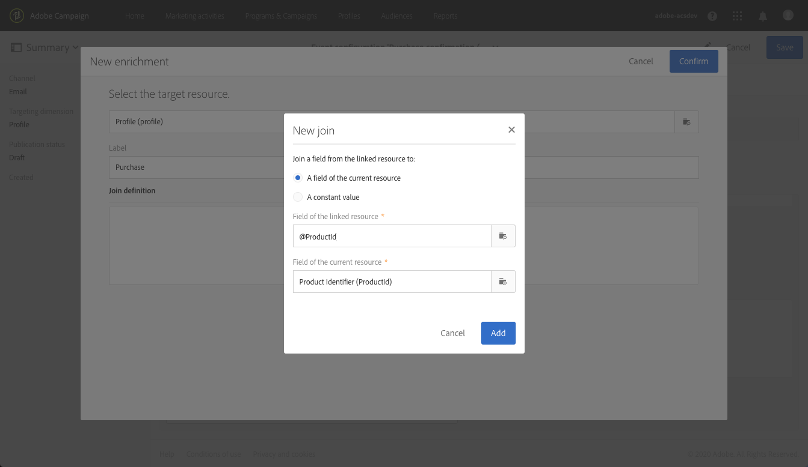

# Transactioneel overseinengebruiksgeval {#transactional-messaging-use-case}

In dit voorbeeld wilt u de Adobe Campaign-functionaliteit voor transactiemeldingen gebruiken om een bevestigingsbericht te verzenden na elke aankoop op uw website, waarbij u uw klanten kunt identificeren via hun CRM-id.

De voorwaarden zijn als volgt:

* Zorg ervoor dat **[!UICONTROL Profile]** middel met een nieuw gebied is uitgebreid dat met identiteitskaart van CRM beantwoordt.

* Creeer en publiceer een douanemiddel die aan aankopen beantwoordt en het verbinden met **[!UICONTROL Profile]** middel. Op deze manier kunt u informatie ophalen uit deze bron om de inhoud van het bericht te verrijken.

Zie [deze sectie](../../developing/using/key-steps-to-add-a-resource.md) voor meer informatie over het uitbreiden, maken en publiceren van bronnen.

De belangrijkste stappen voor de implementatie van dit gebruiksgeval worden hieronder weergegeven.

>[!NOTE]
>
>Voor een grafische vertegenwoordiging van het transactieoverseinen algemene proces, zie [dit schema](../../channels/using/getting-started-with-transactional-msg.md#key-steps).

## Stap 1 - creeer en publiceer de gebeurtenisconfiguratie {#create-event-configuration}

1. Maak een nieuwe gebeurtenis met het kanaal **[!UICONTROL Email]**. Zie [Een gebeurtenis maken](../../channels/using/configuring-transactional-event.md#creating-an-event).

1. Selecteer **[!UICONTROL Profile]** richtend dimensie om een [op profiel-gebaseerd transactionbericht ](../../channels/using/configuring-transactional-event.md#profile-based-transactional-messages) tot stand te brengen.

1. Definieer de kenmerken die beschikbaar zijn om het transactiebericht aan te passen. Voeg in dit voorbeeld de velden CRM-id en Product-id toe. Zie [Gebeurteniskenmerken definiëren](../../channels/using/configuring-transactional-event.md#defining-the-event-attributes).

   

1. Als u de inhoud van het bericht wilt verrijken met informatie over de aankopen van de klant, maakt u een verrijking voor de **[!UICONTROL Purchase]**-bron. Zie [De gebeurtenis verrijken](../../channels/using/configuring-transactional-event.md#enriching-the-transactional-message-content).

   

1. Maak een samenvoegvoorwaarde tussen het veld &quot;Product-id&quot; dat eerder aan de gebeurtenis is toegevoegd en het bijbehorende veld uit de bron **[!UICONTROL Purchase]**.

   

1. Omdat dit verplicht is voor op profielen gebaseerde gebeurtenissen, moet u ook een verrijking maken die gericht is op de **[!UICONTROL Profile]**-bron.

1. Creeer samen voorwaarde tussen het gebied van CRM identiteitskaart dat eerder aan het bericht werd toegevoegd, en het overeenkomstige gebied van **[!UICONTROL Profile]** middel dat u uitbreidde. <!--What's the purpose to have created a CRM ID for this event and to have the CRM ID as a join condition? could it be any other field provided you created it in the event?-->

   

1. In **[!UICONTROL Targeting enrichment]** sectie, selecteer de verrijking op **[!UICONTROL Profile]** middel, die als berichtdoel tijdens de leveringsuitvoering zal worden gebruikt.

   

1. Bekijk een voorvertoning van de gebeurtenis en publiceer deze. Zie [Een voorvertoning weergeven en de gebeurtenis publiceren](../../channels/using/publishing-transactional-event.md#previewing-and-publishing-the-event).

## Stap 2 - geef en publiceer het transactiebericht {#create-transactional-message} uit

1. Ga naar het transactiebericht dat automatisch werd gecreeerd bij het publiceren van de gebeurtenis. Zie [Transactieberichten benaderen](../../channels/using/editing-transactional-message.md#accessing-transactional-messages).

1. Bewerk het bericht en pas het aan. Zie [Een bericht voor een profieltransactie bewerken](../../channels/using/editing-transactional-message.md#editing-profile-transactional-message).

1. Via afstemming met het veld CRM-id dat u hebt toegevoegd aan de **[!UICONTROL Profile]**-bron, hebt u directe toegang tot alle profielgegevens om uw bericht [personalize](../../designing/using/personalization.md#inserting-a-personalization-field) te verzenden.

   

1. Via aansluiting op het veld &quot;Product identifier&quot; kunt u de inhoud van het bericht verrijken met informatie over de aankopen van de klant door een veld uit de bron **[!UICONTROL Purchase]** toe te voegen.

   

   Selecteer **[!UICONTROL Insert personalization field]** in de contextuele werkbalk om dit te doen. Open in het knooppunt **[!UICONTROL Context]** > **[!UICONTROL Transactional event]** > **[!UICONTROL Event context]** het knooppunt dat overeenkomt met de aangepaste bron **[!UICONTROL Purchase]** en selecteer een willekeurig veld.

1. U kunt uw bericht testen met een specifiek testprofiel. Zie [Transactiebericht testen](../../channels/using/testing-transactional-message.md#testing-a-transactional-message).

1. Wanneer de inhoud gereed is, slaat u de wijzigingen op en publiceert u het bericht. Zie [Een transactioneel bericht publiceren](../../channels/using/publishing-transactional-message.md#publishing-a-transactional-message).

## Stap 3 - Integreer de gebeurtenis die {#integrate-event-trigger} teweegbrengt

Integreer de gebeurtenis in uw website. Zie [De gebeurtenis activeren](../../channels/using/getting-started-with-transactional-msg.md#integrate-event-trigger).

## Stap 4 - Berichtlevering {#message-delivery}

Zodra al deze stappen zijn uitgevoerd, zodra een klant producten van uw website koopt, ontvangen zij een gepersonaliseerd bevestigingsbericht met informatie over hun aankoop.