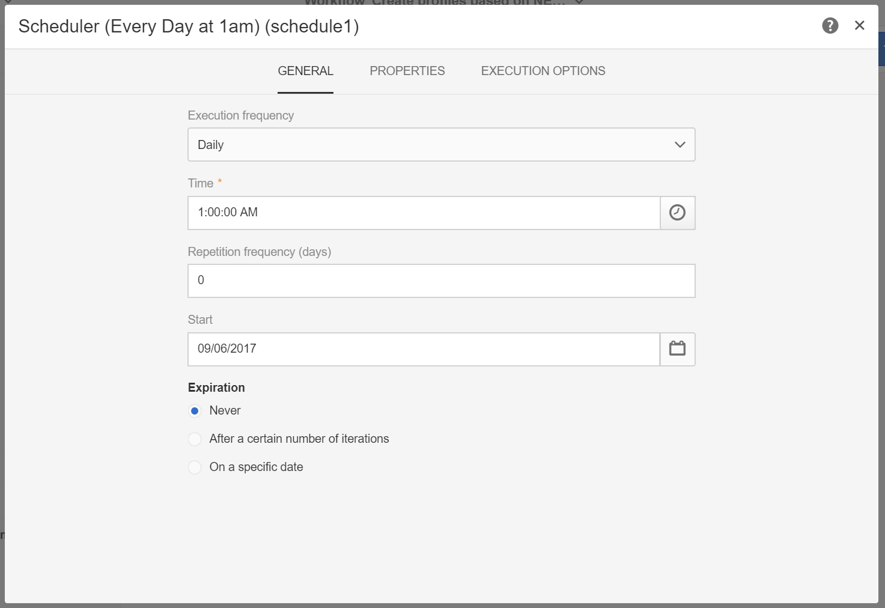
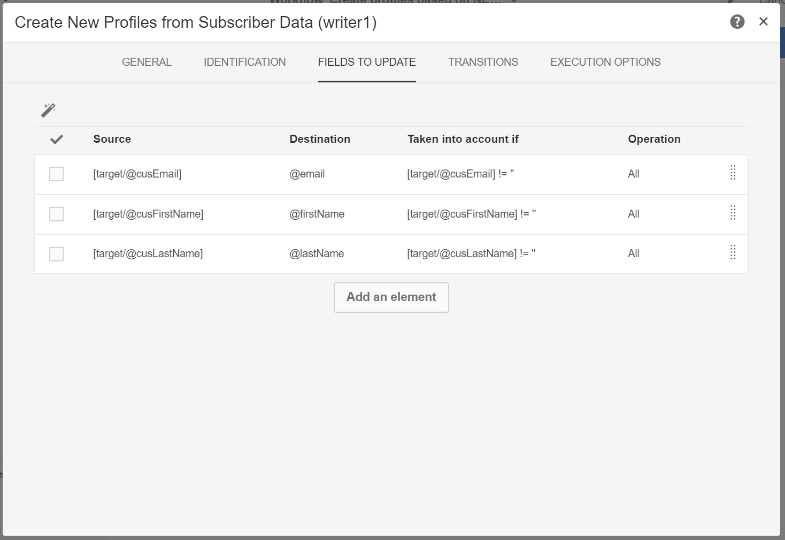

# Profieldata maken en bijwerken op basis van data van mobiele applicaties

## Overzicht

Op deze pagina worden de stappen beschreven voor het ontwikkelen van een workflow waarmee profielgegevens worden gemaakt/bijgewerkt nadat een mobiele toepassing PII-gegevens verzamelen op een geplande basis verzendt.

* **PII** staat voor &quot;Persoonlijk identificeerbare informatie&quot;. Het kunnen om het even welke gegevens zijn, met inbegrip van informatie die niet in de lijst van het Profiel van uw gegevensbestand van de Campagne zoals, bijvoorbeeld, Analytics voor Mobiele [Punten van Interesse](../../integrating/using/about-campaign-points-of-interest-data-integration.md)verschijnt. PII wordt bepaald door de Mobiele Ontwikkelaar van de App, gewoonlijk met een Marketer.
* **PII** verzamelen is een HTTP-POST-bewerking naar een Rest-API in Adobe Campaign Standard vanuit een Mobile-app.

Het doel van dit gebruiksgeval is het maken of bijwerken van een Campaign Standard-profiel als de PII-gegevens die door een mobiele toepassing worden geretourneerd, profielgerelateerde gegevens bevatten.

## Vereisten

Er zijn verschillende configuratiestappen om pushmeldingen in te schakelen in Campaign Standard, voordat Profielen kunnen worden gemaakt of bijgewerkt op basis van de abonnementsgegevens voor de mobiele app:

1. [Een mobiele toepassing maken](../../administration/using/configuring-a-mobile-application.md)
1. [Integreer de Adobe Mobile SDK met uw mobiele toepassing](https://helpx.adobe.com/nl/campaign/kb/integrate-mobile-sdk.html).
1. [Configureer Adobe Campaign om pushmeldingen](https://docs.adobe.com/content/help/nl-NL/campaign-standard/using/administrating/configuring-channels/configuring-a-mobile-application.html)te verzenden.

## Stap 1 - breid het middel van het Profiel voor de Berichten/Abonnementen van de Duw uit

Als u de profielbron wilt maken of bijwerken met PII-gegevens, moet u eerst de profielbron uitbreiden met de gewenste velden. Dit doet u als volgt:

* Identificeer de PII gebieden die door de Mobiele Toepassing worden verzonden.
* Identificeer het gebied om voor aanpassing te gebruiken om de PII gegevens met de Gegevens van het Profiel te associëren.

In dit voorbeeld weerspiegelt de **[!UICONTROL Fields]** sectie de PII-gegevens die door de mobiele toepassing worden verzonden. De **[!UICONTROL Link to profiles]** sectie geeft het veld aan dat wordt gebruikt om de PII te koppelen aan de profielgegevens, waarbij **focusEmail** wordt toegewezen aan **@email**.

De toewijzing voor de Gegevens van het Profiel terwijl het uitbreiden van het **[!UICONTROL Subscriptions to an Application]** middel is LEZEN-ONLY. Het wordt gebruikt voor verzoening. Het profiel moet in het systeem worden ingevoerd met de gegevens die nodig zijn om het profiel in overeenstemming te brengen met de PII-gegevens. In ons geval moet een e-mailadres voor het profiel overeenkomen met een e-mail van de Collect PII om de afstemming te kunnen uitvoeren:

* Verzamel PII wordt ontvangen van een Mobiele App voor een gebruiker waar hun Voornaam &quot;Jane, Achternaam &quot;Doe&quot;is en E-mailadres janedoe@doe.com is.
* De profielgegevens moeten afzonderlijk bestaan (de gegevens moeten bijvoorbeeld handmatig worden ingevoerd of afkomstig zijn van een andere bron), waarbij het e-mailadres van het profiel janedoe@doe.com is.

**Verwante onderwerpen:**

* [De abonnementen uitbreiden naar een applicatieresource](../../developing/using/extending-the-subscriptions-to-an-application-resource.md).
* [Een bestaande bron](../../developing/using/key-steps-to-add-a-resource.md)maken of uitbreiden.

## Stap 2 - De workflow maken

Met behulp van een workflow in Campaign Standard kan een beheerder gegevens op unieke wijze identificeren en synchroniseren tussen de AppSubscription-gegevens (Subscriber) en de Profile- of Recipient-gegevens. Hoewel een op werkstroom-gebaseerde update profielgegevens niet in echt - tijd synchroniseert, zou het geen onnodige gegevensbestandsloten of overheadkosten moeten veroorzaken.

De belangrijkste stappen voor het samenstellen van de workflow zijn:

1. Gebruik een **[!UICONTROL Query]** of **[!UICONTROL Incremental query]** activiteit om een lijst van de recentste abonnementen te krijgen.
1. Gebruik een **[!UICONTROL Reconciliation]** activiteit om de PII gegevens met het profiel in kaart te brengen.
1. Voeg een verificatieproces toe.
1. Gebruik een script **[!UICONTROL Update data]** om het profiel bij te werken of te maken met de PII-gegevens.

In deze workflow wordt uitgegaan van de volgende vereisten:

* Alle/alle velden die zijn uitgebreid, moeten beschikbaar zijn om de profieltabel te maken/bijwerken.
* De tabel Profiel kan worden uitgebreid met ondersteuning voor velden die niet standaard worden ondersteund (bijvoorbeeld Grootte T-Shirt).
* Om het even welk gebied van de lijst AppSubscription die leeg is zou niet in de Lijst van het Profiel moeten worden bijgewerkt.
* Om het even welk verslag dat in de lijst AppSubscription is bijgewerkt zou in de volgende looppas van het Werkschema moeten worden omvat.

U bouwt de workflow door de volgende activiteiten naar de werkruimte te slepen en ze aan elkaar te koppelen: **[!UICONTROL Start]**, **[!UICONTROL Scheduler]**, **[!UICONTROL Incremental query]**, **[!UICONTROL Update data]**.

Voer vervolgens de onderstaande stappen uit om elke activiteit te configureren.

### De **[!UICONTROL Scheduler]** activiteit configureren

In het **[!UICONTROL General]** lusje, plaats **[!UICONTROL Execution frequency]** (bijvoorbeeld, &quot;Dagelijks&quot;), **[!UICONTROL Time]** (bijvoorbeeld, &quot;1:00:00 AM&quot;), en **[!UICONTROL Start]** (bijvoorbeeld, de datum van vandaag).

### Configureer de **[!UICONTROL Incremental query]** activiteit.

1. Klik op het **[!UICONTROL Properties]** tabblad op het **[!UICONTROL Select an element]** pictogram van het **[!UICONTROL Resource]** veld en selecteer vervolgens het **[!UICONTROL Subscriptions to an application (nms:appSubscriptionRcp:appSubscriptionRcpDetail)]** element.

   

1. Sleep op het **[!UICONTROL Target]** tabblad het **[!UICONTROL Mobile application]** filter en selecteer vervolgens de naam van een mobiele toepassing.

   

1. Selecteer op het **[!UICONTROL Processed data]** tabblad de optie **[!UICONTROL Use a date field]** en voeg het **[!UICONTROL Last modified (lastModified)]** veld toe als **[!UICONTROL Path to the date field]**.

   

### Configureer de **[!UICONTROL Update data]** activiteit.

1. Controleer op het **[!UICONTROL Identification]** tabblad of het **[!UICONTROL Dimension to update]** veld is ingesteld op Profielen (profiel) en klik vervolgens op de **[!UICONTROL Create element]** knop om een veld toe te voegen als afstemmingscriteria.

   

1. Selecteer in het **[!UICONTROL Source]** veld een veld in de tabel appSubscriptRcp als een afstemmingsveld. Dit kan de e-mail, crmId, marketingCloudId van het profiel enzovoort zijn. In dit voorbeeld gebruiken we het veld E-mail (cusEmail).

1. Selecteer in het **[!UICONTROL Destination]** veld een veld in de profielentabel om de gegevens in de tabel appSubscriptionRcp met elkaar in overeenstemming te brengen. Dit kan de e-mail van het profiel zijn of een uitgebreid veld zoals crmId, marketingCloudId, enz. In dit voorbeeld moeten we het veld E-mail (e-mail) selecteren om het toe te wijzen met het veld E-mail (cusEmail) in de tabel appSubscriptionRcp.

   

1. Klik op het **[!UICONTROL Fields to update]** tabblad op de **[!UICONTROL Create element]** knop en wijs vervolgens de velden uit de tabel appSubscriptionRcp (**[!UICONTROL Source]** veld) toe aan de velden die u wilt bijwerken in de tabel Profiel (**[!UICONTROL Destination]** veld).

1. Voeg in het **[!UICONTROL Enabled if]** veld een expressie toe om ervoor te zorgen dat het corresponderende veld in de tabel Profiel alleen wordt bijgewerkt als het bronveld een waarde bevat. Hiervoor selecteert u het veld in de lijst en voegt u vervolgens het veld &quot;!=&#39;&#39; uitdrukking (als het Brongebied `[target/@cusEmail]` in de redacteur van de Uitdrukking is zeker om te typen `[target/@cusEmail] != ''"`).

   

>[!NOTE]
>
>In dit geval, voert het Werkschema UPSERT uit maar aangezien het op een **[!UICONTROL Incremental query]** gegeven gebaseerd is wordt slechts opgenomen. Het wijzigen van de query kan invloed hebben op welke gegevens worden ingevoegd of bijgewerkt.
>Bovendien bepalen de instellingen op het tabblad Velden die moeten worden bijgewerkt welke velden onder specifieke omstandigheden worden ingevoegd of bijgewerkt. Deze instellingen kunnen uniek zijn voor elke toepassing of klant.
>Wees voorzichtig bij het configureren van deze instellingen, aangezien dit onbedoelde gevolgen kan hebben, aangezien het bijwerken van records in het profiel op basis van appSubscriptionRcp-gegevens de persoonlijke gegevens van gebruikers zonder validatie kan wijzigen.

Wanneer alle velden die u wilt invoegen/bijwerken in profiel zijn toegevoegd, klikt u op **[!UICONTROL Confirm]**.

Sla de workflow op en klik vervolgens **[!UICONTROL Start]** om de workflow uit te voeren.

