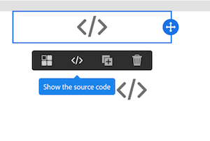

# E-mailinhoud van verouderde editor converteren {#converting-an-html-content}

Werk met de e-mailontwerper en maak herbruikbare sjablonen en fragmenten op van uw e-mailprogramma dat u hebt gemaakt in de Verouderde editor.

Met deze optie kunt u een E-mailDesigner-sjabloon maken door een HTML-e-mail te gebruiken en deze in HTML-onderdelen te verdelen in de e-mailontwerper.

>[!NOTE]
>
>Net als in de compatibiliteitsmodus kan een HTML-component met beperkte opties worden bewerkt: u kunt alleen op plaats edities uitvoeren.

>[!IMPORTANT]
>
>Deze sectie is bedoeld voor geavanceerde gebruikers die vertrouwd zijn met HTML-code.

## E-mailinhoud voorbereiden

1. Selecteer een HTML-e-mailbericht.
1. Secties identificeren om de HTML-e-mail te delen.
1. Knip de verschillende blokken uit uw HTML.

## Uw e-mailstructuur maken

1. Open de **[!UICONTROL Email Designer]**  om een lege e-mailinhoud te maken.
1. Stel de kenmerken voor het tekstniveau in: achtergrondkleuren, breedte, enzovoort. Ga voor meer informatie naar [E-mailstijlen bewerken](../../designing/using/styles.md).
1. Voeg zoveel structuurcomponenten toe als secties. Ga voor meer informatie naar [De e-mailstructuur bewerken](../../designing/using/designing-from-scratch.md#defining-the-email-structure).

## HTML-inhoud toevoegen

1. Voeg een HTML-component toe aan elke structuurcomponent. Ga voor meer informatie naar [Fragmenten en componenten toevoegen](../../designing/using/designing-from-scratch.md#defining-the-email-structure).
1. Kopieer en plak de HTML in elke component.

## De stijl van uw e-mail beheren {#manage-the-style-of-your-email}

1. Overschakelen op **[!UICONTROL Mobile view]**. Zie [deze sectie](../../designing/using/plain-text-html-modes.md#switching-to-mobile-view)voor meer informatie.

1. U kunt dit corrigeren door over te schakelen naar de modus Broncode en de stijlsectie te kopiëren en te plakken in een nieuwe stijlsectie. Bijvoorbeeld:

   ```
   <style type="text/css">
   a {text-decoration:none;}
   body {min-width:100% !important; margin:0 auto !important; padding:0 !important;}
   img {line-height:100%; text-decoration:none; -ms-interpolation-mode:bicubic;}
   ...
   </style>
   ```

   >[!NOTE]
   >
   >Voeg vervolgens de stijl in een andere aangepaste stijltag toe.
   >
   >Wijzig de CSS die is gegenereerd door de e-mailontwerper niet:
   >
   >* `<style data-name="default" type="text/css">(##)</style>`
   >* `<style data-name="supportIOS10" type="text/css">(##)</style>`
   >* `<style data-name="mediaIOS8" type="text/css">(##)</style>`
   >* `<style data-name="media-default-max-width-500px" type="text/css">(##)</style>`
   >* `<style data-name="media-default--webkit-min-device-pixel-ratio-0" type="text/css">(##)</style>`

1. Ga terug naar de mobiele weergave om te controleren of uw inhoud correct wordt weergegeven en sla uw wijzigingen op.

## Hoofdletters gebruiken

Laten we proberen deze e-mail, gemaakt in de verouderde editor, om te zetten in een **[!UICONTROL Email Designer]** sjabloon.

### Het gedeelte van uw e-mail identificeren

We kunnen elf secties in deze e-mail identificeren.


Om te identificeren welk element is welke sectie van de HTML, kunt u het selecteren.


Als u de HTML-versie van het e-mailbericht wilt weergeven, klikt u op **[!UICONTROL Show source]**.

### De e-mailsjabloon en de structuur ervan maken

1. Slepen en slepen **[!UICONTROL Structure components]**  de indeling van onze e-mail weerspiegelen.

1. Herhaal dit zo vaak als nodig is. We moeten elf structuurcomponenten maken.

   

### HTML-inhoudscomponenten invoegen

1. Een **[!UICONTROL HTML component]**  in elke **[!UICONTROL Structure component]** .

   

1. Voor elke sectie klikt u op **[!UICONTROL Show source code]** .

   

1. Voeg de sectie HTML in.

1. Klik op **[!UICONTROL Save]**.

U kunt nu de weergave van uw e-mail controleren.


### Stijlen beheren voor mobiele weergave

1. Voeg CSS-elementen in om ervoor te zorgen dat uw e-mail geschikt is voor de mobiele weergave.

1. Schakel over naar broncode en kopieer en plak de stijlsectie in een nieuwe stijlsectie.

Raadpleeg voor meer informatie hierover [De stijl van uw e-mail beheren](#manage-the-style-of-your-email).

Uw verouderde e-mail is nu beschikbaar in de e-mailontwerper.
