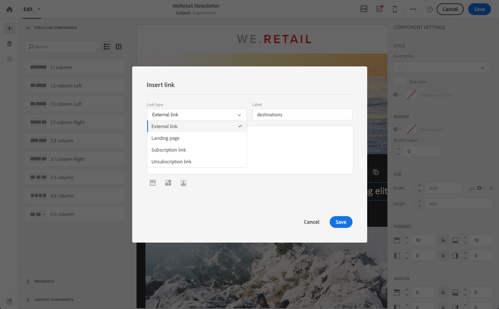

# Koppelingen toevoegen {#links}

## Een koppeling invoegen {#inserting-a-link}

Met de editor kunt u een e-mail- of landingspagina aanpassen door koppelingen in te voegen in de HTML-inhoudselementen.

U kunt een koppeling invoegen in elk pagina-element: afbeelding, woord, groep woorden, tekstblok, enzovoort.

>[!NOTE]
>
>In de onderstaande afbeeldingen ziet u hoe u een koppeling invoegt met de opdracht [E-mailDesigner](../../designing/using/designing-content-in-adobe-campaign.md) in een e-mail.

1. Selecteer een element en klik op **[!UICONTROL Insert link]** in de contextuele werkbalk.

   

1. Kies het type koppeling dat u wilt maken:

   * **Externe koppeling**: voeg een koppeling naar een externe URL in.

     U kunt personalisatie voor uw URLs bepalen. Zie [URL&#39;s aanpassen](personalization.md#personalizing-urls).

   * **Openingspagina**: geef toegang tot een Adobe Campaign-landingspagina.
   * **Koppeling naar abonnement**: voeg een koppeling in om u te abonneren op een Adobe Campaign-service.
   * **Koppeling met abonnement opheffen**: voeg een koppeling in om uw abonnement op een Adobe Campaign-service op te zeggen.
   * **Koppeling die een handeling definieert**: definieer een actie wanneer op een element op de bestemmingspagina wordt geklikt.

     >[!NOTE]
     >
     >Dit type koppeling is alleen beschikbaar voor bestemmingspagina&#39;s.

1. U kunt de tekst wijzigen die aan de ontvanger wordt getoond.
1. U kunt het browsergedrag instellen wanneer de gebruiker op de koppeling klikt (bijvoorbeeld een nieuw venster openen).

   >[!NOTE]
   >
   >Het browsergedrag definiëren is alleen van toepassing op bestemmingspagina&#39;s.

1. Sla uw wijzigingen op.

Nadat de koppeling is gemaakt, kunt u deze nog steeds wijzigen in het deelvenster Instellingen. Klik op het potloodpictogram om de parameters ervan te bewerken.

Wanneer u een e-mailbericht bewerkt met de [E-mailDesigner](../../designing/using/designing-content-in-adobe-campaign.md)U kunt gemakkelijk de koppelingen openen en wijzigen die u hebt gemaakt in de tabel met alle URL&#39;s die in de e-mail zijn opgenomen. In deze lijst kunt u een gecentraliseerde weergave gebruiken en elke URL in de e-mailinhoud opzoeken. Ga voor toegang tot de pagina naar [Bijgehouden URL&#39;s](#about-tracked-urls).

>[!NOTE]
>
>Persoonlijke URL&#39;s, zoals **URL van pagina spiegelen** of **Abonnement opzeggen** koppeling kan niet in deze lijst worden gewijzigd. Alle andere koppelingen kunnen worden bewerkt.

**Verwante onderwerpen**:

* [Een personalisatieveld invoegen](../../designing/using/personalization.md#inserting-a-personalization-field)
* [Inhoudsblokken toevoegen](../../designing/using/personalization.md#adding-a-content-block)
* [Dynamische inhoud definiëren](../../designing/using/personalization.md#defining-dynamic-content-in-an-email)

## Bijgehouden URL&#39;s {#about-tracked-urls}

Met Adobe Campaign kunt u het gedrag van ontvangers bijhouden wanneer ze op een URL in een e-mail klikken. Zie [deze sectie](../../sending/using/tracking-messages.md#about-tracking)voor meer informatie over tracking.

De **[!UICONTROL Links]** op de actiebalk wordt automatisch de lijst weergegeven met alle URL&#39;s van de inhoud die wordt bijgehouden.

>[!NOTE]
>
>Tekstspatiëring wordt standaard geactiveerd. Deze functionaliteit is alleen beschikbaar voor e-mailberichten als tracering is geactiveerd in Adobe Campaign. Raadpleeg voor meer informatie over de parameters tracking [deze sectie](../../administration/using/configuring-email-channel.md#tracking-parameters).

Het URL-, categorie-, label- en tracatietype van elke koppeling kan in deze lijst worden gewijzigd. Als u een koppeling wilt bewerken, klikt u op het bijbehorende potloodpictogram.

Voor elke bijgehouden URL kunt u de modus Tekstspatiëring instellen op een van de volgende waarden:

* **Bijgehouden**: activeert tracking op deze URL.
* **Pagina spiegelen**: beschouwt deze URL als een URL van een spiegelpagina.
* **Nooit**: activeert nooit het bijhouden van deze URL. Deze informatie wordt opgeslagen: als de URL opnieuw in een toekomstig bericht wordt weergegeven, wordt de URL automatisch uitgeschakeld.
* **Uitschakelen**: beschouwt deze URL als een opt-out- of niet-abonnements-URL.

U kunt het bijhouden van wijzigingen ook uitschakelen of activeren voor elke URL.

>[!NOTE]
>
>Standaard worden in Adobe Campaign alle inhoud-URL&#39;s bijgehouden, behalve **URL van pagina spiegelen** en **Abonnement opzeggen** koppeling.

U kunt uw URL&#39;s opnieuw groeperen door de **[!UICONTROL Category]** afhankelijk van de URL&#39;s die in het bericht worden gebruikt. Deze categorieën kunnen rapporten weergeven, zoals bijvoorbeeld in [URL&#39;s en klik op streams](../../reporting/using/urls-and-click-streams.md).

Wanneer het opstellen van een rapport, van **[!UICONTROL Components]** tab, selecteert u **[!UICONTROL Dimension]** en schuif onderaan de lijst om tot de volgende componenten toegang te hebben. Bijvoorbeeld slepen en neerzetten **[!UICONTROL Tracking URL Category]** in de werkruimte om resultaten weer te geven op basis van de categorie tracking van elke aangeklikte URL.

Zie voor meer informatie over het samenstellen van aangepaste rapporten [deze sectie](../../reporting/using/about-dynamic-reports.md).
