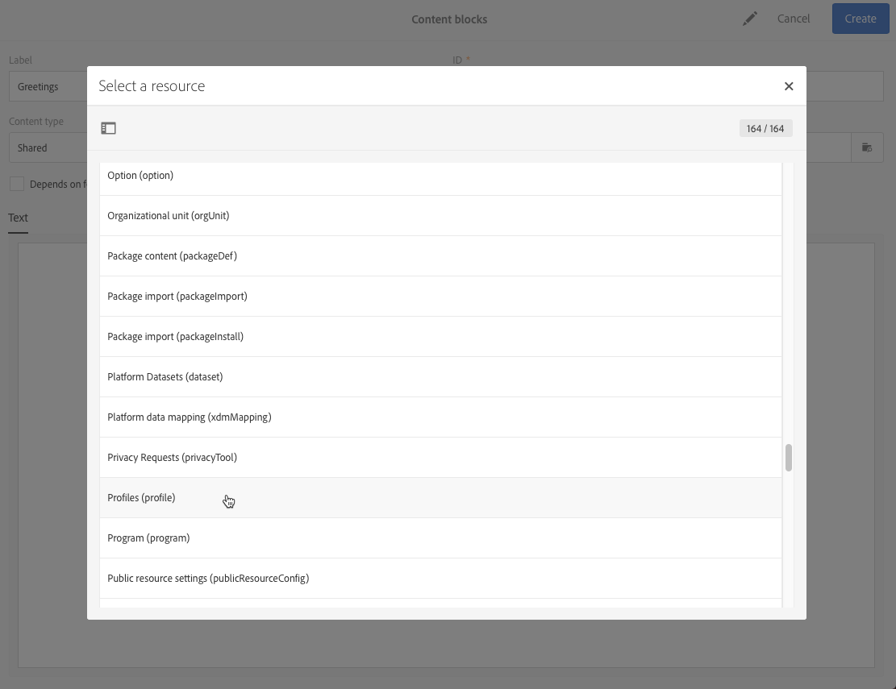

# E-mailcontent personaliseren {#personalization}

De inhoud en weergave van berichten die door Adobe Campaign worden geleverd, kunnen op verschillende manieren worden gepersonaliseerd. Deze methoden kunnen worden gecombineerd op basis van criteria die afhankelijk zijn van de profielen. In het algemeen kunt u met Adobe Campaign:

* Dynamische personalisatievelden invoegen. Zie [Een personalisatieveld invoegen](#inserting-a-personalization-field).
* Vooraf gedefinieerde aanpassingsblokken invoegen. Zie [Een contentblok](#adding-a-content-block) toevoegen.
* Pas de afzender van een e-mail aan. Zie [De afzender aanpassen](#personalizing-the-sender).
* Pas het onderwerp van een e-mail aan. Zie [De onderwerpregel van een e-mail aanpassen](../../designing/using/subject-line.md#subject-line).
* Voorwaardelijke content maken. Zie [Dynamische inhoud in een e-mail definiëren](#defining-dynamic-content-in-an-email).

## De afzender aanpassen {#personalizing-the-sender}

Als u de naam wilt definiëren van de afzender die wordt weergegeven in de koptekst van de verzonden berichten, gaat u naar **[!UICONTROL Properties]** tabblad van de introductiepagina E-mail Designer (toegankelijk via het homepictogram). Zie voor meer informatie [De afzender van een e-mailbericht definiëren](../../designing/using/subject-line.md#email-sender).

U kunt de naam van de afzender wijzigen door op de knop **Naam afzender** blokkeren. Het veld wordt bewerkbaar en u kunt de naam invoeren die u wilt gebruiken.

U kunt dit veld aanpassen. Hiervoor kunt u aanpassingsvelden, inhoudsblokken en dynamische inhoud toevoegen door op de pictogrammen onder de naam van de afzender te klikken.

>[!NOTE]
>
>De headerparameters mogen niet leeg zijn. Het adres van de afzender is verplicht om een e-mailbericht toe te staan (norm RFC). Adobe Campaign controleert de syntaxis van de ingevoerde e-mailadressen.

## URL&#39;s aanpassen {#personalizing-urls}

Met Adobe Campaign kunt u een of meer URL&#39;s in uw bericht aanpassen door personalisatievelden, inhoudsblokken of dynamische inhoud aan de URL&#39;s toe te voegen. Dit doet u als volgt:

1. Voeg een externe URL in en geef de parameters ervan op. Zie [Een koppeling invoegen](../../designing/using/links.md#inserting-a-link).
1. Als deze optie niet wordt weergegeven, klikt u op het potlood naast de geselecteerde URL in het deelvenster Instellingen voor toegang tot de verpersoonlijkingsopties.
1. Voeg de verpersoonlijkingsgebieden, inhoudsblokken, en dynamische inhoud toe die u wilt gebruiken.

   

1. Sla uw wijzigingen op.

>[!NOTE]
>
>Wanneer het mechanisme voor URL-handtekeningen voor het bijhouden van koppelingen is uitgeschakeld, kunnen URL&#39;s die de gebruiker aanpassen niet worden toegepast op de domeinnaam of op de URL-extensie. Een foutenmelding zal tijdens berichtanalyse worden getoond als de verpersoonlijking onjuist is.
>
>Wanneer u een inhoudsblok selecteert, kunt u geen elementen selecteren, zoals **Koppelen aan spiegelpagina**. Dit type blokken is niet toegestaan binnen een koppeling.

## Een aanpassingsveld invoegen{#inserting-a-personalization-field}

Met Adobe Campaign kunt u een veld uit de database in uw pagina invoegen, zoals de voornaam van het profiel.

>[!NOTE]
>
>In de onderstaande afbeeldingen ziet u hoe u een verpersoonlijkingsveld invoegt met de opdracht [E-mailDesigner](../../designing/using/designing-content-in-adobe-campaign.md) voor een e-mail.

Een verpersoonlijkingsveld toevoegen aan de inhoud:

1. Klik in een tekstblok en klik op de knop **[!UICONTROL Personalize]** pictogram in de contextafhankelijke werkbalk en selecteer **[!UICONTROL Insert personalization field]**. Ga voor meer informatie over de interface E-mailontwerper naar [deze sectie](../../designing/using/designing-content-in-adobe-campaign.md#email-designer-interface).

   

1. Selecteer het veld dat u in de pagina-inhoud wilt invoegen.

   

1. Klik op **[!UICONTROL Confirm]**.

De veldnaam wordt weergegeven in de editor en wordt gemarkeerd.

Als personalisatie is gegenereerd (bijvoorbeeld bij het voorvertonen en voorbereiden van de e-mail), wordt dit veld vervangen door de waarde die overeenkomt met het doelprofiel.

>[!NOTE]
>
>Als de e-mail wordt gemaakt op basis van een workflow, zijn de aanvullende gegevens die in de workflow zijn berekend, ook beschikbaar in de velden voor personalisatie. Raadpleeg voor meer informatie over het toevoegen van aanvullende gegevens uit een workflow de [Gegevens worden verrijkt](../../automating/using/about-targeting-activities.md#enriching-data) sectie.

## Een inhoudsblok toevoegen {#adding-a-content-block}

Adobe Campaign biedt een lijst met vooraf geconfigureerde inhoudsblokken. Deze inhoudsblokken zijn dynamisch, gepersonaliseerd en hebben een specifieke rendering. U kunt bijvoorbeeld een begroeting of een koppeling naar de spiegelpagina toevoegen.

>[!NOTE]
>
>In de onderstaande afbeeldingen ziet u hoe u een inhoudsblok invoegt met de opdracht [E-mailDesigner](../../designing/using/designing-content-in-adobe-campaign.md) voor een e-mail.

Een inhoudsblok toevoegen:

1. Klik in een tekstblok en klik op de knop **[!UICONTROL Personalize]** pictogram in de contextafhankelijke werkbalk en selecteer **[!UICONTROL Insert content block]**. Ga voor meer informatie over de interface E-mailontwerper naar [deze sectie](../../designing/using/designing-content-in-adobe-campaign.md#email-designer-interface).

   

1. Selecteer het inhoudsblok dat u wilt invoegen. Welke blokken beschikbaar zijn, is afhankelijk van de context (e-mail- of landingspagina).

   

1. Klik op **[!UICONTROL Save]**.

De naam van het inhoudsblok wordt weergegeven in de editor en geel gemarkeerd. Het zal automatisch aan het profiel aanpassen wanneer de verpersoonlijking wordt geproduceerd.

De uit-van-de-doos inhoudsblokken zijn:

* **[!UICONTROL Database URL in emails (EmailUrlBase)]**: Dit inhoudsblok kan alleen worden gebruikt in een **bezorging**.
* **[!UICONTROL Mirror page URL (MirrorPageUrl)]**: Dit inhoudsblok kan alleen worden gebruikt in een **bezorging**.
* **[!UICONTROL Link to mirror page (MirrorPage)]**: Dit inhoudsblok kan alleen worden gebruikt in een **bezorging**.
* **[!UICONTROL Greetings (Greetings)]**
* **[!UICONTROL Unsubscription link (UnsubscriptionLink)]**: Dit inhoudsblok kan alleen worden gebruikt in een **bezorging**.
* **[!UICONTROL Social network sharing links (LandingPageViralLinks)]**: Dit inhoudsblok kan alleen worden gebruikt in een **landingspagina**.
* **[!UICONTROL Default sender name (DefaultSenderName)]**: Dit inhoudsblok kan alleen worden gebruikt in een **bezorging**.
* **[!UICONTROL Name of default reply-to email address (DefaultReplyName)]**: Dit inhoudsblok kan alleen worden gebruikt in een **bezorging**.
* **[!UICONTROL Email address of default sender (DefaultSenderAddress)]**: Dit inhoudsblok kan alleen worden gebruikt in een **bezorging**.
* **[!UICONTROL Default error email address (DefaultErrorAddress)]**: Dit inhoudsblok kan alleen worden gebruikt in een **bezorging**.
* **[!UICONTROL Default reply-to email address (DefaultReplyAddress)]**: Dit inhoudsblok kan alleen worden gebruikt in een **bezorging**.
* **[!UICONTROL Brand name (BrandingUsualName)]**
* **[!UICONTROL Link to the brand website (BrandingWebSiteLink)]**
* **[!UICONTROL Brand logo (BrandingLogo)]**
* **[!UICONTROL Notification style (notificationStyle)]**

### Aangepaste inhoudsblokken maken {#creating-custom-content-blocks}

U kunt nieuwe inhoudsblokken definiëren die in een bericht- of landingspagina worden ingevoegd.

Ga als volgt te werk om een inhoudsblok te maken:

1. Klikken **[!UICONTROL Resources > Content blocks]** in het menu Geavanceerd voor toegang tot de lijst met inhoudsblokken.
1. Klik op de knop **[!UICONTROL Create]** of dupliceer een reeds bestaand inhoudsblok.

   

1. Voer een label in.
1. Selecteer de blokken **[!UICONTROL Content type]**. Er zijn drie opties beschikbaar:

   * **[!UICONTROL Shared]**: Het inhoudsblok kan worden gebruikt in een levering- of landingspagina.
   * **[!UICONTROL Delivery]**: Het inhoudsblok kan alleen worden gebruikt in een levering.
   * **[!UICONTROL Landing page]**: Het inhoudsblok kan alleen worden gebruikt op een bestemmingspagina.

   

1. U kunt een **[!UICONTROL Targeting dimension]**. Zie voor meer informatie [Dimensie opgeven](#about-targeting-dimension).

   

1. U kunt de **[!UICONTROL Depends on format]** twee verschillende blokken definiëren: een voor e-mails met HTML en een voor e-mails met een tekstindeling. Er worden dan twee tabbladen weergegeven in de editor (HTML en Tekst) om de bijbehorende inhoud te definiëren.

   

1. Voer de inhoud van de inhoudsblokken in en klik op de knop **[!UICONTROL Create]** knop.

U kunt het inhoudsblok nu gebruiken in de inhoudseditor van een bericht of een openingspagina.

>[!CAUTION]
>
>Wanneer u de inhoud van een blok bewerkt, dient u ervoor te zorgen dat er geen extra witruimten zijn tussen het begin en het einde van het blok *indien* instructies. In HTML worden de witruimten op het scherm weergegeven en hebben ze daarom invloed op de lay-out van de inhoud.

### Dimensie opgeven {#about-targeting-dimension}

De het richten afmeting laat u toe om te bepalen in welk type van bericht u het inhoudsblok kunt gebruiken. Hiermee wordt voorkomen dat onjuiste blokken in een bericht worden gebruikt, wat tot fouten kan leiden.

Wanneer u een bericht bewerkt, kunt u alleen inhoudsblokken selecteren met een doeldimensie die compatibel is met de doeldimensie van dat bericht.

Bijvoorbeeld de **[!UICONTROL Unsubscription link]** blok richt dimensie is **[!UICONTROL Profiles]** omdat het personaliseringsgebieden specifiek voor het bevat **[!UICONTROL Profiles]** resource. Daarom kunt u geen **[!UICONTROL Unsubscription link]** in een [Transactiebericht voor gebeurtenis](../../channels/using/getting-started-with-transactional-msg.md#transactional-message-types), omdat de doeldimensie van dat type bericht **[!UICONTROL Real-time events]**. U kunt echter de opdracht **Koppeling met abonnement opheffen** in een [profieltransactiebericht](../../channels/using/getting-started-with-transactional-msg.md#transactional-message-types), omdat de doeldimensie van dat type bericht **Profielen**. Tot slot de **[!UICONTROL Link to mirror page]** blok heeft geen het richten dimensie, zodat kunt u het in om het even welk bericht gebruiken.

Als u dit veld leeg laat, is het inhoudsblok compatibel met alle berichten, ongeacht de doeldimensie. Als u een het richten dimensie plaatst, zal dat blok slechts met berichten compatibel zijn die de zelfde het richten dimensie hebben.

Raadpleeg [Targetingdimensies en resources](../../automating/using/query.md#targeting-dimensions-and-resources) voor meer informatie.

**Verwante onderwerpen:**

* [Een aanpassingsveld invoegen](#inserting-a-personalization-field)
* [Een inhoudsblok toevoegen](#adding-a-content-block)
* [Dynamische inhoud in een e-mail definiëren](#defining-dynamic-content-in-an-email)

## Een afbeeldingsbron aanpassen{#personalizing-an-image-source}

Met Adobe Campaign kunt u een of meer afbeeldingen in uw bericht aanpassen aan een bepaald criterium of de afbeeldingen bijhouden gebruiken. Dit wordt gedaan door verpersoonlijkingsgebieden, inhoudsblokken, of dynamische inhoud in de beeldbron op te nemen. Dit doet u als volgt:

1. Voeg een afbeelding in in de inhoud van het bericht of selecteer een afbeelding die al aanwezig is.
1. Controleer in het palet met afbeeldingseigenschappen het palet **[!UICONTROL Enable personalization]** -optie.

   

   De **[!UICONTROL Source]** wordt weergegeven en wordt de geselecteerde afbeelding weergegeven als **gepersonaliseerd** in de editor.

1. Klik op het potlood naast de **[!UICONTROL Source]** de gebiedsknoop om tot de verpersoonlijkingsopties toegang te hebben.
1. Nadat u de afbeeldingsbron hebt toegevoegd, voegt u de gewenste aanpassingsvelden, inhoudsblokken en dynamische inhoud toe.

   

   >[!NOTE]
   >
   >De domeinnaam (http://mydomain.com) kan niet worden gepersonaliseerd, maar moet handmatig worden ingevoerd. De rest van de URL kan worden gepersonaliseerd. Bijvoorbeeld: http://mydomain.com/ `[Gender]` .jpg

1. Bevestig uw wijzigingen.

## Voorwaardelijke content {#conditional-content}

### Een zichtbaarheidsvoorwaarde definiëren{#defining-a-visibility-condition}

U kunt een zichtbaarheidsvoorwaarde voor elk element opgeven. De voorwaarde is alleen zichtbaar als aan de voorwaarde wordt voldaan.

Als u een zichtbaarheidsvoorwaarde wilt toevoegen, selecteert u een blok en voert u de voorwaarde in die moet worden nageleefd in het dialoogvenster **[!UICONTROL Visibility condition]** van de instellingen.

Deze optie is alleen beschikbaar voor de volgende elementen: ADRES, BLOCKQUOTE, CENTER, DIR, DIV, DL, FIELDSET, FORM, H1, H2, H3, H4, H5, H6, NOSCRIPT, OL, P, PRE, UL, TR, TD.

De expressie-editor wordt weergegeven in het dialoogvenster [Geavanceerde expressies bewerken](../../automating/using/editing-queries.md#about-query-editor) sectie.

Deze voorwaarden nemen de XTK-expressiesyntaxis over (bijvoorbeeld **context.profile.email!=&#39;&#39;** of **context.profile.status=&#39;0&#39;**). Standaard zijn alle velden zichtbaar.

>[!NOTE]
>
>Een voorwaarde kan niet worden gedefinieerd voor een blok dat al een subelement bevat met een dynamische inhoud of een blok dat al een dynamische inhoud vormt. Niet-zichtbare dynamische blokken, zoals vervolgkeuzelijsten, kunnen niet worden bewerkt.

### Dynamische inhoud in een e-mail definiëren{#defining-dynamic-content-in-an-email}

>[!CONTEXTUALHELP]
>id="ac_dynamic_content"
>title="Dynamische inhoud definiëren"
>abstract="Definieer verschillende inhoud die voor bepaalde profielen alleen wordt weergegeven op basis van voorwaarden die u definieert."

In een e-mail kunt u verschillende inhoud definiëren die dynamisch aan de ontvangers wordt weergegeven volgens de voorwaarden die via de expressieeditor zijn gedefinieerd. U kunt er bijvoorbeeld voor zorgen dat elk profiel via hetzelfde e-mailbericht een ander bericht ontvangt op basis van het leeftijdsbereik.

Dynamische inhoud definiëren verschilt van [zichtbaarheidsvoorwaarden definiëren](#defining-a-visibility-condition).

1. Selecteer een fragment, component of element. Selecteer in dit voorbeeld een afbeelding.
1. Klik op de knop **[!UICONTROL Dynamic content]** van de contextafhankelijke werkbalk.

   

   De **[!UICONTROL Dynamic content]** in het palet aan de linkerkant.

   

   Deze sectie bevat standaard twee elementen: de standaardvariant en een nieuwe variant.

   >[!NOTE]
   >
   >De inhoud moet altijd een standaardvariant hebben. U kunt deze niet verwijderen.

1. Klik op de knop **[!UICONTROL Edit]** om de weergavevoorwaarden voor de eerste alternatieve variant te definiëren.

   

1. Geef een label op en selecteer de velden die u als voorwaarden wilt instellen. Bijvoorbeeld vanuit de **[!UICONTROL General]** knoop, selecteer **[!UICONTROL Age]** field

   

1. Stel de filtervoorwaarden in. U wilt bijvoorbeeld een andere inhoud weergeven voor mensen tussen de 18 en 25 jaar oud.

   

1. Wanneer alle voorwaarden zijn ingesteld, definieert u de prioriteitsvolgorde waarin de voorwaarde wordt toegepast en slaat u de wijzigingen op.

   

   De inhoud wordt in het palet weergegeven in volgorde van prioriteit, van boven naar beneden. Voor meer informatie over prioriteiten raadpleegt u [deze sectie](#defining-dynamic-content-in-an-email).

1. Upload een nieuwe afbeelding voor de variant die u net hebt gedefinieerd.

   

   De ontvangers tussen 18 en 25 jaar oud zullen het nieuwe beeld zien.

   

1. Klikken **[!UICONTROL Add a condition]** om nieuwe inhoud en de bijbehorende gekoppelde regel toe te voegen.

   

   U kunt bijvoorbeeld een andere afbeelding toevoegen die wordt weergegeven voor mensen tussen de 26 en 35 jaar.

1. Ga op dezelfde manier te werk voor elk ander element van uw e-mail dat u dynamisch wilt worden getoond. Het kan tekst, knoop, fragment, enz. zijn. Sla uw wijzigingen op.

>[!CAUTION]
>
>Test het met een proefdruk nadat u het bericht hebt voorbereid en voordat u het verzendt. Als u dit niet doet, zijn sommige fouten mogelijk niet gedetecteerd en wordt het e-mailbericht mogelijk niet verzonden.

**Verwante onderwerpen:**

* [Proeven verzenden](../../sending/using/sending-proofs.md)
* [Geavanceerde expressies bewerken](../../automating/using/editing-queries.md#about-query-editor)

### Prioriteitsvolgorde {#order-of-priority}

Wanneer u in de expressieeditor een dynamische inhoud definieert, is de volgorde van prioriteit als volgt.

1. U definieert twee verschillende dynamische inhoud met **twee verschillende voorwaarden**, bijvoorbeeld:

   **Voorwaarde 1:** het geslacht van het profiel mannelijk is;

   **Voorwaarde 2:** het profiel is tussen de 20 en 30 jaar oud .

   

   Sommige profielen in uw database voldoen aan de twee voorwaarden, maar er kan slechts één e-mail met één dynamische inhoud worden verzonden.

1. Daarom moet u de prioriteit voor de dynamische inhoud definiëren. Een voorwaarde met een prioriteit van **1** (en dus de overeenkomstige dynamische inhoud) naar een profiel worden verzonden, zelfs als een andere voorwaarde waarvan de prioriteitsvolgorde **2** of **3** voldoet ook aan dit profiel.

   

U kunt slechts één prioriteitsvolgorde per dynamische inhoud definiëren.

## Voorbeeld: E-mailpersonalisatie{#example-email-personalization}

In dit voorbeeld heeft een lid van het marketingserviceteam een e-mail gemaakt om sommige van hun klanten te laten weten dat er alleen voor hen een speciale aanbieding is. Het teamlid heeft besloten de e-mail aan te passen aan de leeftijd van de klant. Clients tussen 18 en 27 jaar oud ontvangen een e-mail met een andere afbeelding en slogan voor de clients die ouder zijn dan 27 jaar.

Het e-mailbericht wordt als volgt gemaakt:

* Dynamische inhoud wordt toegepast op de afbeelding en deze dynamische inhoud wordt geconfigureerd op basis van het leeftijdsbereik.

  

  Het toevoegen en configureren van dynamische inhoud wordt beschreven in het gedeelte [Dynamische inhoud in een e-mail definiëren](#defining-dynamic-content-in-an-email) sectie.

* De gebieden van de aanpassing en de dynamische inhoud worden toegepast op de tekst. Afhankelijk van het leeftijdsbereik van het profiel, begint de e-mail met de voornaam van het profiel of de titel en achternaam van het profiel.

  

  Het toevoegen en configureren van verpersoonlijkingsvelden wordt gedetailleerd beschreven in het gedeelte [Een aanpassingsveld invoegen](#inserting-a-personalization-field) sectie.

### Afbeeldingen configureren {#configuring-images}

>[!CONTEXTUALHELP]
>id="ac_dynamic_image"
>title="Dynamische afbeeldingen beheren"
>abstract="Pas uw e-mail aan met dynamische afbeeldingen op basis van voorwaarden die u definieert."

In dit voorbeeld wordt de dynamische inhoud die op de afbeeldingen wordt toegepast, als volgt geconfigureerd:

**Om de leeftijd van 18-27 jaar te bereiken:**

1. Selecteer de dynamische inhoud in het dialoogvenster **[!UICONTROL Properties]** en klikt u op **[!UICONTROL Edit]** knop.

   

1. Bewerk het label en selecteer vervolgens het **[!UICONTROL Age]** veld van de **[!UICONTROL Profile]** knooppunt.

   

1. Selecteer de **Groter dan of gelijk aan** operator en vervolgens **18** om de **ouder dan 18** expressie.

   

1. Een nieuwe toevoegen **[!UICONTROL Age]** voorwaarde.

   Selecteer de **Kleiner dan of gelijk aan** operator, gevolgd door 27 in het waardeveld, om de **jonger dan 27 jaar** expressie.

   

1. Bevestig uw wijzigingen.

**Voor profielen van 27 jaar en ouder:**

1. Selecteer de dynamische inhoud in het palet en bewerk deze.
1. Bewerk het label en selecteer vervolgens het **[!UICONTROL Age]** veld van de **[!UICONTROL Profile]** knooppunt.
1. Voeg de **Groter dan** operator, gevolgd door 27 in het waardeveld, om de **ouder dan 27** expressie.

   

1. Bevestig uw wijzigingen.

De dynamische inhoud is op de juiste wijze geconfigureerd.

### Tekst configureren {#configuring-text}

In dit voorbeeld wordt de dynamische inhoud die op de teksten wordt toegepast, als volgt geconfigureerd:

**Voor profielen tussen 18 en 27 jaar:**

1. Selecteer de gewenste structuurcomponent en voeg een dynamische inhoud toe.
1. Bewerk de dynamische inhoud en configureer de doelexpressies. Zie [Afbeeldingen configureren](#configuring-images).
1. Klik in de structuurcomponent op de gewenste positie op de knop **[!UICONTROL Personalize]** pictogram in de contextafhankelijke werkbalk en selecteer **[!UICONTROL Insert personalization field]**.

   

1. Selecteer in de lijst die wordt weergegeven de optie **[!UICONTROL First name]** veld en bevestiging.

   

1. Het verpersoonlijkingsveld wordt vervolgens perfect ingevoegd in de geselecteerde dynamische inhoud.

**Voor profielen van 27 jaar en ouder:**

1. Selecteer de gewenste structuurcomponent en voeg een dynamische inhoud toe.
1. Bewerk de dynamische inhoud en configureer de doelexpressies. Zie [Afbeeldingen configureren](#configuring-images).
1. Klik in de structuurcomponent op de gewenste positie op de knop **[!UICONTROL Personalize]** pictogram in de contextafhankelijke werkbalk en selecteer **[!UICONTROL Insert personalization field]**.
1. Selecteren **[!UICONTROL Title]** in de vervolgkeuzelijst.
1. Ga op dezelfde manier verder om de **[!UICONTROL Last name]** veld.

   

Uw verpersoonlijkingsgebieden zouden nu perfect in de gekozen dynamische inhoud moeten worden opgenomen.

### E-mailberichten voorvertonen {#previewing-emails}

Als u een voorbeeld bekijkt, kunt u controleren of de verpersoonlijkingsvelden en de dynamische inhoud correct zijn geconfigureerd voordat u het dialoogvenster **[!UICONTROL Proofs]**. Tijdens de voorvertoning kunt u verschillende testprofielen selecteren die overeenkomen met de e-maildoelen.

Zonder testprofielen wordt standaard de volgende e-mail weergegeven:

De slogan bevat geen velden voor het aanpassen van het e-mailadres en de standaardafbeelding wordt gebruikt.

Het eerste testprofiel komt overeen met een client tussen 18 en 27 jaar. Door dit profiel te selecteren, wordt het volgende e-mailbericht weergegeven:

Het verpersoonlijkingsgebied dat aan de 18-27 jaar-oude uitdrukking, specifiek de voornaam van het profiel beantwoordt, wordt correct gevormd en het beeld is ook veranderd volgens het profiel.

Het tweede profiel komt overeen met een client ouder dan 27 jaar en genereert de volgende e-mail:

De afbeelding is veranderd dankzij de dynamische inhoud en de slogan die wordt weergegeven, is de meer formele slogan die voor dit doelpubliek is gedefinieerd.

**Verwante onderwerpen:**

* [Doelgroepen maken](../../audiences/using/creating-audiences.md)
* [De verzending voorbereiden](../../sending/using/preparing-the-send.md)
