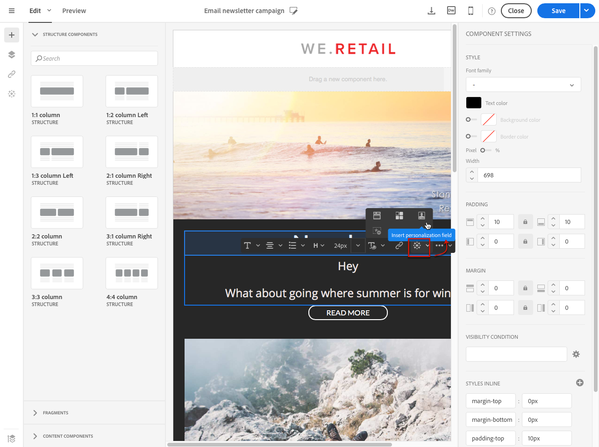
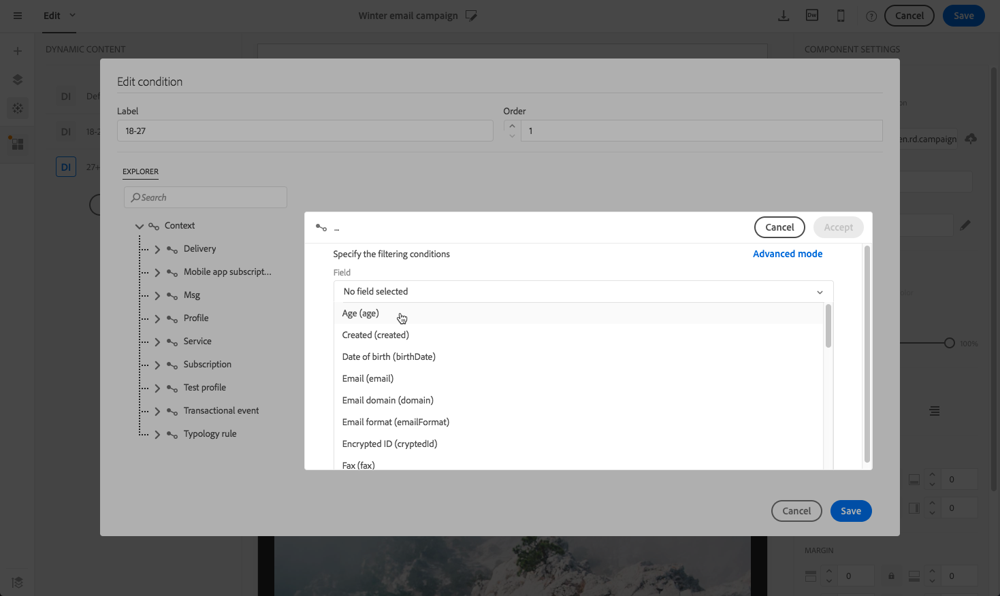

# E-mailcontent personaliseren {#personalization}

De inhoud en weergave van berichten die door Adobe Campaign worden geleverd, kunnen op verschillende manieren worden gepersonaliseerd. Deze methoden kunnen worden gecombineerd op basis van criteria die afhankelijk zijn van de profielen. In het algemeen kunt u met Adobe Campaign:

* Dynamische personalisatievelden invoegen. Zie [Een personalisatieveld invoegen](#inserting-a-personalization-field).
* Vooraf gedefinieerde aanpassingsblokken invoegen. Zie [Een contentblok](#adding-a-content-block) toevoegen.
* Pas de afzender van een e-mail aan. Zie [ Personaliserend de afzender ](#personalizing-the-sender).
* Pas het onderwerp van een e-mail aan. Zie [ Personaliserend de onderwerpregel van e-mail ](../../designing/using/subject-line.md#subject-line).
* Voorwaardelijke content maken. Zie [ Definiërend dynamische inhoud in e-mail ](#defining-dynamic-content-in-an-email).

## De afzender aanpassen {#personalizing-the-sender}

Als u de naam wilt definiëren van de afzender die wordt weergegeven in de koptekst van de verzonden berichten, gaat u naar het tabblad **[!UICONTROL Properties]** van de homepage van E-mail Designer (toegankelijk via het homepage). Voor meer op dit, zie [ Definiërend de afzender van een e-mail ](../../designing/using/subject-line.md#email-sender).

U kunt de afzendernaam veranderen door het **naamblok van de Afzender** te klikken. Het veld wordt bewerkbaar en u kunt de naam invoeren die u wilt gebruiken.

U kunt dit veld aanpassen. Hiervoor kunt u aanpassingsvelden, inhoudsblokken en dynamische inhoud toevoegen door op de pictogrammen onder de naam van de afzender te klikken.

>[!NOTE]
>
>De headerparameters mogen niet leeg zijn. Het adres van de afzender is verplicht om een e-mailbericht toe te staan (norm RFC). Adobe Campaign controleert de syntaxis van de ingevoerde e-mailadressen.

## URL&#39;s aanpassen {#personalizing-urls}

Met Adobe Campaign kunt u een of meer URL&#39;s in uw bericht aanpassen door personalisatievelden, inhoudsblokken of dynamische inhoud aan de URL&#39;s toe te voegen. Dit doet u als volgt:

1. Voeg een externe URL in en geef de parameters ervan op. Zie [ Invoegend een verbinding ](../../designing/using/links.md#inserting-a-link).
1. Als deze optie niet wordt weergegeven, klikt u op het potlood naast de geselecteerde URL in het deelvenster Instellingen voor toegang tot de verpersoonlijkingsopties.
1. Voeg de verpersoonlijkingsgebieden, inhoudsblokken, en dynamische inhoud toe die u wilt gebruiken.

   

1. Sla uw wijzigingen op.

>[!NOTE]
>
>Wanneer het mechanisme voor URL-handtekeningen voor het bijhouden van koppelingen is uitgeschakeld, kunnen URL&#39;s die de gebruiker aanpassen niet worden toegepast op de domeinnaam of op de URL-extensie. Een foutenmelding zal tijdens berichtanalyse worden getoond als de verpersoonlijking onjuist is.
>
>Wanneer het selecteren van een inhoudsblok, wordt u niet toegestaan om elementen zoals **Verbinding te selecteren om pagina** te weerspiegelen. Dit type blokken is niet toegestaan binnen een koppeling.

## Een aanpassingsveld invoegen{#inserting-a-personalization-field}

Met Adobe Campaign kunt u een veld uit de database in uw pagina invoegen, zoals de voornaam van het profiel.

>[!NOTE]
>
>De beelden tonen hieronder hoe te om een verpersoonlijkingsgebied op te nemen gebruikend [ E-mail Designer ](../../designing/using/designing-content-in-adobe-campaign.md) voor e-mail.

Een verpersoonlijkingsveld toevoegen aan de inhoud:

1. Klik in een tekstblok, klik op het pictogram **[!UICONTROL Personalize]** op de contextuele werkbalk en selecteer **[!UICONTROL Insert personalization field]** . Voor meer op de E-mailinterface van Designer, zie [ deze sectie ](../../designing/using/designing-content-in-adobe-campaign.md#email-designer-interface).

   

1. Selecteer het veld dat u in de pagina-inhoud wilt invoegen.

   

1. Klik op **[!UICONTROL Confirm]**.

De veldnaam wordt weergegeven in de editor en wordt gemarkeerd.

Als personalisatie is gegenereerd (bijvoorbeeld bij het voorvertonen en voorbereiden van de e-mail), wordt dit veld vervangen door de waarde die overeenkomt met het doelprofiel.

>[!NOTE]
>
>Als de e-mail wordt gemaakt op basis van een workflow, zijn de aanvullende gegevens die in de workflow zijn berekend, ook beschikbaar in de velden voor personalisatie. Voor meer informatie over het toevoegen van extra gegevens van een werkschema, verwijs naar de [ Verrijkende gegevens ](../../automating/using/about-targeting-activities.md#enriching-data) sectie.

## Een inhoudsblok toevoegen {#adding-a-content-block}

Adobe Campaign biedt een lijst met vooraf geconfigureerde inhoudsblokken. Deze inhoudsblokken zijn dynamisch, gepersonaliseerd en hebben een specifieke rendering. U kunt bijvoorbeeld een begroeting of een koppeling naar de spiegelpagina toevoegen.

>[!NOTE]
>
>De beelden tonen hieronder hoe te om een inhoudsblok op te nemen gebruikend [ E-mail Designer ](../../designing/using/designing-content-in-adobe-campaign.md) voor e-mail.

Een inhoudsblok toevoegen:

1. Klik in een tekstblok, klik op het pictogram **[!UICONTROL Personalize]** op de contextuele werkbalk en selecteer **[!UICONTROL Insert content block]** . Voor meer op de E-mailinterface van Designer, zie [ deze sectie ](../../designing/using/designing-content-in-adobe-campaign.md#email-designer-interface).

   

1. Selecteer het inhoudsblok dat u wilt invoegen. Welke blokken beschikbaar zijn, is afhankelijk van de context (e-mail- of landingspagina).

   

1. Klik op **[!UICONTROL Save]**.

De naam van het inhoudsblok wordt weergegeven in de editor en geel gemarkeerd. Het zal automatisch aan het profiel aanpassen wanneer de verpersoonlijking wordt geproduceerd.

De uit-van-de-doos inhoudsblokken zijn:

* **[!UICONTROL Database URL in emails (EmailUrlBase)]**: Dit inhoudsblok kan slechts in a **levering** worden gebruikt.
* **[!UICONTROL Mirror page URL (MirrorPageUrl)]**: Dit inhoudsblok kan slechts in a **levering** worden gebruikt.
* **[!UICONTROL Link to mirror page (MirrorPage)]**: Dit inhoudsblok kan slechts in a **levering** worden gebruikt.
* **[!UICONTROL Greetings (Greetings)]**
* **[!UICONTROL Unsubscription link (UnsubscriptionLink)]**: Dit inhoudsblok kan slechts in a **levering** worden gebruikt.
* **[!UICONTROL Social network sharing links (LandingPageViralLinks)]**: Dit inhoudsblok kan slechts in a **worden gebruikt landend pagina**.
* **[!UICONTROL Default sender name (DefaultSenderName)]**: Dit inhoudsblok kan slechts in a **levering** worden gebruikt.
* **[!UICONTROL Name of default reply-to email address (DefaultReplyName)]**: Dit inhoudsblok kan slechts in a **levering** worden gebruikt.
* **[!UICONTROL Email address of default sender (DefaultSenderAddress)]**: Dit inhoudsblok kan slechts in a **levering** worden gebruikt.
* **[!UICONTROL Default error email address (DefaultErrorAddress)]**: Dit inhoudsblok kan slechts in a **levering** worden gebruikt.
* **[!UICONTROL Default reply-to email address (DefaultReplyAddress)]**: Dit inhoudsblok kan slechts in a **levering** worden gebruikt.
* **[!UICONTROL Brand name (BrandingUsualName)]**
* **[!UICONTROL Link to the brand website (BrandingWebSiteLink)]**
* **[!UICONTROL Brand logo (BrandingLogo)]**
* **[!UICONTROL Notification style (notificationStyle)]**

### Aangepaste inhoudsblokken maken {#creating-custom-content-blocks}

U kunt nieuwe inhoudsblokken definiëren die in een bericht- of landingspagina worden ingevoegd.

Ga als volgt te werk om een inhoudsblok te maken:

1. Klik op **[!UICONTROL Resources > Content blocks]** in het menu Geavanceerd om de lijst met inhoudsblokken te openen.
1. Klik op de knop **[!UICONTROL Create]** of dupliceer een bestaand inhoudsblok.

   

1. Voer een label in.
1. Selecteer het blok **[!UICONTROL Content type]** . Er zijn drie opties beschikbaar:

   * **[!UICONTROL Shared]**: Het inhoudsblok kan worden gebruikt in een bezorgings- of landingspagina.
   * **[!UICONTROL Delivery]**: Het inhoudsblok kan alleen worden gebruikt in een levering.
   * **[!UICONTROL Landing page]**: Het inhoudsblok kan alleen worden gebruikt op een openingspagina.

   

1. U kunt een **[!UICONTROL Targeting dimension]** selecteren. Voor meer op dit, zie [ Ongeveer richtend afmeting ](#about-targeting-dimension).

   

1. U kunt de optie **[!UICONTROL Depends on format]** selecteren om twee verschillende blokken te definiëren: een voor HTML-e-mails en een voor e-mails in tekstindeling. Er worden dan twee tabbladen weergegeven in de editor (HTML en Text) om de bijbehorende inhoud te definiëren.

   

1. Voer de inhoud van de inhoudblok(ken) in en klik op de knop **[!UICONTROL Create]** .

U kunt het inhoudsblok nu gebruiken in de inhoudseditor van een bericht of een openingspagina.

>[!CAUTION]
>
>Wanneer het uitgeven van de inhoud van een blok, zorg ervoor er geen extra witte ruimten tussen het begin en het eind van uw *zijn als* verklaringen. In HTML worden de witruimten op het scherm weergegeven en hebben ze daarom invloed op de lay-out van de inhoud.

### Dimensie opgeven {#about-targeting-dimension}

De het richten afmeting laat u toe om te bepalen in welk type van bericht u het inhoudsblok kunt gebruiken. Hiermee wordt voorkomen dat onjuiste blokken in een bericht worden gebruikt, wat tot fouten kan leiden.

Wanneer u een bericht bewerkt, kunt u alleen inhoudsblokken selecteren met een doeldimensie die compatibel is met de doeldimensie van dat bericht.

De doeldimensie van het **[!UICONTROL Unsubscription link]** blok is bijvoorbeeld **[!UICONTROL Profiles]** omdat het aanpassingsvelden bevat die specifiek zijn voor de **[!UICONTROL Profiles]** -bron. Daarom kunt u geen **[!UICONTROL Unsubscription link]** blok in een [ bericht van de gebeurtenistransactie ](../../channels/using/getting-started-with-transactional-msg.md#transactional-message-types) gebruiken, omdat het richten dimensie van dat type van bericht **[!UICONTROL Real-time events]** is. Nochtans, kunt u het **blok van de verbinding van 0} Unsubscription in het bericht van de a [ profieltransactie ](../../channels/using/getting-started-with-transactional-msg.md#transactional-message-types) gebruiken, omdat het richten dimensie van dat type van bericht** Profielen **is.** Tot slot heeft het blok **[!UICONTROL Link to mirror page]** geen doeldimensie, zodat kunt u het in om het even welk bericht gebruiken.

Als u dit veld leeg laat, is het inhoudsblok compatibel met alle berichten, ongeacht de doeldimensie. Als u een het richten dimensie plaatst, zal dat blok slechts met berichten compatibel zijn die de zelfde het richten dimensie hebben.

Raadpleeg [Targetingdimensies en resources](../../automating/using/query.md#targeting-dimensions-and-resources) voor meer informatie.

**Verwante onderwerpen:**

* [Een aanpassingsveld invoegen](#inserting-a-personalization-field)
* [Een inhoudsblok toevoegen](#adding-a-content-block)
* [Dynamische content in een e-mail definiëren](#defining-dynamic-content-in-an-email)

## Een afbeeldingsbron aanpassen{#personalizing-an-image-source}

Met Adobe Campaign kunt u een of meer afbeeldingen in uw bericht aanpassen aan een bepaald criterium of de afbeeldingen bijhouden gebruiken. Dit wordt gedaan door verpersoonlijkingsgebieden, inhoudsblokken, of dynamische inhoud in de beeldbron op te nemen. Dit doet u als volgt:

1. Voeg een afbeelding in in de inhoud van het bericht of selecteer een afbeelding die al aanwezig is.
1. Schakel in het palet Eigenschappen van afbeelding de optie **[!UICONTROL Enable personalization]** in.

   

   Het **[!UICONTROL Source]** gebied wordt getoond en het geselecteerde beeld wordt getoond als **gepersonaliseerd** in de redacteur.

1. Klik op het potlood naast de knop voor het veld **[!UICONTROL Source]** voor toegang tot de verpersoonlijkingsopties.
1. Nadat u de afbeeldingsbron hebt toegevoegd, voegt u de gewenste aanpassingsvelden, inhoudsblokken en dynamische inhoud toe.

   

   >[!NOTE]
   >
   >De domeinnaam (http://mydomain.com) kan niet worden gepersonaliseerd, maar moet handmatig worden ingevoerd. De rest van de URL kan worden gepersonaliseerd. Bijvoorbeeld: http://mydomain.com/ `[Gender]` .jpg

1. Bevestig uw wijzigingen.

## Voorwaardelijke content {#conditional-content}

### Een zichtbaarheidsvoorwaarde definiëren{#defining-a-visibility-condition}

U kunt een zichtbaarheidsvoorwaarde voor elk element opgeven. De voorwaarde is alleen zichtbaar als aan de voorwaarde wordt voldaan.

Als u een zichtbaarheidsvoorwaarde wilt toevoegen, selecteert u een blok en voert u de voorwaarde in die moet worden nageleefd in het veld **[!UICONTROL Visibility condition]** van de instellingen.

Deze optie is alleen beschikbaar voor de volgende elementen: ADRES, BLOCKQUOTE, CENTER, DIR, DIV, DL, FIELDSET, FORM, H1, H2, H3, H4, H5, H6, NOSCRIPT, OL, P, PRE, UL, TR, TD.

De uitdrukkingsredacteur wordt voorgesteld in de [ Geavanceerde uitdrukking die ](../../automating/using/editing-queries.md#about-query-editor) sectie uitgeeft.

Deze voorwaarden nemen de XTK uitdrukkingssyntaxis (b.v. **context.profile.email!= &quot;&quot;** of **context.profile.status= &quot;0&quot;**). Standaard zijn alle velden zichtbaar.

>[!NOTE]
>
>Een voorwaarde kan niet worden gedefinieerd voor een blok dat al een subelement bevat met een dynamische inhoud of een blok dat al een dynamische inhoud vormt. Niet-zichtbare dynamische blokken, zoals vervolgkeuzelijsten, kunnen niet worden bewerkt.

### Dynamische content in een e-mail definiëren{#defining-dynamic-content-in-an-email}

>[!CONTEXTUALHELP]
>id="ac_dynamic_content"
>title="Dynamische content definiëren"
>abstract="Definieer verschillende content die voor bepaalde profielen alleen wordt weergegeven op basis van voorwaarden die u definieert."

In een e-mail kunt u verschillende inhoud definiëren die dynamisch aan de ontvangers wordt weergegeven volgens de voorwaarden die via de expressieeditor zijn gedefinieerd. U kunt er bijvoorbeeld voor zorgen dat elk profiel via hetzelfde e-mailbericht een ander bericht ontvangt op basis van het leeftijdsbereik.

Het bepalen van dynamische inhoud is verschillend van [ het bepalen van zichtbaarheidsvoorwaarden ](#defining-a-visibility-condition).

1. Selecteer een fragment, component of element. Selecteer in dit voorbeeld een afbeelding.
1. Klik op het pictogram **[!UICONTROL Dynamic content]** op de contextwerkbalk.

   

   De sectie **[!UICONTROL Dynamic content]** wordt weergegeven in het palet aan de linkerkant.

   

   Deze sectie bevat standaard twee elementen: de standaardvariant en een nieuwe variant.

   >[!NOTE]
   >
   >De inhoud moet altijd een standaardvariant hebben. U kunt deze niet verwijderen.

1. Klik op de knop **[!UICONTROL Edit]** om de weergavevoorwaarden voor de eerste alternatieve variant te definiëren.

   

1. Geef een label op en selecteer de velden die u als voorwaarden wilt instellen. Selecteer bijvoorbeeld in het knooppunt **[!UICONTROL General]** het veld **[!UICONTROL Age]**

   

1. Stel de filtervoorwaarden in. U wilt bijvoorbeeld een andere inhoud weergeven voor mensen tussen de 18 en 25 jaar oud.

   

1. Wanneer alle voorwaarden zijn ingesteld, definieert u de prioriteitsvolgorde waarin de voorwaarde wordt toegepast en slaat u de wijzigingen op.

   

   De inhoud wordt in het palet weergegeven in volgorde van prioriteit, van boven naar beneden. Voor meer op prioriteiten, verwijs naar [ deze sectie ](#defining-dynamic-content-in-an-email).

1. Upload een nieuwe afbeelding voor de variant die u net hebt gedefinieerd.

   

   De ontvangers tussen 18 en 25 jaar oud zullen het nieuwe beeld zien.

   

1. Klik op **[!UICONTROL Add a condition]** om nieuwe inhoud en de bijbehorende gekoppelde regel toe te voegen.

   

   U kunt bijvoorbeeld een andere afbeelding toevoegen die wordt weergegeven voor mensen tussen de 26 en 35 jaar.

1. Ga op dezelfde manier te werk voor elk ander element van uw e-mail dat u dynamisch wilt worden getoond. Het kan tekst, knoop, fragment, enz. zijn. Sla uw wijzigingen op.

>[!CAUTION]
>
>Test het met een proefdruk nadat u het bericht hebt voorbereid en voordat u het verzendt. Als u dit niet doet, zijn sommige fouten mogelijk niet gedetecteerd en wordt het e-mailbericht mogelijk niet verzonden.

**Verwante onderwerpen:**

* [Proeven verzenden](../../sending/using/sending-proofs.md)
* [Geavanceerde expressies bewerken](../../automating/using/editing-queries.md#about-query-editor)

### Prioriteitsvolgorde {#order-of-priority}

Wanneer u in de expressieeditor een dynamische inhoud definieert, is de volgorde van prioriteit als volgt.

1. U bepaalt twee verschillende dynamische inhoud met **twee verschillende voorwaarden**, bijvoorbeeld:

   **Voorwaarde 1:** het geslacht van het profiel is masculine,

   **Voorwaarde 2:** het profiel is tussen 20 en 30 jaar oud.

   

   Sommige profielen in uw database voldoen aan de twee voorwaarden, maar er kan slechts één e-mail met één dynamische inhoud worden verzonden.

1. Daarom moet u de prioriteit voor de dynamische inhoud definiëren. Een voorwaarde met een orde van prioriteit van **1** (en daarom zal de overeenkomstige dynamische inhoud) naar een profiel worden verzonden zelfs als een andere voorwaarde de waarvan prioritaire orde **2** of **3** ook door dit profiel wordt voldaan.

   

U kunt slechts één prioriteitsvolgorde per dynamische inhoud definiëren.

## Voorbeeld: E-mailpersonalisatie{#example-email-personalization}

In dit voorbeeld heeft een lid van het marketingserviceteam een e-mail gemaakt om sommige van hun klanten te laten weten dat er alleen voor hen een speciale aanbieding is. Het teamlid heeft besloten de e-mail aan te passen aan de leeftijd van de klant. Clients tussen 18 en 27 jaar oud ontvangen een e-mail met een andere afbeelding en slogan voor de clients die ouder zijn dan 27 jaar.

Het e-mailbericht wordt als volgt gemaakt:

* Dynamische inhoud wordt toegepast op de afbeelding en deze dynamische inhoud wordt geconfigureerd op basis van het leeftijdsbereik.

  

  Het toevoegen van en het vormen van dynamische inhoud wordt gedetailleerd in [ die dynamische inhoud in een e-mail ](#defining-dynamic-content-in-an-email) sectie bepalen.

* De gebieden van de aanpassing en de dynamische inhoud worden toegepast op de tekst. Afhankelijk van het leeftijdsbereik van het profiel, begint de e-mail met de voornaam van het profiel of de titel en achternaam van het profiel.

  

  Het toevoegen van en het vormen van de verpersoonlijkingsgebieden is gedetailleerd in [ het Opnemen van een verpersoonlijkingsgebied ](#inserting-a-personalization-field) sectie.

### Afbeeldingen configureren {#configuring-images}

>[!CONTEXTUALHELP]
>id="ac_dynamic_image"
>title="Dynamische afbeeldingen beheren"
>abstract="Pas uw e-mail aan met dynamische afbeeldingen op basis van voorwaarden die u definieert."

In dit voorbeeld wordt de dynamische inhoud die op de afbeeldingen wordt toegepast, als volgt geconfigureerd:

**om 18-27 jaar-oud te richten:**

1. Selecteer de dynamische inhoud in het palet **[!UICONTROL Properties]** en klik op de knop **[!UICONTROL Edit]** .

   

1. Bewerk het label en selecteer het veld **[!UICONTROL Age]** in het knooppunt **[!UICONTROL Profile]** .

   

1. Selecteer **Groter dan of gelijk aan** exploitant dan ga **18** in om tot de **ouder dan 18** uitdrukking te leiden.

   

1. Voeg een nieuwe voorwaarde **[!UICONTROL Age]** toe.

   Selecteer **minder dan of gelijk aan** exploitant die door 27 op het waardegebied wordt gevolgd om **tot stand te brengen jonger dan 27** uitdrukking.

   

1. Bevestig uw wijzigingen.

**aan doelprofielen van 27 jaar en ouder:**

1. Selecteer de dynamische inhoud in het palet en bewerk deze.
1. Bewerk het label en selecteer het veld **[!UICONTROL Age]** in het knooppunt **[!UICONTROL Profile]** .
1. Voeg **Groter toe dan** exploitant die door 27 op het waardegebied wordt gevolgd om tot de **ouder dan 27** uitdrukking te leiden.

   

1. Bevestig uw wijzigingen.

De dynamische inhoud is op de juiste wijze geconfigureerd.

### Tekst configureren {#configuring-text}

In dit voorbeeld wordt de dynamische inhoud die op de teksten wordt toegepast, als volgt geconfigureerd:

**aan doelprofielen die tussen 18-27 worden gerijpt:**

1. Selecteer de gewenste structuurcomponent en voeg een dynamische inhoud toe.
1. Bewerk de dynamische inhoud en configureer de doelexpressies. Verwijs naar [ het Vormen beelden ](#configuring-images).
1. Klik in de structuurcomponent op de gewenste positie op het pictogram **[!UICONTROL Personalize]** op de contextafhankelijke werkbalk en selecteer **[!UICONTROL Insert personalization field]** .

   

1. Selecteer in de lijst die wordt weergegeven het veld **[!UICONTROL First name]** en bevestig het.

   

1. Het verpersoonlijkingsveld wordt vervolgens perfect ingevoegd in de geselecteerde dynamische inhoud.

**aan doelprofielen van 27 jaar en ouder:**

1. Selecteer de gewenste structuurcomponent en voeg een dynamische inhoud toe.
1. Bewerk de dynamische inhoud en configureer de doelexpressies. Verwijs naar [ het Vormen beelden ](#configuring-images).
1. Klik in de structuurcomponent op de gewenste positie op het pictogram **[!UICONTROL Personalize]** op de contextafhankelijke werkbalk en selecteer **[!UICONTROL Insert personalization field]** .
1. Selecteer **[!UICONTROL Title]** in de vervolgkeuzelijst.
1. Ga op dezelfde manier verder om het veld **[!UICONTROL Last name]** toe te voegen.

   

Uw verpersoonlijkingsgebieden zouden nu perfect in de gekozen dynamische inhoud moeten worden opgenomen.

### E-mailberichten voorvertonen {#previewing-emails}

Door een voorbeeld weer te geven, kunt u controleren of de aanpassingsvelden en de dynamische inhoud correct zijn geconfigureerd voordat u de **[!UICONTROL Proofs]** verzendt. Tijdens de voorvertoning kunt u verschillende testprofielen selecteren die overeenkomen met de e-maildoelen.

Zonder testprofielen wordt standaard de volgende e-mail weergegeven:

De slogan bevat geen velden voor het aanpassen van het e-mailadres en de standaardafbeelding wordt gebruikt.

Het eerste testprofiel komt overeen met een client tussen 18 en 27 jaar. Door dit profiel te selecteren, wordt het volgende e-mailbericht weergegeven:

Het verpersoonlijkingsgebied dat aan de 18-27 jaar-oude uitdrukking, specifiek de voornaam van het profiel beantwoordt, wordt correct gevormd en het beeld is ook veranderd volgens het profiel.

Het tweede profiel komt overeen met een client ouder dan 27 jaar en genereert de volgende e-mail:

De afbeelding is veranderd dankzij de dynamische inhoud en de slogan die wordt weergegeven, is de meer formele slogan die voor dit doelpubliek is gedefinieerd.

**Verwante onderwerpen:**

* [Doelgroepen maken](../../audiences/using/creating-audiences.md)
* [De verzending voorbereiden](../../sending/using/preparing-the-send.md)
