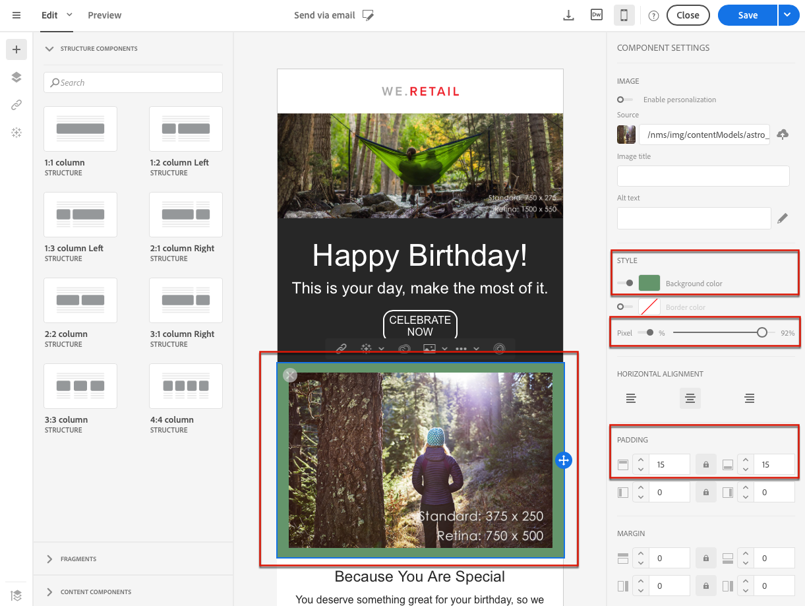

# Onbewerkte tekst, HTML- en mobiele e-mailindelingen {#plain-text-and-html-modes} bewerken

Met de e-mailontwerper kunt u verschillende rendering van uw e-mails bewerken. U kunt een tekstversie van uw e-mail genereren, de HTML-bron van een e-mail bewerken en e-mails ontwerpen voor de mobiele weergave.

## Een tekstversie van de e-mail genereren {#generating-a-text-version-of-the-email}

Standaard wordt de **[!UICONTROL Plain text]**-versie van uw e-mail automatisch gegenereerd en gesynchroniseerd met de **[!UICONTROL Edit]**-versie.

De gebieden van de aanpassing en inhoudsblokken die aan de versie van HTML worden toegevoegd worden ook gesynchroniseerd met de gewone tekstversie.

>[!NOTE]
>
>Als u inhoudsblokken in de versie zonder opmaak wilt gebruiken, moet u ervoor zorgen dat ze geen HTML-code bevatten.

Als u een versie met normale tekst wilt hebben die afwijkt van de HTML-versie, kunt u deze synchronisatie uitschakelen door te klikken op de **[!UICONTROL Sync with HTML]**-schakelaar in de weergave **[!UICONTROL Plain text]** van uw e-mail.

Vervolgens kunt u de versie zonder tekst naar wens bewerken.

>[!NOTE]
>
>Als u de **[!UICONTROL Plain text]**-versie bewerkt terwijl synchronisatie is uitgeschakeld, worden alle wijzigingen die u hebt aangebracht in de versie zonder opmaak vervangen door de HTML-versie wanneer u de optie **[!UICONTROL Sync with HTML]** weer inschakelt. De wijzigingen die zijn aangebracht in de weergave **[!UICONTROL Plain text]** kunnen niet worden weerspiegeld in de weergave **[!UICONTROL HTML]**.

## Een e-mailinhoudsbron bewerken in HTML {#editing-an-email-content-source-in-html}

Voor de meest geavanceerde gebruikers en foutopsporing kunt u de e-mailinhoud rechtstreeks in HTML weergeven en bewerken.

U kunt de HTML-versie van de e-mail op twee manieren bewerken:

* Selecteer **[!UICONTROL Edit]** > **[!UICONTROL HTML]** om de HTML-versie van het volledige e-mailbericht te openen.

   

* Van de interface WYSIWYG, selecteer een element en klik **[!UICONTROL Source code]** pictogram.

   Alleen de bron van het geselecteerde element wordt weergegeven. U kunt de broncode bewerken als het geselecteerde element een inhoudscomponent **[!UICONTROL HTML]** is. Andere componenten bevinden zich in de modus Alleen-lezen, maar kunnen nog steeds worden bewerkt in de volledige HTML-versie van de e-mail.

   

Als u de HTML-code wijzigt, kan de reactiesnelheid van de e-mail worden verbroken. Zorg ervoor dat u het bestand test met de knop **[!UICONTROL Preview]**. Zie [Berichten voorvertonen](../../sending/using/previewing-messages.md).

## E-mails ontwerpen voor mobiele rendering {#switching-to-mobile-view}

U kunt het responsieve ontwerp van een e-mail perfectioneren door alle stijlopties voor mobiele weergave afzonderlijk te bewerken. U kunt bijvoorbeeld marges en opvulling aanpassen, kleinere of grotere lettergrootten gebruiken, knoppen wijzigen of andere achtergrondkleuren toepassen die specifiek zijn voor de mobiele versie van uw e-mail.

Alle stijlopties zijn beschikbaar in de mobiele weergave. De e-mailDesigner-stijlinstellingen worden eerder op deze pagina weergegeven.

1. Maak een e-mail en begin met het bewerken van de inhoud. Zie [Een geheel nieuwe e-mailinhoud ontwerpen](../../designing/using/designing-from-scratch.md#designing-an-email-content-from-scratch) voor meer informatie.
1. Als u de toegewezen mobiele weergave wilt openen, selecteert u de knop **[!UICONTROL Switch to mobile view]**.

   

   De mobiele versie van het e-mailbericht wordt weergegeven. Het bevat alle componenten en stijlen die in Desktopmening werden bepaald.

1. Alle stijlinstellingen zoals achtergrondkleur, uitlijning, opvulling, marge, lettertypefamilie, tekstkleur enzovoort onafhankelijk bewerken.

   

1. Wanneer u een stijlinstelling bewerkt in de mobiele weergave, worden de wijzigingen alleen toegepast op de mobiele weergave.

   Verklein bijvoorbeeld de grootte van een afbeelding, voeg een groene achtergrond toe en wijzig de opvulling in de mobiele weergave.

   

1. U kunt een component verbergen wanneer deze op een mobiel apparaat wordt weergegeven. Selecteer **[!UICONTROL Show only on desktop devices]** in **[!UICONTROL Display options]** om dit te doen.

   U kunt deze component ook verbergen op bureaubladapparaten, wat betekent dat deze alleen op mobiele apparaten wordt weergegeven. Selecteer **[!UICONTROL Show only on mobile devices]** om dit te doen.

   Met deze optie kunt u bijvoorbeeld een specifieke afbeelding op mobiele apparaten en een andere afbeelding op desktopapparaten weergeven.

   U kunt deze optie instellen in de weergave Mobiel of Desktop.

   

1. Klik nogmaals op de knop **[!UICONTROL Switch to mobile view]** om terug te gaan naar de standaardweergave op het bureaublad. De wijzigingen die u zojuist hebt aangebracht in de stijl worden niet doorgevoerd.

   

   >[!NOTE]
   >
   >De enige uitzondering hierop zijn de **[!UICONTROL Style inline]**-instellingen. Elke wijziging in de inline-instelling van de stijl wordt ook toegepast op de standaardweergave op het bureaublad.

1. Eventuele andere wijzigingen in de structuur of de inhoud van de e-mail, zoals tekstbewerkingen, het uploaden van een nieuwe afbeelding, het toevoegen van een nieuwe component, enz. wordt ook toegepast op de standaardweergave.

   Ga bijvoorbeeld terug naar de mobiele weergave, bewerk wat tekst en vervang een afbeelding.

   

1. Klik nogmaals op de knop **[!UICONTROL Switch to mobile view]** om terug te gaan naar de standaardweergave op het bureaublad. De wijzigingen worden weerspiegeld.

   

1. Als u een stijl verwijdert in de mobiele weergave, keert u terug naar de stijl die is toegepast in de bureaubladmodus.

   Pas in de mobiele weergave bijvoorbeeld een groene achtergrondkleur toe op een knop.

   

1. Schakel over naar de bureaubladweergave en pas een grijze achtergrond toe op dezelfde knop.

   

1. Schakel opnieuw over naar de mobiele weergave en schakel nu de instelling **[!UICONTROL Background color]** uit.

   

   De achtergrondkleur die is gedefinieerd in de bureaubladweergave wordt nu toegepast: wordt grijs (niet leeg).

   De enige uitzondering is de instelling **[!UICONTROL Border color]**. Wanneer deze optie is uitgeschakeld in de mobiele weergave, wordt er geen rand meer toegepast, zelfs niet wanneer een randkleur is gedefinieerd in de desktopweergave.

>[!NOTE]
>
>De mobiele weergave is niet beschikbaar in [fragmenten](../../designing/using/using-reusable-content.md#about-fragments).
