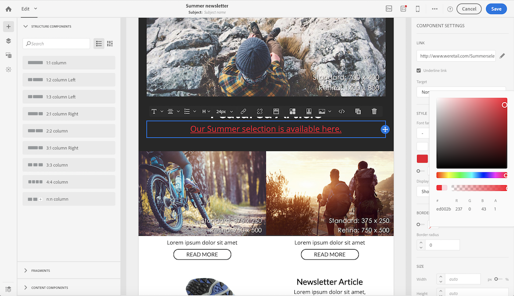

# E-mailstijlen beheren {#managing-styles}

Als u in het venster E-mail Designer een element selecteert, worden in het deelvenster **[!UICONTROL Settings]** verschillende opties weergegeven die specifiek zijn voor het type inhoud dat is geselecteerd. U kunt deze opties gebruiken om de stijl van uw e-mail gemakkelijk te veranderen.

## Een element selecteren {#selecting-an-element}

Als u een element wilt selecteren in de e-mailinterface van Designer, kunt u:

* klik rechtstreeks in de e-mail,
* of doorblader de boomstructuur beschikbaar van de opties die in het linker{**worden gevestigd 0} Palet.**

Door in de boomstructuur te bladeren, kunt u een nauwkeurigere selectie maken. U kunt kiezen uit:

* de volledige structuurcomponent,
* een van de kolommen waaruit de structuurcomponent bestaat,
* of alleen een component die zich in een kolom bevindt.

Als u een kolom wilt selecteren, kunt u ook het volgende doen:

1. Selecteer een structuurcomponent (direct in e-mail of gebruikend de boomstructuur beschikbaar van het linker **Palet**).
1. Van de **contextafhankelijke toolbar**, klik **[!UICONTROL Select a column]** om de gewenste kolom te kiezen.

Zie een voorbeeld in [ deze sectie ](#example--adjusting-vertical-alignment-and-padding).

## Stijlinstellingen aanpassen {#adjusting-style-settings}

1. Selecteer een element in uw e-mail. Voor meer op dit, zie [ Selecterend een element ](#selecting-an-element).
1. Pas de instellingen naar wens aan. Elk geselecteerd element heeft een andere set instellingen.

   U kunt achtergronden opnemen, grootte veranderen, horizontale of verticale groepering wijzigen, kleuren beheren, [ opvullen of marge ](#selecting-an-element) toevoegen, etc.

   Om dit te doen, gebruik de opties die in de **[!UICONTROL Settings]** ruit worden getoond of [ voeg gealigneerde het stileren attributen ](#adding-inline-styling-attributes) toe.

   

1. Sla uw inhoud op.

## Opvulling en marge aanpassen {#about-padding-and-margin}

Met de e-mailinterface van Designer kunt u snel opvulling- en marge-instellingen aanpassen.

**[!UICONTROL Padding]**: met deze instelling kunt u de ruimte beheren die zich binnen de rand van een element bevindt.

Bijvoorbeeld:

* Gebruik opvulling om marges in te stellen aan de linker- en rechterzijde van een afbeelding.
* Gebruik opvulling boven en onder om meer ruimte toe te voegen aan een **[!UICONTROL Text]** - of **[!UICONTROL Divider]** -component.
* Als u randen tussen kolommen in een structuurelement wilt instellen, definieert u de opvulling voor elke kolom.

**[!UICONTROL Margin]**: met deze instelling kunt u de ruimte tussen de rand van het element en het volgende element beheren.

>[!NOTE]
>
>Afhankelijk van uw selectie (structuurcomponent, kolom of inhoudscomponent), is het resultaat niet hetzelfde. Adobe raadt u aan de parameters **[!UICONTROL Padding]** en **[!UICONTROL Margin]** op kolomniveau in te stellen.

Voor zowel **[!UICONTROL Padding]** als **[!UICONTROL Margin]** klikt u op het vergrendelingspictogram om de synchronisatie tussen de boven- en onder- of rechterparameter en de linkerparameter te verbreken. Hierdoor kunt u elke parameter afzonderlijk aanpassen.

## Stijluitlijning {#about-alignment}

* **de groepering van de Tekst**: plaats de curseur van uw muis op één of andere tekst en gebruik de contextafhankelijke toolbar om het te richten.

  

* **Horizontale groepering** kan op tekst, beelden en knopen - momenteel niet op **[!UICONTROL Divider]** en **[!UICONTROL Social]** componenten worden toegepast.

  

* Om **verticale groepering** te plaatsen, selecteer een kolom binnen een structuurcomponent en kies een optie van de ruit van Montages.

  

## Achtergronden instellen {#about-backgrounds}

>[!CONTEXTUALHELP]
>id="ac_edition_backgroundimage"
>title="Achtergrondinstellingen"
>abstract="Met de E-mail Designer kunt u de achtergrondkleur of achtergrondafbeelding voor uw content aanpassen. Houd er rekening mee dat achtergrondafbeeldingen niet door alle e-mailclients worden ondersteund."

Adobe raadt het volgende aan als het gaat om het instellen van achtergronden voor de e-mailtoepassing Designer:

1. Pas een achtergrondkleur toe op de tekst van uw e-mail, indien dat door uw ontwerp wordt vereist.
1. In de meeste gevallen stelt u achtergrondkleuren in op kolomniveau.
1. Probeer geen achtergrondkleuren te gebruiken voor afbeeldings- of tekstcomponenten, omdat deze moeilijk te beheren zijn.

Hieronder vindt u de beschikbare achtergrondinstellingen die u kunt gebruiken.

* Stel een **[!UICONTROL Background color]** in voor de hele e-mail. Selecteer de instellingen voor de hoofdtekst in de boomstructuur die toegankelijk is in het linkerpalet.

  

* Stel dezelfde achtergrondkleur in voor alle structuurcomponenten door **[!UICONTROL Viewport background color]** te selecteren. Met deze optie kunt u een andere instelling selecteren dan de achtergrondkleur.

  

* Stel een andere achtergrondkleur in voor elke structuurcomponent. Selecteer een structuur in de boomstructuur die toegankelijk is vanuit het linkerpalet als u alleen een specifieke achtergrondkleur op die structuur wilt toepassen.

  

  Zorg ervoor dat u geen achtergrondkleur voor de viewport instelt, omdat hierdoor de achtergrondkleuren van de structuur kunnen worden verborgen.

* Stel een **[!UICONTROL Background image]** in voor de inhoud van een structuurcomponent.

  

  >[!NOTE]
  >
  >Sommige e-mailprogramma&#39;s ondersteunen achtergrondafbeeldingen niet. Als deze optie niet wordt ondersteund, wordt in plaats daarvan de achtergrondkleur van de rij gebruikt. Selecteer de gewenste achtergrondkleur voor fallback als de afbeelding niet kan worden weergegeven.

* Stel een achtergrondkleur in op kolomniveau.

  

  >[!NOTE]
  >
  >Dit is het meest gebruikte geval. Adobe raadt aan achtergrondkleuren in te stellen op kolomniveau, omdat dit meer flexibiliteit biedt bij het bewerken van de volledige e-mailinhoud.

  U kunt ook een achtergrondafbeelding instellen op kolomniveau, maar dit wordt zelden gebruikt.

### Voorbeeld: verticale uitlijning en opvulling aanpassen {#example--adjusting-vertical-alignment-and-padding}

U wilt de opvulling en de verticale uitlijning aanpassen binnen een structuurcomponent die uit drie kolommen bestaat. Hiervoor voert u de volgende stappen uit:

1. Selecteer rechtstreeks de structuurcomponent in e-mail of gebruikend de boomstructuur beschikbaar van het linker **Palet**.
1. Van de **contextafhankelijke toolbar**, klik **[!UICONTROL Select a column]** en kies één die u wilt uitgeven. U kunt deze ook selecteren in de boomstructuur.

   

   De bewerkbare parameters voor die kolom worden weergegeven in het deelvenster **[!UICONTROL Settings]** aan de rechterkant.

1. Selecteer onder **[!UICONTROL Vertical alignment]** de optie **[!UICONTROL Up]** .

   

   De inhoudcomponent wordt vóór de kolom weergegeven.

1. Definieer onder **[!UICONTROL Padding]** de opvulling boven in de kolom. Klik op het vergrendelingspictogram om de synchronisatie met de onderste opvulling te verbreken.

   Definieer de linker- en rechteropvulling voor die kolom.

   

1. Ga op dezelfde manier te werk om de uitlijning en opvulling van de andere kolommen aan te passen.

   

1. Sla uw wijzigingen op.

## Koppelingen opmaken {#about-styling-links}

U kunt een koppeling onderstrepen en de kleur en het doel ervan selecteren in de e-mailtoepassing van de Designer.

1. In een component waar een verbinding wordt opgenomen, selecteer de etikettekst van uw verbinding.

1. In de componentinstellingen schakelt u **[!UICONTROL Underline link]** in om de labeltekst van de koppeling te onderstrepen.

   

1. Selecteer een **[!UICONTROL Target]** als u wilt selecteren in welke browsercontext de koppeling wordt geopend.

   

1. Klik op **[!UICONTROL Link color]** om de kleur van de koppeling te wijzigen.

   

1. Kies de gewenste kleur.

   

1. Sla uw wijzigingen op.

## Inline-opmaakkenmerken toevoegen {#adding-inline-styling-attributes}

Wanneer u in de interface E-mail-Designer een element selecteert en de bijbehorende instellingen in het zijpaneel weergeeft, kunt u de inline-kenmerken en de bijbehorende waarde voor dat specifieke element aanpassen.

1. Selecteer een element in de inhoud.
1. Zoek in het zijpaneel naar de **[!UICONTROL Styles Inline]** -instellingen.

   

1. Wijzig de waarden van de bestaande kenmerken of voeg nieuwe toe met de knop **+** . U kunt alle kenmerken en waarden toevoegen die CSS-compatibel zijn.

De stijl wordt vervolgens toegepast op het geselecteerde element. Als voor de onderliggende elementen geen specifieke stijlkenmerken zijn gedefinieerd, wordt de opmaak van het bovenliggende element overgeërfd.
