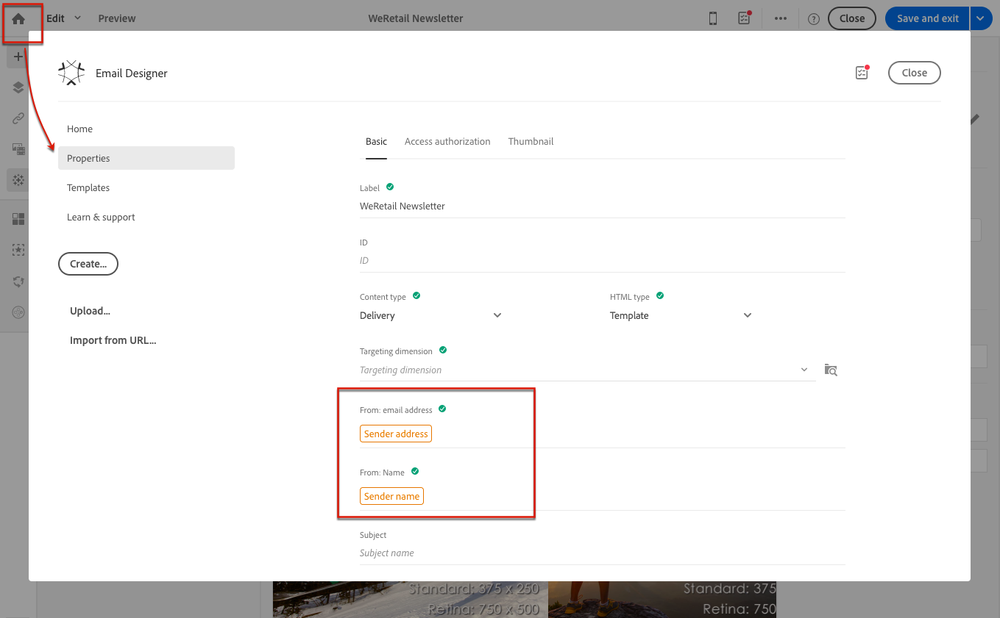

# De onderwerpregel en de afzender van een e-mailbericht definiëren{#defining-the-subject-line-of-an-email}

## De onderwerpregel van een e-mailbericht {#subject-line} definiëren

Het bericht is verplicht om het bericht voor te bereiden en te verzenden.

>[!NOTE]
>
>Als de onderwerpregel leeg is, wordt een waarschuwing weergegeven op het berichtdashboard en in de e-mailontwerper.

1. Een e-mail maken.
1. Ga naar het tabblad **[!UICONTROL Properties]** van de introductiepagina E-mail Designer (toegankelijk via het introductiepictogram).
1. Vul de sectie **[!UICONTROL Subject]** in.

   

1. U kunt ook aanpassingsvelden, inhoudsblokken en dynamische inhoud toevoegen aan de onderwerpregel door op de corresponderende pictogrammen te klikken. Zie [Personalisatie](../../designing/using/personalization.md) voor meer informatie.

## De e-mailafzender van een e-mailbericht definiëren {#email-sender}

Als u de naam wilt definiëren van de afzender die wordt weergegeven in de koptekst van de verzonden berichten, gaat u naar het tabblad **[!UICONTROL Properties]** van de startpagina van E-mailontwerper (toegankelijk via het pictogram Home).

* In het veld **[!UICONTROL From: name]** kunt u de naam van de afzender invoeren. Standaard wordt het standaardblok **Naam afzender** automatisch in het veld ingevoerd. Het standaard e-mailadres en de naam van de afzender worden gedefinieerd in **[!UICONTROL Brands]** toegankelijk via het Adobe Campaign-logo onder het geavanceerde menu **[!UICONTROL Administration > Instance settings > Brand configuration]**.

   U kunt de afzendernaam wijzigen door op het blok **Naam afzender** te klikken. Het veld wordt bewerkbaar en u kunt de naam invoeren die u wilt gebruiken.

   U kunt dit veld aanpassen. Hiervoor kunt u aanpassingsvelden, inhoudsblokken en dynamische inhoud toevoegen door op de pictogrammen onder de naam van de afzender te klikken. Zie [Personalisatie](../../designing/using/personalization.md) voor meer informatie.

* Het veld **[!UICONTROL From: email address]** kan niet vanuit deze sectie worden bewerkt. U kunt dit wijzigen door de eigenschappen van de e-mail te bewerken vanaf het dashboard. Zie [Lijst met geavanceerde e-mailparameters](../../administration/using/configuring-email-channel.md#advanced-parameters) voor meer informatie.

>[!NOTE]
>
>De headerparameters mogen niet leeg zijn. Het adres van de afzender is verplicht om een e-mailbericht toe te staan (norm RFC). Adobe Campaign controleert de syntaxis van de ingevoerde e-mailadressen.

**Verwante onderwerpen:**

* [Een personalisatieveld invoegen](../../designing/using/personalization.md#inserting-a-personalization-field)
* [Een inhoudsblok toevoegen](../../designing/using/personalization.md#adding-a-content-block)
* [Dynamische inhoud in een e-mail definiëren](../../designing/using/personalization.md#defining-dynamic-content-in-an-email)
