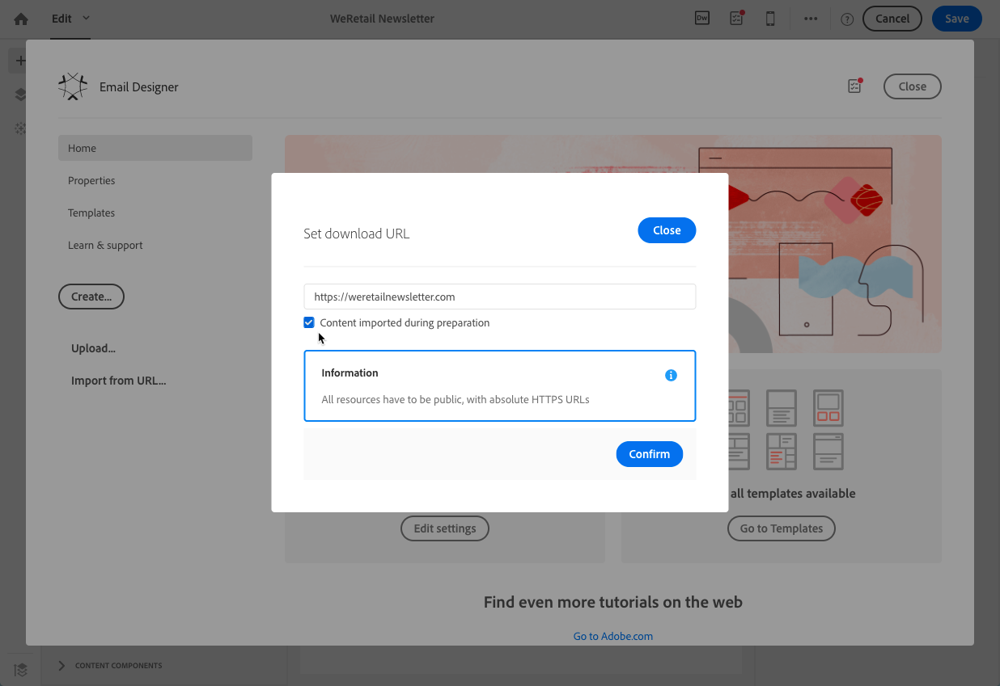

# Ontwerpen met bestaande inhoud {#designing-using-existing-content}

## Selecting an existing content{#selecting-an-existing-content}

Adobe Campaign wordt geleverd met een set vooraf gedefinieerde inhoud die u helpt aan de slag te gaan. U kunt een van deze opties gebruiken. Als de inhoud van het bericht dat u wilt verzenden, buiten Adobe Campaign wordt voorbereid, kunt u het vanuit uw computer of een URL importeren.

Wanneer u een e-mail- of landingspagina maakt, kunt u desgewenst bestaande inhoud uit een andere bron laden.

>[!NOTE]
>
>In de onderstaande afbeeldingen ziet u hoe u bestaande inhoud laadt met de [e-mailontwerper](../../designing/using/designing-content-in-adobe-campaign.md).

1. Open na het maken van de e-mail- of landingspagina de inhoud ervan.
1. Klik op het pictogram Home om de **[!UICONTROL Email Designer]** startpagina te openen.

   

1. Selecteer de bron van de inhoud die u wilt laden:

   * [Inhoudssjablonen](../../designing/using/using-reusable-content.md#content-templates): Klik op het **[!UICONTROL Templates]** tabblad.
   * [Inhoud helemaal vanaf](../../designing/using/designing-from-scratch.md#designing-an-email-content-from-scratch)het begin tot vers: Klik op de **[!UICONTROL Create]** knop.
   * [Inhoud van uw computer als een ZIP- of HTML-bestand](#importing-content-from-a-file): Klik op de **[!UICONTROL Upload]** knop.
   * [Inhoud van een bestaande URL](#importing-content-from-a-url) (alleen voor e-mails): Klik op de **[!UICONTROL Import from URL]** knop.

   

1. Laad de inhoud. De geselecteerde inhoud vervangt de huidige inhoud.

   Nadat de inhoud is geïmporteerd, kan deze worden bewerkt en gepersonaliseerd.

   >[!NOTE]
   >
   >In de [e-mailontwerper](../../designing/using/designing-content-in-adobe-campaign.md) wordt specifieke codering gebruikt. Standaard HTML-inhoud die naar Campagne is geüpload, moet overeenkomen met de verwachte codering om volledig compatibel te zijn met en te kunnen worden bewerkt vanuit de e-mailontwerper. Als de inhoud niet overeenkomt, wordt de inhoud geüpload in de [compatibiliteitsmodus](#compatibility-mode). Zie [deze sectie](#editing-existing-contents-with-the-email-designer)als u bestaande inhoud compatibel wilt maken.

**Verwante onderwerpen:**

* [Een e-mail maken](../../channels/using/creating-an-email.md)
* [Landingspagina&#39;s beheren](../../channels/using/getting-started-with-landing-pages.md)

## Bestaande inhoud bewerken met de e-mailontwerper{#editing-existing-contents-with-the-email-designer}

Als u de versiemogelijkheden van de [e-mailontwerper](../../designing/using/designing-content-in-adobe-campaign.md)volledig wilt benutten, moet de geüploade HTML specifieke tags bevatten die ervoor zorgen dat deze compatibel is met de WYSIWYG-editor.

Als de HTML deze codering geheel of gedeeltelijk niet heeft, wordt de inhoud geladen in de [compatibiliteitsmodus](#compatibility-mode).

Als u een bestaande externe inhoud volledig bewerkbaar wilt maken in de e-mailontwerper, raadpleegt u de sectie Een e-mail [ontwerpen met bestaande inhoud](../../designing/using/using-existing-content.md) .

## Bestaande e-mailinhoud importeren {#importing}

### Importing content from a file {#importing-content-from-a-file}

Klik op de introductiepagina E-mail Designer op de **[!UICONTROL Upload]** knop om een bestand van uw computer te uploaden en bevestig het vervolgens.

Er zijn geen beperkingen op de ZIP-bestandsstructuur. Verwijzen naar HTML-bestanden moet echter relatief zijn en de boomstructuur van de ZIP-map respecteren.

De volgende indelingen worden ondersteund voor importeren:

* Een HTML-bestand met een opgenomen stijlblad
* Een ZIP-map met het HTML-bestand, de stijlpagina (.CSS) en de afbeeldingen

>[!NOTE]
>
>Voor e-mailinhoud raden we u aan om afzonderlijke HTML-bestanden met een opgenomen stijlpagina te importeren.

#### Importing content from a URL {#importing-content-from-a-url}

Voordat u inhoud van een URL importeert, moet u controleren of aan de onderstaande vereisten wordt voldaan:

* De inhoud moet openbaar zijn via deze URL.
* Om veiligheidsredenen zijn alleen URL&#39;s toegestaan die beginnen met **[!UICONTROL https]** .
* Zorg ervoor dat alle bronnen (afbeeldingen, CSS) zijn ingesteld in absolute koppelingen en in HTTPS. Anders wordt de spiegel na het verzenden van de e-mail weergegeven zonder de bijbehorende bronnen. Hier volgt een voorbeeld van een absolute koppelingsdefinitie:

   ```
   <a href="https://www.mywebsite.com/images/myimage.png">
   ```

>[!NOTE]
>
>Inhoud van een URL laden is alleen beschikbaar voor het e-mailkanaal.

Ga als volgt te werk om bestaande inhoud van een URL op te halen:

1. Selecteer de **[!UICONTROL Import from URL]** knop op de introductiepagina E-mail Designer.

   

1. Definieer de URL waarvan de inhoud wordt opgehaald.
1. Klik op **[!UICONTROL Confirm]**.

**Verwant onderwerp:**

[Inhoud importeren vanuit een URL](https://docs.adobe.com/content/help/en/campaign-learn/campaign-standard-tutorials/designing-content/email-designer/email-designer-overview.html#Workingwithexistingcontent) -video

### Inhoud automatisch ophalen van een URL tijdens het voorbereiden {#retrieving-content-from-a-url-automatically-at-preparation-time}

Wanneer u inhoud importeert vanaf een URL tijdens het voorbereiden van berichten, kunt u telkens wanneer de e-mail wordt voorbereid, de meest recente HTML-inhoud ophalen. Op die manier is de inhoud van terugkerende e-mails altijd up-to-date op het moment van verzending. Met deze functie kunt u ook een bericht maken dat op een bepaalde datum is gepland, zelfs als de inhoud nog niet gereed is.

Volg onderstaande stappen om inhoud op te halen tijdens het voorbereiden:

1. Selecteer de **[!UICONTROL Content imported during preparation]** optie.

   

1. De inhoud URL wordt in de editor weergegeven als alleen-lezen.

   >[!CAUTION]
   >
   >Bij deze stap moet geen rekening worden gehouden met de HTML-weergave in de inhoudseditor. Het zal in de voorbereidingsfase worden opgehaald.

1. Als u een voorvertoning wilt weergeven van de URL-inhoud die is opgehaald, opent u het bericht nadat u het hebt gemaakt en klikt u op de **[!UICONTROL Preview]** knop.

Het is mogelijk om de externe URL te personaliseren waarvan de inhoud wordt opgehaald. Volg de onderstaande stappen om dit te doen:

1. Klik op het e-maillabel boven aan het scherm om het **[!UICONTROL Properties]** tabblad E-mailontwerper te openen.
1. Zoek het **[!UICONTROL Remote URL]** veld.

   

1. Voeg het gewenste verpersoonlijkingsveld, inhoudsblok of dynamische tekst in.

   Met het **[!UICONTROL Current date - YYYYMMDD]** inhoudsblok kunt u bijvoorbeeld de datum van de dag invoegen.

   >[!NOTE]
   >
   >De beschikbare verpersoonlijkingsvelden zijn alleen gekoppeld aan **leveringskenmerken** (aanmaakdatum van e-mail, status, campagnelabel...).

### Compatibiliteitsmodus {#compatibility-mode}

Wanneer u inhoud uploadt, moet deze specifieke codering bevatten om volledig compatibel te zijn met en te kunnen worden bewerkt met de WYSIWYG-editor van de e-mailontwerper.

Als de geüploade HTML geheel of gedeeltelijk niet voldoet aan de verwachte codering, wordt de inhoud vervolgens geladen in de &#39;compatibiliteitsmodus&#39;, die de versiemogelijkheden beperkt via de gebruikersinterface.

Wanneer inhoud wordt geladen in de compatibiliteitsmodus, kunt u nog steeds de volgende wijzigingen uitvoeren via de interface (niet-beschikbare acties worden verborgen):

* De tekst wijzigen of een afbeelding wijzigen
* Koppelingen en aanpassingsvelden invoegen
* Enkele opmaakopties voor het geselecteerde HTML-blok bewerken
* Voorwaardelijke inhoud definiëren


Andere wijzigingen, zoals het toevoegen van nieuwe secties aan uw e-mail of geavanceerde opmaak, moeten rechtstreeks in de broncode van de e-mail worden uitgevoerd via de HTML-modus.

Zie [deze sectie](../../designing/using/using-existing-content.md)voor meer informatie over het converteren van een bestaande e-mail naar een e-mail die compatibel is met e-mail die compatibel is met e-mail met Designer.

**Verwant onderwerp**:

* [Een e-mail maken](../../channels/using/creating-an-email.md)
* [Introductievideo over e-mailontwerper](https://video.tv.adobe.com/v/22771/?autoplay=true&hidetitle=true&captions=dut)
* [Een geheel nieuwe e-mailinhoud ontwerpen](../../designing/using/designing-from-scratch.md#designing-an-email-content-from-scratch)

## HTML-inhoud converteren {#converting-an-html-content}

Als u een raamwerk van modulaire sjablonen en fragmenten wilt maken die u kunt combineren voor hergebruik in meerdere e-mails, kunt u uw e-mailHTML converteren naar een sjabloon voor e-mailontwerpen.

Met deze kwestie kunt u HTML-e-mail snel converteren naar onderdelen van E-mailontwerper.

>[!CAUTION]
>
>Deze sectie is bedoeld voor geavanceerde gebruikers die vertrouwd zijn met HTML-code.

>[!NOTE]
>
>Net als in de compatibiliteitsmodus kan een HTML-component met beperkte opties worden bewerkt: u kunt alleen op plaats een editie uitvoeren.

Buiten de e-mailontwerper, zorg ervoor originele HTML in herbruikbare secties wordt verdeeld.

Als dit niet het geval is, snijd de verschillende blokken van uw HTML uit. Bijvoorbeeld:

```
<!-- 3 COLUMN w/CTA (SCALED) -->
<table width="100%" align="center" cellspacing="0" cellpadding="0" border="0" role="presentation" style="max-width:680px;">
<tbody>
<tr>
<td class="padh10" align="center" valign="top" style="padding:0 5px 20px 5px;">
<table width="100%" cellspacing="0" cellpadding="0" border="0" role="presentation">
<tbody>
<tr>
...
</tr>
</tbody>
</table>
</td>
</tr>
</tbody>
</table>
<!-- //3 COLUMN w/CTA (SCALED) -->
```

Herhaal de volgende procedure voor elk gedeelte van uw bestaande e-mailbericht nadat u al uw blokken hebt geïdentificeerd:

1. Open de E-mailontwerper om een lege e-mailinhoud te maken.
1. Stel de kenmerken voor het hoofdtekstniveau in: achtergrondkleuren, breedte, enz. Ga voor meer informatie naar [E-mailstijlen bewerken](../../designing/using/styles.md).
1. Voeg een structuurcomponent toe. Ga voor meer informatie naar [De e-mailstructuur bewerken](../../designing/using/designing-from-scratch.md#defining-the-email-structure).
1. Voeg een HTML-component toe. Ga voor meer informatie naar [Fragmenten en componenten toevoegen](../../designing/using/designing-from-scratch.md#defining-the-email-structure).
1. Kopieer en plak de HTML in die component.
1. Schakel over naar de mobiele weergave. Zie [deze sectie](../../designing/using/plain-text-html-modes.md#switching-to-mobile-view)voor meer informatie.

   De responsieve weergave is verbroken, omdat uw CSS ontbreekt.

1. U kunt dit corrigeren door over te schakelen naar de modus Broncode en de stijlsectie te kopiëren en te plakken in een nieuwe stijlsectie. Bijvoorbeeld:

   ```
   <style type="text/css">
   a {text-decoration:none;}
   body {min-width:100% !important; margin:0 auto !important; padding:0 !important;}
   img {line-height:100%; text-decoration:none; -ms-interpolation-mode:bicubic;}
   ...
   </style>
   ```

   >[!NOTE]
   >
   >Voeg vervolgens de stijl in een andere aangepaste stijltag toe.
   >
   >Wijzig de CSS die is gegenereerd door de e-mailontwerper niet:
   >
   >* `<style data-name="default" type="text/css">(##)</style>`
   >* `<style data-name="supportIOS10" type="text/css">(##)</style>`
   >* `<style data-name="mediaIOS8" type="text/css">(##)</style>`
   >* `<style data-name="media-default-max-width-500px" type="text/css">(##)</style>`
   >* `<style data-name="media-default--webkit-min-device-pixel-ratio-0" type="text/css">(##)</style>`


1. Ga terug naar de mobiele weergave om te controleren of uw inhoud correct wordt weergegeven en sla uw wijzigingen op.
