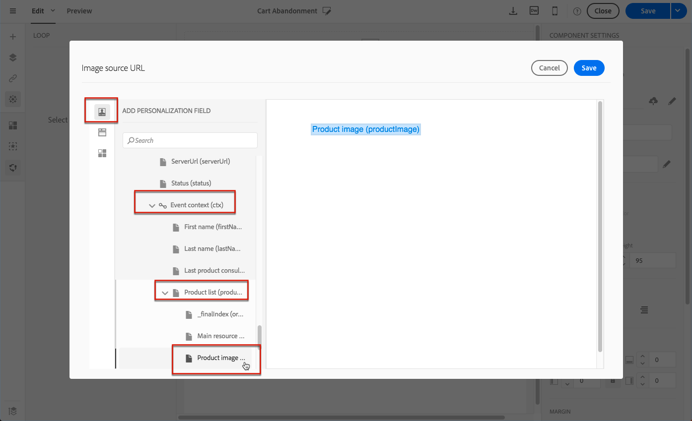
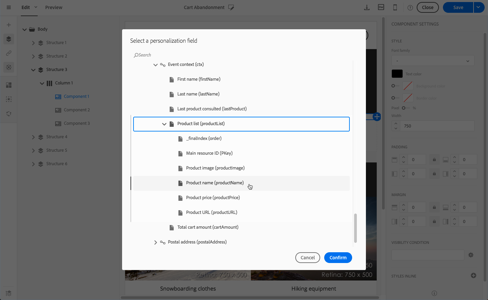

# Productvermeldingen gebruiken in een transactiebericht {#using-product-listings}

>[!IMPORTANT]
>
>Productaanbiedingen zijn alleen beschikbaar voor **transactie-e-mailberichten** via de [e-mailinterface van Designer](../../designing/using/designing-content-in-adobe-campaign.md#email-designer-interface).

Wanneer u de inhoud van een transactie-e-mail bewerkt, kunt u productlijsten maken die verwijzen naar een of meer gegevensverzamelingen. In een e-mailbericht waarin de winkelwagen wordt verlaten, kunt u bijvoorbeeld een lijst opnemen met alle producten die zich in de winkelwagentjes bevonden toen ze uw website verlieten, met een afbeelding, de prijs en een koppeling naar elk product.

Volg de onderstaande stappen om een lijst met achtergelaten producten toe te voegen aan een transactiebericht.

U kunt [deze set video&#39;s ook bekijken](https://experienceleague.adobe.com/docs/campaign-standard-learn/tutorials/designing-content/product-listings-in-transactional-email.html?lang=en#configure-product-listings-in-transactional-emails) waarin de stappen worden uitgelegd die nodig zijn om productlijsten in een transactie-e-mail te configureren.

>[!NOTE]
>
>Adobe Campaign biedt geen ondersteuning voor geneste productvermeldingen. Dit betekent dat u geen productvermeldingen in een andere vermelding kunt opnemen.

## Een productvermelding definiëren {#defining-a-product-listing}

Voordat u een productvermelding in een transactiebericht kunt gebruiken, moet u op gebeurtenisniveau de lijst met producten en de velden definiëren voor elk weer te geven product van de lijst. Ga voor meer informatie naar [Dataverzamelingen definiëren](../../channels/using/configuring-transactional-event.md#defining-data-collections).

1. Klik in het transactiebericht op het blok **[!UICONTROL Content]** om de e-mailcontent te wijzigen.
1. Sleep een structuurcomponent naar de werkruimte. Zie [De e-mailstructuur definiëren](../../designing/using/designing-from-scratch.md#defining-the-email-structure) voor meer informatie.

   Selecteer bijvoorbeeld een structuurcomponent met één kolom en voeg een tekstcomponent, een afbeeldingscomponent en een knopcomponent toe. Zie [Inhoudscomponenten gebruiken](../../designing/using/designing-from-scratch.md#about-content-components) voor meer informatie.

1. Selecteer de net gemaakte structuurcomponent en klik op het pictogram **[!UICONTROL Enable product listing]** op de contextgevoelige werkbalk.

   

   De structuurcomponent wordt met een oranje kader gemarkeerd en de instellingen **[!UICONTROL Product listing]** worden in het linkerpalet getoond.

   

1. Selecteer hoe de elementen van de verzameling worden weergegeven:

   * **[!UICONTROL Row]**: horizontaal, elk element op een rij, onder elkaar.
   * **[!UICONTROL Column]**: verticaal, dat wil zeggen alle elementen naast elkaar op dezelfde rij.

   >[!NOTE]
   >
   >De optie **[!UICONTROL Column]** is alleen beschikbaar als u een structuurcomponent met meerdere kolommen gebruikt (**[!UICONTROL 2:2 column]**, **[!UICONTROL 3:3 column]** en **[!UICONTROL 4:4 column]**). Vul bij het bewerken van de productvermelding alleen de eerste kolom in, want de andere kolommen worden buiten beschouwing gelaten. Zie [De e-mailstructuur definiëren](../../designing/using/designing-from-scratch.md#defining-the-email-structure) voor meer informatie over het selecteren van structuurcomponenten.

1. Selecteer de dataverzameling die u hebt gemaakt toen u de gebeurtenis die betrekking had op het transactiebericht configureerde. De code kunt u vinden onder de node **[!UICONTROL Context]** > **[!UICONTROL Real-time event]** > **[!UICONTROL Event context]**.

   

   Zie [Dataverzamelingen definiëren](../../channels/using/configuring-transactional-event.md#defining-data-collections) voor meer informatie over het configureren van de gebeurtenis.

1. Gebruik de vervolgkeuzelijst **[!UICONTROL First item]** om te selecteren welk element als eerste in de lijst in de e-mail wordt vermeld.

   Als u bijvoorbeeld 2 selecteert, wordt het eerste item van de verzameling niet in de e-mail weergegeven. De productvermelding begint bij het tweede item.

1. Selecteer het maximum aantal items dat in de lijst moet worden weergegeven.

   >[!NOTE]
   >
   >Als u wilt dat de elementen van de lijst verticaal (**[!UICONTROL Column]**) worden weergegeven, dan wordt het maximumaantal items beperkt volgens de geselecteerde structuurcomponent (2, 3 of 4 kolommen). Zie [De e-mailstructuur bewerken](../../designing/using/designing-from-scratch.md#defining-the-email-structure) voor meer informatie over het selecteren van structuurcomponenten.

## De productvermelding invullen {#populating-the-product-listing}

Volg onderstaande stappen om een productvermelding van de gebeurtenis die gekoppeld is aan de transactie-e-mail weer te geven.

Zie [Dataverzamelingen definiëren](../../channels/using/configuring-transactional-event.md#defining-data-collections) voor meer informatie over het maken van een verzameling en gerelateerde velden tijdens het configureren van de gebeurtenis.

1. Selecteer de door u ingevoegde afbeeldingscomponent, selecteer **[!UICONTROL Enable personalization]** en klik op het potlood in het deelvenster Instellingen.

   

1. Selecteer **[!UICONTROL Add personalization field]** in het venster **[!UICONTROL Image source URL]** dat verschijnt.

   Open in de node **[!UICONTROL Context]** > **[!UICONTROL Real-time event]** > **[!UICONTROL Event context]** de node die overeenkomt met de door u gemaakte verzameling (hier **[!UICONTROL Product list]**) en selecteer het door u gedefinieerde afbeeldingsveld (hier **[!UICONTROL Product image]**). Klik op **[!UICONTROL Save]**.

   

   Het door u geselecteerde personalisatieveld wordt nu weergegeven in het deelvenster Instellingen.

1. Op de gewenste positie selecteert u **[!UICONTROL Insert personalization field]** op de contextgevoelige werkbalk.

   

1. Open in de node **[!UICONTROL Context]** > **[!UICONTROL Real-time event]** > **[!UICONTROL Event context]** de node die overeenkomt met de door u gemaakte verzameling (hier **[!UICONTROL Product list]**) en selecteer het door u gemaakte veld (hier **[!UICONTROL Product name]**). Klik op **[!UICONTROL Confirm]**.

   

   Het door u geselecteerde personalisatieveld wordt nu op de gewenste positie in de e-mailcontent weergegeven.

1. Ga op dezelfde manier te werk om de prijs in te voegen.
1. Selecteer eerst wat tekst en selecteer vervolgens **[!UICONTROL Insert link]** op de contextgevoelige werkbalk.

   

1. Selecteer **[!UICONTROL Add personalization field]** in het venster **[!UICONTROL Insert link]** dat verschijnt.

   Open in de node **[!UICONTROL Context]** > **[!UICONTROL Real-time event]** > **[!UICONTROL Event context]** de node die overeenkomt met de door u gemaakte verzameling (hier **[!UICONTROL Product list]**) en selecteer het door u gemaakte URL-veld (hier **[!UICONTROL Product URL]**). Klik op **[!UICONTROL Save]**.

   >[!IMPORTANT]
   >
   >Uit veiligheidsoverwegingen dient u ervoor te zorgen dat u het personalisatieveld invoegt in een koppeling die met een correcte statische domeinnaam begint.

   

   Het door u geselecteerde personalisatieveld wordt nu weergegeven in het deelvenster Instellingen.

1. Selecteer de structuurcomponent waarop de productvermelding wordt toegepast en selecteer **[!UICONTROL Show fallback]** om standaardcontent te definiëren.

   

1. Sleep een of meer contentcomponenten en bewerk deze indien noodzakelijk.

   

   De fallback-content wordt weergegeven als de verzameling tijdens het activeren van de gebeurtenis leeg is, bijvoorbeeld als een klant niets in zijn winkelwagen heeft.

1. Bewerk de stijlen voor de productvermelding in het deelvenster Instellingen. Zie [E-mailstijlen beheren](../../designing/using/styles.md) voor meer informatie.
1. Toon een voorbeeld van de e-mail met een testprofiel dat is gekoppeld aan de relevante transactiegebeurtenis en waarvoor u verzamelingsdata hebt gedefinieerd. Voeg bijvoorbeeld de volgende informatie toe aan de sectie **[!UICONTROL Event data]** voor het testprofiel dat u wilt gebruiken:

   

   Ga voor meer informatie over het definiëren van een testprofiel in een transactiebericht naar [deze sectie](../../channels/using/testing-transactional-message.md#defining-specific-test-profile).
