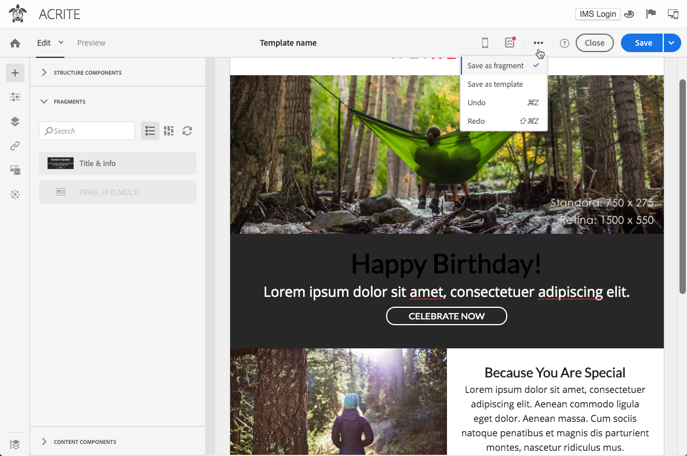

# Herbruikbare inhoud maken en gebruiken {#using-reusable-content}

Leer hoe u e-mailinhoud kunt master. Met E-mailontwerper kunt u sjablonen en fragmenten maken met uw eigen vooraf gedefinieerde inhoud en deze opnieuw gebruiken voor de volgende leveringen.

## E-mailberichten ontwerpen met behulp van sjablonen {#designing-templates}

>[!NOTE]
>
> In Adobe Campaign Standard kunt u verschillende typen sjablonen maken die u kunt openen via het menu **Bronnen** > **Sjablonen** . De sjablonen die worden gebruikt in de e-mailontwerper zijn inhoudssjablonen. Zie [Over sjablonen](../../start/using/marketing-activity-templates.md)voor meer informatie.

### Over inhoudssjablonen {#content-templates}

U kunt HTML-inhoud beheren die wordt aangeboden op het **[!UICONTROL Templates]** tabblad van de [introductiepagina van E-](../../designing/using/designing-content-in-adobe-campaign.md) mailontwerper.

De sjablonen voor e-mailinhoud die niet in de verpakking staan, bevatten achttien voor mobiele apparaten geoptimaliseerde lay-outs en vier best-in-class responsieve sjablonen die door Behance-artiesten zijn ontworpen. Ze komen overeen met de meest recente toepassingen, zoals welkomstberichten van klanten, nieuwsbrieven en e-mails over opnieuw contact. Ze kunnen eenvoudig worden aangepast met de inhoud van uw merk, zodat u gemakkelijk geheel nieuwe e-mails kunt ontwerpen.

De HTML-inhoudssjablonen zijn toegankelijk via het scherm **[!UICONTROL Resources]** > **[!UICONTROL Content templates & fragments]** van het menu Geavanceerd. Vanaf dat punt kunt u sjablonen voor het plaatsen van pagina-inhoud, sjablonen voor e-mailinhoud en ook fragmenten beheren.

De out-of-the-box inhoudssjablonen zijn alleen-lezen. Als u een van deze sjablonen wilt bewerken, moet u eerst de gewenste sjabloon dupliceren.

U kunt nieuwe sjablonen of fragmenten maken en uw eigen inhoud definiëren. Zie Een inhoudssjabloon  maken en een inhoudsfragment maken voor meer informatie.

Wanneer u inhoud bewerkt met de e-mailontwerper, kunt u ook inhoudssjablonen maken door de inhoud op te slaan als fragment of sjabloon. Zie Inhoud [opslaan als sjabloon](#saving-content-as-template) en Inhoud [opslaan als fragment](../../designing/using/using-reusable-content.md#saving-content-as-a-fragment)voor meer informatie.

**Verwante onderwerpen:**

* Leer hoe u inhoudssjablonen kunt aanpassen [in deze video](https://docs.adobe.com/content/help/en/campaign-learn/campaign-standard-tutorials/designing-content/email-designer/email-content-templates.html).
* Zie [Informatie over ontwerpen](../../designing/using/designing-content-in-adobe-campaign.md)van e-mailinhoud voor meer informatie over het bewerken van inhoud.

### Creating a content template {#creating-a-content-template}

U kunt uw eigen inhoudssjablonen maken en deze zo vaak als nodig is gebruiken.

In het volgende voorbeeld ziet u hoe u een sjabloon voor e-mailinhoud maakt.

1. Ga naar **[!UICONTROL Resources]** > **[!UICONTROL Content templates & fragments]** en klik **[!UICONTROL Create]**.
1. Klik op het e-maillabel voor toegang tot het **[!UICONTROL Properties]** tabblad van e-mailontwerper.
1. Geef een herkenbaar label op en selecteer de volgende parameters om deze sjabloon in e-mails te kunnen gebruiken:

   * Selecteer **[!UICONTROL Shared]** of **[!UICONTROL Delivery]** uit de **[!UICONTROL Content type]** vervolgkeuzelijst.
   * Selecteer een optie **[!UICONTROL Template]** in de **[!UICONTROL HTML type]** vervolgkeuzelijst.

   

1. Indien nodig kunt u een afbeelding instellen die als miniatuur voor de sjabloon wordt gebruikt. Selecteer dit op het **[!UICONTROL Thumbnail]** tabblad van de sjablooneigenschappen.

   

   Deze miniatuur wordt weergegeven op het **[!UICONTROL Templates]** tabblad van de startpagina van [E-mailontwerper](../../designing/using/designing-content-in-adobe-campaign.md) .

1. Sluit het **[!UICONTROL Properties]** tabblad om terug te keren naar de hoofdwerkruimte.
1. Voeg structuurcomponenten en inhoudscomponenten toe die u naar wens kunt aanpassen.
   >[!NOTE]
   >
   > U kunt geen verpersoonlijkingsgebieden of voorwaardelijke inhoud binnen een inhoudsmalplaatje opnemen.
1. Sla de sjabloon op nadat u deze hebt bewerkt.

Deze sjabloon kan nu worden gebruikt in elke e-mail die is gemaakt met de e-mailontwerper. Selecteer deze op het **[!UICONTROL Templates]** tabblad van de [introductiepagina E-mail Designer](../../designing/using/designing-content-in-adobe-campaign.md) .

### Inhoud opslaan als sjabloon {#saving-content-as-template}

Als u een e-mailbericht bewerkt met de e-mailontwerper, kunt u de inhoud van dat e-mailbericht rechtstreeks opslaan als een sjabloon.

<!--[!CAUTION]
>
>You cannot save as template a structure containing personalization fields or dynamic content.-->

1. Selecteer een optie **[!UICONTROL Save as template]** op de hoofdwerkbalk van E-mailontwerper.

   

1. Voeg desgewenst een label en een beschrijving toe en klik op **[!UICONTROL Save]**.

   

1. Ga naar **[!UICONTROL Resources]** > **[!UICONTROL Content templates & fragments]**.

1. Als u de nieuwe sjabloon wilt gebruiken, selecteert u deze op het **[!UICONTROL Templates]** tabblad van de [introductiepagina van E-](../../designing/using/designing-content-in-adobe-campaign.md) mailontwerper.

   

### Een sjabloon maken met fragmenten en componenten {#template-fragments-components}

U kunt nu een e-mailsjabloon maken met de e-mailontwerper. Gebruik inhoudcomponenten om de verschillende gedeelten van uw e-mail te weerspiegelen en pas de instellingen aan om deze zo dicht mogelijk bij uw oorspronkelijke nieuwsbrief te plaatsen. Voeg tot slot de fragmenten in die u net hebt gemaakt.

1. Maak een sjabloon met de e-mailontwerper. Zie [Inhoudssjablonen](#content-templates)voor meer informatie.
1. Voeg verschillende structuurcomponenten in uw sjabloon in, die overeenkomen met de kop-, voettekst- en hoofdtekst van uw e-mail. Zie De e-mailstructuur [bewerken met E-mailontwerper](../../designing/using/designing-from-scratch.md#defining-the-email-structure)voor meer informatie over het toevoegen van structuurcomponenten.
1. Voeg zoveel inhoudscomponenten in als nodig zijn om de hoofdtekst van uw nieuwsbrief te maken. Dit is de bewerkbare inhoud van uw e-mail die u elke maand bijwerkt.

   

   Als u bekend bent met HTML-code, raadt Adobe u aan **[!UICONTROL Html]** componenten te gebruiken waarin u de complexere elementen van de originele e-mail kunt kopiëren en plakken. Gebruik andere componenten, zoals **[!UICONTROL Button]****[!UICONTROL Image]** of **[!UICONTROL Text]** voor de rest van de inhoud. Zie [Informatie over inhoudscomponenten](../../designing/using/designing-from-scratch.md#about-content-components)voor meer informatie.

   >[!NOTE]
   >
   >Als u de **[!UICONTROL Html]** component gebruikt, worden componenten gemaakt die met beperkte opties kunnen worden bewerkt. Zorg ervoor dat u weet hoe u HTML-code moet verwerken voordat u deze component selecteert.

1. Pas de inhoudcomponenten zo veel mogelijk aan uw originele e-mail aan.

   

   Zie E-mailstijlen bewerken voor meer informatie over het beheren van stijlinstellingen en inline-kenmerken.

1. Voeg de twee fragmenten (kop- en voettekst) die u eerder hebt gemaakt in de gewenste structuurcomponenten in.

   

1. Sla de sjabloon op.

U kunt deze sjabloon nu volledig beheren in de e-mailontwerper om de nieuwsbrief die u elke maand naar uw ontvangers verzendt, te maken en bij te werken.

Maak een e-mail en selecteer de inhoudssjabloon die u zojuist hebt gemaakt om deze sjabloon te gebruiken.

**Verwant onderwerp**:

* [Een e-mail maken](../../channels/using/creating-an-email.md)
* [Introductievideo over e-mailontwerper](https://video.tv.adobe.com/v/22771/?autoplay=true&hidetitle=true&captions=dut)
* [Een geheel nieuwe e-mailinhoud ontwerpen](../../designing/using/designing-from-scratch.md#designing-an-email-content-from-scratch)

## Informatie over fragmenten {#about-fragments}

>[!CONTEXTUALHELP]
>id="ac_fragments"
>title="Informatie over fragmenten"
>abstract="Een fragment is een herbruikbare component waarnaar in een of meer e-mails kan worden verwezen."

Een fragment is een herbruikbare component waarnaar in een of meer e-mails kan worden verwezen.
Deze vindt u in de interface onder **Bronnen** > **Inhoudsfragmenten en -sjablonen**.

Zo kunt u optimaal gebruikmaken van fragmenten in de e-mailontwerper:

* Maak uw eigen fragmenten. Zie [Een inhoudsfragment](#creating-a-content-fragment) maken en inhoud [opslaan als fragment](#saving-content-as-a-fragment).
* Gebruik ze zo vaak als nodig is in je e-mails. Zie Elementen [invoegen in een e-mail](#inserting-elements-into-an-email).
* Wanneer u een fragment bewerkt, worden de wijzigingen gesynchroniseerd: ze worden automatisch doorgegeven aan alle e-mails (mits ze nog niet zijn voorbereid of verzonden) die dat fragment bevatten.

Wanneer fragmenten aan een e-mailbericht worden toegevoegd, worden ze standaard vergrendeld. Als u een fragment voor een specifieke e-mail wilt wijzigen, kunt u de synchronisatie met het oorspronkelijke fragment verbreken door het te ontgrendelen in de e-mail waar het wordt gebruikt. De wijzigingen worden niet meer gesynchroniseerd.

Als u een fragment in een e-mailbericht wilt ontgrendelen, selecteert u het en klikt u op het vergrendelingspictogram op de contextafhankelijke werkbalk.

Dat fragment wordt een zelfstandige component die niet meer aan het oorspronkelijke fragment is gekoppeld. Deze kan vervolgens worden bewerkt als elke andere inhoudscomponent. Zie [Informatie over inhoudscomponenten](../../designing/using/designing-from-scratch.md#about-content-components).

### Fragmenten in een e-mail invoegen {#inserting-elements-into-an-email}

Als u de inhoud van uw e-mail wilt definiëren, kunt u inhoudselementen toevoegen aan de structuurcomponenten die u vooraf hebt geplaatst. Zie De [e-mailstructuur](../../designing/using/designing-from-scratch.md#defining-the-email-structure)bewerken.

1. U opent de inhoudselementen door het pictogram **+** links te selecteren. Selecteer [Fragmenten](#about-fragments) of [Inhoudscomponenten](../../designing/using/designing-from-scratch.md#about-content-components).
1. Als u het label of een deel van het label van het fragment dat u wilt toevoegen al kent, kunt u ernaar zoeken.

   

1. Sleep een fragment of inhoudscomponent van het palet naar een structuurcomponent van de e-mail.

   

   Als een element eenmaal aan de e-mail is toegevoegd, kan het worden verplaatst binnen de structuurcomponent of naar een andere structuurcomponent in de e-mail.

   

1. Bewerk het element om precies aan de behoeften van deze e-mail te voldoen. U kunt tekst, koppelingen, afbeeldingen enzovoort toevoegen.

   >[!NOTE]
   >
   >Fragmenten worden standaard vergrendeld wanneer ze aan een e-mail worden toegevoegd. U kunt de synchronisatie verbreken met het oorspronkelijke fragment als u het fragment voor een specifieke e-mail wilt wijzigen, of u kunt de wijziging rechtstreeks in het fragment doorvoeren. Zie [Informatie over fragmenten](#about-fragments).

1. Herhaal deze procedure voor alle elementen die u aan uw e-mail moet toevoegen.
1. Sla uw e-mail op.

Nu de e-mailstructuur is gevuld, kunt u de stijl van elk inhoudselement bewerken. Zie Een element bewerken.

>[!NOTE]
>
>Als een fragment wordt gewijzigd, worden de wijzigingen automatisch doorgegeven in de e-mails waar het wordt gebruikt. Zie [Informatie over fragmenten](#about-fragments)voor meer informatie.

### Een inhoudsfragment maken {#creating-a-content-fragment}

U kunt uw eigen inhoudsfragmenten maken en deze zo nodig in een of meer e-mails gebruiken.

1. Ga naar **[!UICONTROL Resources]** > **[!UICONTROL Content templates & fragments]** en klik **[!UICONTROL Create]**.
1. Klik op het e-maillabel voor toegang tot het **[!UICONTROL Properties]** tabblad van e-mailontwerper.
1. Geef een herkenbaar label op en selecteer de volgende parameters om het fragment te zoeken bij het bewerken van e-mailinhoud:

   * Omdat fragmenten alleen compatibel zijn met e-mailberichten, selecteert u deze in de **[!UICONTROL Delivery]** **[!UICONTROL Content type]** vervolgkeuzelijst.
   * Selecteer deze inhoud **[!UICONTROL Fragment]** in de **[!UICONTROL HTML type]** vervolgkeuzelijst als een fragment.

   

1. Indien nodig kunt u een afbeelding instellen die als miniatuur voor het fragment wordt gebruikt. Selecteer dit op het **[!UICONTROL Thumbnail]** tabblad van de sjablooneigenschappen.

   

   Deze miniatuur wordt weergegeven naast het label van het fragment wanneer u een e-mail bewerkt.

1. Sluit het **[!UICONTROL Properties]** tabblad om terug te keren naar de hoofdwerkruimte.
1. Voeg structuurcomponenten en inhoudscomponenten toe die u naar wens kunt aanpassen.

   >[!CAUTION]
   >
   >Fragmenten mogen geen verpersoonlijkingsvelden, dynamische inhoud of een ander fragment bevatten.
   >
   >Sla de inhoud niet op als een fragment met lege structuurcomponenten. Nadat het fragment >is ingevoegd, kunnen deze niet meer worden bewerkt.
   >
   >De [mobiele weergave](../../designing/using/plain-text-html-modes.md#switching-to-mobile-view) is niet beschikbaar in fragmenten.

1. Sla het fragment op nadat u het hebt bewerkt.

Dit fragment kan nu worden gebruikt in elke e-mail die is gemaakt met de e-mailontwerper. Deze wordt weergegeven onder het **[!UICONTROL Fragments]** gedeelte van het palet.

>[!NOTE]
>
>U kunt geen verpersoonlijkingsgebieden binnen een fragment opnemen tenzij het in een e-mail wordt gebruikt en ontgrendeld. Zie [Informatie over fragmenten](#about-fragments).

### Inhoud opslaan als een fragment {#saving-content-as-a-fragment}

Als u een e-mailbericht bewerkt met de e-mailontwerper, kunt u een deel van dat e-mailbericht rechtstreeks opslaan als een fragment.

* U kunt een structuur met verpersoonlijkingsvelden, dynamische inhoud of een ander fragment niet als fragment opslaan.
* U kunt alleen structuren selecteren die aan elkaar grenzen.
<!-- - You cannot select an empty structure.-->

1. Als u een e-mailbericht bewerkt in de e-mailontwerper, selecteert u een optie op de hoofdwerkbalk. **[!UICONTROL Save as fragment]**

   

1. Selecteer in de werkruimte de structuren waaruit het fragment wordt samengesteld.

   

   >[!NOTE]
   >
   >Zorg ervoor dat u structuren selecteert die aan elkaar grenzen en geen verpersoonlijkingsvelden, dynamische inhoud of een ander fragment bevatten.
   <!--You cannot select an empty structure.-->

1. Klik op **[!UICONTROL Create]**.

1. Voeg desgewenst een label en een beschrijving toe en klik op **[!UICONTROL Save]**.

   

1. Ga naar **[!UICONTROL Resources]** > **[!UICONTROL Content templates & fragments]**.

   

1. Als u het nieuwe fragment wilt gebruiken, opent u e-mailinhoud en selecteert u deze in de fragmentlijst.

>[!NOTE]
>De [mobiele weergave](../../designing/using/plain-text-html-modes.md#switching-to-mobile-view) is niet beschikbaar in fragmenten. Als u een mobiele e-mailweergave wilt bewerken, doet u dit voordat u de inhoud opslaat als een fragment.

<!--You need to copy-paste the HTML corresponding to the section that you want to save into a new fragment.

>[!NOTE]
>
>To do this, you need to be familiar with HTML code.

To save as a fragment some email content that you created, follow the steps below.

1. When editing an email in the Email Designer, select **[!UICONTROL Edit]** > **[!UICONTROL HTML]** to open the HTML version of that email.
1. Select and copy the HTML corresponding to the part that you want to save.
1. Go to **[!UICONTROL Resources]** > **[!UICONTROL Content templates & fragments]** and click **[!UICONTROL Create]**.
1. Click the email label to access the **[!UICONTROL Properties]** tab of the Email Designer and select **[!UICONTROL Fragment]** from the **[!UICONTROL HTML type]** drop-down list.
1. Select **[!UICONTROL Edit]** > **[!UICONTROL HTML]** to open the HTML version of the fragment.
1. Paste the HTML that you copied where appropriate.
1. Switch back to the **[!UICONTROL Edit]** view to check the result and save the new fragment.-->

## Herbruikbare kop- en voetteksten maken met behulp van fragmenten {#header-footer-fragments}

Maak met de e-mailontwerper een fragment voor elke herbruikbare sectie. In dit voorbeeld maakt u twee fragmenten: één voor de koptekst en één voor de voettekst. Vervolgens kunt u de relevante onderdelen van uw bestaande inhoud naar deze fragmenten kopiëren.

Volg de onderstaande stappen om dit te doen:

1. Ga in Adobe Campaign naar **[!UICONTROL Resources]** > **[!UICONTROL Content templates & fragments]** en maak een fragment voor de koptekst. Zie [Een inhoudsfragment](#creating-a-content-fragment)maken voor meer informatie.
1. Voeg zoveel structuurcomponenten aan het fragment toe als u nodig hebt.

   

1. Voeg afbeeldings- en tekstcomponenten in uw structuur in.

   

1. Upload de bijbehorende afbeelding, voer de tekst in en pas de instellingen aan.

   

1. Sla het fragment op.
1. Ga op dezelfde manier te werk om uw voettekst te maken en op te slaan.

   

Uw fragmenten kunnen nu worden gebruikt in een sjabloon.
