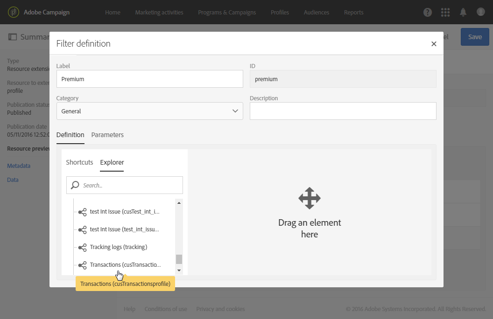

# De filterdefinitie configureren{#configuring-filter-definition}

Op het tabblad **[!UICONTROL Filter definition]** maakt u geavanceerde filters die direct toegankelijk zijn voor gebruikers wanneer ze complexe query&#39;s maken, zoals voor het definiëren van een doelgroep.

Deze stap is niet verplicht omdat u uw resource nog steeds kunt invullen en de data ervan kunt openen via workflows, doelgroepen en de REST API.

Deze filters worden in de query-editor gebruikt in de vorm van vooraf geconfigureerde regels. Met deze filters kunt u het aantal stappen beperken dat nodig is om de gewenste configuratie op te halen. Dit kan bijzonder handig zijn voor herhaalde segmentaties.

Zo kunt u een filter maken waarmee u alle transacties selecteert die een bepaald bedrag in de laatste drie maanden overschrijden.

Hiervoor moet u de bron **[!UICONTROL Profiles]** uitbreiden en een filter definiëren die is gekoppeld aan een transactietabel (die u eerder hebt gemaakt). De koppeling werkt met een regel die aangeeft dat de transactieprijs groter dan of gelijk moet zijn aan een bepaalde parameter, en dat de transactie binnen het datumbereik van de laatste drie maanden moet vallen.

1. Zorg ervoor dat u een transactietabel maakt en publiceert. Zie [De bron maken of uitbreiden](../../developing/using/creating-or-extending-the-resource.md).

   >[!NOTE]
   >
   >Deze procedure gebruikt een aangepaste transactietabel als voorbeeld. Pas deze aan op basis van uw bedrijfsbehoeften.

1. Voordat u een filter definieert voor de transactietabel in de bron **[!UICONTROL Profiles]**, moet u de koppeling naar de tabel definiëren en uw wijzigingen publiceren. Zie [Koppelingen definiëren met andere bronnen](../../developing/using/configuring-the-resource-s-data-structure.md#defining-links-with-other-resources) en [De databasestructuur bijwerken](../../developing/using/updating-the-database-structure.md).
1. Selecteer de transactietabel op het tabblad **[!UICONTROL Definition]** van het definitiescherm van het nieuwe filter.

   

1. In het venster **[!UICONTROL Add a rule - Profiles/Transactions]** sleept u de transactietabel naar de werkruimte. In het volgende venster dat wordt weergegeven selecteert u het veld dat u wilt gebruiken.

   

1. In de **[!UICONTROL Optional parameter settings]** van het venster **[!UICONTROL Add a rule - Transactions]** schakelt u het selectievakje **[!UICONTROL Switch to parameters]** in.

   Selecteer de operator **[!UICONTROL Greater than or equal to]** in het dialoogvenster **[!UICONTROL Filter conditions]**. Typ een naam in het veld **[!UICONTROL Parameters]** en klik op het plusteken om de nieuwe parameter te maken.

   

1. Bevestig uw wijzigingen. Deze definitie komt overeen met een configureerbaar veld dat de gebruiker later moet invullen om de query uit te voeren.

   

1. Combineer deze regel met een andere regel die specificeert dat de transactiedatum binnen de laatste drie maanden moet vallen.

   

1. Kies de categorie waarin het filter wordt weergegeven.

   

1. Ga naar het tabblad **[!UICONTROL Parameters]** op het filterdefinitiescherm, en wijzig de beschrijving en het label om het doel van het filter duidelijk aan te geven voor uw gebruikers. Deze informatie wordt weergegeven in de query-editor.

   

   Als u meerdere configureerbare velden definieert, kunt u de volgorde wijzigen waarin ze in de interface worden weergegeven.

1. Sla uw wijzigingen op en publiceer de bronnen. Raadpleeg de sectie [De databasestructuur bijwerken](../../developing/using/updating-the-database-structure.md) voor meer informatie.

Zodra de **[!UICONTROL Profiles]**-bronuitbreiding wordt gepubliceerd, is het filter voor gebruikers te zien op het tabblad met sneltoetsen in de interface van de [query-editor](../../automating/using/editing-queries.md).

De gebruiker kan nu heel eenvoudig zijn doelgroep definiëren bij het maken van een e-mail die naar alle klanten wordt verzonden die de afgelopen drie maanden meer dan een bepaald bedrag hebben uitgegeven.

Uw gebruikers hoeven nu niet zelf een filter te configureren en kunnen gewoon het gewenste bedrag invoeren in het dialoogvenster dat verschijnt.

Nadat een filter is geconfigureerd, kunt u het van Campaign Standard API&#39;s gebruiken met behulp van deze syntaxis:

`GET https://mc.adobe.io/<ORGANIZATION>/campaign/profileAndServicesExt/<resourceName>/by<customFilterName>?<customFilterparam>=<customFilterValue>`

Raadpleeg de documentatie [van de API&#39;s van](../../api/using/filtering.md#custom-filters)Campaign Standard voor meer informatie.
