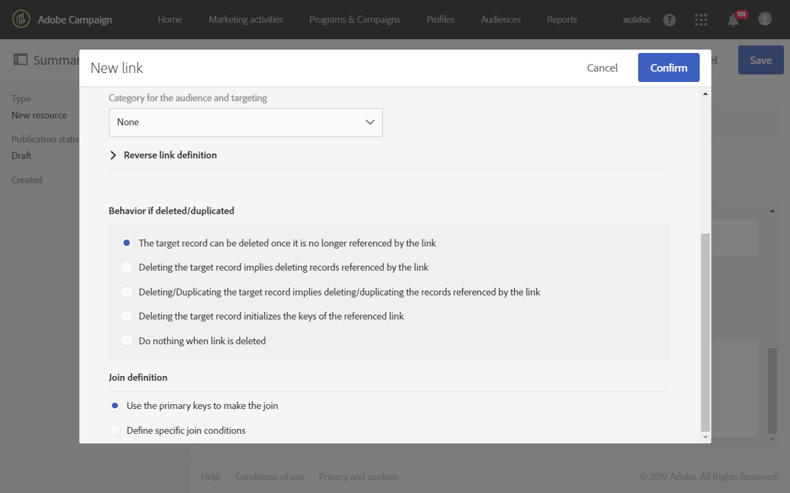
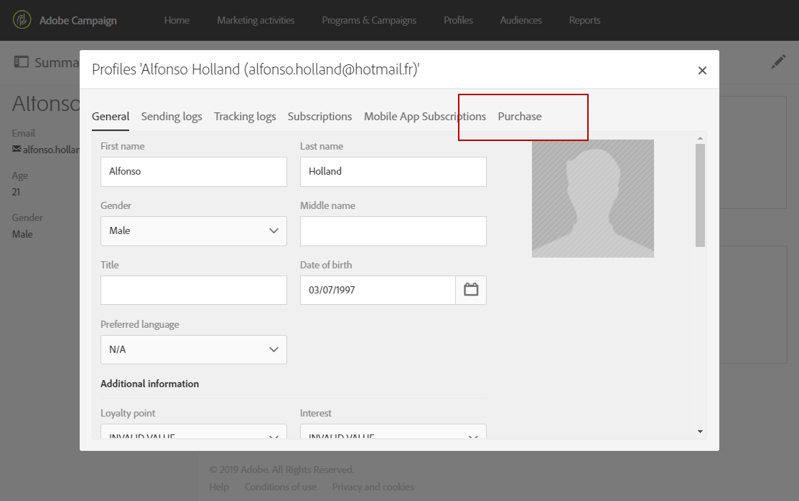
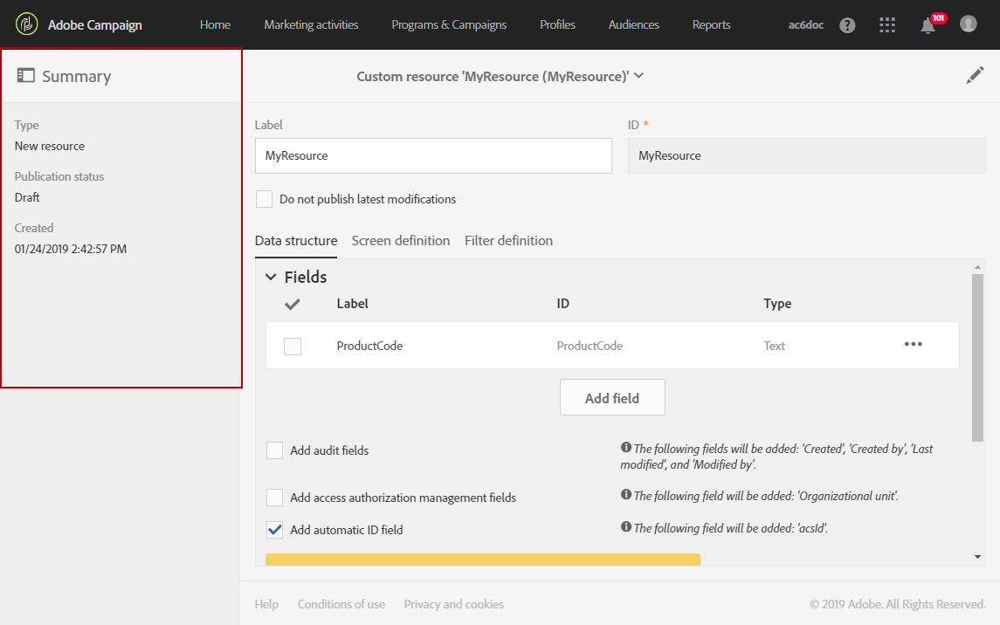

# De gegevensstructuur van de bron configureren{#configuring-the-resource-s-data-structure}

Nadat u een nieuwe aangepaste bron hebt gemaakt, moet u de gegevensstructuur configureren.

Wanneer u de bron bewerkt, kunt u op het **[!UICONTROL Data structure]** tabblad het volgende toevoegen:

* [Velden](#adding-fields-to-a-resource)
* [Identificatietoetsen](#defining-identification-keys)
* [Indexen](#defining-indexes)
* [Koppelingen](#defining-links-with-other-resources)
* [Logboeken verzenden](#defining-sending-logs-extension)

## Velden toevoegen aan een bron {#adding-fields-to-a-resource}

U kunt nieuwe gebieden aan een middel toevoegen om gegevens op te slaan die geen deel van uit het model van kadergegevens uitmaken.

1. Gebruik de **[!UICONTROL Create element]** knop om een veld te maken.
1. Geef een label, een id, een veldtype op en definieer de maximumlengte die voor dit veld is toegestaan.

   Het **[!UICONTROL ID]** veld is verplicht en moet uniek zijn voor elk toegevoegd veld.

   >[!NOTE]
   >
   >Gebruik maximaal 30 tekens.

   

1. Als u een van de velden wilt wijzigen, schakelt u de **[!UICONTROL Edit Properties]** knop in.

   

1. In het **[!UICONTROL Field definition]** scherm kunt u een categorie definiëren die voor het publiek wordt gebruikt en waarvoor u de doelgroep kiest, of zelfs een beschrijving toevoegen.

   

1. Schakel de **[!UICONTROL Specify a list of authorized values]** optie in als u waarden moet definiëren die aan de gebruiker worden aangeboden (opsommingswaarden).

   Klik vervolgens op **[!UICONTROL Create element]** en geef een **[!UICONTROL Label]** en **[!UICONTROL Value]** een waarde op. Voeg zo veel waarden toe als u nodig hebt.

1. Nadat u de velden hebt toegevoegd, schakelt u het **[!UICONTROL Add audit fields]** vakje in met velden waarin de aanmaakdatum, de gebruiker die de bron heeft gemaakt, de datum en de auteur van de laatste wijziging worden vermeld.
1. Schakel het **[!UICONTROL Add access authorization management fields]** selectievakje in om de velden op te nemen die aangeven wie toegangsrechten heeft tot die bepaalde bron.

   Deze velden worden weergegeven in de gegevens en metagegevens die kunnen worden weergegeven wanneer de database-update is uitgevoerd. Raadpleeg voor meer informatie de sectie [De databasestructuur](../../developing/using/updating-the-database-structure.md) bijwerken.

1. Schakel het **[!UICONTROL Add automatic ID]** veld in om automatisch een id te genereren. Bestaande entiteiten blijven leeg. Raadpleeg voor meer informatie het [genereren van een unieke id voor profielen en aangepaste bronnen](../../developing/using/configuring-the-resource-s-data-structure.md#generating-a-unique-id-for-profiles-and-custom-resources).
1. Als u de manier wilt wijzigen waarop de naam van de bronelementen in de lijsten en aanmaakstappen wordt weergegeven, schakelt u het **[!UICONTROL Customize the title of the resource elements]** selectievakje in. Selecteer een veld uit de velden die u voor deze bron hebt gemaakt.

   

   >[!NOTE]
   >
   >Als u deze optie niet inschakelt, wordt de automatische primaire sleutel (die automatisch wordt gemaakt telkens wanneer een entiteit aan de tabel wordt toegevoegd) gebruikt wanneer u alle entiteiten uit deze tabel opsomt.

De velden van uw bron zijn nu gedefinieerd.

## Identificatietoetsen definiëren {#defining-identification-keys}

Elke bron moet ten minste één unieke sleutel hebben. U kunt bijvoorbeeld een sleutel opgeven zodat twee producten niet dezelfde id in een aankooptabel kunnen hebben.

1. Geef dit op in de **[!UICONTROL Automatic primary key]** sectie de grootte voor de opslag als u automatisch een technische sleutel wilt genereren en incrementeel wilt genereren.

   

1. Gebruik de **[!UICONTROL Create element]** knop om een toets te maken.

   De velden **[!UICONTROL Label]** en **[!UICONTROL ID]** velden worden standaard ingevuld, maar u kunt ze bewerken.

   >[!NOTE]
   >
   >Gebruik maximaal 30 tekens.

1. Als u de elementen waaruit deze sleutel bestaat, wilt definiëren, klikt u op de velden die u voor deze bron hebt gemaakt **[!UICONTROL Create element]** en selecteert u deze.

   

   De gecreeerde sleutels worden getoond in de **[!UICONTROL Custom keys]** sectie.

Uw identificatietoetsen voor de bron worden nu gemaakt.

>[!NOTE]
>
>Zie deze [sectie](../../developing/using/data-model-best-practices.md#keys)voor meer informatie over tips en trucs bij het maken van identificatietoetsen.

## Indexen definiëren {#defining-indexes}

Een index kan verwijzen naar een of meerdere bronvelden. Met indexen kan de database records sorteren om deze eenvoudiger te kunnen herstellen. Ze optimaliseren de prestaties van SQL-query&#39;s.

Indexen definiëren wordt aanbevolen, maar is niet verplicht.

1. Gebruik de **[!UICONTROL Create element]** knop om een index te maken.

   

1. De velden **[!UICONTROL Label]** en **[!UICONTROL ID]** velden zijn standaard ingevuld, maar u kunt ze bewerken.

   >[!NOTE]
   >
   >Gebruik maximaal 30 tekens.

1. Als u de elementen wilt definiëren waaruit deze index bestaat, selecteert u de velden uit de velden die u voor deze bron hebt gemaakt.

   

1. Klik op **[!UICONTROL Confirm]**.

De indexen die zijn gemaakt, worden weergegeven in de lijst in de **[!UICONTROL Index]** sectie.

>[!NOTE]
>
>Zie deze [sectie](../../developing/using/data-model-best-practices.md#indexes)voor meer informatie over de beste werkwijzen bij het maken van indexen.

## Koppelingen met andere bronnen definiëren {#defining-links-with-other-resources}

Een koppeling geeft de koppeling weer die een tabel heeft met andere tabellen.

1. Gebruik de **[!UICONTROL Create element]** knoop om een verbinding aan een doelmiddel tot stand te brengen.
1. Klik op **[!UICONTROL Select a target resource]**.

   

1. De middelen worden getoond in alfabetische orde en kunnen door naam worden gefiltreerd. Hun technische naam wordt getoond tussen haakjes.

   Selecteer een element in de lijst en klik op **[!UICONTROL Confirm]**.

   

1. Selecteer de **[!UICONTROL Link type]** standaardinstellingen. Afhankelijk van het geselecteerde kardinaliteitstype kan het gedrag als de records worden verwijderd of gedupliceerd, variëren.

   De verschillende verbindingstypes zijn als volgt:

   * **[!UICONTROL 1 cardinality simple link]**: één instantie van de brontabel kan maximaal één overeenkomende instantie van de doeltabel bevatten.
   * **[!UICONTROL N cardinality collection link]**: één instantie van de brontabel kan meerdere overeenkomende instanties van de doeltabel bevatten, maar één instantie van de doeltabel kan maximaal één overeenkomende instantie van de brontabel hebben.
   * **[!UICONTROL 0 or 1 cardinality simple link]**: één instantie van de brontabel kan maximaal één overeenkomende instantie van de doeltabel of geen instantie bevatten. Merk op dat dit soort van prestatieskwestie **[!UICONTROL Link type]** kan veroorzaken.
   

1. In het **[!UICONTROL New link]** scherm worden de velden **[!UICONTROL Label]** en **[!UICONTROL ID]** velden standaard ingevuld, maar u kunt ze bewerken.

   >[!NOTE]
   >
   >Gebruik maximaal 30 tekens.

   >[!IMPORTANT]
   >
   >Het is niet mogelijk de naam van een koppeling te wijzigen nadat deze is gemaakt. Als u de naam van een koppeling wilt wijzigen, moet u de koppeling verwijderen en opnieuw maken.

1. In de **[!UICONTROL Category for the audience and targeting]** lijst kunt u deze koppeling toewijzen aan een categorie waardoor de koppeling beter zichtbaar wordt in het gereedschap Query-editor.
1. Indien nodig, staat de **[!UICONTROL Reverse link definition]** sectie u toe om het etiket en identiteitskaart van het middel in het gerichte middel te tonen.
1. Definieer het gedrag van de records waarnaar wordt verwezen door de koppeling in de **[!UICONTROL Behavior if deleted/duplicated]** sectie.

   Standaard wordt de doelrecord verwijderd als de koppeling er niet langer naar verwijst.

   

1. In de **[!UICONTROL Join definition]** sectie is de standaardoptie **[!UICONTROL Use the primary keys to make the join]** geselecteerd, maar u kunt kiezen uit twee opties:

   * **[!UICONTROL Use the primary key to make the join]**: Met deze join-definitie kunt u de primaire sleutel van de profielen gebruiken om de primaire sleutel van de aankopen te combineren.
   * **[!UICONTROL Define specific join conditions]**: Met deze join-definitie kunt u handmatig de velden selecteren waarmee beide bronnen worden samengevoegd. Houd er rekening mee dat als de gegevens niet correct zijn geconfigureerd, de **aankooprecord** niet zichtbaar is.
   

De gemaakte koppelingen worden weergegeven in de lijst in de **[!UICONTROL Links]** sectie.

>[!NOTE]
>
>Zie deze [sectie](../../developing/using/data-model-best-practices.md#links)voor meer informatie over de beste werkwijzen bij het maken van indexen.

**Voorbeeld: Een gemaakte bron koppelen met de bron &#39;Profielen&#39;**

In dit voorbeeld willen we een nieuwe resource **Purchase** koppelen aan de aangepaste resource **Profiles** :

1. Maak uw nieuwe **inkoopbron** .
1. Als u deze wilt koppelen aan de aangepaste bron voor **profielen** , vouwt u de **[!UICONTROL Links]** sectie op het **[!UICONTROL Data structure]** tabblad uit en klikt u **[!UICONTROL Create element]**.
1. Selecteer hier de doelbron **[!UICONTROL Profiles (profile)]**.
1. In dit voorbeeld selecteert u het standaardtype **[!UICONTROL 1 cardinality simple link]** koppeling.

   

1. Kies een verbindingsdefinitie, hier houd het gebrek **[!UICONTROL Use the primary key to make the join]**.

   

1. Indien nodig kunt u een detailscherm definiëren om **Aankoop** te kunnen bewerken en koppelen aan een profiel.

   Ontgrendel de **[!UICONTROL Detail screen configuration]** sectie en controleer **[!UICONTROL Define a detail screen]** om het scherm te vormen dat aan elk element van het middel beantwoordt. Als u dit selectievakje niet inschakelt, is de gedetailleerde weergave van elementen van deze bron niet toegankelijk.

1. Klik op **[!UICONTROL Create element]**.
1. Selecteer de gekoppelde bron en klik op **[!UICONTROL Add]**.

   De nieuwe bron is dan beschikbaar in het geavanceerde menu door **[!UICONTROL Client data]** > **[!UICONTROL Purchase]** te selecteren.

   

1. Zodra uw configuratie wordt gedaan, klik **[!UICONTROL Confirm]**.

   U kunt uw nieuwe bron nu publiceren.

Als u deze koppeling toevoegt, wordt via het menu **> een tabblad** Aankoop **[!UICONTROL Profiles & audiences]** **[!UICONTROL Profiles]** toegevoegd aan het detailscherm voor profielen. Dit geldt specifiek voor de **[!UICONTROL Profile]** bron.

## De bestandsextensie definiëren {#defining-sending-logs-extension}

De verzendende logboekuitbreiding staat u toe:

* dynamische rapportmogelijkheden uitbreiden door aangepaste profielvelden **toe te voegen**
* om de verzendende logboekgegevens met **segmentcode en profielgegevens uit te breiden**

**Uitbreiden met een segmentcode**

De gebruiker kan de logboeken met de segmentcode uitbreiden die uit de werkschemamotor komt.

De segmentcode moet in de workflow worden gedefinieerd.

Selecteer de optie om deze extensie te activeren **[!UICONTROL Add segment code]**.

Voor meer informatie over segmentcode, verwijs naar de sectie van de [Segmentatie](../../automating/using/segmentation.md) .

**Uitbreiden met een profielveld**

>[!NOTE]
>
>De beheerder zou het middel van het Profiel met een douanegebied moeten uitgebreid hebben.

Klik op een aangepast veld in de profielbron **[!UICONTROL Add field]** en selecteer dit.

Als u een nieuwe subdimensie wilt genereren die is gekoppeld aan de profieldimensie, schakelt u deze **[!UICONTROL Add this field in Dynamic reporting as a new dimension]** optie in.

Van Dynamische Rapportering, kunt u de dimensie van het douanegebied in een vrije vormlijst slepen en laten vallen.

Voor meer informatie over Dynamische Rapportering, verwijs naar de [Lijst van componenten](../../reporting/using/list-of-components-.md).

>[!IMPORTANT]
>
>Het aantal velden dat naar Dynamic Reporting wordt verzonden, is beperkt tot 20.

## Broneigenschappen bewerken {#editing-resource-properties}

In het scherm van het douanemiddel, wijst de **[!UICONTROL Summary]** ruit op de status van het pas gecreëerde middel. U kunt de toegang en de algemene eigenschappen beheren.

1. Klik op de **[!UICONTROL Edit properties]** knop om een beschrijving toe te voegen.

   

1. Wijzig zo nodig het label en de id van de bron.

   >[!NOTE]
   >
   >Gebruik maximaal 30 tekens.

1. Als u de toegang tot deze bron tot bepaalde organisatorische eenheden moet beperken, specificeer hen hier. Alleen gebruikers van geautoriseerde eenheden kunnen met deze resource werken in de toepassing.
1. Sla de wijzigingen op.

Uw wijzigingen worden opgeslagen. U moet de bron opnieuw publiceren om deze toe te passen.

## Een unieke id genereren voor profielen en aangepaste bronnen {#generating-a-unique-id-for-profiles-and-custom-resources}

Standaard hebben profielen en aangepaste bronnen geen bedrijfs-id wanneer ze worden gemaakt. U kunt een optie inschakelen waarmee automatisch een unieke id wordt gegenereerd wanneer elementen worden gemaakt. Deze id kan worden gebruikt om:

* Geëxporteerde records gemakkelijk identificeren in een extern gereedschap.
* Sla records op bij het importeren van bijgewerkte gegevens die in een andere toepassing zijn verwerkt.

Deze functie kan alleen worden ingeschakeld voor profielen en aangepaste bronnen.

1. Maak een extensie voor de profielbron of maak een nieuwe bron.
1. Controleer in de definitie van de gegevensstructuur de **[!UICONTROL Add automatic ID field]** optie onder de **[!UICONTROL Fields]** sectie.

   

   >[!NOTE]
   >
   >Alleen nieuwe records hebben een ACS-id. Het **[!UICONTROL ACS ID]** veld blijft leeg voor profielen of elementen die zijn gemaakt voordat deze optie wordt geactiveerd.

1. Sla de wijzigingen in de bron op en publiceer deze. Als u dit mechanisme wilt toepassen op elementen die zijn gemaakt via de API, schakelt u de optie in om de API uit te breiden.

Het **[!UICONTROL ACS ID]** veld is nu beschikbaar en automatisch ingevuld wanneer nieuwe elementen handmatig worden gemaakt via de API of worden ingevoegd vanuit een importworkflow. Het veld ACS-id is een UUID-veld en wordt geïndexeerd.

Wanneer u profielen of aangepaste bronnen exporteert, kunt u nu de **[!UICONTROL ACS ID]** kolom toevoegen als deze is ingeschakeld voor die bron. U kunt deze id opnieuw gebruiken in externe gereedschappen om records te identificeren.

Wanneer het re-invoeren van gegevens die in een andere toepassing (bijvoorbeeld CRM) zijn verwerkt/bijgewerkt, kunt u het gemakkelijk met deze unieke identiteitskaart in overeenstemming brengen.

>[!NOTE]
>
>Het **[!UICONTROL ACS ID]** veld wordt niet bijgewerkt voor profielen of elementen die zijn gemaakt voordat de optie is ingeschakeld. Alleen nieuwe records hebben een ACS-id.
>
>Dit veld bevindt zich in de modus Alleen-lezen. U kunt het niet wijzigen.
