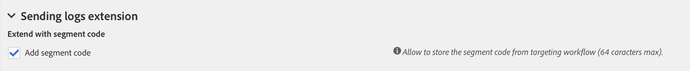

# De datastructuur van de resource configureren{#configuring-the-resource-s-data-structure}

Nadat u een nieuwe aangepaste resource hebt gemaakt, moet u de datastructuur configureren.

Wanneer u de resource bewerkt, kunt u op het tabblad **[!UICONTROL Data structure]** het volgende toevoegen:

* [Velden](#adding-fields-to-a-resource)
* [Identificatiesleutels](#defining-identification-keys)
* [Indexen](#defining-indexes)
* [Koppelingen](#defining-links-with-other-resources)
* [Verzendlogboeken](#defining-sending-logs-extension)

## Velden toevoegen aan een resource {#adding-fields-to-a-resource}

U kunt nieuwe velden aan een resource toevoegen om data op te slaan die geen deel uitmaken van het kant-en-klare datamodel.

1. Gebruik de knop **[!UICONTROL Create element]** om een veld te maken.
1. Geef een label, een id en een veldtype op en definieer de maximumlengte die voor dit veld is toegestaan.

   Het veld **[!UICONTROL ID]** is verplicht en moet uniek zijn voor elk toegevoegd veld.

   >[!NOTE]
   >
   >Gebruik maximaal 30 tekens.

   

1. Als u een van de velden wilt wijzigen, schakelt u de knop **[!UICONTROL Edit Properties]** in.

   

1. In het scherm **[!UICONTROL Field definition]** kunt u een categorie definiëren die voor de doelgroep en targeting wordt gebruikt, of kunt u zelfs een beschrijving toevoegen.

   

1. Schakel de optie **[!UICONTROL Specify a list of authorized values]** in als u waarden moet definiëren die aan de gebruiker worden aangeboden (opsommingswaarden).

   Klik vervolgens op **[!UICONTROL Create element]** en geef een **[!UICONTROL Label]** en een **[!UICONTROL Value]** op. Voeg zo veel waarden toe als u nodig hebt.

1. Nadat u de velden hebt toegevoegd, schakelt u het selectievakje **[!UICONTROL Add audit fields]** in om velden op te nemen met informatie over de aanmaakdatum, de gebruiker die de resource heeft gemaakt, de datum en de auteur van de laatste wijziging.
1. Schakel het selectievakje **[!UICONTROL Add access authorization management fields]** in om de velden op te nemen die aangeven wie toegangsrechten heeft tot de desbetreffende resource.

   Deze velden worden weergegeven in de data en metagegevens die kunnen worden weergegeven zodra de database-update is uitgevoerd. Raadpleeg de sectie [De databasestructuur bijwerken](../../developing/using/updating-the-database-structure.md) voor meer informatie.

1. Schakel het veld **[!UICONTROL Add automatic ID]** in om automatisch een id te genereren. Merk op dat bestaande entiteiten leeg blijven. Raadpleeg [Een unieke id genereren voor profielen en aangepaste resources](../../developing/using/configuring-the-resource-s-data-structure.md#generating-a-unique-id-for-profiles-and-custom-resources) voor meer informatie.
1. Als u de manier wilt wijzigen waarop de naam van de resource-elementen in de lijsten en aanmaakstappen wordt weergegeven, schakelt u het selectievakje **[!UICONTROL Customize the title of the resource elements]** in. Selecteer een van de velden die u voor deze resource hebt gemaakt.

   

   >[!NOTE]
   >
   >Als u deze optie niet inschakelt, wordt de automatische primaire sleutel (die automatisch wordt gemaakt telkens wanneer een entiteit aan de tabel wordt toegevoegd) gebruikt wanneer u alle entiteiten uit deze tabel opsomt.

De velden van uw resource zijn nu gedefinieerd.

## Identificatiesleutels definiëren {#defining-identification-keys}

Elke resource moet ten minste één unieke sleutel hebben. U kunt bijvoorbeeld een sleutel opgeven zodat twee producten niet dezelfde id in een aankooptabel kunnen hebben.

1. Geef in de sectie **[!UICONTROL Automatic primary key]** de grootte voor de opslag op als u een technische sleutel automatisch en incrementeel wilt genereren.

   

1. Gebruik de knop **[!UICONTROL Create element]** om een sleutel te maken.

   De velden **[!UICONTROL Label]** en **[!UICONTROL ID]** zijn standaard ingevuld, maar u kunt ze bewerken.

   >[!NOTE]
   >
   >Gebruik maximaal 30 tekens.

1. Als u de elementen waaruit deze sleutel bestaat, wilt definiëren, klikt u op **[!UICONTROL Create element]** en selecteert u de velden die u voor deze resource hebt gemaakt.

   

   De gemaakte sleutels worden in de sectie **[!UICONTROL Custom keys]** weergegeven.

Uw identificatiesleutels voor de resource worden nu gemaakt.

>[!NOTE]
>
>Zie deze [sectie](../../developing/using/data-model-best-practices.md#keys) voor meer informatie over best practices bij het maken van identificatiesleutels.

## Indexen definiëren {#defining-indexes}

Een index kan verwijzen naar een of meerdere resourcevelden. Met indexen kan de database records sorteren om deze eenvoudiger terug te vinden. Indexen optimaliseren de prestaties van SQL-query&#39;s.

Indexen definiëren wordt aanbevolen, maar is niet verplicht.

1. Gebruik de knop **[!UICONTROL Create element]** om een index te maken.

   

1. De velden **[!UICONTROL Label]** en **[!UICONTROL ID]** zijn standaard ingevuld, maar u kunt ze bewerken.

   >[!NOTE]
   >
   >Gebruik maximaal 30 tekens.

1. Als u de elementen waaruit deze index bestaat, wilt definiëren, selecteert u de gewenste velden uit de velden die u voor deze resource hebt gemaakt.

   

1. Klik op **[!UICONTROL Confirm]**.

De indexen die zijn gemaakt, worden weergegeven in de lijst in de sectie **[!UICONTROL Index]**.

>[!NOTE]
>
>Zie deze [sectie](../../developing/using/data-model-best-practices.md#indexes) voor meer informatie over best practices bij het maken van indexen.

## Koppelingen met andere resources definiëren {#defining-links-with-other-resources}

Een koppeling geeft de verbinding weer die een tabel heeft met andere tabellen.

1. Gebruik de knop **[!UICONTROL Create element]** om een koppeling met een doelresource tot stand te brengen.
1. Klik op **[!UICONTROL Select a target resource]**.

   

1. Resources worden in alfabetische volgorde weergegeven en kunnen op naam worden gefilterd. Hun technische naam wordt tussen haakjes weergegeven.

   Selecteer een element in de lijst en klik op **[!UICONTROL Confirm]**.

   

1. Selecteer het **[!UICONTROL Link type]** volgens kardinaliteit. Afhankelijk van het geselecteerde kardinaliteitstype kan het gedrag bij het verwijderen of dupliceren van de records variëren.

   De verschillende koppelingstypen zijn als volgt:

   * **[!UICONTROL 1 cardinality simple link]**: Eén instantie van de brontabel kan maximaal één overeenkomende instantie van de doeltabel bevatten.
   * **[!UICONTROL N cardinality collection link]**: Eén instantie van de brontabel kan meerdere overeenkomende instanties van de doeltabel bevatten, maar één instantie van de doeltabel kan maximaal één overeenkomende instantie van de brontabel hebben.
   * **[!UICONTROL 0 or 1 cardinality simple link]**: Eén instantie van de brontabel kan maximaal één overeenkomende instantie van de doeltabel of geen instantie bevatten. Merk op dat dit **[!UICONTROL Link type]** prestatieproblemen kan veroorzaken.
   

1. In het scherm **[!UICONTROL New link]** zijn de velden **[!UICONTROL Label]** en **[!UICONTROL ID]** standaard ingevuld, maar u kunt ze bewerken.

   >[!NOTE]
   >
   >Gebruik maximaal 30 tekens.

   >[!IMPORTANT]
   >
   >Het is niet mogelijk de naam van een koppeling te wijzigen nadat deze is gemaakt. Als u de naam van een koppeling wilt wijzigen, moet u de koppeling verwijderen en opnieuw maken.

1. In de lijst **[!UICONTROL Category for the audience and targeting]** kunt u deze koppeling toewijzen aan een categorie waardoor de koppeling zichtbaarder wordt in de query-editor.
1. Indien nodig kunt u met de sectie **[!UICONTROL Reverse link definition]** het label en de id van de resource weergeven in de doelresource.
1. Definieer het gedrag van de records waarnaar wordt verwezen door de koppeling in de sectie **[!UICONTROL Behavior if deleted/duplicated]**.

   Standaard wordt de doelrecord verwijderd als de koppeling er niet langer naar verwijst.

   

1. In de sectie **[!UICONTROL Join definition]** is de standaardoptie **[!UICONTROL Use the primary keys to make the join]** geselecteerd, maar u kunt kiezen uit twee opties:

   * **[!UICONTROL Use the primary key to make the join]**: Met deze samenvoegdefinitie kunt u de primaire sleutel van de profielen gebruiken om af te stemmen met de primaire sleutel van de aankopen.
   * **[!UICONTROL Define specific join conditions]**: Met deze samenvoegdefinitie kunt u handmatig de velden selecteren waarmee beide resources worden samengevoegd. Houd er rekening mee dat de record **Purchase** niet zichtbaar is als de data niet correct zijn geconfigureerd.
   

De gemaakte koppelingen worden weergegeven in de lijst in de sectie **[!UICONTROL Links]**.

>[!NOTE]
>
>Zie deze [sectie](../../developing/using/data-model-best-practices.md#links) voor meer informatie over best practices bij het maken van indexen.

**Voorbeeld: Een gemaakte resource koppelen met de resource Profiles**

In dit voorbeeld willen we een nieuwe resource **Purchase** koppelen aan de aangepaste resource **Profiles**:

1. Maak uw nieuwe resource **Purchase**.
1. Als u deze wilt koppelen aan de aangepaste resource **Profiles**, vouwt u de sectie **[!UICONTROL Links]** op het tabblad **[!UICONTROL Data structure]** uit en klikt u op **[!UICONTROL Create element]**.
1. Selecteer de doelresource, in dit geval **[!UICONTROL Profiles (profile)]**.
1. In dit voorbeeld behoudt u de selectie van het standaardkoppelingstype **[!UICONTROL 1 cardinality simple link]**.

   

1. Kies een samenvoegdefinitie en behoud hier de standaardselectie **[!UICONTROL Use the primary key to make the join]**.

   

1. Indien nodig kunt u een detailscherm definiëren om **Purchase** te kunnen bewerken en aan een profiel te koppelen.

   Vouw de sectie **[!UICONTROL Detail screen configuration]** uit en schakel **[!UICONTROL Define a detail screen]** in om het scherm te configureren dat overeenkomt met elk element van de resource. Als u dit selectievakje niet inschakelt, is de gedetailleerde weergave van elementen van deze resource niet toegankelijk.

1. Klik op **[!UICONTROL Create element]**.
1. Selecteer de gekoppelde resource en klik op **[!UICONTROL Add]**.

   De nieuwe resource is nu beschikbaar in het geavanceerde menu als u **[!UICONTROL Client data]** > **[!UICONTROL Purchase]** selecteert.

   

1. Zodra uw configuratie gereed is, klikt u op **[!UICONTROL Confirm]**.

   U kunt uw nieuwe resource nu publiceren.

Als u deze koppeling toevoegt, wordt via het menu **[!UICONTROL Profiles & audiences]** > **[!UICONTROL Profiles]** een tabblad **Purchase** toegevoegd aan het detailscherm voor profielen. Dit geldt specifiek voor de resource **[!UICONTROL Profile]**.

## De extensie voor verzendlogboeken definiëren {#defining-sending-logs-extension}

Met de extensie voor verzendlogboeken kunt u het volgende doen:

* Dynamische rapportmogelijkheden uitbreiden door **aangepaste profielvelden toe te voegen**
* De data van verzendlogboeken uitbreiden met **segmentcode en profieldata**

**Uitbreiden met een segmentcode**

De gebruiker kan de logboeken uitbreiden met de segmentcode die afkomstig is uit de workflowengine.

De segmentcode moet in de workflow worden gedefinieerd.

Selecteer de optie **[!UICONTROL Add segment code]** om deze extensie te activeren.

Raadpleeg de sectie [Segmentatie](../../automating/using/segmentation.md) voor meer informatie over segmentcodes.

**Uitbreiden met een profielveld**

>[!NOTE]
>
>De beheerder moet de resource Profile hebben uitgebreid met een aangepast veld.

Klik op **[!UICONTROL Add field]** en selecteer een willekeurig aangepast veld in de profielresource.

Als u een nieuwe subdimensie wilt genereren die is gekoppeld aan de dimensie Profile, schakelt u de optie **[!UICONTROL Add this field in Dynamic reporting as a new dimension]** in.

Vanaf Dynamische rapportage kunt u de dimensie van het aangepaste veld slepen en neerzetten in een vrije-vormtabel.

Voor meer informatie over Dynamische rapportage raadpleegt u de [Lijst met componenten](../../reporting/using/list-of-components-.md).

>[!IMPORTANT]
>
>Het aantal velden dat naar Dynamische rapportage wordt verzonden, is beperkt tot 20.

## Resource-eigenschappen bewerken {#editing-resource-properties}

In het scherm van de aangepaste resource geeft het deelvenster **[!UICONTROL Summary]** de status van de pas gemaakte resource aan. U kunt de toegang tot en de algemene eigenschappen van deze resource beheren.

1. Klik op de knop **[!UICONTROL Edit properties]** om een beschrijving toe te voegen.

   

1. Wijzig zo nodig het label en de id van de resource.

   >[!NOTE]
   >
   >Gebruik maximaal 30 tekens.

1. Als u de toegang tot deze resource moet beperken tot bepaalde organisatorische eenheden, geef deze dan hier op. Alleen gebruikers van de geautoriseerde eenheden kunnen met deze resource werken in de applicatie.
1. Sla de wijzigingen op.

Uw wijzigingen worden opgeslagen. U moet de resource opnieuw publiceren om deze toe te passen.

## Een unieke id genereren voor profielen en aangepaste resources {#generating-a-unique-id-for-profiles-and-custom-resources}

Standaard hebben profielen en aangepaste resources geen bedrijfs-id wanneer ze worden gemaakt. U kunt een optie inschakelen waarmee automatisch een unieke id wordt gegenereerd wanneer elementen worden gemaakt. Deze id kan worden gebruikt om:

* Geëxporteerde records gemakkelijk te identificeren in een externe tool.
* Records af te stemmen bij het importeren van bijgewerkte data die in een andere applicatie zijn verwerkt.

Deze functie kan alleen worden ingeschakeld voor profielen en aangepaste resources.

1. Maak een extensie voor de profielresource of maak een nieuwe resource.
1. Schakel in de definitie van de datastructuur de optie **[!UICONTROL Add automatic ID field]** in onder de sectie **[!UICONTROL Fields]**.

   

   >[!NOTE]
   >
   >Alleen nieuwe records hebben een ACS-id. Het veld **[!UICONTROL ACS ID]** blijft leeg voor profielen of elementen die zijn gemaakt voordat deze optie is geactiveerd.

1. Sla de wijzigingen in de resource op en publiceer deze. Als u dit mechanisme wilt toepassen op elementen die zijn gemaakt via de API, schakelt u de optie in om de API uit te breiden.

Het veld **[!UICONTROL ACS ID]** is nu beschikbaar en wordt automatisch ingevuld wanneer nieuwe elementen handmatig worden gemaakt, via de API of worden ingevoegd vanuit een importworkflow. Het veld voor de ACS-id is een UUID-veld en wordt geïndexeerd.

Wanneer u profielen of aangepaste resources exporteert, kunt u nu de kolom **[!UICONTROL ACS ID]** toevoegen als deze is ingeschakeld voor die resource. U kunt deze id opnieuw gebruiken in externe tools om records te identificeren.

Bij het opnieuw importeren van data die in een andere applicatie (bijvoorbeeld een CRM) zijn verwerkt/bijgewerkt, kunt u deze id gemakkelijk afstemmen met deze unieke id.

>[!NOTE]
>
>Het veld **[!UICONTROL ACS ID]** wordt niet bijgewerkt voor profielen of elementen die zijn gemaakt voordat de optie is ingeschakeld. Alleen nieuwe records hebben een ACS-id.
>
>Dit veld bevindt zich in de modus Alleen-lezen. U kunt het niet wijzigen.
