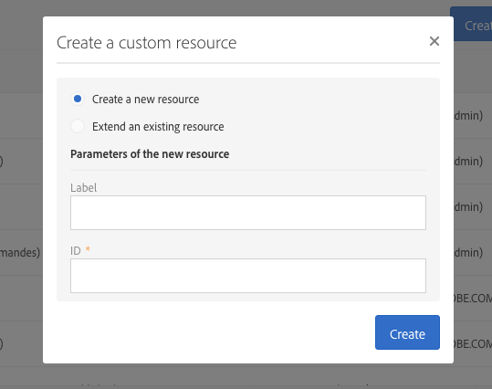

# De resource maken of uitbreiden{#creating-or-extending-the-resource}

Beheerders kunnen een geheel nieuwe bron maken of een uitbreiding van een bestaande bron maken als u gegevens nodig hebt die geen deel uitmaken van het ingebouwde gegevensmodel.

Alleen de volgende ingebouwde bronnen kunnen worden uitgebreid:

* **[!UICONTROL Campaign (campaign)]**
* **[!UICONTROL Deliveries (delivery)]**
* **[!UICONTROL Landing page (Landingpage)]**
* **[!UICONTROL Profiles (profile)]**
* **[!UICONTROL Program (program)]**
* **[!UICONTROL Service (service)]**
* **[!UICONTROL Subscriptions to an application (appSubscriptionRcp)]**
* **[!UICONTROL Test profiles (seedMember)]**
* **[!UICONTROL Workflow (workflow)]**

Een bron maken of uitbreiden:

1. Klik op de **[!UICONTROL Administration]** knop van **[!UICONTROL Development]** > **[!UICONTROL Custom Resources]**> **[!UICONTROL Create]** .
1. Kies de handeling die u wilt uitvoeren:

   * **[!UICONTROL Create a new resource]**: Voer de **[!UICONTROL Label]** velden en de **[!UICONTROL ID]** velden in. Het veld **[!UICONTROL ID]** is verplicht. Als u het veld Label leeg laat, wordt dit automatisch ingevuld met de id.

      

      >[!NOTE]
      >
      >Gebruik maximaal 30 tekens.

   * **[!UICONTROL Extend an existing resource]**: Selecteer de bron die u wilt uitbreiden.

      

1. Klik **[!UICONTROL Create]** om de bron te maken, die dan de **[!UICONTROL Draft]** status krijgt in het geval van een nieuwe bron of de **[!UICONTROL Editing]** status in het geval van een extensie.

Het nieuwe middel wordt gecreeerd en kan nu worden gevormd. Voor meer op middelconfiguratie, verwijs naar het [Vormen van de de gegevensstructuur](../../developing/using/configuring-the-resource-s-data-structure.md)van het middel.
