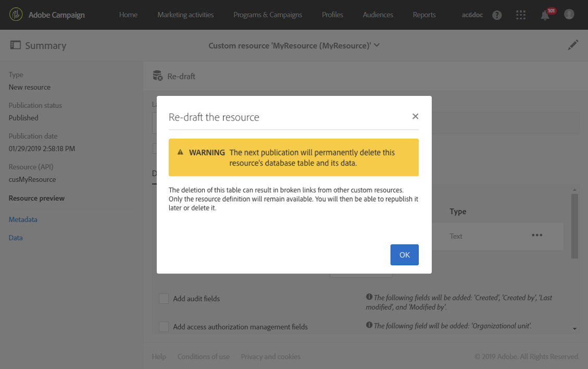

# Een bron verwijderen{#deleting-a-resource}

Als u een bron wilt verwijderen, moet de bron in kwestie een **[!UICONTROL Draft]**. De resource is in **[!UICONTROL Draft]** status als:

* Het is zojuist opgericht en is nog niet gepubliceerd.
* Als het al is gepubliceerd, moet de bron opnieuw worden opgesteld.

>[!CAUTION]
>
>Het herschrijven en schrappen van een douanemiddel zijn gevoelige verrichtingen die andere middelen kunnen beïnvloeden. Deze handelingen mogen alleen door een deskundige gebruiker worden uitgevoerd.

Een gepubliceerde bron opnieuw samenstellen en verwijderen:

1. Selecteer de bron die u opnieuw wilt samenstellen.
1. Klik op de **[!UICONTROL Re-draft]** knop op de actiebalk.

   

1. Klik op **[!UICONTROL Ok]**.

   >[!IMPORTANT]
   >
   >Deze actie is definitief: de de gegevensbestandlijst of kolommen van het middel en hun gegevens zullen permanent worden geschrapt wanneer de wijziging wordt gepubliceerd, die in gebroken verbindingen van andere douanemiddelen kan resulteren. Alleen de brondefinitie blijft beschikbaar.

   

   >[!NOTE]
   >
   >Als u een uitbreiding van de uit-van-de-doos bron van **Profielen (profiel)** opnieuw ontwerpt, moet u om het even welke uitbreiding van het **Testprofiel (zaadLid)** ook opnieuw ontwerpen u kunt bepaald hebben. Zie [deze sectie](../../developing/using/extending-the-profile-resource-with-a-new-field.md)voor meer informatie over het uitbreiden van de profielbron.

1. Publiceer de bron. Voor meer gedetailleerde stappen, verwijs naar het [Publiceren van een douanemiddel](../../developing/using/updating-the-database-structure.md#publishing-a-custom-resource).

   De bron gaat vervolgens naar de **conceptmodus** en de activeringsstatus is **[!UICONTROL Inactive]**.

1. Controleer in de **[!UICONTROL List]** modus de te verwijderen bron en klik op het **[!UICONTROL Delete element]** pictogram.

   

Uw bron wordt verwijderd uit het gegevensmodel.

>[!NOTE]
>
>Als een gebied van een douanemiddel dat op een gebeurtenis wordt gebruikt wordt gewijzigd of geschrapt, zal de overeenkomstige gebeurtenis automatisch unpublished. Zie [Transactieoverseinen](../../administration/using/configuring-transactional-messaging.md)configureren.

