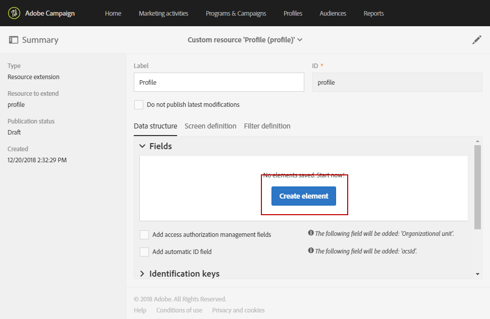
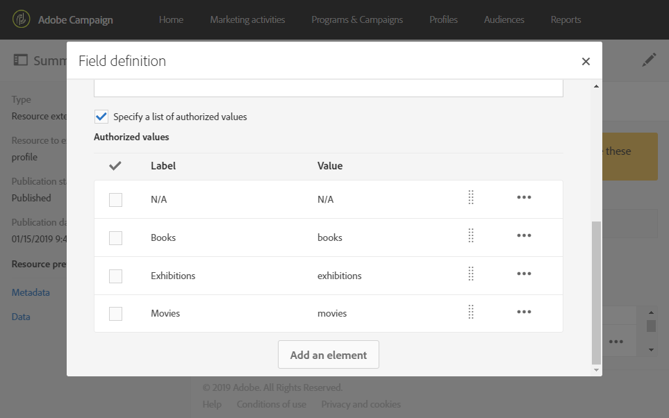

# De profielresource uitbreiden met een nieuw veld{#extending-the-profile-resource-with-a-new-field}

## Profielen uitbreiden {#about-extending-profiles}

In dit gebruiksscenario wordt beschreven hoe u een profiel en een testprofiel kunt uitbreiden met een specifiek veld.

Hier ziet u hoe we profielen bijwerken met het nieuwe veld met behulp van een landingspagina en vervolgens profielen doelgericht benaderen met een nieuwsbrief die aansluit bij hun specifieke interesses.

Hiervoor voert u de volgende stappen uit:

* [Stap 1: De profielresource uitbreiden](#step-1--extend-the-profile-resource)
* [Stap 2: Het testprofiel uitbreiden](#step-2--extend-the-test-profile)
* [Stap 3: Uw aangepaste resource publiceren](#step-3--publish-your-custom-resource)
* [Stap 4: Profielen bijwerken en doelgericht benaderen met een workflow](#step-4--update-and-target-profiles-with-a-workflow)

Het volgende veld wordt aan de profielen toegevoegd en kan in een levering doelgericht worden benaderd:

Verwante onderwerpen:

* [Informatie over aangepaste resources](../../developing/using/data-model-concepts.md)
* [Profielen beheren](../../audiences/using/about-profiles.md)
* [Testprofielen beheren](../../audiences/using/managing-test-profiles.md)

## Stap 1: De profielresource uitbreiden {#step-1--extend-the-profile-resource}

Om het nieuwe veld **Interest** voor de profielen te maken moet u eerst de kant-en-klare resource **[!UICONTROL Profiles (profile)]** uitbreiden.

1. Selecteer in het geavanceerde menu dat u opent via het Adobe Campaign-logo achtereenvolgens **[!UICONTROL Administration]** > **[!UICONTROL Development]** en **[!UICONTROL Custom resources]**.
1. Als u de resource **[!UICONTROL Profiles]** nog niet hebt uitgebreid, klikt u op **[!UICONTROL Create]**.
1. Kies de optie **[!UICONTROL Extend an existing resource]**.
1. Selecteer de resource **[!UICONTROL Profile (profile)]**.
1. Klik op **[!UICONTROL Create]**.

   

1. Klik in de categorie **[!UICONTROL Fields]** van het tabblad **[!UICONTROL Data structure]** op **[!UICONTROL Create element]**.

   >[!NOTE]
   >
   >Als u de resource **[!UICONTROL Profile]** al hebt uitgebreid voor eerdere doeleinden, kunt u bij deze stap beginnen door op **[!UICONTROL Add field]** te klikken.

   

1. Voeg een **[!UICONTROL Label]** en een **[!UICONTROL ID]** toe. Selecteer het type **[!UICONTROL Text]** en klik op **[!UICONTROL Add]**.

   

1. Als u uw veld wilt configureren, klikt u op het tabblad **[!UICONTROL Data structure]** onder de vervolgkeuzelijst **[!UICONTROL Fields]** op  en vervolgens op  vanaf het eerder gemaakte veld.
1. In dit voorbeeld willen we specifieke waarden toevoegen. Hiervoor klikt u op **[!UICONTROL Specify a list of authorized values]**.

   

1. Klik op **[!UICONTROL Add an element]** en voeg vervolgens zoveel waarden toe als nodig is door een **[!UICONTROL Label]** en een **[!UICONTROL ID]** toe te voegen en op **[!UICONTROL Add]** te klikken.

   Hier maken we de waarden Books, Exhibitions, Movies en N/A voor profielen zodat zij tussen deze opties kunnen kiezen.

   

1. Als u dit veld op het scherm **[!UICONTROL Profile]** wilt toevoegen, klikt u op het tabblad **[!UICONTROL Screen definition]**.
1. Klik in de vervolgkeuzelijst **[!UICONTROL Detail screen configuration]** op **[!UICONTROL Add a personalized fields section]** en klik op **[!UICONTROL Create element]**.

   

1. Selecteer een **[!UICONTROL Type]**. Hier voegen we een invoerveld toe. Selecteer vervolgens het eerder gemaakte veld en klik op **[!UICONTROL Add]**.

   

1. Als u een scheidingsteken wilt toevoegen om uw profielvenster beter te organiseren, klikt u op **[!UICONTROL Create an element]** en selecteert u **[!UICONTROL Separator]** in de vervolgkeuzelijst **[!UICONTROL Type]**.

   

Uw veld is nu geconfigureerd. We moeten het vervolgens uitbreiden naar het testprofiel.

>[!NOTE]
>
>Als u de resource van het testprofiel niet wilt uitbreiden, kunt u naar de publicatiestap gaan.

## Stap 2: Het testprofiel uitbreiden {#step-2--extend-the-test-profile}

Om te testen of het nieuwe gemaakte veld correct is geconfigureerd, kunt u uw levering naar de testprofielen verzenden. Ten eerste moet het nieuwe veld ook worden toegepast op de testprofielen.

1. Selecteer in het geavanceerde menu dat u opent via het Adobe Campaign-logo achtereenvolgens **[!UICONTROL Administration]** > **[!UICONTROL Development]** en **[!UICONTROL Custom resources]**.
1. Als u de resource **[!UICONTROL Profiles]** nog niet hebt uitgebreid, klikt u op **[!UICONTROL Create]**.
1. Kies de optie **[!UICONTROL Extend an existing resource]**.
1. Selecteer de resource **[!UICONTROL Test profile (seedMember)]**.
1. Klik op **[!UICONTROL Create]**.

   

1. Klik op het tabblad **[!UICONTROL Data structure]** op **[!UICONTROL Create element]**.

   

1. Selecteer het eerder gemaakte resourceveld en klik op **[!UICONTROL Add]**.

   

1. Voer dezelfde stappen uit van stap 11 tot en met 13 als de procedure voor het uitbreiden van het profiel hierboven om dit veld op het scherm **[!UICONTROL Test profile]** toe te voegen.
1. Klik op **[!UICONTROL Save]**.

Het nieuwe veld is nu beschikbaar voor zowel profielen als testprofielen. U moet de aangepaste resource publiceren om ervoor te zorgen dat deze correct is geconfigureerd.

## Stap 3: Uw aangepaste resource publiceren {#step-3--publish-your-custom-resource}

Om de veranderingen die op de resources zijn uitgevoerd, te kunnen toepassen en gebruiken, moet u de database bijwerken.

1. Selecteer in het geavanceerde menu **Administration** > **Development** en **Publishing**.
1. De optie **[!UICONTROL Determine modifications since the last publication]** is standaard ingeschakeld, wat betekent dat alleen de wijzigingen worden toegepast die zijn uitgevoerd sinds de laatste update.

   

1. Klik op **[!UICONTROL Prepare publication]** om de analyse te starten waarmee uw database wordt bijgewerkt.
1. Nadat de publicatie is uitgevoerd, klikt u op de knop **Publish** om de nieuwe configuraties toe te passen.

   

1. Zodra de publicatie is voltooid, geeft het deelvenster **Summary** van elke resource aan dat de status nu **Published** is en wordt de datum van de laatste publicatie opgegeven.

   

1. Selecteer het tabblad **[!UICONTROL Profiles]** en klik op **[!UICONTROL New]** om te controleren of de wijzigingen correct zijn geïmplementeerd.

   

Het nieuwe resourceveld is nu klaar om te worden gebruikt en om bijvoorbeeld in een levering doelgericht profielen te benaderen.

## Stap 4: Profielen bijwerken en doelgericht benaderen met een workflow {#step-4--update-and-target-profiles-with-a-workflow}

Als u profielen wilt bijwerken met data voor het nieuwe aangepaste veld, kunt u een landingspagina maken met de sjabloon **[!UICONTROL Profile acquisition]**. Raadpleeg deze [pagina](../../channels/using/getting-started-with-landing-pages.md) voor meer informatie over landingspagina’s.

Hier maken we een workflow om profielen te benaderen die dit veld niet hebben ingevuld. Zij zullen een e-mail ontvangen waarin ze worden gevraagd hun profielen bij te werken om persoonlijke nieuwsbrieven en aanbiedingen te ontvangen. Elk profiel ontvangt vervolgens een gepersonaliseerde nieuwsbrief afhankelijk van de door hen gekozen interesses.

Eerst moeten we een landingspagina maken die de velden **Interest** van de doelprofielen bijwerkt:

1. Klik in **[!UICONTROL Marketing activities]** op **[!UICONTROL Create]** en selecteer vervolgens **[!UICONTROL Landing page]**.
1. Selecteer een type landingspagina. Selecteer **[!UICONTROL Profile acquisition]** aangezien we de profielen willen bijwerken.
1. Klik op **[!UICONTROL Create]**.
1. Klik op het blok **[!UICONTROL Content]** om de content van de landingspagina te bewerken.

   

1. Pas de landingspagina desgewenst aan.
1. Klik op het veld dat voor uw profielen is geconfigureerd om te kiezen tussen de selectie van interesses. Selecteer in het linkerdeelvenster uw eerder gemaakte aangepaste resource **Interest**.

   

1. Sla de landingspagina op en test deze om te controleren of de velden correct zijn geconfigureerd.
1. Klik op **[!UICONTROL Publish]** wanneer uw landingspagina klaar is.

Uw landingspagina is nu klaar. Als u de profielen wilt bijwerken, kunt u een workflow maken waarin een speciale aanbieding wordt verzonden, afhankelijk van de gekozen interesse.

1. Klik op het tabblad **[!UICONTROL Marketing activities]** op **[!UICONTROL Create]** en selecteer **[!UICONTROL Workflow]**.
1. Sleep en zet een activiteit **[!UICONTROL Query]** neer om de gewenste profielen of doelgroepen te benaderen.
1. Sleep en zet een activiteit **[!UICONTROL Email delivery]** neer om een e-mail met een koppeling naar de landingspagina te configureren. Selecteer **[!UICONTROL Add an outbound transition with the population]**.

   

1. Maak en ontwerp uw e-mail naar wens. Raadpleeg deze [pagina](../../designing/using/quick-start.md) voor meer informatie over personalisatie van e-mails.
1. Voeg een knop toe aan uw e-mail waarmee profielen naar uw landingspagina worden omgeleid.
1. Selecteer de toegevoegde knop en klik op  in de sectie **[!UICONTROL Link]** in het linkerdeelvenster.

   

1. Selecteer in het venster **[!UICONTROL Insert link]** de optie **[!UICONTROL Landing page]** in de vervolgkeuzelijst **[!UICONTROL Link type]** en selecteer de eerder gemaakte landingspagina.

   

1. Klik op **[!UICONTROL Save]**. Uw e-mail is nu klaar en u kunt terugkeren naar uw workflow.
1. Voeg een activiteit **[!UICONTROL Wait]** toe zodat uw profielen enige tijd hebben om de landingspagina in te vullen.
1. Voeg een activiteit **[!UICONTROL Segmentation]** toe om de uitgaande overgang te verdelen afhankelijk van hun **Interests**.
1. Maak een uitgaand segment voor elke **Interest**.

   

1. Voeg na elke overgang een activiteit **[!UICONTROL Email delivery]** toe en maak een gepersonaliseerde e-mail afhankelijk van de gekozen **Interest**.
1. Start de workflow wanneer de configuratie is voltooid.

   

Profielen ontvangen nu een e-mail met de vraag om dit veld Interest in te vullen, gevolgd door een gepersonaliseerde e-mail, afhankelijk van de gekozen waarde.
