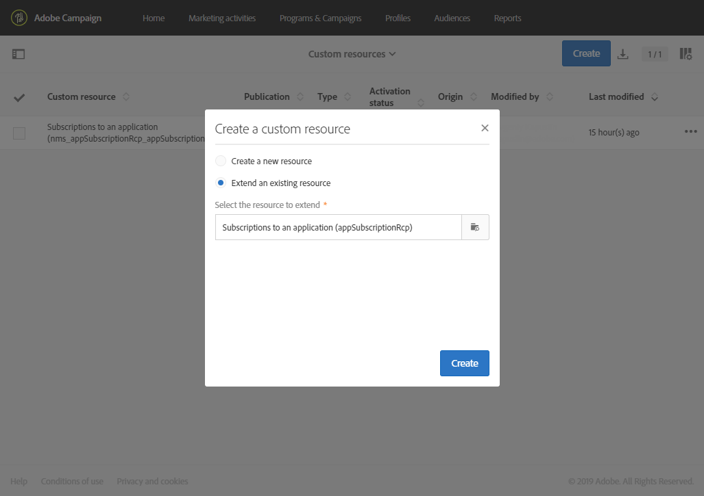

# De abonnementen uitbreiden naar een applicatieresource{#extending-the-subscriptions-to-an-application-resource}

In Adobe Campaign worden data van mobiele profielkenmerken die vanaf een mobiel apparaat worden verzonden, opgeslagen in de resource **[!UICONTROL Subscriptions to an application (appSubscriptionRcp)]** waardoor u de data die u van de abonnees van uw applicaties wilt verzamelen, kunt definiëren. For more information on custom resources, refer to [this page](../../developing/using/key-steps-to-add-a-resource.md).

Deze bron kan worden uitgebreid om gegevens te verzamelen die u van het mobiele apparaat naar Adobe Campaign wilt verzenden.

1. Selecteer in het geavanceerde menu dat u opent via het Adobe Campaign-logo achtereenvolgens **[!UICONTROL Administration]** > **[!UICONTROL Development]** en **[!UICONTROL Custom resources]**.
1. Klik **[!UICONTROL Create]** en kies de **[!UICONTROL Extend an existing resource]** optie.
1. Select the **[!UICONTROL Subscriptions to an application (appSubscriptionRcp)]** resource and click **[!UICONTROL Create]**.

   

1. Definieer in de **[!UICONTROL Fields]** categorie van het **[!UICONTROL Data structure]** tabblad de klantgegevens die u van uw mobiele toepassing wilt ophalen door op de **[!UICONTROL Add field]** knop te klikken.

   >[!NOTE]
   >
   >Als u meerdere mobiele toepassingen beheert, moeten alle velden die door al uw toepassingen worden gebruikt, worden vermeld. Met de iOS- of Android-oproep voor verzamelen van PII&#39;s wordt gedefinieerd welke velden door elke toepassing worden vastgelegd.

   

1. Voeg een **[!UICONTROL Label]** en een **[!UICONTROL ID]** veld toe aan het nieuwe veld. Selecteer de velden **[!UICONTROL Type]**.

   

1. In de **[!UICONTROL Link to profiles]** categorie configureert u de afstemmingssleutel die wordt gebruikt om de profielen van de Adobe Campaign-database te koppelen aan de abonnees van uw toepassingen, zoals de e-mail.

   Voor uw In-App-berichten kunt u slechts één afstemmingssleutel definiëren voor al uw mobiele toepassingen.

   

1. **[!UICONTROL Save]** en publiceert u uw aangepaste bron. Raadpleeg deze [pagina](../../developing/using/updating-the-database-structure.md#publishing-a-custom-resource)voor meer informatie over de publicatie van aangepaste bronnen.

