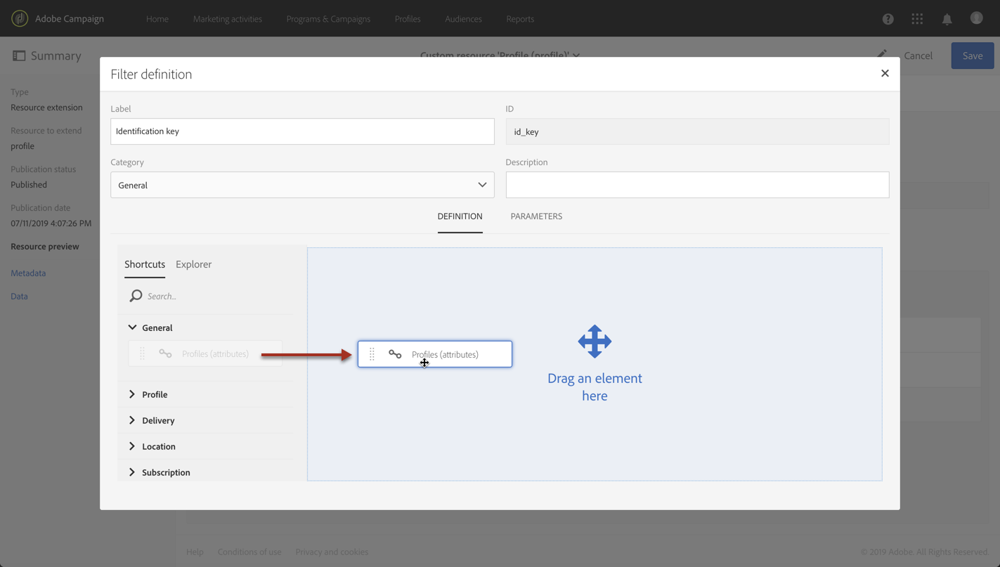
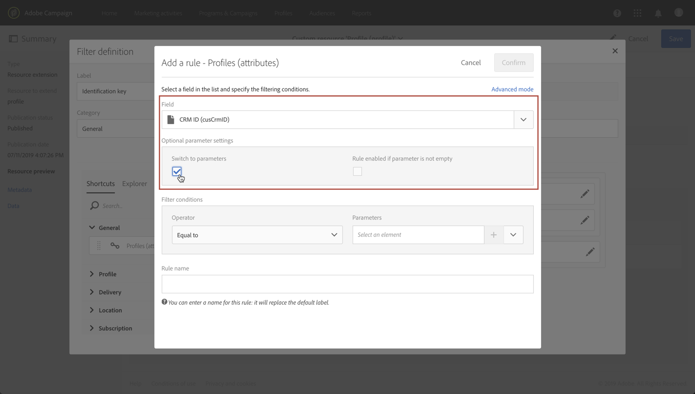
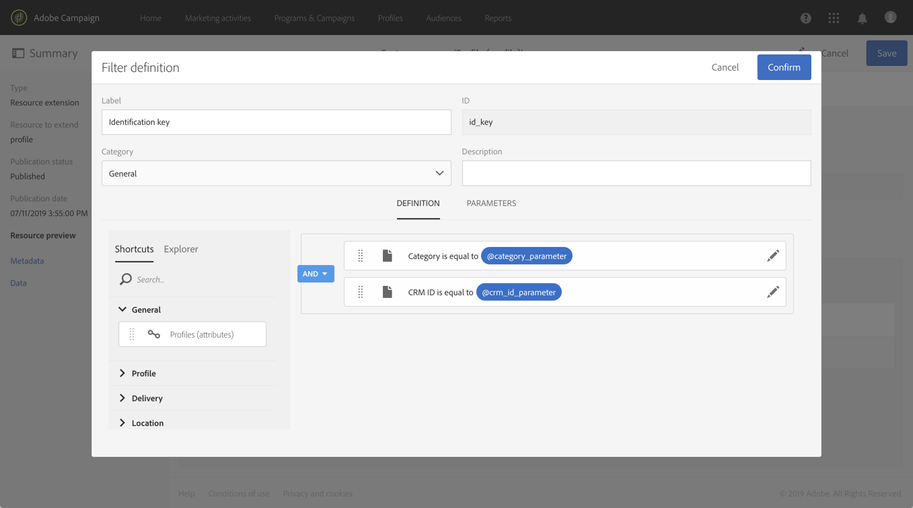
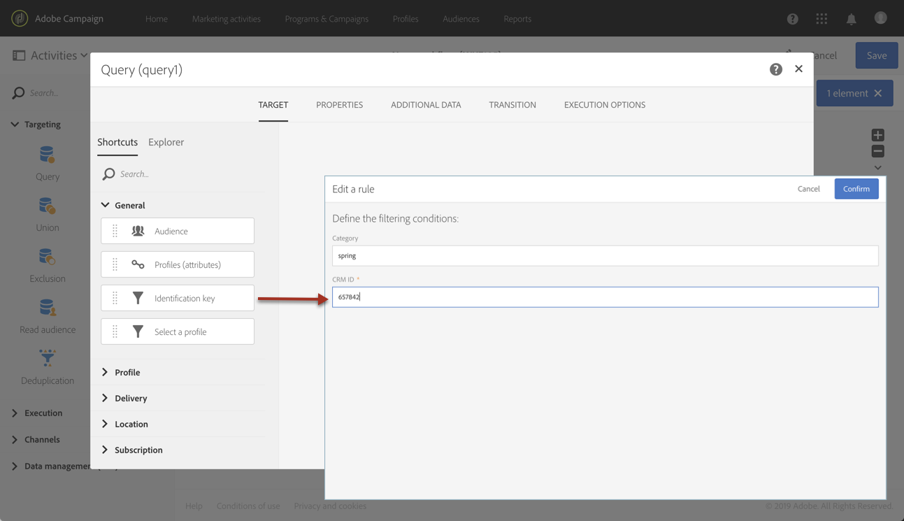

# Een bron aanroepen met een samengestelde identificatiesleutel{#calling-a-resource-using-a-composite-identification-key}

In sommige gevallen moet u voor een resource mogelijk een id-sleutel definiëren die uit twee velden bestaat. Zodra de identificatiesleutel wordt gevormd, moet u een filterdefinitie vormen om het middel met deze identificatiesleutel, of van de Standaardinterface van de Campagne of APIs te kunnen roepen.

In dit gebruiksgeval is de **profielbron** uitgebreid met het aangepaste veld **&quot;CRM-id&quot;** en **&quot;categorie&quot;** . We maken een identificatiesleutel voor de profielbron, die uit deze twee velden zal bestaan. Vervolgens configureren we een filterdefinitie, zodat we toegang hebben tot de profielbron met de id-toets.

De belangrijkste stappen voor dit gebruiksgeval zijn:

1. Vorm de identificatiesleutel voor het middel van het Profiel, dat op de twee gebieden wordt gebaseerd.
1. Vorm de filterdefinitie, om het middel van het Profiel te kunnen roepen gebruikend zijn identificatiecode.
1. Roep het middel van het Profiel van de interface of van APis aan.

Verwante onderwerpen:

* [De bron maken of uitbreiden](../../developing/using/creating-or-extending-the-resource.md)
* [Identificatietoetsen definiëren](../../developing/using/configuring-the-resource-s-data-structure.md#defining-identification-keys)
* [Standaard REST API&#39;s voor campagne](../../api/using/get-started-apis.md)

## Stap 1: De id-toets configureren{#step-1-configure-the-identification-key}

>[!NOTE]
> Algemene concepten bij het configureren van identificatietoetsen worden in [deze sectie](../../developing/using/configuring-the-resource-s-data-structure.md#defining-identification-keys)nader beschreven.

1. Voordat u de identificatiesleutel configureert, moet u controleren of de bron is uitgebreid met de gewenste velden en of deze is gepubliceerd. For more on this, refer to [this section](../../developing/using/creating-or-extending-the-resource.md).

1. Ga naar het **[!UICONTROL Administration]** / **[!UICONTROL Developement]** / **[!UICONTROL Custom resources]** menu en open de **[!UICONTROL Profile]** bron.

   

1. Klik in de **[!UICONTROL Identification keys]** sectie op de **[!UICONTROL Create element]** knop.

   

1. Voeg de twee aangepaste velden CRM-id en Categorie toe en klik vervolgens op **[!UICONTROL Confirm]**.

   

   >[!NOTE]
   > Als u de twee aangepaste velden in de interface van het profiel wilt weergeven, configureert u het **[!UICONTROL Screen definition]** tabblad. For more on this, refer to [this section](../../developing/using/configuring-the-screen-definition.md).

1. U kunt de filterdefinitie nu configureren om de bron aan te roepen met behulp van de id-sleutel.

## Stap 2: De filterdefinitie configureren{#step-2-configure-the-filter-definition}

>[!NOTE]
> Algemene concepten bij het configureren van filterdefinities worden in [deze sectie](../../developing/using/configuring-filter-definition.md)nader beschreven.

1. Klik op het **[!UICONTROL Filter definition]** tabblad **[!UICONTROL Add an element]** en voer vervolgens het label en de id van de filterdefinitie in.

1. Bewerk de eigenschappen van de filterdefinitie om de regels ervan te configureren.

   

1. Sleep de tabel met de velden in de identificatietoets naar de werkruimte.

   

1. Selecteer het eerste veld dat wordt gebruikt in de identificatietoets (&quot;CRM-id&quot;) en activeer vervolgens de **[!UICONTROL Switch to parameters]** optie.

   

1. Houd in de **[!UICONTROL Filter conditions]** sectie de **[!UICONTROL Equal]** operator, definieer vervolgens de naam van de parameter en klik op het plusteken om deze te maken.

   

   >[!NOTE]
   > Nadat u op de plusknop hebt geklikt, wordt de naam van de parameter automatisch gegenereerd. Let op deze informatie omdat u deze nodig hebt om het filter van de API&#39;s te gebruiken.

1. Herhaal bovenstaande stappen met alle velden waaruit de identificatiesleutel bestaat (&quot;categorie&quot;) en sla uw wijzigingen op.

   

1. De filterdefinitie is nu geconfigureerd. U kunt de bron publiceren zodat het filter beschikbaar is.

## Stap 3: Roep de bron aan op basis van de identificatiesleutel{#step-3-call-the-resource-based-on-its-identification-key}

Zodra de identificatiesleutel en zijn filterdefinitie worden gevormd, kunt u hen gebruiken om het middel, of van de standaardinterface van de Campagne of REST APIs te roepen.

Als u de filterdefinitie van de interface wilt gebruiken, gebruikt u een **[!UICONTROL Query]** activiteit in een workflow (zie [deze sectie](../../automating/using/query.md)). Het filter is vervolgens beschikbaar in het linkerdeelvenster.



Gebruik de onderstaande syntaxis om de filterdefinitie van standaard REST-API&#39;s voor campagnes te gebruiken:

```
GET /profileAndServicesExt/<resourceName>/by<filterName>?<param1_parameter>=<value>&<param2_parameter>=<value>
```

>[!NOTE]
>Als u een aangepast filter wilt aanroepen, gebruikt u het voorvoegsel &quot;by&quot; gevolgd door de filternaam die is gedefinieerd bij het configureren van de filterdefinitie in [stap 2](../../developing/using/uc-calling-resource-id-key.md#step-2-configure-the-filter-definition).

In ons geval zou de syntaxis om een profiel op te halen uit de categorie &quot;spring&quot; met de CRM-id &quot;123456&quot; als volgt zijn:

```
GET https://mc.adobe.io/<ORGANIZATION>/campaign/profileAndServicesExt/profile/byidentification_key?category_parameter=spring&crm_id_parameter=123456
```

Raadpleeg de documentatie [van de standaard REST API&#39;s voor](../../api/using/filtering.md)campagnes voor meer informatie.