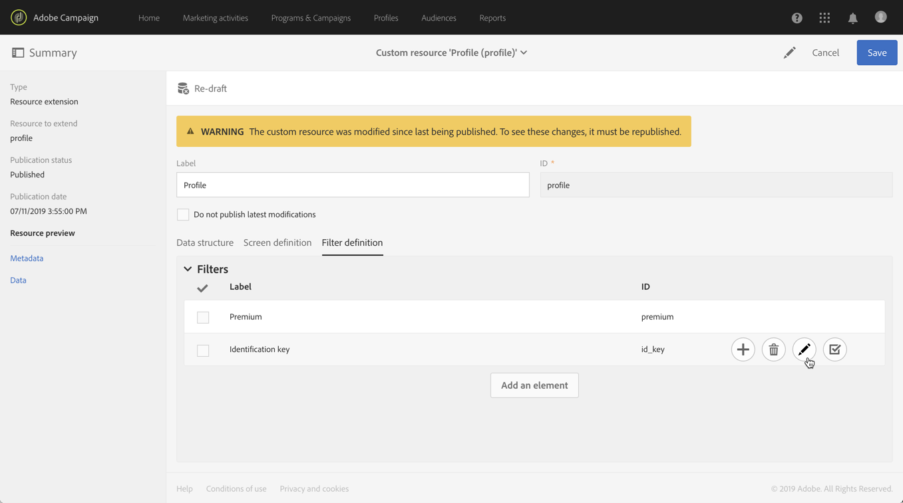

# Een resource aanroepen met een samengestelde identificatiesleutel{#calling-a-resource-using-a-composite-identification-key}

In sommige gevallen moet u voor een resource mogelijk een id-sleutel definiëren die uit twee velden bestaat. Zodra de identificatiesleutel wordt gevormd, moet u een filterdefinitie vormen om het middel met deze identificatiesleutel, of van de interface van Campaign Standard of APIs te kunnen roepen.

In dit geval is de **Profile**-bron uitgebreid met aangepaste **&quot;CRM-id&quot;** en **&quot;categorie&quot;** velden. We maken een identificatiesleutel voor de profielbron, die uit deze twee velden zal bestaan. Vervolgens configureren we een filterdefinitie, zodat we toegang hebben tot de profielbron met de id-toets.

De belangrijkste stappen voor dit gebruiksgeval zijn:

1. Vorm de identificatiesleutel voor het middel van het Profiel, dat op de twee gebieden wordt gebaseerd.
1. Vorm de filterdefinitie, om het middel van het Profiel te kunnen roepen gebruikend zijn identificatiecode.
1. Roep het middel van het Profiel van de interface of van APis aan.

Verwante onderwerpen:

* [De resource maken of uitbreiden](../../developing/using/creating-or-extending-the-resource.md)
* [Identificatiesleutels definiëren](../../developing/using/configuring-the-resource-s-data-structure.md#defining-identification-keys)
* [Campaign Standard REST API&#39;s](../../api/using/get-started-apis.md)

## Stap 1: De identificatiesleutel{#step-1-configure-the-identification-key} configureren

>[!NOTE]
> Algemene concepten bij het configureren van identificatietoetsen worden beschreven in [deze sectie](../../developing/using/configuring-the-resource-s-data-structure.md#defining-identification-keys).

1. Voordat u de identificatiesleutel configureert, moet u controleren of de bron is uitgebreid met de gewenste velden en of deze is gepubliceerd. Raadpleeg [deze sectie](../../developing/using/creating-or-extending-the-resource.md) voor meer informatie.

1. Ga naar **[!UICONTROL Administration]** / **[!UICONTROL Development]** / **[!UICONTROL Custom resources]** menu, dan open **[!UICONTROL Profile]** middel.

   

1. Klik in de sectie **[!UICONTROL Identification keys]** op de knop **[!UICONTROL Create element]**.

   

1. Voeg de twee aangepaste velden CRM-id en Categorie toe en klik op **[!UICONTROL Confirm]**.

   

   >[!NOTE]
   > Als u de twee douanevelden in de interface van het profiel wilt tonen, vorm **[!UICONTROL Screen definition]** tabel. Raadpleeg [deze sectie](../../developing/using/configuring-the-screen-definition.md) voor meer informatie.

1. U kunt de filterdefinitie nu configureren om de bron aan te roepen met behulp van de id-sleutel.

## Stap 2: De filterdefinitie configureren{#step-2-configure-the-filter-definition}

>[!NOTE]
> Algemene concepten bij het configureren van filterdefinities worden beschreven in [deze sectie](../../developing/using/configuring-filter-definition.md).

1. Klik op **[!UICONTROL Filter definition]** op het tabblad **[!UICONTROL Add an element]** en voer vervolgens het label en de id van de filterdefinitie in.

1. Bewerk de eigenschappen van de filterdefinitie om de regels ervan te configureren.

   

1. Sleep de tabel met de velden in de identificatietoets naar de werkruimte.

   

1. Selecteer het eerste veld dat wordt gebruikt in de identificatietoets (&quot;CRM-id&quot;) en activeer vervolgens de optie **[!UICONTROL Switch to parameters]**.

   

1. Houd in de sectie **[!UICONTROL Filter conditions]** de operator **[!UICONTROL Equal]**, definieer vervolgens de naam van de parameter en klik op het plusteken om deze te maken.

   

   >[!NOTE]
   > Nadat u op de knop **+** hebt geklikt, wordt de naam van de parameter automatisch gegenereerd. Let op deze informatie omdat u deze nodig hebt om het filter van de API&#39;s te gebruiken.

1. Herhaal bovenstaande stappen met alle velden waaruit de identificatiesleutel bestaat (&quot;categorie&quot;) en sla uw wijzigingen op.

   

1. De filterdefinitie is nu geconfigureerd. U kunt de bron publiceren zodat het filter beschikbaar is.

## Stap 3: Roep de bron aan op basis van zijn identificatiesleutel{#step-3-call-the-resource-based-on-its-identification-key}

Zodra de identificatiesleutel en zijn filterdefinitie worden gevormd, kunt u hen gebruiken om het middel, of van de standaardinterface van de Campagne of REST APIs te roepen.

Om de filterdefinitie van de interface te gebruiken, gebruik **[!UICONTROL Query]** activiteit in een werkschema (zie [deze sectie](../../automating/using/query.md)). Het filter is vervolgens beschikbaar in het linkerdeelvenster.


Gebruik de onderstaande syntaxis om de filterdefinitie van Campaign Standard REST API&#39;s te gebruiken:

```
GET /profileAndServicesExt/<resourceName>/by<filterName>?<param1_parameter>=<value>&<param2_parameter>=<value>
```

>[!NOTE]
>Als u een aangepast filter wilt aanroepen, gebruikt u het voorvoegsel &quot;by&quot; gevolgd door de filternaam die is gedefinieerd bij het configureren van de filterdefinitie in [stap 2](../../developing/using/uc-calling-resource-id-key.md#step-2-configure-the-filter-definition).

In ons geval zou de syntaxis om een profiel op te halen uit de categorie &quot;spring&quot; met de CRM-id &quot;123456&quot; als volgt zijn:

```
GET https://mc.adobe.io/<ORGANIZATION>/campaign/profileAndServicesExt/profile/byidentification_key?category_parameter=spring&crm_id_parameter=123456
```

Raadpleeg de documentatie van [Campaign Standard REST API&#39;s](../../api/using/filtering.md) voor meer informatie.