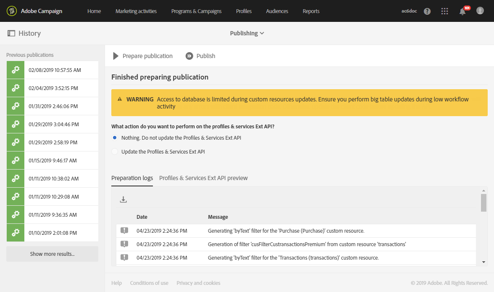

# De databasestructuur bijwerken{#updating-the-database-structure}

De databasestructuur moet worden bijgewerkt om wijzigingen in het datamodel door te voeren en ze te gebruiken.

>[!NOTE]
>
>Aangepaste bronnen worden tijdens door Adobe uitgevoerde automatische updates automatisch vernieuwd.

## Een aangepaste bron publiceren {#publishing-a-custom-resource}

De database moet worden bijgewerkt om de wijzigingen toe te passen die in de bronnen zijn aangebracht.

>[!NOTE]
>
>Als een veld van een aangepaste bron die wordt gebruikt voor een gebeurtenis, wordt aangepast of verwijderd, wordt de publicatie van de overeenkomstige gebeurtenis automatisch ongedaan gemaakt. Zie de sectie [Transactieberichten configureren](../../administration/using/configuring-transactional-messaging.md).

1. Selecteer in het geavanceerde menu dat u opent via het Adobe Campaign-logo achtereenvolgens **[!UICONTROL Administration]** > **[!UICONTROL Development]** en **[!UICONTROL Publishing]**.
1. De optie **[!UICONTROL Determine modifications since the last publication]** is standaard ingeschakeld, wat betekent dat alleen de wijzigingen worden toegepast die zijn uitgevoerd sinds de laatste update.

   >[!NOTE]
   >
   >De **[!UICONTROL Repair database structure]** herstelt een correcte configuratie als de publicatie niet kan worden voltooid. Alle wijzigingen die rechtstreeks in de database zijn uitgevoerd en geen aangepaste bronnen gebruiken, worden verwijderd.

   

1. Klik op de knop **[!UICONTROL Prepare publication]** om de analyse te starten. Houd er rekening mee dat grote tabelupdates het beste kunnen worden uitgevoerd wanneer de instantie niet intensief door workflows wordt gebruikt.

   Zie [Een bron met API-extensie publiceren](#publishing-a-resource-with-api-extension) voor meer informatie over de op de Profiles &amp; Services-API uit te voeren actie.

   

1. Klik na het uitvoeren van de publicatie op de knop **[!UICONTROL Publish]** om de nieuwe configuraties toe te passen.
1. Na publicatie toont het **[!UICONTROL Summary]** deelvenster van elke bron de actieve status **[!UICONTROL Published]** en de datum van de laatste publicatie.

   >[!NOTE]
   >
   >Herhaal deze bewerking als u nieuwe wijzigingen aanbrengt in een bron, zodat de wijzigingen kunnen worden toegepast.

   Bij bronnen met de status **[!UICONTROL Pending re-draft]** voor publicatie wordt er een extra bericht getoond waarin u wordt gevraagd uw acties te controleren, omdat publicatie resulteert in definitieve wijzigingen (het verwijderen van kolommen, tabellen...). Een tabblad **[!UICONTROL SQL Script]** helpt bij het uitvoeren van deze laatste wijziging. Het bevat de SQL-opdracht die tijdens de publicatie wordt uitgevoerd.

   

   >[!NOTE]
   >
   >U kunt het herschrijvingsproces stoppen door op de knop **[!UICONTROL Cancel re-draft]** te klikken. Dan wordt de oorspronkelijke status van de bron hersteld.

1. Als uw publicatie is mislukt, kunt u altijd teruggaan naar de vorige publicatie door op **[!UICONTROL Back to latest successful publication]** te klikken.

   Als u de publicatie in de status Fail laat staan, wordt er bij het aanmelden een pop-upvenster geopend om u eraan te herinneren om deze publicatie te repareren. Uw versie wordt pas bijgewerkt met nieuwe productversies als uw publicatie is gerepareerd.

   

## Een bron met API-extensie publiceren {#publishing-a-resource-with-api-extension}

U kunt de Profile and Services-API in de volgende gevallen maken:

* Wanneer u de aangepaste bronnen **[!UICONTROL Profiles]** of **[!UICONTROL Services]** uitbreidt, kunt u de Profile and Services-API bijwerken om de velden die zijn gedeclareerd in de aangepaste-bronextensie te integreren.
* Wanneer u een aangepaste bron definieert en een koppeling aanbrengt tussen de bronnen **[!UICONTROL Profiles]** of **[!UICONTROL Services]** en de aangepaste bron, kunt u een update uitvoeren, zodat de nieuwe bron in de API wordt opgenomen.

Selecteer deze optie in het publicatiescherm.

* Als de API nog niet is gepubliceerd (dus als u de bron nooit hebt uitgebreid of als u deze optie voor deze of een andere bron nog nooit hebt ingeschakeld), hebt u de keuze om deze wel of niet te maken.

   

* Als de API al is gepubliceerd (wat betekent dat u de bron al hebt uitgebreid en deze optie één keer hebt ingeschakeld), wordt de API-update geforceerd.

   Als de API eenmaal is gemaakt, wordt deze automatisch bijgewerkt telkens wanneer u deze opnieuw publiceert. Zo wordt voorkomen dat het profiel of de servicebron van deze API wordt verbroken en uw instantie beschadigd raakt.

Standaard wordt de aangepaste bron geïntegreerd, maar als u deze bron voor een specifiek gedrag niet wilt publiceren, kunt u de optie **[!UICONTROL Hide this resource from APIs]** in de **[!UICONTROL Resource Properties]** selecteren.

In Adobe Campaign ziet u na de stap **[!UICONTROL Prepare Publication]** de delta tussen de huidige versie van de API en de toekomstige versie na publicatie in het tabblad **[!UICONTROL Profiles & Services API Preview]**. Als u de API voor het eerst uitbreidt, vergelijkt de delta de kant-en-klare definitie van de aangepaste bron met uw extensie.

De informatie die op het tabblad wordt weergegeven, bestaat uit drie gedeelten: toegevoegde, verwijderde en gewijzigde elementen.

De analyse van de delta is een verplichte stap, aangezien de publicatiestap het API-gedrag zal wijzigen en de omringende ontwikkeling hoogstwaarschijnlijk in een domino-effect zal beïnvloeden.

>[!NOTE]
>
>Deze publicatie werkt de **[!UICONTROL profilesAndServicesExt]**-API bij. De **[!UICONTROL profilesAndServices]**-API is niet bijgewerkt.

Meer informatie over de Adobe Campaign-API vindt u in de speciale documentatie van Adobe Campaign over [Adobe IO](https://docs.campaign.adobe.com/doc/standard/en/adobeio.html).
