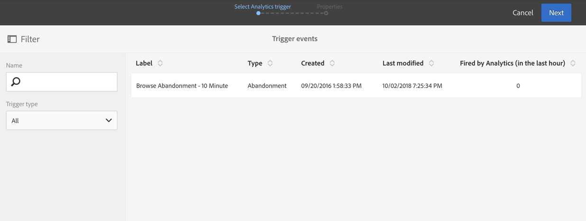

# Gebruiksscenario’s voor triggers bij afbrekingsacties{#abandonment-triggers-use-cases}

In deze sectie worden verschillende gebruiksscenario’s beschreven die kunnen worden geïmplementeerd met de integratie tussen Adobe Campaign en Experience Cloud Triggers. U vindt twee voorbeelden van gebruiksscenario’s:

* [Trigger voor afbreken van bladeren](#browse-abandonment-trigger): Stuur een bericht naar klanten die hun bezoek op uw website hebben afgebroken.
* [Trigger voor afbreken van zoekopdracht](#search-abandonment-trigger): Neem opnieuw contact op met bezoekers die een zoekopdracht op uw website hebben uitgevoerd, maar geen aankoop hebben gedaan.

>[!NOTE]
>
>De gebruiksscenario’s die in deze sectie worden beschreven, zijn afhankelijk van Experience Cloud Visitor ID. U kunt ze ook implementeren met Experience Cloud Declared ID. Gehashte en versleutelde gedeclareerde id’s worden ook ondersteund. U kunt e-mails/sms’en verzenden naar een profiel dat niet in Campaign bestaat door het versleutelde e-mailadres/mobiele nummer direct te ontsleutelen. In dit geval kan personalisatie met behulp van profieldata echter niet worden gebruikt.

## Voorwaarden {#pre-requisites}

Deze gebruiksscenario’s kunnen alleen worden geïmplementeerd als u toegang hebt tot de volgende oplossingen/kernservices:

* Adobe Campaign
* Adobe Analytics Ultimate, Premium, Foundation, OD, Select, Prime, Mobile Apps, Select of Standard.
* Experience Cloud Triggers-kernservice
* Experience Cloud DTM-kernservice
* Experience Cloud Visitor ID- en Experience Cloud People-kernservice

U hebt ook een werkende website nodig.

Raadpleeg [Oplossingen en services configureren](../../integrating/using/configuring-triggers-in-experience-cloud.md#configuring-solutions-and-services) voor meer informatie.

## Trigger voor afbreken van bladeren {#browse-abandonment-trigger}

In dit gebruiksscenario maken we een eenvoudige trigger die wordt geactiveerd telkens wanneer een klant een bezoek op de website afbreekt. In dit voorbeeld wordt ervan uitgegaan dat u al over DTM beschikt om data te verzamelen en naar Adobe Analytics te verzenden en dat al uw gebeurtenissen zijn gemaakt.

### Een Experience Cloud Trigger maken {#creating-an-experience-cloud-trigger}

1. Selecteer **[!UICONTROL Manage Triggers]** in het menu van de Experience Cloud Activation-kernservice.

   

1. Kies een triggertype (in ons gebruiksscenario is dit **[!UICONTROL Abandonment]**).

   

1. Voor dit gebruiksscenario hebben we een eenvoudige trigger voor afbreking nodig. Het bedrijfsdoel is bezoekers te identificeren die door onze boekingssite bladeren, naar de pagina met deals kijken, maar geen reis boeken. Zodra we deze doelgroep hebben geïdentificeerd, willen we deze binnen korte tijd opnieuw kunnen bereiken. In dit voorbeeld kiezen we ervoor de trigger na een periode van 10 minuten te verzenden.

   

### De trigger gebruiken in Adobe Campaign {#using-the-trigger-in-adobe-campaign}

Nu we een Experience Cloud Trigger hebben gemaakt, gebruiken we deze in Adobe Campaign.

In Adobe Campaign moet u een trigger maken die gekoppeld is aan de trigger die u in Experience Cloud hebt gemaakt.

1. Als u de trigger in Adobe Campaign wilt maken, klikt u op het **[!UICONTROL Adobe Campaign]**-logo in de linkerbovenhoek en selecteert u **[!UICONTROL Marketing plans]** > **[!UICONTROL Transactional messages]** > **[!UICONTROL Experience Cloud triggers]**.

   

1. Klik op **[!UICONTROL Create]**.
1. Selecteer de trigger die u eerder hebt gemaakt en klik op **[!UICONTROL Next]**.

   

1. Selecteer het kanaal **[!UICONTROL Email]** en de doeldimensie **[!UICONTROL Real-time event]** en klik op **[!UICONTROL Create]**.

   

1. Publiceer de trigger in Adobe Campaign. Met dit proces wordt automatisch een sjabloon voor een transactioneel bericht gemaakt.

   

1. Als u de berichtsjabloon wilt weergeven, klikt u op de knop **[!UICONTROL More]** in de rechterbovenhoek en vervolgens klikt u op **[!UICONTROL Trigger Transactional Template]**.

1. Pas de content en de data van de afzender aan.

   

1. Publiceer de berichtsjabloon. De trigger is nu live en actief.

   

### Het scenario uitvoeren {#running-the-scenario}

1. Dit gebruiksscenario begint met een eerste e-mail die naar uw doelgroep wordt verzonden met Adobe Campaign.

   

1. De ontvanger opent de e-mail.

   

1. De ontvanger klikt op een koppeling die hem/haar naar uw website brengt. In dit voorbeeld brengt de banner de ontvanger naar de startpagina van de boekingssite.

   

1. De ontvanger gaat naar de pagina met deals, maar opeens stopt zijn bezoek. Na een periode van 10 minuten activeert Adobe Campaign het verzenden van het transactionele bericht.

   

1. U kunt op elk gewenst moment de Experience Cloud-logboeken controleren om te zien hoe vaak de trigger is geactiveerd.

   

1. U kunt ook het Adobe Campaign-triggerrapport weergeven.

   

## Trigger voor afbreken van zoekopdracht {#search-abandonment-trigger}

In dit gebruiksscenario maken we een trigger om opnieuw contact op te nemen met bezoekers die onze boekingssite hebben bezocht, naar een bestemming hebben gezocht, geen geschikte resultaten hebben gevonden en daarna niets hebben geboekt. Het algemene proces is hetzelfde als in het vorige gebruiksscenario (zie [Trigger voor afbreken van bladeren](#browse-abandonment-trigger)). We concentreren ons daarom hier op het personaliseren van de remarketing-e-mail.

### Een Experience Cloud Trigger maken {#creating-an-experience-cloud-trigger-1}

Voer de stappen uit die in het vorige gebruiksscenario zijn beschreven om de Experience Cloud Trigger te maken. Zie [Een Experience Cloud Trigger maken](#creating-an-experience-cloud-trigger). Het belangrijkste verschil is de triggerdefinitie.

In de sectie **[!UICONTROL Include Meta Data]** kunt u alle data die zijn verzameld via Analytics doorgeven aan de triggerpayload. In dit voorbeeld maken we een aangepaste eVar (bijvoorbeeld eVar 3) om de zoekterm te verzamelen die de bezoeker invoert. Deze term wordt vervolgens gebruikt in het transactionele e-mailbericht dat aan dezelfde bezoeker wordt verzonden.

### De trigger gebruiken in Adobe Campaign {#using-the-trigger-in-adobe-campaign-1}

1. Voer de stappen uit die in het vorige gebruiksscenario zijn beschreven om de trigger in Adobe Campaign te maken. Zie [De trigger gebruiken in Adobe Campaign](#using-the-trigger-in-adobe-campaign). Het belangrijkste verschil is hoe we in Adobe Campaign toegang krijgen tot en gebruikmaken van de metadata die naar de triggerpayload worden gepusht.
1. Klik in de trigger voor het afbreken van een zoekopdracht die u in Adobe Campaign hebt gemaakt op het pictogram **[!UICONTROL Event content and enrichment]** om de payload weer te geven die naar Adobe Campaign wordt gepusht.

   

1. Zoals u ziet, wordt de aangepaste eVar doorgegeven naar de triggerpayload en aan de tabel **Event Context** (ctx) toegewezen. We kunnen het nu gebruiken om het transactionele bericht te personaliseren.

   

1. In dit voorbeeld kiezen we ervoor om de zoekterm voor de bestemming op te nemen in de onderwerpregel en in de hoofdtekst van de e-mail.

   

1. Wanneer u een gepersonaliseerd veld selecteert, zoekt u naar de metadata van de payload in de tabel **Transactional event** (rtEvent) en vervolgens in de subtabel **Event context** (ctx).

   

### Het scenario uitvoeren {#running-the-scenario-1}

1. De bezoeker gaat naar de boekingssite en zoekt naar een bestemming. In dit voorbeeld zoekt de bezoeker naar een reis naar Japan, maar vindt geen resultaat. Dit is een kans voor ons om opnieuw contact op te nemen met deze bezoeker en een alternatief reisplan voor te stellen.

   

   >[!NOTE]
   >
   >In dit gebruiksscenario gaan we ervan uit dat de bezoeker/ontvanger al een e-mail van dezelfde website heeft geopend en erop heeft geklikt. Dit staat ons toe om de VisitorID te gebruiken en te verzamelen en deze aan de ontvanger toe te wijzen. We hoeven dit maar één keer te doen.

1. Een paar ogenblikken later ontvangt dezelfde bezoeker/ontvanger een remarketingbericht. Het bericht omvat de onlangs gezochte bestemming.

   

