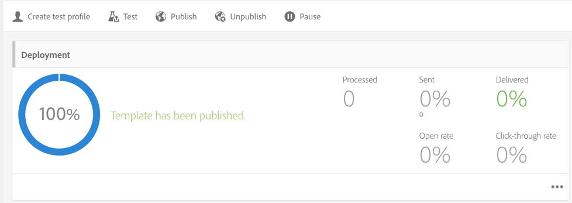
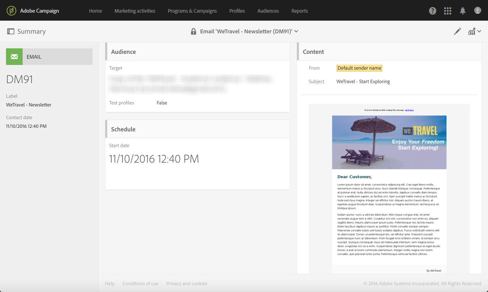

# Afsluiten Gebruiksgevallen activeren{#abandonment-triggers-use-cases}

In deze sectie worden verschillende gebruiksgevallen beschreven die kunnen worden geïmplementeerd via de integratie tussen Adobe Campaign en Experience Cloud Triggers. U zult twee voorbeelden van gebruiksgevallen vinden:

* [Trigger](#browse-abandonment-trigger)voor verlaten bladeren: Stuur een bericht naar klanten die hun bezoek op uw website hebben stopgezet.
* [Trigger voor](#search-abandonment-trigger)verlaten van zoekopdracht: Neem opnieuw contact op met bezoekers die een zoekopdracht op uw website hebben uitgevoerd, maar geen aankoop hebben gedaan.

>[!NOTE]
>
>De gebruiksgevallen die in deze sectie worden beschreven, zijn afhankelijk van de Experience Cloud Visitor ID. U kunt ze ook implementeren met de door Experience Cloud gedeclareerde id. Onderbroken en gecodeerde gedeclareerde id&#39;s worden ook ondersteund. U kunt e-mails/SMS verzenden naar een profiel dat niet in Campagne bestaat door het gecodeerde e-mailadres/mobiele nummer rechtstreeks te decoderen. Maar in dit geval kan personalisatie met behulp van profielgegevens niet worden gebruikt.

## Voorwaarden {#pre-requisites}

Deze gebruiksgevallen kunnen alleen worden geïmplementeerd als u toegang hebt tot de volgende oplossingen/kernservices:

* Adobe-campagne
* Adobe Analytics Ultimate, Premium, Foundation, OD, Select, Prime, Mobile Apps, Select of Standard.
* Experience Cloud Triggers Core Service
* Ervaar de Cloud DTM Core-service
* Ervaar de Cloud Visitor ID en Ervaar Cloud People Core Service

U hebt ook een werkende website nodig.

Voor meer informatie, verwijs naar het [Vormen oplossingen en de diensten](../../integrating/using/configuring-triggers-in-experience-cloud.md#configuring-solutions-and-services).

## Bladeren door activeringstrigger {#browse-abandonment-trigger}

In dit geval gaan we een eenvoudige trigger maken die wordt geactiveerd telkens wanneer een klant een bezoek op de website verlaat. In dit voorbeeld wordt ervan uitgegaan dat u al over DTM beschikt om gegevens te verzamelen en naar Adobe Analytics te verzenden en dat al uw gebeurtenissen zijn gemaakt.

### Een Experience Cloud Trigger maken {#creating-an-experience-cloud-trigger}

1. Selecteer **[!UICONTROL Manage Triggers]** in het menu Experience Cloud Activation Core Service.

   

1. Kies een triggertype ( **[!UICONTROL Abandonment]** in ons gebruik).

   

1. Voor dit gebruik hebben we een eenvoudige reden voor stopzetting nodig. Het bedrijfsdoel is bezoekers te identificeren die door onze reisboekingswebsite bladeren, kijken naar de pagina &quot;Deals&quot;maar geen reis boeken. Zodra we dit publiek identificeren, willen we het binnen een korte tijd weer bereiken. In dit voorbeeld kiezen we ervoor de trigger na een periode van 10 minuten te verzenden.

   

### De trigger gebruiken in Adobe Campagne {#using-the-trigger-in-adobe-campaign}

Nu we een Experience Cloud Trigger hebben gemaakt, gebruiken we deze in Adobe Campaign.

In Adobe Campaign moet u een trigger maken die is gekoppeld aan de trigger die u in de Experience Cloud hebt gemaakt.

1. Als u de trigger in Adobe Campaign wilt maken, klikt u op het **[!UICONTROL Adobe Campaign]** logo in de linkerbovenhoek en selecteert u **[!UICONTROL Marketing plans]** > **[!UICONTROL Transactional messages]** > **[!UICONTROL Experience Cloud triggers]**.

   

1. Klik op **[!UICONTROL Create]**.
1. Selecteer de trigger die u eerder hebt gemaakt en klik op **[!UICONTROL Next]**.

   

1. Selecteer het **[!UICONTROL Email]** kanaal en de **[!UICONTROL Real-time event]** doeldimensie en klik **[!UICONTROL Create]**.

   

1. Publiceer de trigger in de Adobe-campagne. Dit proces zal automatisch tot een transactiemalplaatje van het berichtbericht leiden.

   

1. Als u de berichtsjabloon wilt weergeven, klikt u op de **[!UICONTROL More]** knop rechtsboven en klikt u op **[!UICONTROL Trigger Transactional Template]**.

1. Pas de inhoud en verzendgegevens aan.

   

1. Publiceer het berichtmalplaatje. De trigger is nu live en functioneel.

   

### Het scenario uitvoeren {#running-the-scenario}

1. Deze kwestie begint met een eerste e-mail die naar uw publiek wordt verzonden met de Campagne van Adobe.

   

1. De ontvanger opent de e-mail.

   

1. Hij klikt op een koppeling die hem naar uw website brengt. In dit voorbeeld brengt de banner de ontvanger naar de homepage van de website voor het boeken van de reis.

   

1. De ontvanger gaat naar de pagina &quot;Deals&quot;maar opeens stopt zijn bezoek. Na een periode van 10 minuten activeert Adobe Campaign het verzenden van het transactiemelding.

   

1. U kunt op elk gewenst moment de logboeken van de Experience Cloud controleren om te zien hoe vaak de trigger is geactiveerd.

   

1. U kunt ook het triggerrapport voor Adobe Campagne weergeven.

   

## Trigger voor verlaten van zoekopdracht {#search-abandonment-trigger}

In dit gebruiksgeval gaan we een trigger maken om opnieuw te gaan samenwerken met bezoekers die op onze site voor het boeken van reizen zijn gegaan, naar een bestemming zijn gezocht, geen resultaten hebben opgeleverd en daarna niets hebben geboekt. Het algemene proces is het zelfde als in het vorige gebruiksgeval (zie de Trigger van de [Verlaat van de Verlaat](#browse-abandonment-trigger)doorbladeren). We zullen ons hier concentreren op het aanpassen van het e-mailbericht voor opnieuw in de handel brengen.

### Een Experience Cloud Trigger maken {#creating-an-experience-cloud-trigger-1}

Voer de stappen uit die in het vorige gebruiksscenario zijn beschreven om de Experience Cloud Trigger te maken. Zie [Een Experience Cloud Trigger](#creating-an-experience-cloud-trigger)maken. Het belangrijkste verschil is de triggerdefinitie.

In de **[!UICONTROL Include Meta Data]** sectie kunt u alle gegevens die zijn verzameld van Analytics doorgeven aan de triggerlading. In dit voorbeeld maken we een aangepaste eVar (bijvoorbeeld eVar 3) om de zoekterm te verzamelen die de bezoeker invoert. Deze term wordt vervolgens gebruikt in het transactiebericht dat aan dezelfde bezoeker wordt verzonden.

### De trigger gebruiken in Adobe Campagne {#using-the-trigger-in-adobe-campaign-1}

1. Voer de stappen uit die in het vorige gebruiksgeval zijn beschreven om de trigger in Adobe Campaign te maken. Zie De trigger [gebruiken in Adobe Campaign](#using-the-trigger-in-adobe-campaign). Het belangrijkste verschil is hoe we in Adobe Campaign toegang krijgen tot de metagegevens die in de triggerlading worden geduwd.
1. Klik in de zoekopdrachtregelactivering die u in Adobe Campagne hebt gemaakt op het **[!UICONTROL Event content and enrichment]** pictogram om de payload weer te geven die naar Adobe Campagne wordt geduwd.

   

1. Zoals u kunt zien, wordt de aangepaste eVar overgegaan in de lading van de Trekker en aan de lijst van de Context **van de** Gebeurtenis (ctx) in kaart gebracht. We kunnen het nu gebruiken om het transactiebericht te personaliseren.

   

1. In dit voorbeeld kiezen we ervoor om de zoekterm voor de bestemming op te nemen in de onderwerpregel en in de berichttekst.

   

1. Wanneer u een gepersonaliseerd veld selecteert, zoekt u naar de metagegevens van de payload in de tabel **TransactionEvent** (rtEvent) en vervolgens in de subtabel **Event context** (ctx).

   

### Het scenario uitvoeren {#running-the-scenario-1}

1. De bezoeker gaat op de reisboekingswebsite en zoekt naar een bestemming. In dit voorbeeld zoekt de bezoeker naar een reis naar Japan, maar vindt hij geen resultaat. Dit is een kans voor ons om terug te keren naar deze bezoeker en een alternatief reisplan aan te bevelen.

   

   >[!NOTE]
   >
   >In dit geval gaan we ervan uit dat de bezoeker/ontvanger al een e-mail van dezelfde website heeft geopend en erop heeft geklikt. Dit staat ons toe om VisitorID te gebruiken en te verzamelen en het aan de ontvanger in kaart te brengen. We hoeven dit maar één keer te doen.

1. Een paar ogenblikken later ontvangt dezelfde bezoeker/ontvanger een bericht voor het opnieuw in de handel brengen. Het bericht omvat de onlangs gezochte bestemming.

   

