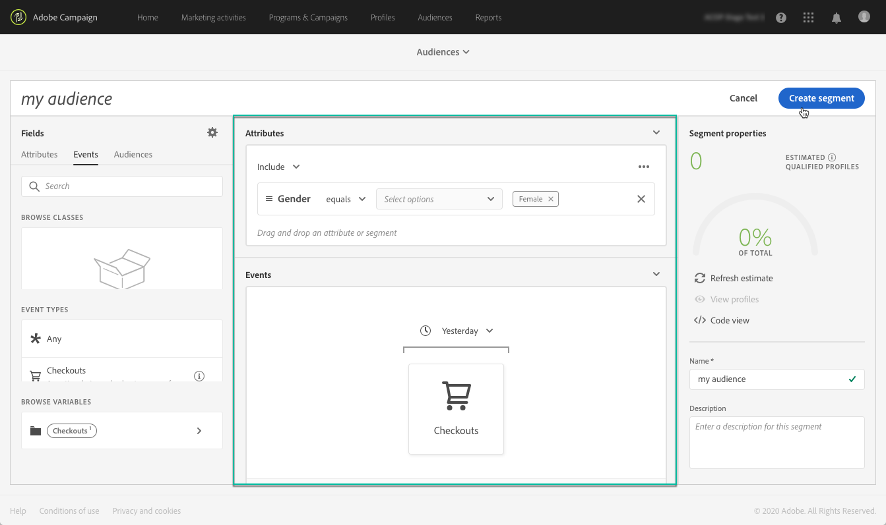

# Adobe Experience Platform-doelgroepen beheren {#about-audiences}

>[!IMPORTANT]
>
>De Dienst van de Doelen van het publiek is momenteel in bèta, die aan regelmatige updates zonder bericht kan worden onderworpen. Klanten moeten op Azure (momenteel alleen in bèta voor Noord-Amerika) worden gehost om toegang te krijgen tot deze mogelijkheden. Neem contact op met de klantenservice van Adobe als u toegang wilt.

## Toegang tot Adobe Experience Platform-publiek

Als u toegang wilt tot de Adobe Experience Platform-segmentbuilder, navigeert u naar de **[!UICONTROL Audiences]** -kaart op de startpagina van Campaign Standard (of de **[!UICONTROL Audiences]** -koppeling in de koptekst) en selecteert u de **[!UICONTROL Adobe Experience Platform]** -omgeving.

U wordt eerst omgeleid naar de pagina met Adobe Experience Platform-segmentlijsten, waar u reeds bestaande Adobe Experience Platform-segmenten kunt openen voor verdere bewerking.

Er zijn een zoekbalk en filter beschikbaar waarmee u het gewenste Adobe Experience Platform-segment kunt vinden.

## Adobe Experience Platform-publiek maken

Ga als volgt te werk om een Adobe Experience Platform-publiek rechtstreeks in Campaign Standard te maken:

1. Klik op de pagina met Adobe Experience Platform-segmentlijsten op de knop **[!UICONTROL New audience]** in de rechterhoek.

   

1. De Segment Builder moet nu in uw werkruimte worden weergegeven. Hiermee kunt u een segment maken met gegevens uit Adobe Experience Platform die uiteindelijk worden gebruikt om uw publiek te maken.

1. Geef het segment een naam in het rechterdeelvenster en voer een beschrijving in (optioneel).

   

1. Om een segment met succes tot stand te brengen, moet u a **fusiebeleid** selecteren dat uw marketing doel voor dit segment aanpast.

   In de instellingenruit, wordt een Platform standaardsamenvoegbeleid geselecteerd. Voor meer informatie over samenvoegbeleid, verwijs naar de specifieke sectie van de [ gebruikersgids van de Bouwer van het Segment ](https://experienceleague.adobe.com/docs/experience-platform/segmentation/ui/overview.html).

   

1. Bepaal de regels die de profielen zullen identificeren die in uw publiek moeten worden teruggewonnen.

   Om dit te doen, sleep de gewenste attributen en/of de gebeurtenissen van de linkerruit in de werkruimte, bepaal de overeenkomstige regels dan klik de **[!UICONTROL Create segment]** knoop om het segment (zie [ Gebruikend de Bouwer van het Segment ](../../integrating/using/aep-using-segment-builder.md)) te bewaren.

   

Het publiek is nu klaar om worden geactiveerd, kunt u het als doel voor uw campagnes gebruiken (zie [ richtend het publiek van Adobe Experience Platform ](../../integrating/using/aep-targeting-audiences.md)).

## Soorten publiek bewerken

Om een publiek uit te geven, open het en wijzig de regels zoals nodig binnen de interface van de Bouwer van het Segment (zie [ Gebruikend de Bouwer van het Segment ](../../integrating/using/aep-using-segment-builder.md)).

Nadat de wijzigingen zijn voltooid, klikt u op de knop **[!UICONTROL Save segment]** om het publiek bij te werken.

