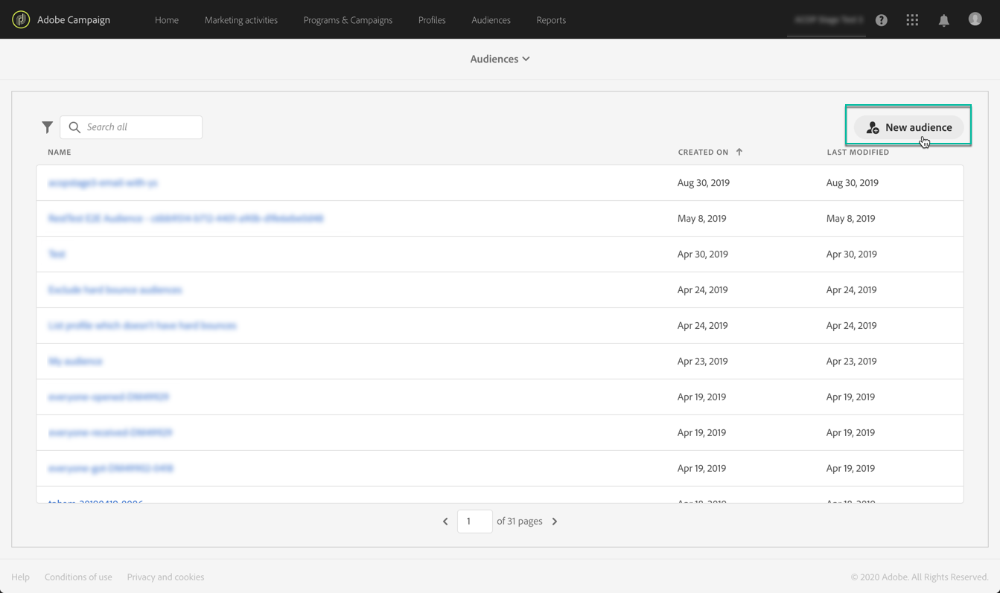
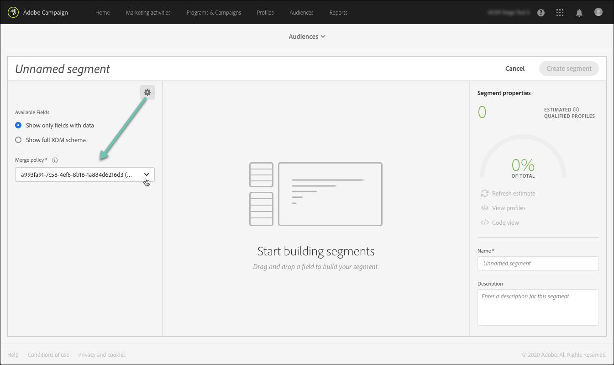

# Adobe Experience Platform-doelgroepen beheren {#about-audiences}

>[!IMPORTANT]
>
>De Dienst van de Doelen van het publiek is momenteel in bèta, die aan regelmatige updates zonder bericht kan worden onderworpen. Klanten moeten op Azure (momenteel alleen in bèta voor Noord-Amerika) worden gehost om toegang te krijgen tot deze mogelijkheden. Neem contact op met de klantenservice van de Adobe als u toegang wilt.

## Toegang tot Adobe Experience Platform-publiek

Als u toegang wilt tot de Adobe Experience Platform-segmentbuilder, navigeert u naar de **[!UICONTROL Audiences]** kaart op homepage van Campaign Standard (of **[!UICONTROL Audiences]** (in de koptekst) en selecteer vervolgens de optie **[!UICONTROL Adobe Experience Platform]** milieu.

U wordt eerst omgeleid naar de pagina met Adobe Experience Platform-segmentlijsten, waar u reeds bestaande Adobe Experience Platform-segmenten kunt openen voor verdere bewerking.

Er zijn een zoekbalk en filter beschikbaar waarmee u het gewenste Adobe Experience Platform-segment kunt vinden.

## Adobe Experience Platform-publiek maken

Ga als volgt te werk om een Adobe Experience Platform-publiek rechtstreeks in Campaign Standard te maken:

1. Klik op de pagina in de lijst met Adobe Experience Platform-segmenten op **[!UICONTROL New audience]** in de rechterhoek.

   

1. De Segment Builder moet nu in uw werkruimte worden weergegeven. Hiermee kunt u een segment maken met gegevens uit Adobe Experience Platform die uiteindelijk worden gebruikt om uw publiek te maken.

1. Geef het segment een naam in het rechterdeelvenster en voer een beschrijving in (optioneel).

   

1. Als u een segment wilt maken, moet u een **samenvoegingsbeleid** dat overeenkomt met uw marketingdoel voor dit segment.

   In de instellingenruit, wordt een Platform standaardsamenvoegbeleid geselecteerd. Voor meer informatie over fusiebeleid, verwijs naar de specifieke sectie van [Gebruikershandleiding voor Segment Builder](https://experienceleague.adobe.com/docs/experience-platform/segmentation/ui/overview.html).

   

1. Bepaal de regels die de profielen zullen identificeren die in uw publiek moeten worden teruggewonnen.

   Hiervoor sleept u de gewenste kenmerken en/of gebeurtenissen vanuit het linkerdeelvenster naar de werkruimte, definieert u de corresponderende regels en klikt u op de knop **[!UICONTROL Create segment]** om het segment op te slaan (zie [De Segment Builder gebruiken](../../integrating/using/aep-using-segment-builder.md)).

   

Het publiek is nu klaar om te worden geactiveerd, kunt u het gebruiken als doel voor uw campagnes (zie [Adobe Experience Platform-doelgroepen](../../integrating/using/aep-targeting-audiences.md)).

## Doelgroepen bewerken

Om een publiek uit te geven, open het en wijzig de regels zoals nodig binnen de interface van de Bouwer van het Segment (zie [De Segment Builder gebruiken](../../integrating/using/aep-using-segment-builder.md)).

Klik op de knop **[!UICONTROL Save segment]** om uw publiek bij te werken.

