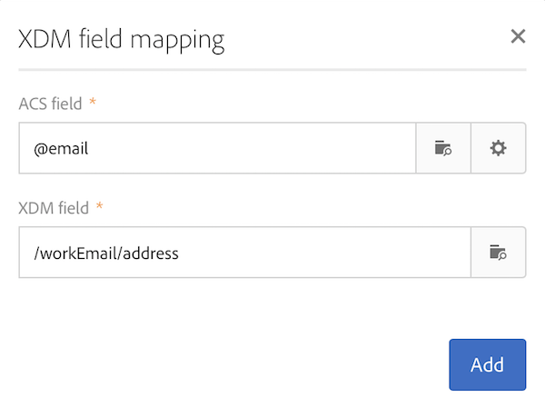

# Toewijzingsdefinitie {#mapping-definition}

>[!IMPORTANT]
>
>Adobe Experience Platform Data Connector bevindt zich momenteel in bèta, die vaak zonder voorafgaande kennisgeving kan worden bijgewerkt. Klanten moeten op Azure (momenteel alleen in bèta voor Noord-Amerika) worden gehost om toegang te krijgen tot deze mogelijkheden. Neem contact op met de klantenservice van Adobe als u toegang wilt.

In deze sectie, zult u ontdekken hoe te om een gebied van Campaign Standard met een gebied van de Gegevens van de Ervaring in kaart te brengen van een Model (XDM).

Om deze taak uit te voeren, zijn de eerste vereisten:

* een XDM-schemadefinitie via de interface of met behulp van de REST API die aan XDM is gekoppeld
* een verwezenlijking Dataset die op de XDM schemadefinitie wordt gebaseerd

1. Ga naar **[!UICONTROL Administration]** > **[!UICONTROL Development]** > **[!UICONTROL Platform]** en kies de **[!UICONTROL Data mappings]** ingang.

1. Klik op **[!UICONTROL Create]** om een nieuwe XDM-toewijzing te starten.

   

1. Vul de verplichte velden in en selecteer:

   * a **doeldimensie**: dit is het Campaign Standard-schema dat moet worden toegewezen
   * a **dataset**: Dit is het gegevenspakket dat aan een XDM-schema in Adobe Experience Platform is gekoppeld.

>[!NOTE]
>
>Als een partij in het Profiel van de Klant in real time of de Dienst van de Identiteit moet worden opgenomen, moet de dataset [toegelaten voor het Profiel van de Klant in real time](https://experienceleague.adobe.com/docs/experience-platform/rtcdp/intro/get-started.html) zijn.
>
>Als de gegevensset die u selecteert al wordt gebruikt in een bestaande gegevenstoewijzing, wordt een waarschuwing weergegeven dat uw gegevens mogelijk worden overschreven op Adobe Experience Platform. Dit kan gebeuren wanneer er sommige gemeenschappelijke ontvangers in datamappings gebruikend een zelfde dataset zijn.

Het volgende scherm stelt de **[!UICONTROL Field mappings]** sectie voor waar u een nieuwe afbeelding voor elk gebied in het schema van de Campaign Standard kunt tot stand brengen.

Met de knop **[!UICONTROL Create new field mapping]** kunt u het veld Campaign Standard en de bijbehorende veldpadexpressie selecteren in het XDM-schema.

Als u geen Adobe Campaign Standard-veld kunt vinden, kunt u het zoekveld gebruiken om naar het veld te zoeken. Op dit moment werkt alleen zoeken naar velden die zijn geopend in de hiërarchie.

De uitgebreide bronnen die zijn gedefinieerd in Campaign Standard, worden toegewezen als alle native velden. Ze worden gedefinieerd in de extensie _customer/default in XDM.

U kunt de XDM-extensie aanpassen via de API en uw eigen extensie definiëren, zodat u een betere controle hebt over de toewijzing.

Zie [Zelfstudie voor schema-registratie-API](https://experienceleague.adobe.com/docs/experience-platform/xdm/api/getting-started.html) voor meer informatie over XDM API.

Als u een opsommingsveld wilt toewijzen, moet u de expressie-editor gebruiken om elke opsommingswaarde te definiëren die overeenkomt met de XDM-waarde. Het postadressfield moet bijvoorbeeld als volgt worden gedefinieerd:

Als de waarde XDM als opsomming in het Schema XDM wordt bepaald, kunt u de inheemse functie gebruiken EXDM die **lif** syntaxis automatisch zal vervangen.

Als u een XDM-toewijzing wilt bewerken, opent u deze, wijzigt u de gewenste informatie en slaat u deze op.

>[!IMPORTANT]
>
>Als u momenteel een waarde in de sectie **[!UICONTROL Field mappings]** bewerkt en vervolgens buiten het veld klikt, wordt de wijziging pas in de interface weergegeven wanneer u op de knop **[!UICONTROL Save]** klikt. Dit gedrag treedt slechts eenmaal op, wanneer de bewerking op **[!UICONTROL Field Mappings]** de eerste bewerking op de pagina is.
