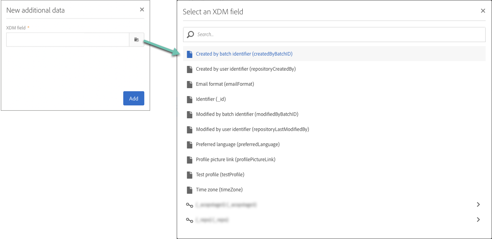

# Campagnes aanpassen met Adobe Experience Platform-kenmerken {#personalizing-campaigns-using-aep-attributes}

>[!IMPORTANT]
>
>De dienst van de Doelen van het publiek is momenteel in bèta, die aan regelmatige updates zonder bericht kan worden onderworpen. Klanten moeten op Azure (momenteel alleen in bèta voor Noord-Amerika) worden gehost om toegang te krijgen tot deze mogelijkheden. Neem contact op met de klantenservice van de Adobe als u toegang wilt.
>
>**Push** en **In app** de kanalen zijn nog niet beschikbaar voor verpersoonlijking gebruikend contextuele gegevens van Adobe Experience Platform.

Zodra uw werkschema met wordt gevormd [Adobe Experience Platform-publiek](../../integrating/using/aep-about-audience-destinations-service.md), kunt u berichten met profielattributen personaliseren die uitsluitend in het Model van de Gegevens van de Ervaring (XDM) bestaan.

Hiervoor moet u deze kenmerken toevoegen aan het dialoogvenster **[!UICONTROL Read audience]** activiteit:

1. Open de **[!UICONTROL Read audience]** activiteit. In de **[!UICONTROL Additional data]** klikt u op de knop **[!UICONTROL Create element]** knop.

   Let erop dat de **[!UICONTROL Additional data]** is alleen beschikbaar nadat een Adobe Experience Platform-publiek is geselecteerd.

   

   >[!NOTE]
   >
   >De gegevenstypen Array en Map worden niet ondersteund in deze functie. Ook, slechts zullen de gegevens van het unieschema in de plukker worden getoond.

1. Selecteer het gewenste XDM-veld in de lijst en klik op **[!UICONTROL Confirm]**.

   

1. Klik op de knop **[!UICONTROL Add]** om deze toe te voegen aan de lijst met aanvullende gegevens.

   

1. Herhaal deze stappen voor elk XDM gebied dat u in uw werkschema wilt toevoegen.

   >[!NOTE]
   >
   >U kunt maximaal 20 XDM-velden toevoegen aan een **[!UICONTROL Read audience]** activiteit.

1. Als alle velden zijn toegevoegd, klikt u op de knop **[!UICONTROL Confirm]** om uw wijzigingen op te slaan. Ze zijn nu beschikbaar om uw leveringen aan te passen.

Raadpleeg de documentatie bij het Campaign Standard voor meer informatie over het maken en personaliseren van leveringen:

* [Communicatiekanalen detecteren](../../channels/using/get-started-communication-channels.md)
* [Informatie over kanaalactiviteiten](../../automating/using/about-channel-activities.md)
* [Leveringen personaliseren](../../designing/using/personalization.md)
