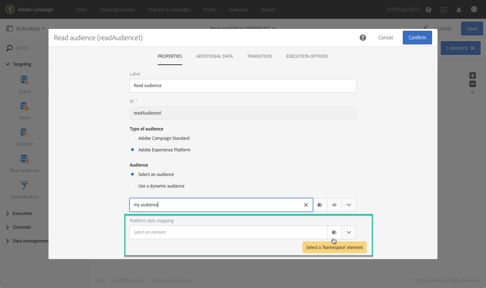

# Adobe Experience Platform-doelgroepen doelgericht benaderen {#targeting-aep-audiences}

>[!IMPORTANT]
>
>De dienst van de Doelen van het publiek is momenteel in bèta, die aan regelmatige updates zonder bericht kan worden onderworpen. Klanten moeten op Azure (momenteel alleen in bèta voor Noord-Amerika) worden gehost om toegang te krijgen tot deze mogelijkheden. Neem contact op met de klantenservice van de Adobe als u toegang wilt.

Als u eenmaal een [Adobe Experience Platform-publiek](../../integrating/using/aep-about-audience-destinations-service.md) Gebruikend de Bouwer van het Segment, kunt u het op de zelfde manier gebruiken zoals u voor een publiek van de Campagne binnen werkschema&#39;s om berichten te personaliseren en te verzenden.

Voer de volgende stappen uit om een Adobe Experience Platform-publiek te activeren in uw workflows:

1. Voeg een **[!UICONTROL Read audience]** in de werkstroom te openen en vervolgens te openen.

1. Selecteer de **[!UICONTROL Adobe Experience Platform]** optie onder **[!UICONTROL Type of audience]** voegt u vervolgens het gewenste publiek toe.

   

1. (Optioneel) Als het publiek is geselecteerd, kunt u op de oogknop klikken om de segmentdefinitie te bekijken en/of bewerken (vergeet niet om de wijzigingen opnieuw op te slaan).

   Als u op de oogknop klikt, gaat u naar de Segment Builder (op een ander tabblad) die is gekoppeld aan het geselecteerde publiek in Campagne.

1. Selecteer een **[!UICONTROL Platform data mapping]** -element om de gewenste doeldimensie voor het geselecteerde Adobe Experience Platform-publiek op te geven.

   Standaard is de primaire sleutel (bijvoorbeeld iRecipientID voor de tabel Profile, iAppSubscriptionID voor de tabel AppSubscription) die voor de afstemming wordt gebruikt, automatisch beschikbaar in de vervolgkeuzelijst. Als u een object buiten de primaire sleutel wilt plaatsen, moet u een aangepaste **Naamruimte**.

   >[!NOTE]
   >
   >Voor doelen buiten de primaire sleutel moet u ook een aangepaste doeltoewijzing maken die overeenkomt met de aangepaste naamruimte. Raadpleeg voor meer informatie over doeltoewijzing [deze sectie](../../administration/using/target-mappings-in-campaign.md).

   

   Deze lijst bevat alle afbeeldingen van het Gegevensmodel van de Ervaring (XDM) die op uw instantie zijn gevormd. Raadpleeg voor meer informatie over Adobe Experience Platform Data Connector [dit speciale document](../../integrating/using/aep-about-data-connector.md).

   

1. Zodra het publiek en het richten dimensies behoorlijk worden gevormd, klik **[!UICONTROL Confirm]** om uw wijzigingen op te slaan.

U kunt nu uw workflow configureren met andere activiteiten. U kunt bijvoorbeeld een koppeling maken naar **[!UICONTROL Email delivery]** activiteit om een e-mail naar het geselecteerde publiek te verzenden.

>[!NOTE]
>
>Met Campaign Standard kunt u Adobe Experience Platform-doelgroepen binnen alle leveringskanalen gebruiken: e-mails, SMS-berichten, Direct-mailberichten, pushberichten en In-App-berichten.
>
>*Opmerking: voor alle push- en In-App-berichten ondersteunt Campaign Standard alleen leveringen voor bekende profielen.

Raadpleeg de volgende secties voor meer informatie over het gebruik van workflows en leveringen:

* [Workflows detecteren](../../automating/using/get-started-workflows.md)
* [Een workflow maken](../../automating/using/building-a-workflow.md)
* [Communicatiekanalen detecteren](../../channels/using/get-started-communication-channels.md)
* [Informatie over kanaalactiviteiten](../../automating/using/about-channel-activities.md)
