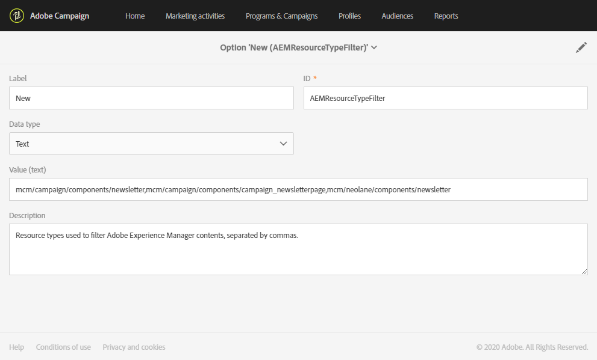

# De integratie van Campagne-Experience Manager configureren {#configuration-aem}

Dankzij deze integratie tussen Adobe Campaign Standard en Adobe Experience Manager kunt u inhoud die in Adobe Experience Manager is gemaakt, gebruiken in uw e-mails over Adobe Campagne.

Met dit gebruiksgeval leert u hoe u e-mailinhoud maakt en beheert in Adobe Experience Manager en deze vervolgens voor uw marketingcampagnes gebruikt door deze inhoud in uw e-mails te importeren in Adobe Campaign Standard.

## Vereisten {#prerequisites}

Zorg ervoor dat u de volgende elementen vooraf hebt:

* Een Adobe Experience Manager- **ontwerpinstantie**
* Een Adobe Experience Manager- **publicatieexemplaar**
* Een Adobe Campaign-exemplaar

## Configuratie in Adobe Campaign Standard {#config-acs}

Om deze twee oplossingen samen te gebruiken, moet u hen vormen om met elkaar te verbinden.
Adobe-campagne configureren:

1. U moet eerst de **[!UICONTROL Adobe Experience Manager instance]** externe account configureren onder **[!UICONTROL Administration]** > **[!UICONTROL Application settings]** > **[!UICONTROL External accounts menu]**.

1. Configureer het type externe account in Adobe Experience Manager met uw **[!UICONTROL Server]** URL **[!UICONTROL Account]** en **[!UICONTROL Password]**.

   

1. Controleer of de **[!UICONTROL AEMResourceTypeFilter]** optie correct is geconfigureerd. Open het **[!UICONTROL Options]** menu via **[!UICONTROL Administration]** > **[!UICONTROL Application settings]** > **[!UICONTROL Options]** .

1. Controleer in het **[!UICONTROL Value (text)]** veld of de volgende syntaxis correct is:

   ```
   mcm/campaign/components/newsletter,mcm/campaign/components/campaign_newsletterpage,mcm/neolane/components/newsletter
   ```

   

1. Vervolgens dupliceert u in het menu Geavanceerd onder **[!UICONTROL Resources]** > **[!UICONTROL Templates]** **[!UICONTROL Delivery templates]**> een van de bestaande sjabloon om een e-mailsjabloon te maken die specifiek is voor Adobe Experience Manager.

   

1. Klik op het **[!UICONTROL Edit properties]** pictogram.

   

1. Selecteer onder de **[!UICONTROL Content]** vervolgkeuzelijst **[!UICONTROL Adobe Experience Manager]** in het **[!UICONTROL Content source]** veld uw eerder gemaakte externe account in de **[!UICONTROL Adobe Experience Manager account]**.

U moet de integratie nu configureren in Adobe Experience Manager.

## Configuratie in Adobe Experience Manager {#config-aem}

Voer de volgende stappen uit om Adobe Experience Manager te configureren met Adobe Campaign Standard:

1. U moet eerst de replicatie tussen de auteurs en publicatieinstanties van de Manager van de Ervaring van Adobe vormen. Zie deze [sectie](https://docs.adobe.com/content/help/en/experience-manager-65/administering/integration/campaignstandard.html#configuring-adobe-experience-manager).

1. Maak vervolgens verbinding met Adobe Experience Manager met Adobe Campagne door een speciale versie te configureren **[!UICONTROL Cloud Service]**. Zie deze [sectie](https://docs.adobe.com/content/help/en/experience-manager-65/administering/integration/campaignstandard.html#connecting-aem-to-adobe-campaign).

1. U moet nu de externalizer in de Manager van de Ervaring van Adobe op uw auteursinstantie vormen. Zie deze [sectie](https://docs.adobe.com/content/help/en/experience-manager-65/administering/integration/campaignstandard.html#configuring-the-externalizer).

