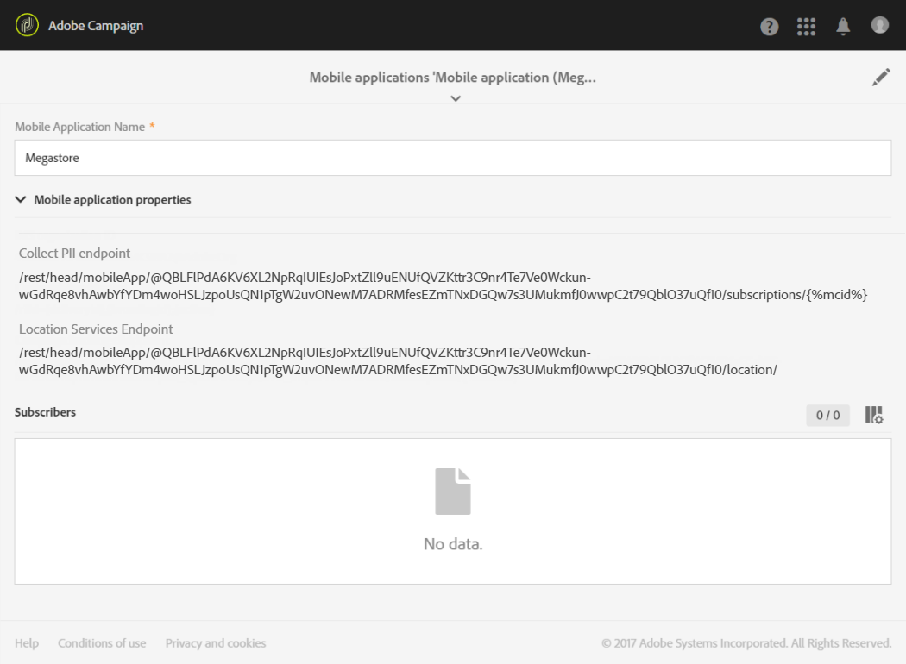

# De integratie van data van Campaign-Points of Interest configureren{#configuring-campaign-points-of-interest-data-integration}

## Integratie van Campagne-Punten van de Gegevens van de Interesse met Adobe Experience Platform SDKs vormen {#configuring-campaign-poi-aep-sdk}

>[!NOTE]
>
>Uw mobiele toepassing moet al in Adobe Campaign Standard zijn geconfigureerd met Adobe Experience Platform SDK. Voor de gedetailleerde stappen raadpleegt u deze [page](https://helpx.adobe.com/nl/campaign/kb/configuring-app-sdk.html).

De mobiele toepassingen die worden gebruikt om locatiegegevens te verzamelen moeten door een **beheerder** in de Adobe Campaign-interface.

Om Adobe Experience Platform Location Services met mobiele toepassingen te kunnen gebruiken die met SDK van Adobe Experience Platform worden gevormd, moet u:

1. Voeg de **[!UICONTROL Places]** en **[!UICONTROL Places Monitor]** extensies naar uw mobiele toepassingsconfiguratie in de gebruikersinterface voor gegevensverzameling. Stel uw mobiele toepassing in Adobe Campaign in. Zie [De extensie Plaatsen installeren](https://experienceleague.adobe.com/docs/places/using/places-ext-aep-sdks/places-extension/places-extension.html#install-the-places-extension-in-adobe-experience-platform-launch) en [De extensie Places Monitor installeren](https://experienceleague.adobe.com/docs/places/using/places-ext-aep-sdks/places-monitor-extension/using-places-monitor-extension.html#install-the-places-monitor-extension-in-experience-platform-launch).

1. Als uw extensies zijn ingesteld, maakt u gegevenselementen in de gebruikersinterface voor gegevensverzameling om gegevens van deze extensies op te halen. Zie dit [page](https://helpx.adobe.com/campaign/kb/config-app-in-launch.html#Step1Createdataelements) om uw gegevenselementen te maken.

1. Dan, in de Inzameling van Gegevens UI, moet u regels tot stand brengen om mobiele gebruiksgevallen tussen Punt van Belangen en Adobe Campaign te steunen.\
   Deze regel wordt geactiveerd wanneer een gebruiker een geo-fenced invoert **[!UICONTROL Point of Interest]**. Zie dit [page](https://helpx.adobe.com/campaign/kb/config-app-in-launch.html#Locationpostback) om uw regel te maken.

1. Definieer uw **[!UICONTROL Points of Interest]** op plaatsen. Zie [Een interessepunt maken](https://experienceleague.adobe.com/docs/places/using/poi-mgmt-ui/create-a-poi-ui.html).

1. Zorg ervoor dat u toegang hebt tot de mobiele toepassing en de verzamelde locatiegegevens in Adobe Campaign. Zie [Toegang verkrijgen tot mobiele apps die worden gebruikt om locatiegegevens te verzamelen](#accessing-mobile-apps-used-to-collect-location-data) en [Toegang tot verzamelde locatiegegevens](#accessing-collected-location-data).

## Campagne-Punten van de gegevensintegratie van de Rente vormen gebruikend SDK V4 {#configuring-campaign-poi-sdkv4}

De mobiele toepassingen die worden gebruikt om locatiegegevens te verzamelen moeten door een **beheerder** in de Adobe Campaign-interface.

Om de de gegevenseigenschap van het Punt van de Gegevens met mobiele toepassingen te gebruiken die met SDK V4 worden gevormd, moet u:

1. Toegang tot Adobe Analytics for Mobile. Controleer uw licentieovereenkomst of neem contact op met de manager van uw Adobe-account voor meer informatie.
1. Stel uw mobiele toepassing in Adobe Campaign in. Zie [Een mobiele app instellen in Campagne](#setting-up-a-mobile-app-in-campaign).
1. Stel uw mobiele toepassing in de Adobe Mobile Services-interface in. Op deze manier kunt u ervoor zorgen dat gegevens die door Adobe Mobile Services zijn verzameld, naar Adobe Campaign worden verzonden. Zie [Een mobiele app configureren in Adobe Mobile Services](#configuring-a-mobile-app-in-adobe-mobile-services).
1. Voer de specifieke installatie van de mobiele toepassing uit:

   * Verpak het configuratiedossier dat van de Adobe Mobiele interface van de Diensten met de mobiele toepassing wordt gedownload.
   * Integreer de Experience Cloud Mobile SDK in uw mobiele toepassing. Zie [De SDK integreren in een mobiele toepassing](#integrating-the-sdk-into-a-mobile-application).

1. Bepaal Punten van Belang in de interface van de Diensten van de Mobiele Adobe. Zie [Belangenpunten bij mobiele Adobe-diensten definiëren](#defining-points-of-interest-in-adobe-mobile-services).
1. Definieer de gegevens die u wilt verzamelen van de abonnees van uw mobiele toepassing. Zie [Gegevens over belangenpunten van abonnees verzamelen](#collecting-subscribers--points-of-interest-data).
1. Zorg ervoor dat u toegang hebt tot de mobiele toepassing en de verzamelde locatiegegevens in Adobe Campaign. Zie [Toegang verkrijgen tot mobiele apps die worden gebruikt om locatiegegevens te verzamelen](#accessing-mobile-apps-used-to-collect-location-data) en [Toegang tot verzamelde locatiegegevens](#accessing-collected-location-data).

### Een mobiele app instellen in Adobe Campaign met SDK V4 {#setting-up-a-mobile-app-in-campaign}

Als u gegevens van punten van belang met Adobe Campaign wilt kunnen verzamelen, moet u de mobiele toepassing configureren waarvan Adobe Campaign gegevens ontvangt.

1. Klik op de knop **Adobe** logo, in de linkerbovenhoek, en selecteer **[!UICONTROL Administration]** > **[!UICONTROL Channels]** > **[!UICONTROL Mobile app]**.
1. Klikken **[!UICONTROL Create]** om een toepassing in te stellen.
1. Typ een naam in het dialoogvenster **[!UICONTROL Application name]** veld en klik op **[!UICONTROL Create]**.

   Vul de **[!UICONTROL Device-specific settings]** sectie. Dit geldt alleen voor het configureren van toepassingen die pushmeldingen ontvangen.

In de **[!UICONTROL Mobile application properties]** -sectie, worden twee URL&#39;s weergegeven: **[!UICONTROL Collect PII endpoint]** en **[!UICONTROL Location Services endpoint]**. Zij zullen in de Adobe Mobiele interface van de Diensten worden gebruikt. Zie [Een mobiele app configureren in Adobe Mobile Services](#configuring-a-mobile-app-in-adobe-mobile-services).

* De **[!UICONTROL Collect PII endpoint]** De URL wordt gebruikt om de Experience Cloud-id&#39;s en registratietokens van de gebruikers te verzamelen van de mobiele toepassing wanneer deze wordt gestart. Wanneer een gebruiker zich bij de toepassing aanmeldt met referenties, zoals e-mail, voornaam, achternaam, enz., worden deze gegevens ook verzameld en gebruikt om de registratietoken van de gebruiker in overeenstemming te brengen met een Adobe Campaign-profiel.
* De **[!UICONTROL Location Services endpoint]** URL wordt gebruikt om locatiegegevens zoals de breedte, lengte en straal van een gebruiker van een Punt van Interesse te verzamelen.

U kunt deze waarden in de Mobiele Diensten van Adobe nu gebruiken om de configuratie te beëindigen, zoals die in [Een mobiele app configureren in Adobe Mobile Services](#configuring-a-mobile-app-in-adobe-mobile-services) sectie.



### Een v4 mobiele app configureren in Adobe Mobile Services {#configuring-a-mobile-app-in-adobe-mobile-services}

Om de gegevens te verzenden die door de Mobiele Diensten van Adobe aan Adobe Campaign worden verzameld, moet u postbacks in de Mobiele interface van de Diensten vormen.

U hebt specifieke informatie nodig die u kunt vinden in de parameters voor mobiele toepassingen die zijn ingesteld in Adobe Campaign (zie [Een mobiele app instellen in Campagne](#setting-up-a-mobile-app-in-campaign)):

* **[!UICONTROL IMS Organization ID]**
* **[!UICONTROL Collect PII Endpoint]**
* **[!UICONTROL Location Services endpoint]**

U moet toegang hebben tot Adobe Analytics om de volgende configuratie te kunnen uitvoeren. Neem contact op met de Adobe Campaign-beheerder als u geen Adobe Analytics-gebruiker bent.

1. Aanmelden [mobiemarketing.adobe.com](https://mobilemarketing.adobe.com/).
1. Maak de toepassing of selecteer een bestaande toepassing.
1. Ga naar de **[!UICONTROL Manage App Settings]** pagina.
1. In de **Bezoekersidentiteitsservice** sectie, controle **Inschakelen** en selecteert u uw organisatie in de vervolgkeuzelijst. Klikken **Opslaan**.

   >[!CAUTION]
   >
   >Deze organisatie moet dezelfde zijn als de organisatie die u gebruikt op het Adobe Campaign-exemplaar.

1. Klik op **[!UICONTROL Manage Postbacks]**.
1. Maak een postback.

   * Selecteren **[!UICONTROL PII]** als de **[!UICONTROL Postback Type]**.
   * In de **[!UICONTROL URL]** veld, kopieert u de **[!UICONTROL Collect PII Endpoint]** URL van de mobiele toepassing die u in de interface van Adobe Campaign vormde, voorafgegaan door de servernaam. Zie [Een mobiele app instellen in Campagne](#setting-up-a-mobile-app-in-campaign).
   * Vul de **[!UICONTROL Post Body]** veld als volgt:

      Voor iOS:

      ```
      {
      "userKey": "{userKey}",
      "pushPlatform":"apns",
      "marketingCloudId":"",
      "cusEmail":"{email}",
      "cusFirstName":"{firstName}",
      "cusLastName":"{lastName}"
      }
      ```

      Voor Android:

      ```
      {
      "userKey": "{userKey}",
      "pushPlatform":"gcm",
      "marketingCloudId":"",
      "cusEmail":"{email}",
      "cusFirstName":"{firstName}",
      "cusLastName":"{lastName}"
      }
      ```

   * Set **Inhoudstype** als **[!UICONTROL application/json]**.
   * In de **Met welke gegevenstags wordt de postback geactiveerd?** selecteert u normaal gesproken elke gebeurtenis **[!UICONTROL Launched]** en **[!UICONTROL exists]**.
   * Klik op **[!UICONTROL Save & Activate]**.

1. Maak een tweede postback.

   * Selecteren **[!UICONTROL Postback]** als de **[!UICONTROL Postback Type]**.
   * In de **[!UICONTROL URL]** veld, kopieert u de **[!UICONTROL Location Services Endpoint]** URL van de mobiele toepassing die u in de interface van Adobe Campaign vormde, voorafgegaan door de servernaam. Zie [Een mobiele app instellen in Campagne](#setting-up-a-mobile-app-in-campaign).
   * Vul de **[!UICONTROL Post Body]** veld als volgt:

      ```
      {
      "locationData":{
      "distances":"{a.loc.dist}",
      "poiLabel":"{a.loc.poi}",
      "latitude.a":"{a.loc.lat.a}",
      "latitude.b":"{a.loc.lat.b}",
      "latitude.c":"{a.loc.lat.c}",
      "longitude.a":"{a.loc.lon.a}",
      "longitude.b":"{a.loc.lon.b}",
      "longitude.c":"{a.loc.lon.c}",
      "appId":"{a.appid}",
      "marketingCloudId":"{mid}"
      }
      }
      ```

   * Set **Inhoudstype** als **[!UICONTROL application/json]**.
   * In de **Met welke gegevenstags wordt de postback geactiveerd?**, selecteert u **[!UICONTROL campaign.test]** en **[!UICONTROL exists]**.
   * Klik op **[!UICONTROL Save & Activate]**.

>[!NOTE]
>
>Voor gedetailleerde informatie bij het vormen van postbacks, verwijs naar [Adobe Mobile Services-documentatie](https://experienceleague.adobe.com/docs/mobile-services/using/manage-app-settings-ug/configuring-app/signals.html).

### De SDK integreren in een mobiele toepassing {#integrating-the-sdk-into-a-mobile-application}

De SDK (Software Development Kit) van de Mobile Core-service vergemakkelijkt de integratie van een mobiele toepassing in Adobe Campaign.

Deze stap wordt in deze [page](https://helpx.adobe.com/nl/campaign/kb/configuring-app-sdkv4.html).

### Belangenpunten bij mobiele Adobe-diensten definiëren {#defining-points-of-interest-in-adobe-mobile-services}

U definieert de interessepunten die worden gebruikt om locatiegegevens te verzamelen:

1. Ga naar de Adobe Mobile Services interface.
1. Voeg uw toepassing toe.

   Voor meer informatie over het beheren van toepassingen in de Mobiele Diensten, verwijs naar [Adobe Mobile Services-documentatie](https://experienceleague.adobe.com/docs/mobile-services/using/manage-apps-ug/t-new-app.html).

1. Definieer de interessepunten.

   Raadpleeg voor meer informatie over het beheren van de belangengroepen de [Adobe Mobile Services-documentatie](https://experienceleague.adobe.com/docs/mobile-services/using/location-ug/t-manage-points.html).

### Gegevens over belangenpunten van abonnees verzamelen {#collecting-subscribers--points-of-interest-data}

Een specifieke douanemiddel laat u toe om de gegevens te bepalen die u van de abonnees van uw toepassingen wilt verzamelen.

Deze stap wordt beschreven in het dialoogvenster [Een mobiele toepassing configureren met SDK V4](https://helpx.adobe.com/campaign/kb/configuring-app-sdkv4.html) pagina.

## Toegang verkrijgen tot mobiele apps die worden gebruikt om locatiegegevens te verzamelen {#accessing-mobile-apps-used-to-collect-location-data}

Om tot de met succes gecreeerde toepassingen in Adobe Campaign toegang te hebben:

1. Klik op de knop **Adobe** in de linkerbovenhoek.
1. Selecteren **[!UICONTROL Administration]** > **[!UICONTROL Channels]** > **[!UICONTROL Mobile app (SDK v4)]** of **[!UICONTROL Mobile app (AEP SDK)]** afhankelijk van de SDK.
1. Selecteer een mobiele toepassing in de lijst om de eigenschappen ervan weer te geven.

   

Een lijst met de abonnees van de toepassing wordt ook weergegeven in het dialoogvenster **[!UICONTROL Mobile application subscribers]** tab. De abonnees zijn alle gebruikers die de toepassing op hun mobiele apparaat hebben geïnstalleerd. De Adobe Campaign-databaseprofielen worden aangeduid met een registratietoken.

## Toegang tot verzamelde locatiegegevens {#accessing-collected-location-data}

Zodra de opstelling wordt gedaan, zijn de verzamelde Punten van Interesseel gegevens vermeld in **[!UICONTROL Places]** van elk profiel. De lijst openen:

1. Selecteer een profiel.
1. Klik op de knop **[!UICONTROL Edit profile properties]** rechts.
1. Selecteer het tabblad **[!UICONTROL Places]**. 

   

De verzamelde gegevens van Punten van Interesse voor het huidige profiel zijn vermeld. Locatiegegevens worden zes maanden lang opgeslagen in de Adobe Campaign-database.

Ga voor meer informatie over het openen en bewerken van profielen naar [Profielen](../../audiences/using/about-profiles.md).
