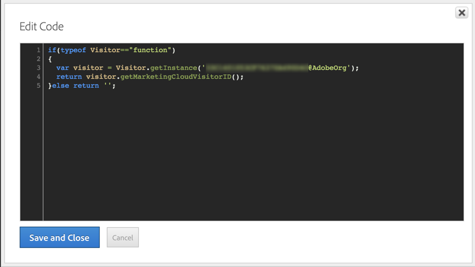
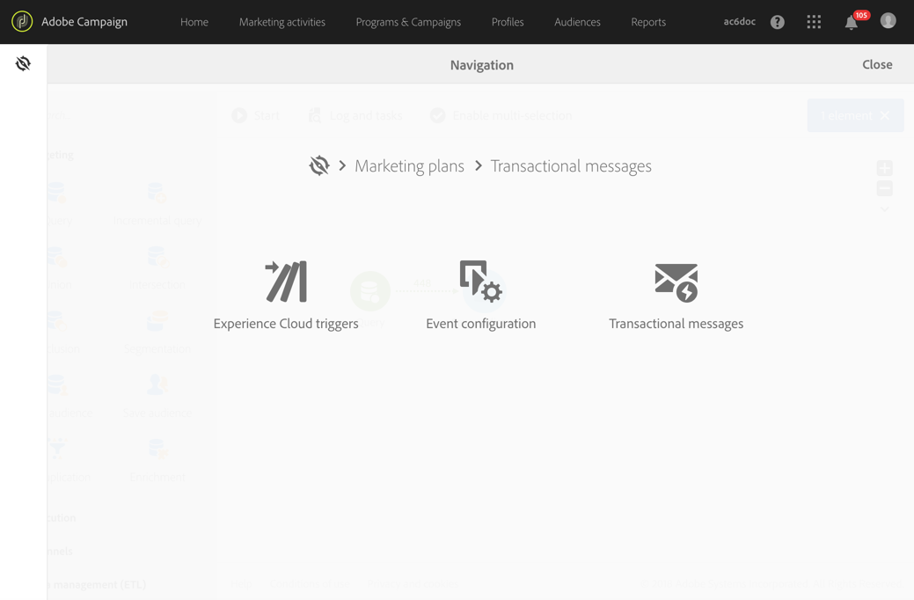

# Triggers configureren in Experience Cloud{#configuring-triggers-in-experience-cloud}

## De functionaliteit activeren {#activating-the-functionality}

De functionaliteit moet in Adobe Campaign door Adobe worden geactiveerd. Neem contact op met uw Adobe-accountmanager of professionele servicepartner.

Het Adobe-team heeft de volgende informatie nodig om triggers te activeren:

* Bedrijfsnaam Marketing Cloud
* IMS-organisatie-id
* Login van de Analyse Bedrijf (kan het zelfde zijn als de Naam van het Bedrijf van de Marketing Cloud)

## Oplossingen en services configureren {#configuring-solutions-and-services}

Als u deze functie wilt gebruiken, hebt u toegang nodig tot de volgende oplossingen/kernservices:

* Adobe Campaign
* Adobe Analytics Ultimate, Premium, Foundation, OD, Select, Prime, Mobile Apps, Select of Standard.
* Experience Cloud Triggers-kernservice

   

* Experience Cloud DTM-kernservice

   

* Experience Cloud Visitor ID- en Experience Cloud People-kernservice

   

U hebt ook een werkende website nodig.

>[!CAUTION]
>
>Subdomeinconfiguratie is een sleutelelement voor de beschikbaarheid. Zorg ervoor dat de e-mails van Adobe Campaign worden verzonden vanuit hetzelfde domein als dat van de website.

U moet [Experience Cloud DTM Core-service](#configuring-experience-cloud-dtm-core-service), [Experience Cloud People Core-service](#configuring-experience-cloud-people-core-service) en - [campagne](#configuring-triggers-and-aliases-in-campaign) configureren om deze gebruiksgevallen uit te voeren.

### Configuring Experience Cloud DTM Core Service {#configuring-experience-cloud-dtm-core-service}

1. Activeer in Experience Cloud DTM Core-service (Dynamic Tag Management) de Experience Cloud-id en Adobe Analytics voor uw websitepagina&#39;s.

   

1. Voor ID-afstemming tussen de website, Adobe Analytics en Adobe Campaign moet aliasing worden gebruikt. Maak bijvoorbeeld een alias met de naam &quot;bezoeker&quot;.

   

### De Experience Cloud People Core-service configureren {#configuring-experience-cloud-people-core-service}

De alias waarnaar eerder in DTM wordt verwezen, moet via een kenmerk van de klant worden gemaakt in de Experience Cloud People Core Service. Zorg ervoor dat u een nieuwe maakt en dat u in de integratiecode naar dezelfde DTM-alias verwijst (bijvoorbeeld &quot;bezoeker&quot;).

>[!NOTE]
>
>We gaan dit kenmerk van klant gebruiken in de gegevensbron in Adobe Campaign (volgende stap).

### Triggers en aliassen configureren in campagne {#configuring-triggers-and-aliases-in-campaign}

1. Zorg ervoor dat je een Adobe Campaign Standard-exemplaar ziet. **[!UICONTROL Experience Cloud triggers]** Als u dat niet doet, neemt u contact op met de Adobe Campaign-beheerders.

   

1. Met aliassen kan een contactpersoon in Analytics worden afgestemd op een profiel in Campagne. U moet de aliassen aanpassen die in de dienst van identiteitskaart van de Experience Cloud met Gedeelde Gegevensbron in Campagne worden bepaald. U moet de aliasresolutie in Adobe Campaign configureren via een gegevensbron ( **[!UICONTROL Administration]** > **[!UICONTROL Application Settings]** > **[!UICONTROL Shared Data Sources]** ). Zorg ervoor u de correcte gegevensbron in het **[!UICONTROL Data Source/Alias]** drop-down menu kiest, dat met de zelfde die gegevensbron van Attributen van de Klant in vorige stap wordt gecreeerd in kaart wordt gebracht.

   

   >[!NOTE]
   >
   >U kunt uw triggers afstemmen voor zowel anonieme als aangemelde gebruikers. Voor anonieme gebruikers moet het profiel bestaan in Adobe Campaign en is een e-mail verzonden naar de gebruiker eerder. Hiervoor is de configuratie van bezoekersidentiteitskaart voldoende. Nochtans, als u trekkers voor het programma geopende gebruikers wilt in overeenstemming brengen, moet u de Gedeclareerde Gegevensbron van identiteitskaart plaatsen. Voor meer op dit, verwijs naar de configuratie [van de](../../integrating/using/provisioning-and-configuring-integration-with-audience-manager-or-people-core-service.md#step-2--configure-the-data-sources)Gegevensbron.

## Een trigger maken in de interface Experience Cloud {#creating-a-trigger-in-the-experience-cloud-interface}

Er moet een Adobe Experience Cloud-trigger worden gemaakt, zodat u deze kunt gebruiken in Campagne.

Maak een nieuwe trigger in Experience Cloud en selecteer de rapportsuite die op uw website wordt gebruikt. Zorg ervoor dat u de juiste afmeting kiest, zodat de trigger wordt geactiveerd.

Raadpleeg de documentatie [bij](https://docs.adobe.com/content/help/nl-NL/core-services/interface/activation/triggers.html) Adobe Experience Cloud en bekijk deze [video](https://helpx.adobe.com/marketing-cloud/how-to/email-marketing.html#step-two).

## Triggert beste praktijken en beperkingen {#triggers-best-practices-and-limitations}

Hier volgt een lijst met beste praktijken en beperkingen voor het gebruik van de campagne - Triggers-integratie:

* Als u meerdere instanties van Campaign Standard hebt, kunnen triggers door alle instanties worden ontvangen zolang ze zich in dezelfde IMS-organisatie-id bevinden. Analyses moeten ook op dezelfde IMS-organisatie-id staan.
* U kunt geen trekker in de Dienst van de Kern van de Trigger tot stand brengen gebruikend gebeurtenissen van twee verschillende rapportreeksen.
* Triggers zijn gebaseerd op transactieberichten. Transactieberichten worden gebruikt wanneer u een bericht zeer snel moet verzenden. U kunt geen transactiemeldingen in de wachtrij plaatsen en deze vervolgens in batch herhalen.
* Triggers zijn niet deterministisch van aard. Wanneer een trigger wordt gegenereerd, verstuurt deze alle aliassen die aan het cookie zijn gekoppeld. In het geval van gedeelde browsers, zoals in winkelkiosken, bibliotheken, cybercafes of gedeelde apparaten thuis (echtgenoot en echtgenote die zich aanmelden vanaf hetzelfde apparaat), is het dus niet mogelijk om de juiste id toe te wijzen. Alle id&#39;s die worden gebruikt om u aan te melden bij de browser, worden verzonden naar Campagne die een bericht verzendt op basis van de eerste afstemming. Als er meerdere &#39;e-mail-id&#39;s&#39; zijn die in aanmerking komen voor afstemming, verzendt Campagne geen e-mail. Campagne kan niet weten wat de juiste e-mailadres is, tenzij deze wordt vastgelegd en verzonden door Analytics.
* U kunt geen inhoud van lading in Campagne opslaan. Triggers kunnen niet worden gebruikt om de gegevens van een profiel bij te werken.
* Kenmerken van klanten worden niet ondersteund in Triggers (er kunnen alleen gegevens van de rapportsuite worden gebruikt om de regels voor het starten van Triggers-activiteiten te definiëren).
* Verzameling van verzamelingen wordt niet ondersteund in Campagne.

>[!CAUTION]
>
>Uw website moet in hetzelfde domein worden uitgevoerd als de Adobe Campaign-server. Als dat niet het geval is, kunt u de bezoeker-id niet gebruiken om gebruikers die anoniem de website bezoeken, te verzoenen en te bereiken.

